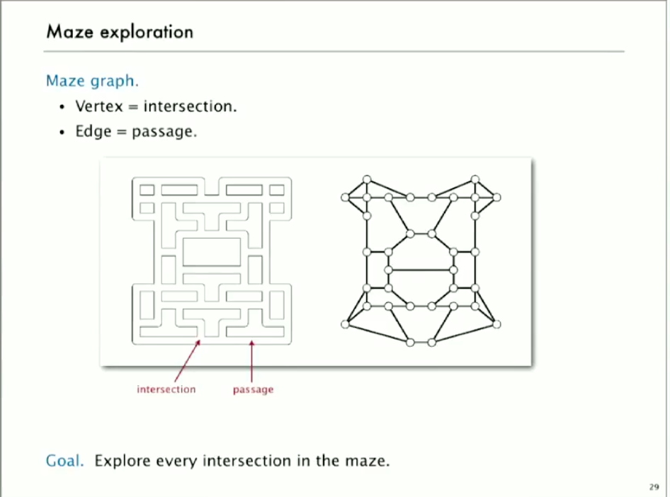
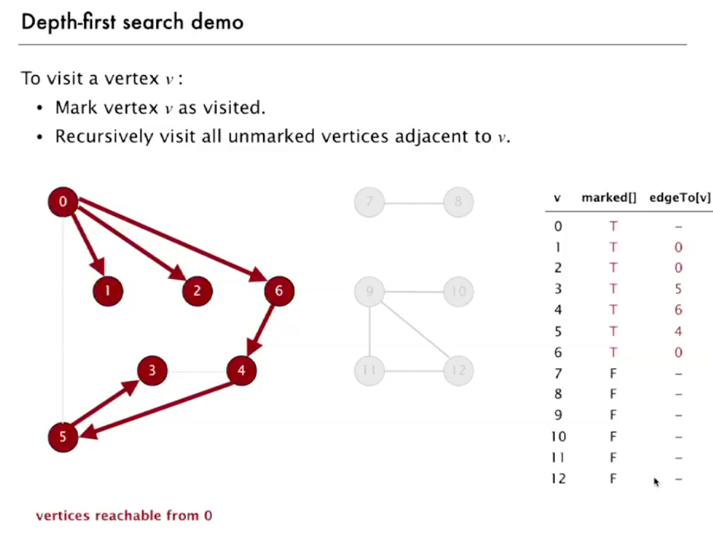
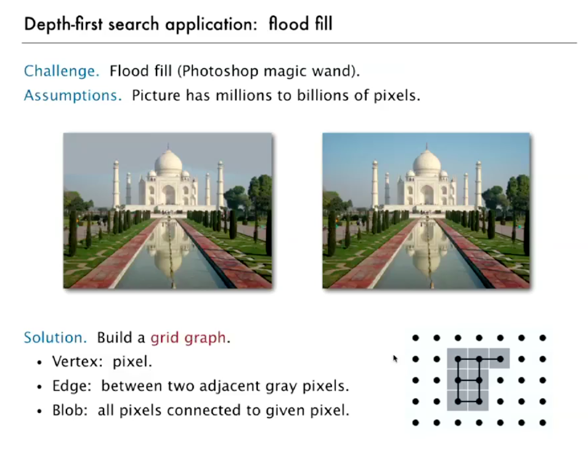
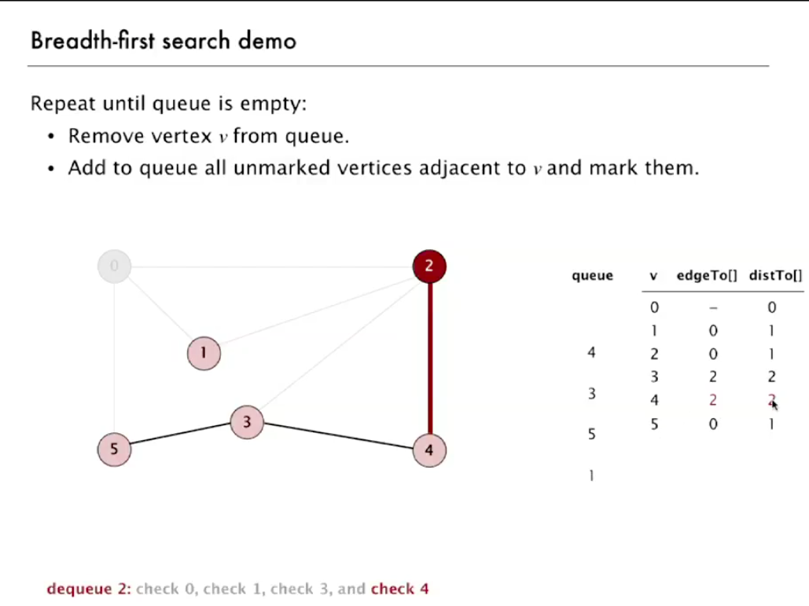
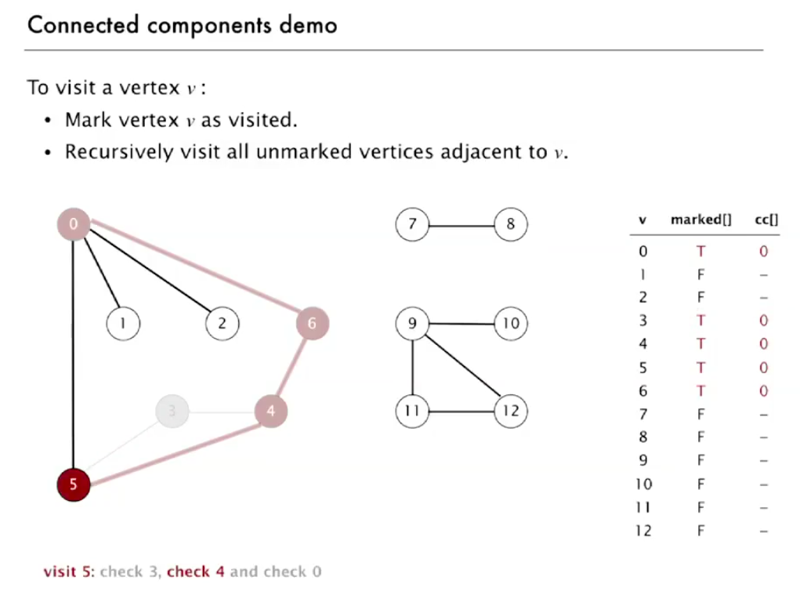
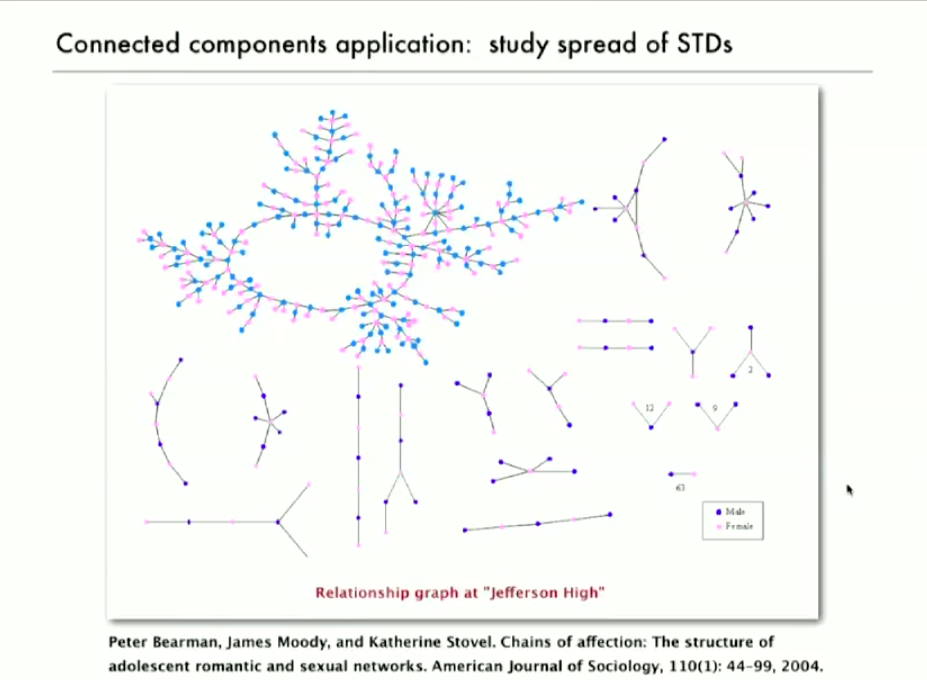

## dfs(depth first search)



- 미로탐색 알고리즘
  - 같은 곳을 두번 방문하지 않음

```
DFS(to 정점 v를 방문하기 위해서)

v를 방문했다고 마킹
재귀적으로 방문하지 않은 곳들을 방문
  v에 인접한 정점들w
```

### 그래프 가공에 있어서의 디자인 패턴

- 디자인 패턴(그래프 가공으로부터 그래프의 데이터 타입을 분리)
  - 그래프 오브젝트 생성
  - 그 그래프를 그래프 가공의 루틴에 인자로 넘겨줌
  - 그래프 가공 루틴에 정보를 질의함

```java
public class Paths{}
Paths(Graph G, int s) // find path in G from source s
boolean hasPathTo(int v) // is there a path from s to v?
Iterable<Integer> pathTo(int v) // path from s to v; null if no such path

```

### DFS 데모



- marked로 이미 방문한 정점을 기록
- edgeTo로 해당 정점을 방문하기 전 정점을 기록

### DFS 알고리즘

- 목표
  - s와 연결된 모든 정점을 찾기(그리고 그와 연결된 경로도)
- 아이디어
  - 미로 탐색 흉내내기
- 알고리즘
  - 재귀의 사용
  - 각각의 방문한 정점을 기록, 그리고 그 정점ㅁ에 방문하기 위한 간선도 기록
  - 가능한 방문할 수 있는 모든 정점을 방문하면 리턴함
- 사용되는 데이터 구조
  - `boolean[] marked` 방문한 정점들을 기록
  - `int[] edgeTo` 경로의 트리를 유지
    - (edgeTo[w] == v)는 간선 v-w가 w를 처음 방문하기 위해서 사용되었다는 의미

```java
public class DepthFirstPaths
{
  private boolean[] marked;
  private int[] edgeTo;
  private int s;

  public DepthFirstPaths(Graph G, int s)
  {
    ...
    dfs(G, s);
  }

  private void dfs(Graph G, int v)
  {
    marked[v] = true;
    for (int w : G.adj(v))
      if (!marked[w])
      {
        dfs(G, w);
        edgeTo[w] = v;
      }
  }
}
```

### dfs의 특징

- dfs는 s(시작 정점)과 연결된 모든 정점들을 그 (연결된)정점들의 차수의 합의 시간적 복잡도로 기록함
- dfs이후, s에 연결된 정점들은 상수 시간에 연결되어있는지 확인 가능. 그리고 s와의 경로(만약 존재 한다면)를 그 경로의 길이에 비례하는 시간복잡도로 확인 가능.

### dfs의 구현

```java
public boolean hasPathTo(int v)
{ return marked[v]; }

public Iterable<Integer> pathTo(int v)
{
  if (!hasPathTo(v)) return null;
  Stack<Integer> path = new Stack<Integer>();
  for (int x = v; x != s; x = edgeTo[x]) {
    path.push(x);
  return path;
}
```

### dfs의 응용



- flood fill

## bfs

### bfs 데모



- 큐의 원소가 다 사라질 때 까지 반복
  - 정점 v를 큐에서 제거
  - v와 인접한 모든 방문하지 않은 점은 큐에 추가하고 그 점을 방문했다고 처리

### bfs 알고리즘

- 깊이 우선 탐색
  - `스택`에 방문하지 않은 정점을 추가
- 너비 우선 탐색
  - `큐`에 방문하지 않은 정점을 추가

- 최단경로
  - s에서 t까지 가장 적은 간선을 사용하는 경로를 탐색

- 직관
  - BFS는 거리가 작은 순에서 큰 순으로 모든 정점들을 조사함

```
BFS(출발지 정점 s로 부터)
s를 큐에 삽입 후 s를 방문했다고 기록
큐의 원소가 존재하지 않을 때 까지 다음을 반복:
  - 가장 최근에 더해진 정점 v를 제거
  - v의 방문되지 않은 인접 정점을 큐에 추가, 그리고 그것들을 방문했다고 기록
```

### bfs의 특징

- bfs는 시작 정점인 s로부터 모든 다른 정점에 E+V에 비례하는 시간적 복잡도로 최단 경로를 계산함

### bfs구현

```java
public class BreadthFirstPaths
{
  private boolean[] marked;
  private int[] edgeTo;
  ...

  private void bfs(Graph G, int s)
  {
    Queue<Integer> q = new Queue<Integer>();
    q.enqueue(s);
    marked[s] = true;
    while(!q.isEmpty())
    {
      int v = q.dequeue();
      for (int w : G.adj(v))
      {
        if (!marked[w])
        {
          q.enqueue(w);
          marked[w] = true;
          edgeTo[w] = v;
        }
      }
    }
  }
}
```

### bfs의 응용

- 라우팅
  - 적은 hoping으로 다른 네트워크에 연결하는 방법?
- Kevin Bacon 숫자
  - 어떠한 영화배우와 어떠한 영화배우는 어떠한 영화와 연관되어 있는가?
- Erdos 숫자

## 연결된 컴포넌트(Connectivity Components)

### 연결 쿼리

- 정의
  - 정점 v와 w는 그것들 사이의 경로(path)가 있으면 연결되었다 라고 함
- 목표
  - *v와 w는 연결되었는가?* 라는 쿼리에 상수 시간에 대답할 수 있도록 그래프를 가공함

```
public class CC {}
CC(Graph G) // 그래프 G에서 연결된 컴포넌트를 찾음
boolean connected(int v, int w) // v와 w는 연결되어 있는가?
int count() // 연결된 컴포넌트의 개수
int id(int v) // 정점 v의 컴포넌트 식별자
```

union find와 비슷하나, 다르다(시간적 복잡도, union과 find를 둘다 다룰 수는 없다(데이터 update가 없음))

### 연결된 컴포넌트(Connected Components)

- *연결되어 있음*은 다음을 뜻함:
  - Reflexive
    - v는 v와 연결되어 있음
  - Symmetric
    - 만약 v가 w와 연결되어 있으면, w는 v와 연결되어 있음
  - Transitive
    - 만약 v가 w와 연결되고, w가 x와 연결되면, x와 v는 x와 연결되어 있음
- 목표
  - 연결된 컴포넌트 단위로 정점들을 분할함

### 연결된 컴포넌트 알고리즘 데모



cc는 정점의 컴포넌트 id를 기록한 것

### 구현

```java
public class CC
{
  private boolean marked[];
  private int[] id;
  private int count; // number of components

  public CC(Graph G)
  {
    marked = new boolean[G.V()];
    id = new int[G.V()];
    for (int v=0; v < G.V(); v++)
    {
      if (!marked[v])
      {
        dfs(G, v);
        count++;
      }
    }
  }

  public int count()
  { return count; }

  public int id(int v)
  { return id[v]; }

  public void dfs(Graph G, int v)
  {
    marked[v] = true;
    id[v] = count;
    for (int w : G.adj(v))
      if (!marked[w])
        dfs(G, w);
  }
}
```

### 응용



- 병의 확산을 표현
- 작은 먼지 트래킹

## 그래프 첼린지

### 첼린지1: bipartite

- 정의
  - 모든 정점을 두가지 색으로 칠할 수 있는가?
  - 인접한 정점은 다른 색을 칠해야 함
- 해결
  - dfs로 해결 가능함
- 난이도
  - 쉬움
- 응용
  - 데이트 그래프는 bipartite인가?
  - 옛날에는 그랬을지 모르지만 지금은 아님

### 첼린지2: 그래프에 회로가 존재하는가?

- 해결
  - dfs를 사용하면 바로 알 수 있음
- 난이도
  - 쉬움

### 첼린지3: 오일러 탐색

- 정의
  - 주어진 그래프의 모든 간선을 단 한번만 사용해서 회로를 만들 수 있는가?
  - 위가 가능하면 **오일러 탐색이 가능하다** 라고 함
- 해결
  - 주어진 연결 그래프의 모든 정점이 짝수의 차수를 갖으면 오일러 탐색이 가능함
  - 시도할만한 재미있는 문제
- 난이도
  - 할만 함

### 첼린지4: 헤밀턴 탐색

- 정의
  - 주어진 그래프의 모든 정점을 단 한번만 지나가는 회로를 만들 수 있는가?
  - 외판원 순회 문제(TSP)
- 난이도
  - NP완전 문제(아무도 이 문제에 대한 효율적인 풀이를 모름)

### 첼린지5: 두 그래프는 동형인가?

- 정의
  - 두가지의 그래프가 다르게 생겼고 정점도 다르게 부여되었으나, 정점을 바꾸는 것으로 같은 그래프로 만들 수 있는가?
- 난이도
  - 모름

### 첼린지6: 그래프를 간선이 겹치지 않도록 바꿀 수 있는가?

- 난이도
  - DFS에 기초한 선형의 시간복잡도를 가진 알고리즘이 있으나, 너무나도 복잡함
