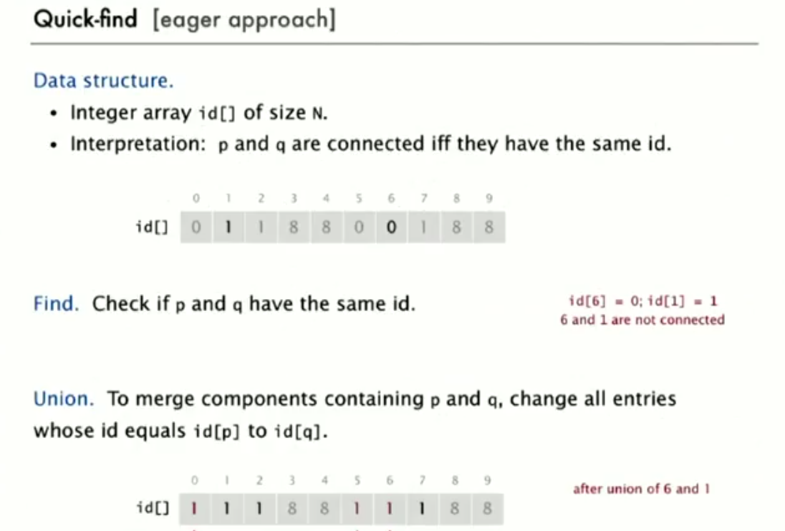
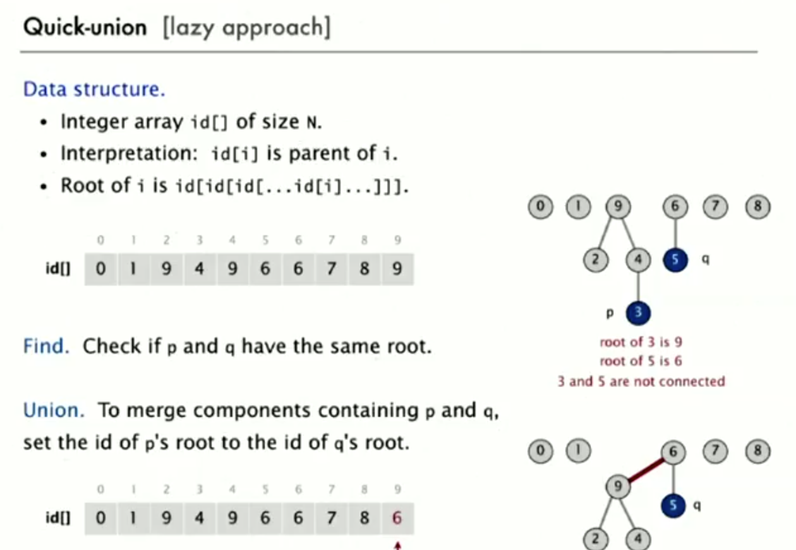

# Union Find

## 문제

어떠한 그래프가 존재하는데, 임의의 노드에서 다른 노드까지 연결되어있는가? 연결되어있다면, 그 경로는? 임의의 노드를 다른 노드와 연결하는 방법은?

## 응용

- 디지털 사진에서의 픽셀들
- 컴퓨터의 네트워크들
- 소셜 네트워크의 친구들
- 컴퓨터 칩의 트랜지스터들
- 수학적 집합의 요소들
- 포트란 프로그램의 변수이름...?

## modeling the connection

- Reflective
  - p는 p에 연결되어 있음
- Symmetric
  - p가 q에 연결되어 있음 => q가 p에 연결되어 있음
- Transitive
  - p가 q에 연결되어 있고, q가 r에 연결되어 있음 => p는 r에 연결되어 있음

### 연결된 컴포넌트

- Connected components
  - Maximal set of objects that are mutually connected

## 데이터 타입(API)

- UF
  - `void union(int p, int q)`
  - `boolean connected(int p, int q)`

## 알고리즘 아이디어

### 접근1: quick find

### 접근2: quick union

### 접근3: 개선

- quick union을 베이스
- weighting
  - 트리의 깊이가 커지지 않도록 함
    - 각 트리의 size를 추적함
    - 요소가 더 적은 트리의 루트를 요소가 더 많은 트리의 루트로 함
  - 임의의 노드 x의 깊이는 최대로 logN이다.
