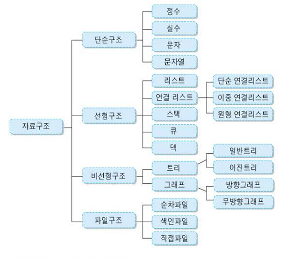

# Algorithm & Data structure 기초

자료 구조가 중요한 이유는 문제 해결을 효과적으로 하기 위해서이다. 즉, 주어진 자원을 적절하게 최대한 사용하기 위해서 자료 구조와 알고리즘이 중요하다.

각각의 자료구조와 알고리즘의 **장단점**을 명확히 파악하고 있어야 한다.

시간적 효율성과 공간적 효율성을 동시에 생각할 줄 알아야 한다.

특히 중요한 자료구조는 **해시** 와 **트리** 가 있다. 왜냐하면 이 두 자료구조는 방대한 데이터를 다룰때 시간적으로/공간적으로 최적의 방법을 제시하는 경우가 많기 때문이다. 하지만 이 둘이 꼭 능사는 아니므로 반드시 시간적/공간적 장단점을 **반드시** 생각해야 한다.

## 자료구조의 분류

- 선형 구조: 자료 간의 연결 관계가 1:1 관계를 갖는 구조
- 비선형 구조: 자료 간에 선형 구조가 아닌 계층 구조나 망 구조를 갖는 자료구조

## 대규모 서비스와 알고리즘 트리 & 해시

대규모 서비스에서는 알고리즘과 자료구조가 매우 중요하다. 아키텍트가 기술을 선정할 때 왜 그 기술을 선정하는가를 장점과 단점을 잘 따져서 선택하는 것과 같이, 알고리즘과 자료구조 역시 왜 그러한 방식대로 하는가가 매우 중요하다.

> 대부분의 대규모서비스는 O(n^2)의 성능으로는 느리기때문에, O(nlogn)의 효율을 자랑하는 트리와 일정 메모리까지 O(1)을 자랑하는 해시를 중요시 여긴다.

단순히 여기에서 끝나는 것이 아니고, 해시를 사용한다면 이 해시가 **몇 MB나 GB까지 차지하는지, 그리고 그것이 현실적인 해법인지**까지 생각해야 한다. 즉 정당성의 문제이다.

해시에서 정당성을 찾을 수 없다면 이제 트리로 넘어간다. 트리 역시 단순히 자료구조가 있어서 사용한다의 차원을 넘어서 트리의 정당성과 다양한 활용에 대해서 생각할 수 있어야 한다.

물론 이와 같은 내용을 말로 잘 설명할 수 있어야 한다.
