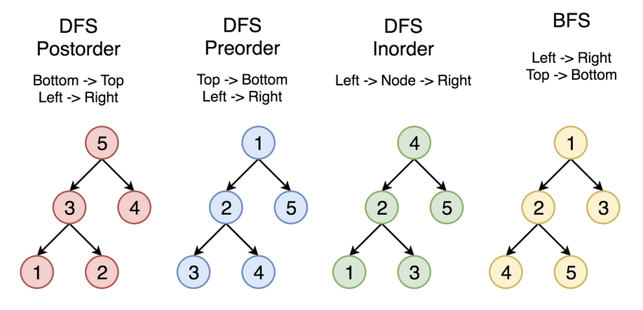

# Binary Search Tree: 이진 탐색 트리

- 의문
- 개요
- API와 효율
- 사용 가능한 특수 API
- Iteration
- 노드의 삭제
- 2-3트리
- Left Leaning Red-Back Tree
- B-Tree

## 의문

## 개요

- 각각의 노드는 키를 소유
- 왼쪽 서브트리는 그 서브트리에 속하지 않는 노드의 키보다 무조건 작다.
- 오른쪽 서브트리는 그 서브트리에 속하지 않는 노드의 키보다 무조건 크다.
- 보통 키는 유일하다(unique).

## API와 효율

- insert: `O(n)`
- search: `O(n)`
- deletion: `O(루트n)`

트리가 한쪽으로 편향되어있으면 최악의 경우 삽입과 검색에서 `O(n)`의 시간적 효율성을 보인다. 평균적으로는 4*log(n)이라고 한다.

그래서 균형 이진 탐색 트리(편향되지 않은 이진 탐색 트리)를 구현한다.

이진 탐색 트리는 퀵소트의 `partitioning(분할과정)`과 정확히 유사하다. 이는 여기서 말하는 분할과정은 three-way-partitioning이 아닌 일반적인 분할과정이다.

## 사용 가능한 특수 API

- min(): 가장 작은 키에 대응하는 값은?
- max()
- select(n): n번째 키에 대응하는 값은?
- ceiling(key Key) Key: key이후의 가장 작은 key는?
- floor(key Key) Key
- rank(key Key) int: key는 몇번째로 작은 key인가?
- size(key Key) int: key를 갖고 있는 노드가 루트인 서브트리의 노드 개수는?

## Iteration: 이터레이션

Binary Search Tree의 Traverse 방법

- DFS
  - Preorder
    - 그냥 자신 node 참조
  - Inorder
    - left subtree의 traversal이 다 끝나야지 자신 node 참조
  - Postorder
    - left, right subtrees의 traversal이 다 끝나야지 자신 node 참조
- BFS
  - level 별 노드 참조

## 노드의 삭제

### 최소(최대) 키를 가지는 노드의 삭제

가장 왼쪽 노드까지 간다. 그 노드의 오른쪽 자식 노드가 존재하면 그 노드의 부모노드와 그 노드의 오른쪽 자식 노드를 연결 시켜준다.

### Hibbard 삭제

- 자식 노드가 존재하지 않는 경우
- 자식 노드가 하나만 존재하는 경우
- 자식 노드가 둘 다 존재하는 경우
  - 삭제되는 노드의 오른쪽 부분 트리에서 가장 작은 노드를 삭제되는 노드의 위치로 놓는다(immutable)
  - 단 계속해서 이를 진행하면, 트리의 편향성이 증가한다.
  - `O(루트n)`

## 2-3트리

### 특징

각각의 노드마다 1개나 2개의 키를 허락한다. 노드의 종류는 다음과 같다:

- 2노드: 1개의 키, 2개의 자식노드
- 3노드: 2개의 키, 3개의 자식노드
  - 자식 노드는 2개의 키(E, J그리고 E < J)가 있을때, E보다 작은 범위, E와 J사이의 범위, J이상의 범위로 나뉜다.

- 루트 노드에서 null 노드까지의 거리(트리의 높이)는 모두 같다.
- 중위순회(Inorder search)는 키값의 오름차순으로 노드를 순회한다.

### Search: 탐색

### Insert: 삽입

- 먼저 적당한 위치로 이동한다 삽입할때는 자기자신이 새로운 level을 더해서 만들지 않고 기존의 노드가 있는 곳에서 키를 추가하는 형식으로 한다.
- 2노드에 삽입하는 경우
  - 3노드로 만듬
- 3노드에 삽입하는 경우
  - 임시적으로 4노드로 만듬
  - 가운데 키를 부모노드로 보내고 기존의 두 노드는 분리시켜 2노드 두개를 만듬
  - 만일 계속해서 부모의 노드가 3노드여서 루트까지 임시4노드가 된다면, 루트의 임시4노드의 중간 키 루트키로 만들고 나머지 두 노드를 2노드로 해서 연결시킨다.

symmetric order(대소관계 유지) + perfect balance(레벨 변화 없음)이 항상 보증되어야 한다.

### 효율

`O(c*logn)`

하지만 만드는 것이 힘들다.

## Left Leaning Red-Back Tree

C++이나 JAVA등에서 사용.

### 특징

- 어떠한 노드도 두개의 레드 간선을 가지고 있지 않다.
- 루트노드에서 null노드 까지의 모든 경로는 같은 숫자의 검은 간선을 갖고 있다.
- 레드 간선은 왼쪽으로 치우쳐있다.

### Search: 검색

단순한 이진 탐색트리와 동일. 대신 밸런스가 좋기 때문에 더 빠르게 찾을 수 있다.

### Insert: 삽입

여기에서 밸런스(높이 변화 없음)를 맞추면 된다.

- 노드의 특성에서 color를 추가(true, false)
- 오른쪽으로 치우친 레드 간선을 왼쪽으로 치우치게 회전시킨다(left rotation)
- 왼쪽으로 치우친 레드 간선을 왼쪽으로 치우치게 회전시킨다(right rotation)
- 4노드를 분할한다.

### Delete: 삭제

삭제가 제일 어렵다.

## B-Tree

데이터베이스나 파일시스템에서 많이 사용.

엄청나게 큰 연속적인 블록 데이터에서 페이지를 효율적으로 찾고 싶을때 사용. 프로브의 자체를 찾는게 느리므로 가능한한 수를 줄이고 프로브내의 데이터 탐색은 빠르므로 그 수를 증가시킨다.

- 2-3트리를 일반화 함.
- 하나의 노드는 많은 키를 가질 수 있다. 그래서 매우 얗은 트리 높이를 갖음.
