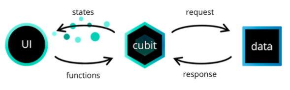
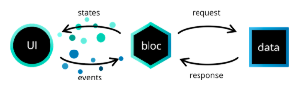

# Bloc

- 의문
- Why?
- Core Concepts
  - `package:bloc`
    - Streams
      - Stream events를 받는 법
      - Stream의 종류
      - stream을 가공하는 methods
      - stream을 수정하는 methods
    - Cubit
    - Bloc
    - Cubit vs Bloc
  - `package:flutter_bloc`
    - BlocBuilder
    - BlocProvider

## 의문

## Why?

**본질: view와 business logic의 분리**

- Core value
  - Simple
    - 다양한 레벨의 개발자도 쉽게 이해 가능
  - Powerful
    - 작은 컴포넌트의 조합으로 복잡한 애플리케이션 제작 가능
  - Testable
    - 애플리케이션의 모든 부분을 테스트 가능 -> Reliable
- 특징
  - state 변화를 오직 한가지 방법으로만 가능하게 함
    - state 변화를 predictable하게 함

## Core Concepts

### `package:bloc`

#### Streams

- 정의(dart)
  - sequence of asynchronous events
  - 사실상 async generator
- 특징
  - Future vs Stream
    - 개요
      - **pull vs push**
    - Future
      - 자신이 요청해서 다음 이벤트를 받음 pull
    - Stream
      - 이벤트가 준비되면 자신에게 stream이 event가 준비되었다고 push

##### Stream events를 받는 법

Stream events를 받는 법

```dart
Future<int> sumStream(Stream<int> stream) async {
  var sum = 0;
  await for (var value in stream) {
    sum += value;
  }
  return sum;
}

// async generator
Stream<int> countStream(int to) async* {
  for (int i = 1; i <= to; i++) {
    yield i;
  }
}

main() async {
  var stream = countStream(10);
  var sum = await sumStream(stream);
  print(sum); // 55
}
```

Stream을 이용한 error handling

```dart
import 'dart:async';

Future<int> sumStream(Stream<int> stream) async {
  var sum = 0;
  try {
    await for (var value in stream) {
      sum += value;
    }
  } catch (e) {
    return -1;
  }
  return sum;
}

Stream<int> countStream(int to) async* {
  for (int i = 1; i <= to; i++) {
    if (i == 4) {
      throw new Exception('Intentional exception');
    } else {
      yield i;
    }
  }
}

main() async {
  var stream = countStream(10);
  var sum = await sumStream(stream);
  print(sum); // -1
}
```

##### Stream의 종류

- Single subscription streams
  - 개요
    - 더 큰 전체의 부분인 이벤트들의 sequence를 포함하는 스트림
  - 특징
    - 이벤트들은 올바른 순서와, missing이 없이 전달되어야 함
    - 한 번에 모든 스트림데이터를 가져옴
  - 예시
    - file
    - web request
- Broadcast streams
  - 개요
    - 한번에 한개씩 다루어질 수 있는 개개의 메시지를 다루기 위한 스트림
  - 특징
    - 해당 스트림을 언제든지 listen 가능
    - 하나 이상의 listener 존재 가능
    - subscription cancel한 후 다시 subscribe가능
  - 예시
    - 브라우저의 마우스 이벤트

##### stream을 가공하는 methods

stream을 가공하고, result를 반환

```dart
Future<T> get first;
Future<bool> get isEmpty;
Future<T> get last;
Future<int> get length;
Future<T> get single;
Future<bool> any(bool Function(T element) test);
Future<bool> contains(Object needle);
Future<E> drain<E>([E futureValue]); // ???
Future<T> elementAt(int index);
Future<bool> every(bool Function(T element) test);
Future<T> firstWhere(bool Function(T element) test, {T Function() orElse});
Future<S> fold<S>(S initialValue, S Function(S previous, T element) combine);
Future forEach(void Function(T element) action);
Future<String> join([String separator = ""]);
Future<T> lastWhere(bool Function(T element) test, {T Function() orElse});
Future pipe(StreamConsumer<T> streamConsumer); // ????
Future<T> reduce(T Function(T previous, T element) combine);
Future<T> singleWhere(bool Function(T element) test, {T Function() orElse});
Future<List<T>> toList();
Future<Set<T>> toSet();
```

- 뭐하는 거지?
  - `drain()`
  - `pipe()`

##### stream을 수정하는 methods

original stream을 기반으로 new stream을 반환

```dart
Stream<R> cast<R>();
Stream<S> expand<S>(Iterable<S> Function(T element) convert);
Stream<S> map<S>(S Function(T event) convert);
Stream<T> skip(int count);
Stream<T> skipWhile(bool Function(T element) test);
Stream<T> take(int count);
Stream<T> takeWhile(bool Function(T element) test);
Stream<T> where(bool Function(T event) test);

// argument can be async function
Stream<E> asyncExpand<E>(Stream<E> Function(T event) convert);
Stream<E> asyncMap<E>(FutureOr<E> Function(T event) convert);
Stream<T> distinct([bool Function(T previous, T next) equals]);

// Error handling
Stream<T> handleError(Function onError, {bool test(error)});
Stream<T> timeout(Duration timeLimit,
    {void Function(EventSink<T> sink) onTimeout});

// generalized "map" for stream
// take several incoming events to produce an output event
Stream<S> transform<S>(StreamTransformer<T, S> streamTransformer);

// low-level method
// all other stream functions are defined in terms of listen()
StreamSubscription<T> listen(void Function(T event) onData,
    {Function onError, void Function() onDone, bool cancelOnError});
```

Stream Error handling예시

```dart
Stream<S> mapLogErrors<S, T>(
  Stream<T> stream,
  S Function(T event) convert,
) async* {
  var streamWithoutErrors = stream.handleError((e) => log(e));
  await for (var event in streamWithoutErrors) {
    yield convert(event);
  }
}
```

Transformer 예시

```dart
import 'dart:convert';
import 'dart:io';

Future<void> main(List<String> args) async {
  var file = File(args[0]);
  var lines = utf8.decoder
      .bind(file.openRead())
      .transform(LineSplitter());
  await for (var line in lines) {
    if (!line.startsWith('#')) print(line);
  }
}
```

- `listen()` method
  - 개요
    - stream을 listening할 수 있도록 함
  - 특징
    - listen하기 전 까지는 비활성화
    - listen하면 => event를 producing하는 것을 나타내는 `StreamSubscription` 오브젝트가 반환됨
      - Iterable이 단순한 오브젝트의 컬렉션이나, iterator가 실제의 iteration을 하는것과 유사함
    - `StreamSubscription`은 subscription을 pause, resume, cancel할 수 있도록 함
- 뭐하는 거지?
  - `cast()`
  - `expand()`

#### Cubit



- 정의
  - `Bloc` 클래스의 베이스로 사용되는 **특별한 타입의 `Stream`**
  - 일종의 observable
    - `listen()`으로 subscribe(listen, observe)가능
- 특징
  - state는 `Cubit`의 output이고, application의 상태의 일부를 나타냄
    - UI 컴포넌트는 state를 푸시받고, 자체적으로 일부만 current state기반으로 redraw함
  - Cubit은, 자신의 state 변화를 트리거링할 수 있는 함수를 노출함
  - Cubit역시 `stream`이므로, `subscribe`가능함
  - `state == nextState` 인 경우는 변화가 발생하지 않음

```dart
class CounterCubit extends Cubit<int> {
  CounterCubit() : super(0);

  void increment() => emit(state + 1);
}

// Basic Usage
void main() {
  final cubit = CounterCubit();
  print(cubit.state);
  cubit.increment();
  print(cubit.state);
  cubit.close();
}

// Stream Usage
Future<void> main() async {
  final cubit = CounterCubit();
  // subscribe
  // print on each state change
  final subscription = cubit.listen(print);
  // emit a new state
  cubit.increment();
  await Future.delayed(Duration.zero);
  // closing the Cubit
  await subscription.cancel();
  await cubit.close();
}

// Observing a Cubit
class CounterCubit extends Cubit<int> {
  CounterCubit() : super(0);

  void increment() => emit(state + 1);

  @override
  void onChange(Change<int> change) {
    // called just before the state of the Cubit is updated
    // Change { currentState: 0, nextState: 1 }
    print(change);
    super.onChange(change);
  }
}

// BlocObserver
// Observe all Changes in one place
class SimpleBlocObserver extends BlocObserver {
  @override
  void onChange(Cubit cubit, Change change) {
    print('${cubit.runtimeType} $change');
    super.onChange(cubit, change);
  }
}

void main() {
  Bloc.observer = SimpleBlocObserver();
  CounterCubit()
    // Change { currentState: 0, nextState: 1 }
    // CounterCubit Change { currentState: 0, nextState: 1 }
    ..increment()
    ..close();
}

// Error handling
class CounterCubit extends Cubit<int> {
  CounterCubit() : super(0);

  void increment() {
    addError(Exception('increment error!'), StackTrace.current);
    emit(state + 1);
  }

  @override
  void onChange(Change<int> change) {
    print(change);
    super.onChange(change);
  }

  @override
  void onError(Object error, StackTrace stackTrace) {
    print('$error, $stackTrace');
    super.onError(error, stackTrace);
  }
}

// Global error handling
class SimpleBlocObserver extends BlocObserver {
  @override
  void onChange(Cubit cubit, Change change) {
    print('${cubit.runtimeType} $change');
    super.onChange(cubit, change);
  }

  @override
  void onError(Cubit cubit, Object error, StackTrace stackTrace) {
    print('${cubit.runtimeType} $error $stackTrace');
    super.onError(cubit, error, stackTrace);
  }
}

// print out
// Exception: increment error!, #0      CounterCubit.increment (file:///main.dart:21:56)
// #1      main (file:///main.dart:41:7)
// #2      _startIsolate.<anonymous closure> (dart:isolate-patch/isolate_patch.dart:301:19)
// #3      _RawReceivePortImpl._handleMessage (dart:isolate-patch/isolate_patch.dart:168:12)

// CounterCubit Exception: increment error! #0      CounterCubit.increment (file:///main.dart:21:56)
// #1      main (file:///main.dart:41:7)
// #2      _startIsolate.<anonymous closure> (dart:isolate-patch/isolate_patch.dart:301:19)
// #3      _RawReceivePortImpl._handleMessage (dart:isolate-patch/isolate_patch.dart:168:12)

// Change { currentState: 0, nextState: 1 }
// CounterCubit Change { currentState: 0, nextState: 1 }
```

#### Bloc

Bloc



- 정의
  - Cubit s.t. **incoming events** 를 outgoing states로 변환
    - Cubit은 state변화를 위해서 Cubit의 함수를 직접 호출했다면, Bloc은 이벤트를 받아서 갱신
- 특징
  - `Cubit`클래스를 extends함

```dart
enum CounterEvent { increment }

class CounterBloc extends Bloc<CounterEvent, int> {
  // initial state
  CounterBloc() : super(0);

  // converting any incoming events into one or more outgoing states
  @override
  Stream<int> mapEventToState(CounterEvent event) async* {
    switch (event) {
      case CounterEvent.increment'
        yield state + 1;
        break;
    }
  }
}

// Basic Usage
Future<void> main() async {
  final bloc = CounterBloc();
  print(bloc.state); // 0
  bloc.add(CounterEvent.increment);
  await Future.delayed(Duration.zero);
  print(bloc.state); // 1
  await bloc.close();
}

// Stream Usage
Future<void> main() async {
  final bloc = CounterBloc();
  final subscription = bloc.listen(print); // 1
  bloc.add(CounterEvent.increment);
  await Future.delayed(Duration.zero);
  await subscription.cancel();
  await bloc.close();
}

// Observing a Bloc
enum CounterEvent { increment }

class CounterBloc extends Bloc<CounterEvent, int> {
  CounterBloc() : super(0);

  @override
  Stream<int> mapEventToState(CounterEvent event) async* {
    switch (event) {
      case CounterEvent.increment:
        yield state + 1;
        break;
    }
  }

  // second
  @override
  void onChange(Change<int> change) {
    // Change { currentState: 0, nextState: 1 }
    print(change);
    super.onChange(change);
  }

  // first
  @override
  void onTransition(Transition<CounterEvent, int> transition) {
    // Transition { currentState: 0, event: CounterEvent.increment, nextState: 1 }
    print(transition);
    super.onTransition(transition);
  }
}

void main() {
  CounterBloc()
    ..add(CounterEvent.increment)
    ..close();
}

// BlocObserver
enum CounterEvent { increment }

class CounterBloc extends Bloc<CounterEvent, int> {
  CounterBloc() : super(0);

  @override
  Stream<int> mapEventToState(CounterEvent event) async* {
    switch (event) {
      case CounterEvent.increment:
        yield state + 1;
        break;
    }
  }

  @override
  void onEvent(CounterEvent event) {
    print(event);
    super.onEvent(event);
  }

  @override
  void onChange(Change<int> change) {
    print(change);
    super.onChange(change);
  }

  @override
  void onTransition(Transition<CounterEvent, int> transition) {
    print(transition);
    super.onTransition(transition);
  }
}

class SimpleBlocObserver extends BlocObserver {
  @override
  void onEvent(Bloc bloc, Object event) {
    print('${bloc.runtimeType} $event');
    super.onEvent(bloc, event);
  }

  @override
  void onChange(Cubit cubit, Change change) {
    print('${cubit.runtimeType} $change');
    super.onChange(cubit, change);
  }

  @override
  void onTransition(Bloc bloc, Transition transition) {
    print('${bloc.runtimeType} $transition');
    super.onTransition(bloc, transition);
  }
}

// print out
// CounterEvent.increment
// CounterBloc CounterEvent.increment
// Transition { currentState: 0, event: CounterEvent.increment, nextState: 1 }
// CounterBloc Transition { currentState: 0, event: CounterEvent.increment, nextState: 1 }
// Change { currentState: 0, nextState: 1 }
// CounterBloc Change { currentState: 0, nextState: 1 }

// Error handling
enum CounterEvent { increment }

class CounterBloc extends Bloc<CounterEvent, int> {
  CounterBloc() : super(0);

  @override
  Stream<int> mapEventToState(CounterEvent event) async* {
    switch (event) {
      case CounterEvent.increment:
        addError(Exception('increment error!'), StackTrace.current);
        yield state + 1;
        break;
    }
  }

  @override
  void onChange(Change<int> change) {
    print(change);
    super.onChange(change);
  }

  @override
  void onTransition(Transition<CounterEvent, int> transition) {
    print(transition);
    super.onTransition(transition);
  }

  @override
  void onError(Object error, StackTrace stackTrace) {
    print('$error, $stackTrace');
    super.onError(error, stackTrace);
  }
}

// print out
// Exception: increment error!, #0      CounterBloc.mapEventToState (file:///main.dart:55:60)
// <asynchronous suspension>
// #1      Bloc._bindEventsToStates.<anonymous closure> (package:bloc/src/bloc.dart:232:20)
// #2      Stream.asyncExpand.onListen.<anonymous closure> (dart:async/stream.dart:579:30)
// #3      _RootZone.runUnaryGuarded (dart:async/zone.dart:1374:10)
// #4      _BufferingStreamSubscription._sendData (dart:async/stream_impl.dart:339:11)
// #5      _DelayedData.perform (dart:async/stream_impl.dart:594:14)
// #6      _StreamImplEvents.handleNext (dart:async/stream_impl.dart:710:11)
// #7      _PendingEvents.schedule.<anonymous closure> (dart:async/stream_impl.dart:670:7)
// #8      _microtaskLoop (dart:async/schedule_microtask.dart:43:21)
// #9      _startMicrotaskLoop (dart:async/schedule_microtask.dart:52:5)
// #10     _runPendingImmediateCallback (dart:isolate-patch/isolate_patch.dart:118:13)
// #11     _RawReceivePortImpl._handleMessage (dart:isolate-patch/isolate_patch.dart:169:5)

// CounterBloc Exception: increment error! #0      CounterBloc.mapEventToState (file:///main.dart:55:60)
// <asynchronous suspension>
// #1      Bloc._bindEventsToStates.<anonymous closure> (package:bloc/src/bloc.dart:232:20)
// #2      Stream.asyncExpand.onListen.<anonymous closure> (dart:async/stream.dart:579:30)
// #3      _RootZone.runUnaryGuarded (dart:async/zone.dart:1374:10)
// #4      _BufferingStreamSubscription._sendData (dart:async/stream_impl.dart:339:11)
// #5      _DelayedData.perform (dart:async/stream_impl.dart:594:14)
// #6      _StreamImplEvents.handleNext (dart:async/stream_impl.dart:710:11)
// #7      _PendingEvents.schedule.<anonymous closure> (dart:async/stream_impl.dart:670:7)
// #8      _microtaskLoop (dart:async/schedule_microtask.dart:43:21)
// #9      _startMicrotaskLoop (dart:async/schedule_microtask.dart:52:5)
// #10     _runPendingImmediateCallback (dart:isolate-patch/isolate_patch.dart:118:13)
// #11     _RawReceivePortImpl._handleMessage (dart:isolate-patch/isolate_patch.dart:169:5)

// Transition { currentState: 0, event: CounterEvent.increment, nextState: 1 }
// CounterBloc Transition { currentState: 0, event: CounterEvent.increment, nextState: 1 }
// Change { currentState: 0, nextState: 1 }
// CounterBloc Change { currentState: 0, nextState: 1 }

```

#### Cubit vs Bloc

- Cubit
  - 장점
    - 간단함
- Bloc
  - 장점
    - traceability
      - 무엇이 state변화를 이끌었는지 확인 가능(`transition`)
    - ReactiveX Operations
      - `buffer`, `debounceTime`, `throttle`
        - 등의 reactive operator를 지원

Bloc을 이용한 debounce reactive operation

```dart
@override
Stream<Transition<CounterEvent int>> transformEvents(
  Stream<CounterEvent> events,
  TransitionFunction<CounterEvent, int> transitionFn,
) {
  return super.transformEvents(
    events.debounceTime(const Duration(milliseconds: 300)),
    transitionFn,
  );
}
```

### `package:flutter_bloc`

#### BlocBuilder

```dart
BlocBuilder<BlocA, BlocAState>(
  buildWhen: (previousState, state) {
    // return true/false to determine whether or not
    // to rebuild the widget with state
  },
  builder: (context, state) {
    // return widget here based on BlocA's state
  }
)
```

- 개요
  - Flutter widget 이며, 새로운 state에 대응하여 widget을 생성
- 특징
  - builder function은 pure해야 함(Widget만 반환)
  - c.f) `BlockListener`
    - state가 변화할 때 마다, side effect를 행할떄 사용

#### BlocProvider

```dart
BlocProvider(
  create: (BuildContext context) => BlocA(),
  child: ChildA(),
);
```

- 개요
  - `BlocProvider.of<T>(context)`를 통해서, children에게 bloc를 제공하는 widget
  - DI widget이어서, 하나의 bloc 인스턴스가 subtree의 다수의 widget으로 제공될 수 있도록 함

#### MultiBlocProvider

```dart
MultiBlocProvider(
  providers: [
    BlocProvider<BlocA>(
      create: (BuildContext context) => BlocA(),
    ),
    BlocProvider<BlocB>(
      create: (BuildContext context) => BlocB(),
    ),
    BlocProvider<BlocC>(
      create: (BuildContext context) => BlocC(),
    ),
  ],
  child: ChildA(),
)
```

- 개요
  - 다수의 `BlocProvider`위젯을 하나로 합친 것
  - 네스팅 없애고 보기 쉬움

#### BlocListener

```dart
BlocListener<BlocA, BlocAState>(
  listenWhen: (previousState, state) {
    // return true/false to determine whether or not
    // to call listener with state
  },
  listener: (context, state) {
    // do stuff here based on BlocA's state
  },
  child: Container(),
)
```

- 개요
  - state 변화에 따라서, `listener`를 호출하는 widget
  - cubit parameter가 생략되면, `BlocProvider`와 `BuildContext`를 가지고 lookup함
- 예시
  - `SnackBar`, `Dialog`, ...
    - 부작용 수반

#### MultiBlocListener

```dart
MultiBlocListener(
  listeners: [
    BlocListener<BlocA, BlocAState>(
      listener: (context, state) {},
    ),
    BlocListener<BlocB, BlocBState>(
      listener: (context, state) {},
    ),
    BlocListener<BlocC, BlocCState>(
      listener: (context, state) {},
    ),
  ],
  child: ChildA(),
)
```

- 개요
  - 다수의 `BlocListener` 위젯들을 하나로 결합

#### BlocConsumer

```dart
BlocConsumer<BlocA, BlocAState>(
  listenWhen: (previous, current) {
    // return true/false to determine whether or not
    // to invoke listner with state
  },
  listener: (context, state) {
    // do stuff here based on BlocA's state
  },
  buildWhen: (previous, current) {
    // return true/false to determine whether or not
    // to rebuild the widget with state
  },
  builder: (context, state) {
    // return widget here based on BlocA's state
  }
)
```

- 개요
  - 새 state에 반응 하기 위하여 `builder`, `listener`를 한번에 expose하는 것
  - `listenWhen`, `buildWhen`도 지정가능

#### RepositoryProvider

```dart
// DI
RepositoryProvider(
  create: (context) => RepositoryA(),
  child: ChildA(),
);

// Multi
MultiRepositoryProvider(
  providers: [
    RepositoryProvider<RepositoryA>(
      create: (context) => RepositoryA(),
    ),
    RepositoryProvider<RepositoryB>(
      create: (context) => RepositoryB(),
    ),
    RepositoryProvider<RepositoryC>(
      create: (context) => RepositoryC(),
    ),
  ],
  child: ChildA(),
)

// retrieve
context.read<RepositoryA>();

RepositoryProvider.of<RepositoryA>(context)
```

- 개요
  - `RepositoryProvider.of<T>(context)`를 이용해서 children에게 repository를 제공하는 widget
  - DI widget
