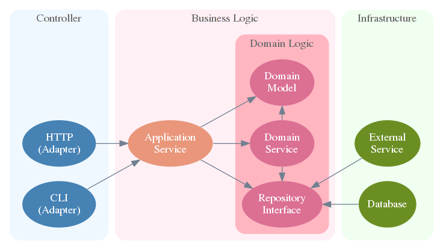

# DDD & Hexagonal Architecture

依存関係逆転の原則を適用した階層構造の各層の意味をもう少し見ていくと, 最下層のドメイン層の上にはアプリケーション層があり, この2つがビジネスロジックをなしていることがわかります. インフラストラクチャ層で実装されるドメイン層のインタフェースの典型例がリポジトリであることに注目すると, ユーザインタフェース層とインフラストラクチャ層はヘキサゴナルアーキテクチャにおける入力の辺と出力の辺に位置することも見てとれます. とくに, ユーザインタフェース層の中のコントローラ層(MVCのC)とインフラストラクチャ層のリポジトリ実装はそれぞれ入力アダプタと出力アダプタになっています.

## 용어 정리

### 어댑터

- 어떠한 인터페이스를 다른 인터페이스에서 사용하기 위한 래퍼

### 엔티티(entity)

- 실제로 시스템에 존재하는 것. 그것을 표현한 값(단순한 값 혹은 값 오브젝트)를 시스템 상에서 식별 가능하게 한 것
- 엔티티로서 별개인 것은 그 내용이 일치했다고 해도 다른 것으로 취급
- 엔티티로 같은 것은 그 상태가 변화하기 전과 후에 메모리 상의 표현이 다르다고 해도, 물건 으로서는 동일하다고 취급

### 값 오브젝트

- 물건의 내용을 자세히 나타내기 위한 특성을 가진 오브젝트
- 물건이 실제로 존재하는지는 신경쓰지않고, 내용이 같다면 같은것으로 취급

### 어그리게이트(aggregate)

- 정합성의 경계를 반영한 물건의 모임
- 어떠한 물건과 다른 물건이 서로 관계해있으며, 한쪽의 상태변화에 다른 한쪽이 변화하는 경우 필요한 것과 같이 복수의 물건의 상태가 정합성이 있을 필요가 있으면, 정합하고 있어야만하는 것들의 범위를 나타낸 것이 어그리게이트라 함

### 리포지토리(repository)

- 시스템상에 존재하는 물건에 직접 도달하기 위한(대개는 컬렉션으로 표현되는) 인터페이스
- 실제의 시스템에서는 데이터 저장소에 대응되며, 리포지토리에 저장된 오브젝트는 데이터베이스 등에서 영속화 되며, 저장된 오브젝트는 나중에 다시 꺼낼 수 있음
- 도메인 모델을 중심으로 고려하면, 다양한 물건은 어떠한 방식으로든 시스템상에 새로 생겨나, 그리고 시스템상에 존재하는 물건은 어떠한 방법으로든 나중에 가져올 수 있음. 데이터 저장소를 이러하게 개념적으로 고려한 것을 리포지토리 라고 함
