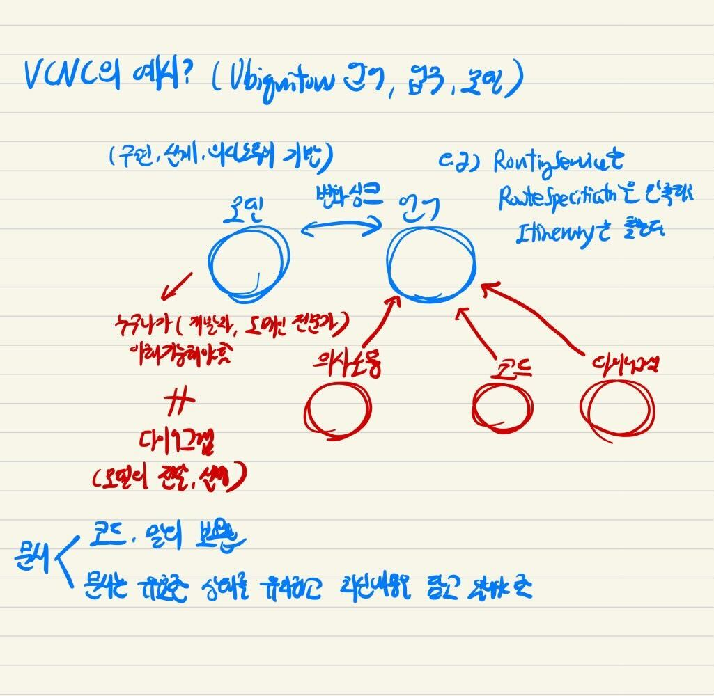
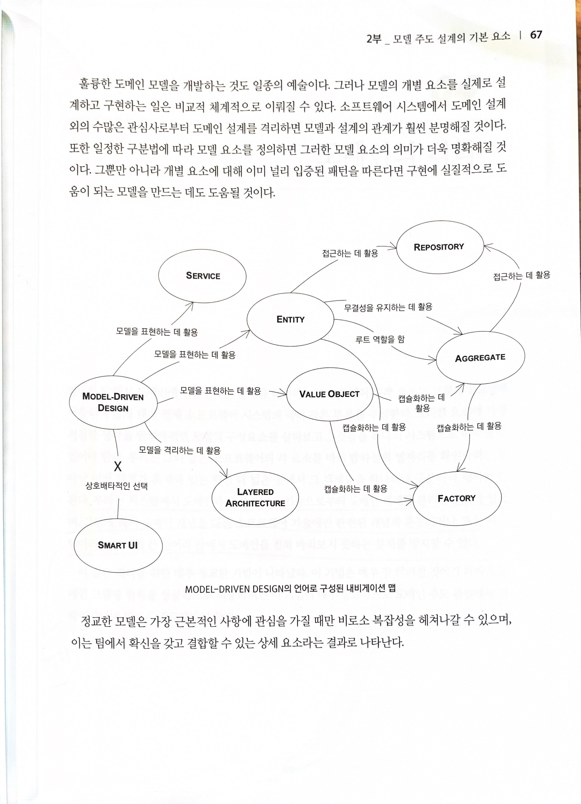
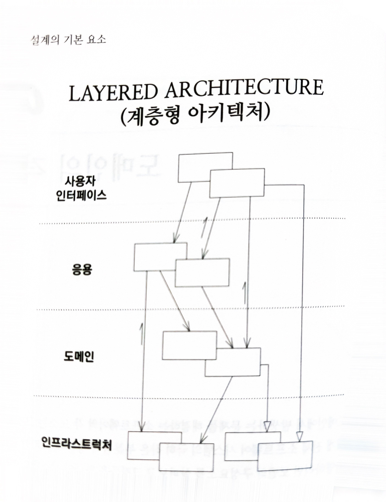
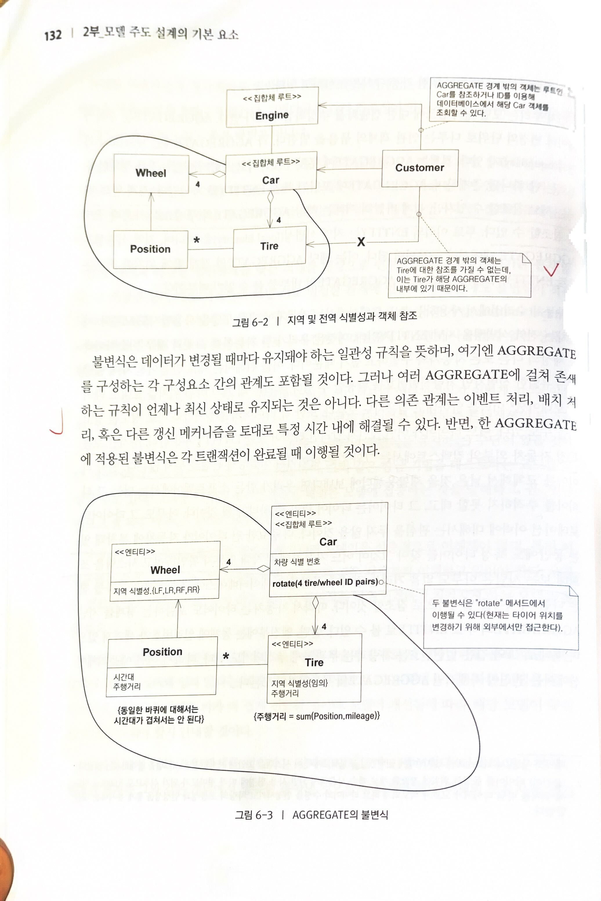

# 도메인 주도 설계 개요

- 의문
- 개요
- 책의 목차
- 제1부 동작하는 도메인 모델 만들기
  - 2장 의사소통과 언어 사용
  - 3장 모델과 구현의 연계
- 제2부 모델 주도 설계의 기본 요소
  - 4장 도메인의 격리
  - 5장 소프트웨어에서 표현되는 모델
  - 6장 도메인 객체의 생명주기

## 의문

- *DDD에서의 '도메인'의 정의는?*
- *목적조직에서는 어떻게 도메인을 나누고 설계해야 할 것인가?*
  - 애초에 DDD의 본질은 도메인 분리가 아니라, 소프트웨어의 유연성과 '커뮤니케이션' 아닌가?
- *모델은 어디까지 예외로직을 반영해야 하는가?*
  - *큰그림만 반영하면 되는가? -> 그런듯?*
- *도메인 레이어와 애플리케이션 레이어의 구체적인 차이점은 무엇일까?*

## 개요

- 마틴 파울러
  - 소프트웨어의 근본적 챌린지는 복잡함의 통제
    - 도메인 모델에 있음
  - 도메인 전문가와 기술자를 서로 공통언어로 이어줌
  - 개발과 설계는 계속해서 이어지는 것(처음부터 완벽한 설계는 없다)
- 복잡성은 기술적인 것이 아니라, 사용자의 활동이나 업무에 해당하는 도메인 자체
- DDD의 전제
  - 개발은 반복적인 주기를 토대로 진행되어야 한다
    - 변화와 불확실성에 대처하자
    - XP
      - 리팩토링을 토대로 설계를 개선하고, 리팩토링을 자주, 빠르게 수행한다고 가정
      - 설계와 개발 프로세스가 상호보완
  - 개발자와 도메인 전문가는 밀접한 관계에 있어야 한다
    - 지속적인 협업을 전제

DDD개요

- 스토리 라인
  - 소프트웨어의 본질 = 도메인의 문제 해결
  - 소프트웨어 개발의 근본적 챌린지 = 복잡도 다루기
    - 복잡도의 근원은 domain
    - 결국 도메인의 복잡도를 잘 다뤄야 함
  - 도메인 복잡도를 잘 다루기 위해서는 도메인 전문가와 개발자의 의사소통이 중요함
    - 같은 언어 사용
    - 개발과 설계가 투명하게 대응되어야 함
  - 복잡도의 해결 방법은 지속적인 커뮤니케이션을 바탕으로 한, 소프트웨어의 성장
    - 반복적인 리팩토링이 필요(외부 환경 변화에 따라서)
    - 계속해서 도메인 모델을 분화시키고 발전시킴
    - 객체지향 base
  - 도메인 주도 팀이 중요함
    - 의사 소통의 중심을 도메인 모델로하기
    - *이 부분이 직접 목적조직으로 될 수 있는가?*
    - *DDD의 본질은 *

## 책의 목차

- 1부 "동작하는 도메인 모델 만들기"
  - DDD의 기본적인 목표 제시
  - DDD 용어 정의
  - 도메인 모델의 사용이 의사소통과 설계에 어떤 영향을 주는지 설명
- 2부 "모델 주도 설계의 기본 요소"
  - **객체지향** 도메인 모델링에서의 우수 실천법의 핵심을 요약
  - 모델과 구현(소프트웨어) 간의 간극을 메우기
    - 상호보완까지도
  - 표준화된 패턴 제시
- 3부 "더 심층적인 통찰력을 향한 리팩토링"
  - 가치를 제공하는 실용적인 모델을 만들기
  - **모델의 발견 과정 강조**
    - 원시적인 모델에 기반둔 초기 설계내용에서 반복해서 변형해나감
    - 팀원들은 통찰을 얻을때마다 모델은 풍부한 지식을 나타낼 수 있게 됨
      - 코드는 심층적인 모델을 반영하게끔 리팩토링 되어, 애플리케이션에 적용가능하게 됨
    - 지속적인 리팩토링
  - 모델의 발견 과정에서 선택을 돕는 모델링 원칙과 적절한 방향을 제시하는 기법을 살펴봄
- 4부 "전략적 설계"
  - 복잡한 시스템, 더 큰 조직, 외부 시스템 및 기존 시스템과의 상호작용에서 발생하는 상황 다룸
  - *context, distillation, 대규모 구조* 원칙 살펴보기
  - 전략적 설계
    - 더 큰 규모, 대형 시스템, 큰 애플리케이션의 팀단위 의사결정

## 제1부 동작하는 도메인 모델 만들기

모델: **소프트웨어로 현실 문제를 해결하기 위해서, 도메인을 추상화 한 것**

- 도메인
  - 정의
    - 사용자가 프로그램을 사용하는 대상 영역
- 모델
  - 정의
    - **소프트웨어로 현실 문제를 해결하기 위해서, 도메인을 추상화 한 것**
  - 행동 정의
    - 어떤 사실을 해석할 때, 당면한 문제를 해결하는 것과 관련된 측면을 추상화 함
      - 세부사항은 주의 기울이지 않음
    - **도메인 지식을 엄격하게 구성하고 선택적으로 추상화(디테일 제외) 한 것**
      - 다이어그램을 이용해 모델을 표현하고 전달 가능
    - 목적에 따라서 제약에 구애받지 않고 현실을 표현하는 영화 제작에 더 가까움
- 도메인과 모델
  - 도메인 지식이 위압적으로 많으므로, 그런 복잡성을 모델로 단순화하고 구조화
  - 모든것은 도메인 모델에 기반을 두어야 한다
    - 모든것
      - 용어, 설계, 구현, 아키텍처
- DDD에서 모델의 유용성
  - 1 모델과 핵심 설계는 서로 영향을 주며 구체화된다
  - 2 모델은 모든 팀 구성원이 사용하는 언어 중추
  - 3 모델은 지식의 정수만을 뽑아낸 것
- 소프트웨어의 본질
  - 도메인의 문제 해결
    - 개발자는 도메인 지식 증진에 몰두해야 함
    - 개발자는 도메인 모델링 기법을 연마해서 도메인 설계에 통달해야 함
- 효과적인 모델링의 요소
  - 1 모델과 구현의 연계
  - 2 모델을 기반으로 하는 언어 정제
    - 모든이가 모델을 기반으로 한 용어로 문장 구성 가능
  - 3 풍부한 지식이 담긴 모델 개발
  - 4 모델의 정제
    - 오직 본질적인 개념만 식별할 수 있도록
  - 5 브레인스토밍과 실험
    - 여러 모델링을 시도 & 평가
      - 말로 표현만해도 모델의 타당성 여부 판단 가능

### 2장 의사소통과 언어 사용

모델과 유비쿼터스언어의 관계 다이어그램

- Ubiquitous Language
  - 개요
  - 예시
    - RoutingService는 RouteSpecification을 만족하는 Itinerary를 찾는다
- 모델과 언어
  - 개요
    - **모델은 구현 / 설계 / 의사소통의 기반이 되어야 함**
      - 모델은 누구나(개발자 / 도메인 전문가)가 이해 가능해야 함
    - **언어는 의사소통 / 코드 / 다이어그램 등에서 사용되어야 함**
    - 모델과 언어는 각자의 변화에 싱크를 맞춰야 함
  - 참고
    - 모델은 다이어그램이 아니다
      - 다이어그램은 모델을 전달, 설명하기 위한 도구
- 문서
  - 코드, 말의 보완재
  - 문서는 유효한 상태를 유지하고, 최신 내용을 담고 있어야 함

### 3장 모델과 구현의 연계

한 도메인에서 모델, 설계, 프로그래밍은 계속해서 발전하고 대응되어야 함

- 모델과 코드
  - 개요
    - 코드는 모델로부터 대응되어야 함
      - **결국 코드는 모델의 한 표현**
      - 즉, 코드의 변경은 모델의 변경이므로 프로그래머는 모델러
    - 하나의 도메인에 **모델은 오직 하나** 여야 함, 그리고 그 모델만이 코드에 대응되어야 함
  - 모델과 코드의 간격이 끊기는 이유
    - 분석 모델
      - 오로지 도메인 이해를 위한 수단
      - 결국 설계/구현 단계에서 폐기되기 쉬움
    - 설계의 기반이 되는 개념(모델)이 부족한 소프트웨어는 기껏해야 해당 소프트웨어의 행위를 설명하지 모한 채 그저 유익한 일을 수행하는 매커니즘에 불과
    - 설계 혹은 설계의 주된 부분이 도메인 모델과 대응하지 않으면, 그 모델은 그다지 가치가 없으며 소프트웨어의 정확함도 의심스러워진다
    - 모델과 설계 사이에 복잡한 대응관계가 되므로, 이해힘들고 유지보수가 불가능해짐. 통찰력이 서로에게 전달되지 않음
      - e.g) 호출예약
- 좋은 모델
  - 개요
    - 분석과 설계 관점에서 모두 효과적인(연결된) 모델(단일 모델)
      - 기술과는 분리됨
      - 분석과 설계 관점에서 어느쪽이든 효과적이지 못하면, 새로운 모델을 찾아야 함
    - 설계에 밀접하게 연관된 모델 **(모델이 먼저 정의되나, 그 모델은 설계와 관련있어야 함)**
      - 계속해서 리팩터링해야 함
      - 따라서, 설계시 도메인 모델을 있는 그대로 반영해야 함
    - 모델로부터 설계와 기본적인 책임 할당에 사용한 용어를 도출 가능해야 함
      - 코드 사용시 그러한 용어 사용
      - 코드의 변경이 곧 모델의 변경
  - 구현을 모델과 묶기위한 방법
    - 객체지향 프로그래밍과 같은 모델링 패러다임을 지원하는 소프트웨어 개발도구와 언어가 필요
  - 개발
    - 정의
      - 단일 모델을 <-> 설계, 코드를 단일한 활동으로 정제하는 반복적인 과정
        - 리팩터링 & 지식탐구의 반복
- 모델링 패러다임(MODEL-DRIVEN DESIGN)과 도구 지원
  - 정의
    - 모델과 구현을 매우 밀접하게 연결하는 패러다임
  - 방식
    - **객체지향 프로그래밍**
      - 모델링 패러다임에 근거하고, 모델의 구성요소에 대한 구현을 제공
      - 도메인의 활동적인 측면도 반영 가능
    - c.f) 절차지향 프로그래밍
      - 언어에 대응되는 모델링 패러다임 이 없어서 MODEL-DRIVEN DESIGN적용이 힘듬
      - 프로그램은 데이터를 기술적으로 조작할 뿐
    - **모델을 동작하게 만들어 애플리케이션의 문제를 해결**
  - 성공하기 위한 방식
    - 세부적인 설계 결정에 민감하게 영향을 받음
- 참고
  - 모델과 분석, 모델링, 설계, 프로그래밍을 지나치게 나누면 안된다

## 제2부 모델 주도 설계의 기본 요소

내비게이션 맵 예시

- 내비게이션 맵
  - 패턴과 패턴들이 서로 어떻게 관계를 맺는지 보여 줌
  - MODEL-DRIVEN DESIGN의 언어로 구성된 내비게이션 맵이 존재
- 표준 패턴
  - 특징
    - 설계에 체계가 생겨 팀 구성원이 각기 다른 구성원의 업무를 더욱 쉽게 이해할 수 있음
    - UBIQUITOUS LANGUAGE에도 표준 패턴을 사용하면, 모든 팀 구성원이 모델과 설계의 사결정에 관해 논의하는 데 활용 가능
  - 소프트웨어 시스템에서 도메인 설계를 격리하면, 모델과 설계의 관계가 훨씬 분명해짐
    - *무엇으로부터 격리? 정확한 의미가?*
- 도메인 모델의 개발
  - 모델의 개별 요소를 체계적으로 개발하자 How to
    - **시스템의 수많은 관심사에서 도메인의 설계 격리**
    - **일정한 구분법에 따라 모델의 요소를 정의**
    - **개별 요소에 대해 이미 널리 입증된 패턴을 따르기**
      - 표준 패턴()
  - c.f) DDD에서 모델을 표현하는 패턴(Entity, Value Object, Service)

### 4장 도메인의 격리

계층형 아키텍처

**계층형(Layered) 아키텍처** 가 도메인을 격리하기 위한 수단 설계 기법 -> 내비게이션 맵 참고

- 배경
  - 도메인에 관련된 코드는 항상 도메인에만 격리되어 있어야 함(separation of concern)
    - 그렇지않으면, 코드  확인 및 추론이 매우 힘들어짐
- 계층형 아키텍처
  - 개요
    - 한 계층의 모든 요소는 오직 같은 계층에 존재하는 다른 요소나 계층상 아래에 위치한 요소에만 의존
      - 위로 거슬러 올라가는 의사소통은 반드시 간접적인 메커니즘을 거쳐야 함
  - 가치
    - 각 계층에서 프로그램의 특정 측면만을 전문적으로 다룸
      - 응집력 있는 설계
      - 설계의 이해가 쉬움
    - **본질은 도메인 계층을 나누는 것**
      - **도메인 객체는 도메인 모델을 표현하는 것에만 집중하도록**
        - 표현이나 저장, 애플리케이션 작업을 관리하는 등의 책임에서 자유로움
        - **모델이 진화를 자유롭게 계속할 수 있도록 하는것이 중요**
  - 일반적인 계층들
    - UI
      - 사용자에게 정보를 보여주고, 사용자 명령을 해석하는 책임
      - 사용자가 아닌, 다른 컴퓨터 시스템과의 관계일수도 있음
    - 응용 계층
      - 소프트웨어가 수행할 작업을 정의하고, 표현력있는 도메인 객체가 문제를 해결하게 함
      - 얇게 유지
      - 반영할 것
        - 작업 조정, 도메인 객체의 협력자에게 작업 위임
        - 업무 진행 상황 상태
      - 반영하지 않을 것
        - 업무 규칙, 지식
        - 업무 상황 상태
    - 도메인(또는 모델) 계층
      - 비즈니스 로직을 다루는 계층
        - 업무 개념, 업무 상황에 관한 정보, 업무 규칙을 표현하는 일
        - 업무 상태를 제어 및 사용
          - c.f) 업무 상태를 저장하는 것은 인프라스트럭쳐에게 위임
    - 인프라스트럭쳐 계층
      - 상위 계층을 지원하는 일반화된 기술적 기능 제공
        - 메시지 전송
        - 도메인 영속화
        - UI에 위젯 그리기
  - c.f) 도메인 계층과 인프라스트럭쳐 계층
    - 인프라스트럭쳐 계층이 도메인계층을 의존하는게 바람직
      - **인프라스트럭쳐가 바뀌어도 도메인은 바뀌면 안됨**
      - 도메인 레이어의 요소들(리포지토리, 서비스 등)은 interface로만 정의

## 5장 소프트웨어에서 표현되는 모델

결국에는 MDD(Model Driven Dsign)을 하기 위함(모델과 구현은 하나다)

- 배경
  - **MODEL-DRIVEN DESIGN을 할떄는, 구현과 설계가 조화를 이루어야 함(대응되어야 함)**
    - 따라서, 구현 결정이 모델에도 매우 중요함
- 모델을 표현하는 세 가지 패턴(요소)
  - ENTITY
    - *연속성(o)*
      - *이게 뭐지*
    - 식별성(o)
  - VALUE OBJECT
    - 다른 뭔가의 상태를 기술하는 속성에 불과
      - 연속성(x)
      - 식별성(x)
  - SERVICE
    - 소프트웨어가 수행해야 하는 것이지만, 상태를 주고받지는 않는 활동을 모델링하는 경우
    - 도메인 측면에서 행동(action)이나 연산(operation)으로 표현하는 것이 명확할 때
      - 물론 객체지향 모델링에서 다소 벗어나지만, 억지로 객체에게 맡기진 말자
  - MODULE
    - 모델의 한 부분이므로, 도메인의 개념을 반영해야 함
      - 모든 의사결정은 도메인에 부여된 통찰력을 바탕으로 내려야 함
      - 도메인에도 높은 응집도, 낮은 결합도 개념을 접목해야 함
- 도메인 모델의 각 개념은 구현 요소에 반영되어야 함
  - **엔티티, VO, 그리고 그러한 객체들간의 연관관계는 일부 도메인 서비스와 조직화 모듈과 함께 구현과 모델이 직접 대응하는 지점**
  - 구현에서의 객체와 포인터, 검색 메커니즘은 모델 요소에 직접적이고 분명하게 매핑돼야 함
- 모델링 패러다임
  - OOP가 지배적
    - 단순하지만 도메인 지식을 포착할만큼 풍부함(비전문가도 어느정도 이해 ok)
    - 개발자 커뮤니티와 설계 문화 자체의 성숙도가 높음
  - 다른 패러다임은, 애초에 모델링하기 힘들수도있고, 모델링을 잘하는 사람을 구하기 힘들수도 있음
  - 따라서, OOP이외의 패러다임이 주류가 된다면, 다른 식으로 모델링할 수 있음
  - 도메인에 따라서, 도메인 모델이 객체모델이 아닐 수도 있음
    - Prolog로 구현된 MDD는 모델이 규칙과 사실로 이루어짐
    - 모델의 요소를 잘 표현할 수 있는 것이 존재한다면, 다른 패러다임의 도메인 구성요소를 사용가능
    - e.g) 객체에 의해서 수행되기만하는 수학 연산, 룰 엔진
  - 모델은 반드시 하나이지만, 구현에서는 두개이상의 패러다임을 사용할 수 있음. 대신 대응이 잘 되어야 함
    - UL을 사용하면 더 좋음
    - 객체가 아닌 요소를 객체지향 시스템에 혼합하는 팁
      - 1 구현 패러다임을 도메인에 억지로 맞추지 않는다
      - 2 유비쿼터스 언어에 의지한다
      - 3 UML에 심취하지 않는다
        - UML을 그리기 쉬운 방식으로 모델을 왜곡하지 말라
        - 다른 그리기방식이나 간단한 문장으로 설명을 쓰는게 나을수도 있음
      - 4 회의적이어야 한다
        - 도구가 실제로 제 몫을 하고 있는지 끊임없이 파악
    - 여러 패러다임을 보기 전에, 지배적인 패러다임 내에서 선택 가능한 방안을 파악하라
      - 관계형 패러다임은 패러다임 혼합의 특수한 경우
      - 비객체 + 객체 모델
      - 관계형 데이터베이스에 객체 데이터를 저장하는 것을 비롯해 다른 여러 객체의 생명주기와 관련된것은 나중에 나옴

### 연관관계

- 개요
  - **모델 내의 모든 탐색 가능한(traversable) 연관관계에 대해 그것과 동일한 특성을 지닌 메커니즘이 소프트웨어에도 있다**
  - e.g)
    - 고객과 영업사원 간의 연관관계를 나타내는 모델
    - <=> 두 자바 객체 간의 객체 포인터 or 데이터베이스 탐색을 캡슐화 한 것 or 그 외에 견줄만한 것
- 종류
  - one to many
    - e.g) 인스턴스 변수에 들어있는 컬렉션 or 접근자 메서드에서 데이터베이스 조회 후 레코드를 토대로 객체 인스턴스화(다른 설계지만 동일한 모델 반영)
      - 설계에서는 특정한 탐색 메커니즘을 명시해야 하며, 메커니즘의 행위는 모델내의 연관관계와 일치해야 함
  - many to many
    - 현실세계에서는 수많은 many to many 연관관계가 존재하나, 이는 구현과 유지보수를 복잡하게 하고 관계의 특성에 관해서는 거의 전해주는 바가 없다
- 연관관계를 쉽게 다루는 방법
  - 1 탐색 방향을 부여한다
  - 2 한정자(qualifier)를 추가해서 사시랑 다중성(multiplicity)을 줄임
    - 모델에서 중요한 본질만 다루기위해서 연관관계를 제한하자
    - e.g) 국가가 여러 대통령을 갖음, 한 나라에는 한 번에 한 명의 대통령만 존재, 한정자는 다중성을 일대일로 줄이고, 중요한 규칙을 명시적으로 모델에 포함
  - 3 중요하지 않은 연관관계를 제거
- 규칙
  - **어떠한 특별한 규칙이든 연관관계에 대한 제약조건이 발견되면, 해당 제약조건은 모델과 구현에 포함돼야 함**
    - 제약조건은 모델을 더 정확하게 하고 구현을 더욱 쉽게 유지보수하게 함

### ENTITY(엔티티)

- 배경
  - 많은것은 속성이 아닌 식별성에 의해 정의된다
- 정의
  - 개념적 식별성이 있는 오브젝트
    - 도메인에 따라서 엔티티인지 엔티티가 아닌지는 다르다

### VALUE OBJECT(값 객체)

- 개요
  - 개념적 식별성이 없는 오브젝트
  - 모델에 포함된 어떤 요소의 속성에만 관심이 있는 경우
  - immutable로 다루기

### SERVICE(서비스)

TADA에서는 매쳐의 필터링 서비스?

- 개요
  - 개념적으로 어떠한 도메인 객체(엔티티, VO)에도 속하지 않는(엔티티) 도메인 연산(action)
    - 도메인 엔티티나 VO에 억지로 연산을 집어넣어서 객체의 정의를 왜곡시키거나, 무의미하게 만들면 안됨
    - 연산 수행 이상으로 의미없는 객체: ~~Manager 와 같은 꼴
  - 다른 객체와의 관계를 강조
  - stateless 클라이언트
  - 구성 단위가 세밀한 도메인 객체의 도메인 지식이 응용 계층으로 흘러가는 것을 막음
    - e.g) 뷰노의 gravuty gateway의 로직들
    - 도메인 서비스를 적절히 도입하면 계층 간의 경계를 선명하게 하는 데 도움이 됨
- 특징
  - SERVICE의 정의 기준은 순전히 클라이언트에 무엇을 제공할 수 있느냐에 존재
  - SERVICE는 활동으로 이름을 지음
    - 추상적이고 의도적인 정의
    - 규정된 책임이 존재
  - 연산의 명칭은 UL에서 유래하거나, UL에 도입되어야 함
  - SERVICE의 매개변수와 결과는 도메인 객체
- 잘 만들어진 SERVICE의 특징
  - 1 연산이 원래 ENTITY, VALUE OBJECT의 일부를 구성하는 것이 아니라, 도메인 개념과 관련 있음
  - 2 인터페이스가 도메인 모델의 외적 요소의 측면에서 정의됨
    - *예시?*
  - 3 연산이 상태를 갖지 않음
- 예시
  - 한 계좌에서 다른 계좌로 자금을 이체하는 기능(DOMAIN SERVICE)
  - 자금 이체 기능에는 중요한 업무 규칙이 존재
  - 이체 연산은 두 계좌와 일부 전역적인 규칙(전송 금액 +-0)을 수반하므로 서비스로 두는게 바람직

### 모듈(패키지)

- 개요
  - 결합도는 낮고, 응집도는 높아야 함
    - 사람이 한 번에 생각해낼 수 있는 양에는 한계가 있음(결합도는 낮춰야 함)
    - 일관성이 없는 단편적인 생각은 획일적인 생각을 섞어놓은 것처럼 이해하기 힘듬(응집도는 높여야 함)
  - 시스템의 내력을 말해주는 MODULE을 골라 일련의 응집력 있는 개념들을 해당 MODULE에 담아야 함
  - 모듈의 이름은 UL로 정의
- 특징
  - MODULE은 모델과 함께 발전해야 함
    - 모듈에 대한 리팩토링 <=> 모델, 코드에 대한 리팩토링
  - 하나의 개념적 객체를 구현하는 코드는 모두 같은 모듈에 둬야 함
  - 패키지화를 바탕으로 다른 코드로부터 도메인 계층을 분리해야함

## 6장 도메인 객체의 생명주기

- 객체
  - 생명주기가 존재
    - 대다수
      - 생성자를 통해 생성 -> 연산에 사용 -> 가비지 컬렉팅
    - 일부
      - 메모리에서만 시간을 보내지 않음
      - 다른객체와 복잡한 상호의존성을 맺음
  - 관리
    - **생명주기 동안의 무결성(불변식) 유지**
    - 생명주기 관리의 복잡성으로 모델이 난해해지는 것을 방지
- 객체 관리 패턴
  - AGGREGATE(어그리거트)
    - 소유권과 경계의 관계를 명확히 해서, 모델을 엄격하게 해서 객체간의 연관관계가 혼란스럽게 얽히지 않게 함
    - 불변식이 유지돼야 할 범위 표시
  - FACTORY(팩토리)
    - 복잡한 객체와, 어그리거트를 생성하고 재구성해서 내부 구조 캡슐화
    - 어그리거트를 대상으로 연산을 수행하며, 특정 생명주기로 옮겨가는 데 따르는 복잡성 해소
  - REPOSITORY(리파지토리)
    - 영속 객체를 찾아 조회하는 수단
    - 어그리거트를 대상으로 연산을 수행하며, 특정 생명주기로 옮겨가는 데 따르는 복잡성 해소

### AGGREGATE(어그리거트)

어그리거트와 불변식

불변식의 경계에서 인터페이스가 되는 엔티티

- 문제
  - 모델 내에서 복잡한 연관관계를 맺는 객체를 대상으로 변경의 일관성(불변식)을 보장하기 쉽지 않음 -> 불변식이 어느 바운더리까지 보장되어야 하는거지?(특히 DB트랜잭션에서)
    - 개별 객체 뿐만 아니라, 서로 밀접한 관계에 있는 객체 집합에도 불변식이 적용되기 때문
    - lock만을 쓰기에는 데드락의 문제도 생겨버림
  - 여러 객체로 구성된 한 객체의 범위가 어디부터 어디까지인지 어떻게 알 수 있을까?
    - **불변식의 유지 바운더리를 명확히 하려면, 모델에 경계(모델 내 소유관계 등)를 정의해야 함**
- 개요
  - 데이터 변경의 단위(불변식 단위)로 다루는 연관 객체의 묶음
- 구조
  - root
    - 어그리거트에 포함된 특정 엔티티
    - 경계 바깥의 객체는 해당 어그리거트의 구성요소 가운데 루트만 참조 가능
      - 외부 객체는 경계 안을 볼 수 없음
      - *그런데, 모든 경우에서 경계가 잘 나뉠 수 있는것인가?*
  - boundary
    - 어그리거트에 무엇이 포함되고 포함되지 않는지를 정의
    - 경계 안의 객체는 서로 참조 가능
    - 모든것을 한결같이 불변성을 지킬 필요는 없고, 일부는 도메인 특성에 따라서 맞춰주는게 중요함
- 어그리거트 구현 방법
  - 루트 엔티티는 전역 식별성을 지니며, 궁극적으로 불변식을 검사할 책임이 있음
  - 각 루트 엔티티는 전역 식별성을 지니고, 경계안의 엔티티는 지역 식별성을 지니며, 이러한 지역식별성은 해당 어그리거트 안에서만 유일함
  - 어그리거트 밖에서는 루트 엔티티를 제외한 어그리거트 내부의 구성요소를 참조할 수 없음
    - 루트 엔티티가, 내부 엔티티에 대한 참조를 다른 객체에 전달은 가능하나, 일시적임
    - VO의 복사본은 다른 객체에 전달 가능(왜냐하면, 어그리거트와 연관관계를 맺지 않기 때문)
  - DB질의의 경우, 어그리거트의 루트 엔티티만 직접적으로 획득 가능. 다른 객체는 모두 어그리거트를 탐색해서 발견해야 함
  - 어그리거트 안의 객체는 다른 어그리거트의 루트만 참조 가능
  - 삭제 연산은 어그리거트 경계안의 모든 요소를 한 번에 제거해야 함
    - GC를 이용하면 이렇게 하기 쉬움
  - 어그리거트 경계 안의 어떤 객체를 변경해도, 전체 어그리거트의 불변식은 모두 지켜져야 함
- 예시
  - 어그리거트는 업무 관행에 맞는 구매주문과 구매주문에 대한 주문품목에 대한 소유권을 부여함
  - 구매주문과 구매주문의 주문 품목의 생성과 삭제는 자연스럽게 함께 묶이나, 품목의 생성과 삭제는 독립적으로 이뤄짐

### FACTORY(팩터리)

*이 장의 번역이 영 좀 그렇다*

어떤 객체나 전체 어그리거트를 생성하는 일이 복잡해지거나 내부 구조를 너무 많이 드러내는 경우 팩터리가 캡슐화 제공

- 문제
  - 객체 생성시 복잡한 조립 연산은 생성된 객체의 책임으로 어울리지 않음
    - *객체 생성 이후, setProperty하는 것 등*
  - 클라이언트에서 직접 필요로 하는 객체를 생성하면 설계가 지저분해지고, 조립되는 객체나 어그리거트의 캡슐화 위반, 클라이언트와 생성된 객체 구현이 지나치게 결합됨(복잡함)
    - 여기서 클라이언트는 해당 객체를 사용하는 각종 서비스 / 엔티티
    - *객체를 직접 사용하려고 하는 대상, 그것이 객체가 될 수 있고, 애플리케이션 레이어의 무엇이 될 수도 있음*
- 개요
  - 다른 객체를 생성하는 책임
    - ENTITY, VO, SERVICE에는 어울리지 않는 책임
  - 복잡한 객체와 AGGREGATE의 인스턴스를 생성하는 책임을 별도의 객체로 옮겨라
    - 도메인 설계의 일부를 구성
  - 클라이언트가 인스턴스화되는 객체의 구체적 클래스를 참조할 필요가 없는 인터페이스를 제공하라
  - 전체 AGGREGATE를 하나의 단위로 생성해서 그것의 불변식이 이행되도록 해야 함
- 팩터리의 요건
  - 1 생성 방법은 원자적이어야 함. 생성된 객체나 AGGREGATE의 불변식을 모두 지켜야 함
    - 일관성 있는 상태에서만 객체 생성해야 함
    - 엔티티의 경우
      - 전체 AGGREGATE를 생성하는 것
    - VO의 경우
      - 모든 속성이 올바른 최종 상태로 초기화 됨
  - 2 생성된 클래스보다는 생성하고자 하는 타입으로 추상화돼야 함
- 팩터리와 팩터리의 위치 선정
  - 개요
    - 감추고 싶은 세부사항이 포함된 것을 생성하고자 팩터리를 만든다음 제어할 수 있는 곳에 둠
      - 어그리거트 중심
    - 팩터리는 팩터리에서 만들어내는 객체와 매우 강하게 결합돼 있으므로, 팩터리는 자신의 생성물과 가장 밀접한 관계에 있는 객체에 있어야 함
  - 위치
    - 어그리거트의 루트?
      - 이미 존재하는 어그리거트에 요소를 추가하는 경우
    - 생성된 객체를 소유하지는 않지만 다른 객체를 만들어내는 것과 밀접한 관련이 있는 특정 객체에 팩터리 메서드를 둠
      - 팩터리와 객체 사이의 특별한 관계를 만듬
- c.f) 생성자만으로 충분한 경우
  - 클래스가 타입인 경우
    - **생성자가 복잡하지 않은 경우(생성자는 극도로 단순해야 함)**
      - 복잡한 것은 반드시 팩터리가 필요
    - *클래스가 어떤 계층구조의 일부가 아니며, 인터페이스를 구현하는 식으로 다형적으로 사용되지 않는경우*
      - *왜?*
    - 클라이언트가 STRATEGY를 선택하는 한 방법으로서 구현체에 관심있는경우
      - *무슨 의미?*
    - 클라이언트가 객체의 속성을 모두 이용할 수 있어서, 클라이언트에게 노출된 생성자 내에서 객체 생성이 중첩되지 않는 경우
- 팩터리 인터페이스 설계
  - 각 연산은 원자적이어야 함
    - 복잡한 생성물을 만들어내는데 필요한 것들이 모두 한번에 팩터리로 전달되어야 함
    - 생성이 실패해서 불변식이 충족되지 못하면, null값을 반환하던지, 코딩표준이 필요
  - 팩터리는 자신에게 전달된 인자와 결합될 것
    - 인자가 단순히 생성물에 들어가는 것이라면, 가장 의존성이 적당한 상태
    - 인자를 끄집어내서 객체 생성 과정에 사용하면 결합은 더 강해짐
- 불변식 로직의 위치
  - 팩터리 내부에서 시행
    - 어그리거트 규칙에는 잘 맞음
  - 생성물에 위임
    - 팩터리 메서드에서 잘 맞음(역할 분담)

#### 엔티티 팩터리와 VO 팩터리

- 엔티티 팩터리
  - *유효한 어그리거트를 만들어 내는데 필요한 필수 속성만 받아들임*
  - ID할당시, 팩터리 자체가 무엇을 요청하고 어디에 둬야 할지 알고 있어야 함
- VO 팩터리
  - 팩터리 연산이 생성물에 대해 풍부한 설명을 곁들여야 함

#### 저장된 객체의 재구성

- 파일이나, DB의 row로 영속화된 데이터를 객체로 재구성되는 팩터리와 생성에 사용되는 팩터리 차이
  - 재구성에 사용된 엔티티 팩터리는 새로운 ID를 할당하지 않음
    - 연속성의 상실 방지 필요
  - 불변식 위반을 다른 방식으로 처리

### 리파지터리(REPOSITORY)

- 본질
  - 기술적 인프라(검색)이 도메인 로직에 포함되지 않도록 한다
    - c.f) 스프링
  - 검색(전역적 + 기술적인 방법)으로 가져오는 것은 어그리거트여야만 한다
    - 나머지는 연관관계의 탐색으로 가져온다
- 배경
  - 데이터베이스의 검색 vs 연관관계
    - 데이터베이스의 검색
      - 어디서든 이용가능 & 곧바로 어떠한 객체에도 접근 가능
    - 연관관계(탐색)
      - 응집성
    - e.g) Customer 객체가 주문이 성사된 모든 Order에 대한 컬렉션을 갖고 있어야 하는가?
  - 저장된 객체를 가져오는 것
    - 기술적으로는 생성의 한 부분집합(DB의 데이터를 토대로 새로운 객체 생성)
    - DDD에서는 ENTITY의 생명주기 가운데 중간 단계
      - 새로운 객체를 만들어내는 것이 아니고, 재구성하는 것
  - 객체는 전역적인 검색으로 접근하지 말아야 한다
    - 클라이언트 코드에서 직접적으로 데이터베이스를 사용하면, AGGREGATE나 캡슐화와 같은 특징을 활용하는 것을 우회하려 하고, 그 대신 필요한 데이터를 직접 획득해서 조작하게 됨
      - 어그리거트 탐색 법칙에 위반
        - 어그리거트 내부에 존재하는 모든 객체는 루트에서부터 탐색을 토대로 접근하는 것 말고는 접근이 금지 되어있음
      - VO의 속성을 이용해 VO를 찾는 것은, 새로운 인스턴스를 생성하는 것과 매한가지이므로 의미가 없음
- 원칙
  - 영속 객체는 해당 객체의 속성에 근거해서 검색하는 식으로 전역적으로 접근할 수 있어야 함
    - 그러한 접근 방식이 필요한 것은, 탐색으로 도달하기에 편치않은 어그리거트의 루트
    - 루트는 엔티티이며, 간혹 복잡한 내부구조를 지닌 VO거나, 열거형 VALUE이기도 함
  - 어그리거트의 캡슐화를 지키자
- 리포지토리
  - 개요
    - 데이터 조회 기술을 캡슐화 해서 모델에 집중하게 해주는 단순한 개념적 틀
