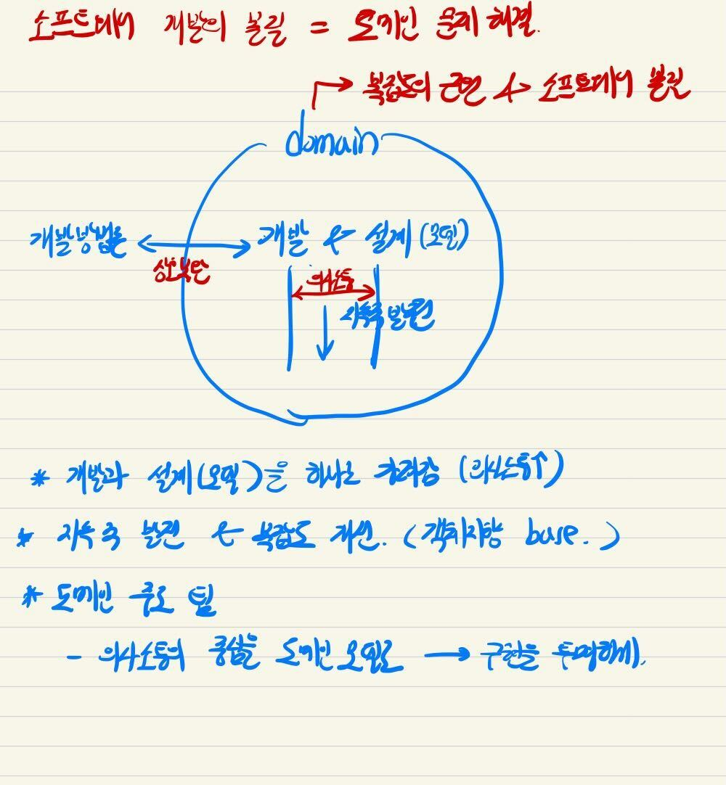

# 도메인 주도 설계 개요

- 의문
- 개요

## 의문

- *DDD에서의 '도메인'의 정의는?*
- *목적조직에서는 어떻게 도메인을 나누고 설계해야 할 것인가?*
  - 애초에 DDD의 본질은 도메인 분리가 아니라, 소프트웨어의 유연성과 '커뮤니케이션' 아닌가?

## 개요

- 마틴 파울러
  - 소프트웨어의 근본적 챌린지는 복잡함의 통제
    - 도메인 모델에 있음
  - 도메인 전문가와 기술자를 서로 공통언어로 이어줌
  - 개발과 설계는 계속해서 이어지는 것(처음부터 완벽한 설계는 없다)
- 복잡성은 기술적인 것이 아니라, 사용자의 활동이나 업무에 해당하는 도메인 자체
- DDD의 전제
  - 개발은 반복적인 주기를 토대로 진행되어야 한다
    - 변화와 불확실성에 대처하자
    - XP
      - 리팩토링을 토대로 설계를 개선하고, 리팩토링을 자주, 빠르게 수행한다고 가정
      - 설계와 개발 프로세스가 상호보완
  - 개발자와 도메인 전문가는 밀접한 관계에 있어야 한다
    - 지속적인 협업을 전제

DDD개요

- 스토리 라인
  - 소프트웨어의 본질 = 도메인의 문제 해결
  - 소프트웨어 개발의 근본적 챌린지 = 복잡도 다루기
    - 복잡도의 근원은 domain
    - 결국 도메인의 복잡도를 잘 다뤄야 함
  - 도메인 복잡도를 잘 다루기 위해서는 도메인 전문가와 개발자의 의사소통이 중요함
    - 같은 언어 사용
    - 개발과 설계가 투명하게 대응되어야 함
  - 복잡도의 해결 방법은 지속적인 커뮤니케이션을 바탕으로 한, 소프트웨어의 성장
    - 반복적인 리팩토링이 필요(외부 환경 변화에 따라서)
    - 계속해서 도메인 모델을 분화시키고 발전시킴
    - 객체지향 base
  - 도메인 주도 팀이 중요함
    - 의사 소통의 중심을 도메인 모델로하기
    - *이 부분이 직접 목적조직으로 될 수 있는가?*
    - *DDD의 본질은 *

## 책의 목차

- 1부 "동작하는 도메인 모델 만들기"
  - DDD의 기본적인 목표 제시
  - DDD 용어 정의
  - 도메인 모델의 사용이 의사소통과 설계에 어떤 영향을 주는지 설명
- 2부 "모델 주도 설계의 기본 요소"
  - **객체지향** 도메인 모델링에서의 우수 실천법의 핵심을 요약
  - 모델과 구현(소프트웨어) 간의 간극을 메우기
    - 상호보완까지도
  - 표준화된 패턴 제시
- 3부 "더 심층적인 통찰력을 향한 리팩토링"
  - 가치를 제공하는 실용적인 모델을 만들기
  - **모델의 발견 과정 강조**
    - 원시적인 모델에 기반둔 초기 설계내용에서 반복해서 변형해나감
    - 팀원들은 통찰을 얻을때마다 모델은 풍부한 지식을 나타낼 수 있게 됨
      - 코드는 심층적인 모델을 반영하게끔 리팩토링 되어, 애플리케이션에 적용가능하게 됨
    - 지속적인 리팩토링
  - 모델의 발견 과정에서 선택을 돕는 모델링 원칙과 적절한 방향을 제시하는 기법을 살펴봄
- 4부 "전략적 설계"
  - 복잡한 시스템, 더 큰 조직, 외부 시스템 및 기존 시스템과의 상호작용에서 발생하는 상황 다룸
  - *context, distillation, 대규모 구조* 원칙 살펴보기
  - 전략적 설계
    - 더 큰 규모, 대형 시스템, 큰 애플리케이션의 팀단위 의사결정
