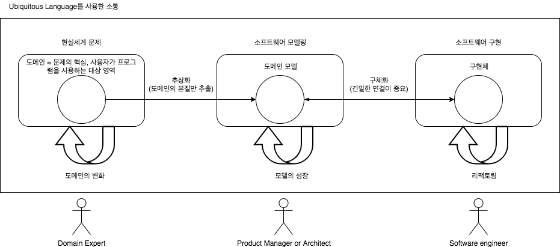

# 에릭 에반스 Domain Driven Development

## 의문

## 개괄

- **소프트웨어의 복잡성은 기술에서 오는 것이 아닌, 소프트웨어가 발을 디디고 있는 문제 도메인(사용자의 활동, 업무) 에서 기인함**
  - 도메인의 문제를 명시적으로 표현
  - 도메인이 자연스럽게 자리잡을 수 있는 코드를 개발
  - 도메인의 변화에 순응할 수 있게 소프트웨어를 진화시키는 것이 중요
- 소프트웨어를 분석하고 설계하는 구현 => 도메인 모델이라는 매개체를 중심으로 순환적 피드백 고리를 형성하는 통합된 작업
- DDD의 전제
  - 대부분의 소프트웨어 프로젝트에서는 가장 먼저 도메인과 도메인 로직에 집중해야 한다
  - 복잡한 도메인 설계는 모델을 기반으로 해야 한다
- 설계 vs 개발 프로세스
  - 설계와 개발 프로세스는 뗄레야 뗄 수 없는 관계
    - 개발은 반복주기를 토대로 진행돼야 한다(애자일)
    - 개발자와 도메인 전문가는 밀접한 관계에 있어야 한다

## 1부 동작하는 도메인 모델 만들기

- 도메인
  - 개요
    - 사용자가 프로그램을 사용하는 대상 영역
- 모델
  - 개요
    - 지식을 선택적 단순화 / 의식적 구조화
    - 개발자가 도메인 지식의 양과 복잡성에 압도되는것을 해소하는 도구
- 도메인 모델링
  - 개요
    - 어떤 목적에 따라 제약에 구애받지 않고, 현실을 표현하는 영화 제작에 더 가까움
      - 영화를 보여주는 방식은 감독마다 다를 수 있듯이, 특정 상황에서는 특정 모델을 채용하여 적용
- 도메인 주도 설계에서의 모델의 유용성
  - 모델과 핵심 설계는 서로 영향을 주며 구체화된다
    - 모델과 구현의 긴밀한 연결이 중요
      - 도메인 전문가와 엔지니어 사이의 갭을 이어줌
    - **엔지니어가 도메인 전문가의 지식을 전부 흡수할 수 없으므로, 개발에 필요한 필수 지식만을 추상화한 도메인 모델의 레벨에서 도메인 전문가와 엔지니어가 서로 커뮤니케이션하며, 모델을 계속 발전시켜나가야 한다.**
  - 모델은 모든 팀 구성원이 사용하는 언어의 중추이다
  - 모델은 지식의 정수만을 뽑아낸 것이다
    - 모델에는 도메인에 관한 조직의 사고방식이 담겨 있음
    - 개발자와 도메인 전문가가 공유 언어를 바탕으로 모델을 만들어내며 효과적으로 협업 가능
    - 모델과 구현이 연결되어 있다면 초기 버전의 소프트웨어를 통해 얻은 경험을 모델링 프로세스에 피드백으로 활용 가능
- 소프트웨어의 본질
  - 해당 소프트웨어 사용자를 위해 도메인에 관련된 문제를 해결하는 능력
    - 개발자는 도메인 연구에 몰두해야 함 + 모델링 기법 통달해서 도메인 설게에 통달해야 함
    - 기술만이 능사가 아님! 정말 중요한 것은 도메인임을 잊지 말자

### 1. 지식 탐구

- 효과적인 모델링의 요소
  - ① 모델과 구현의 연계
    - 초기 프로토타입을 토대로 본질적인 연결 고리를 만든 다음, 이어지는 모든 반복 주기 내내 그 연결 고리를 유지
  - ② 모델을 기반으로 하는 언어 정제
    - 도메인 전문가와 엔지니어가 모델에서 바로 용어를 끄집어내어 모델의 구조와 일관되게 문장을 구성할 수 있어야 함
    - 별도의 해석 없이도 문장을 명확히 이해할 수 있어야 함
  - ③ 풍부한 지식이 담긴 모델 개발
  - ④ 모델의 정제
    - 모델이 점차 완전해지면서 본질적인 개념은 남기고, 필요없는 개념은 제거됨
  - ⑤ 브레인스토밍과 실험
    - 정제된 언어를 바탕으로, 브레인스토밍과 모델에 대한 실험을 시도해보고 평가해봄
    - 시나리오를 빠르고 정확하게 말로 표현하고, 타당성 여부를 파악하기 쉬움
    - 팀내 지식을 가치있는 모델로 전환
- 지식 탐구
  - 개요
    - 협업 중심
  - 과거의 waterfall 개발 방식
    - 지식은 오로지 한방향으로만 흐르고, 축적되지 않음
    - 피드백이 없어서 실패하기 쉬움
  - DDD 방식
    - 모든 구성원이 함꼐 모델을 면밀히 만들어 나가면서 구성원 간 상호작용이 생김
    - 개발자는 자신이 보조하는 업무의 중요 원칙들을 배움
    - 도메인 전문가는 자신이 알고있는 지식의 핵심만 추출해야 하므로, 항상 자신의 이해를 자주 정제하고, 개념적 엄밀함(conceptual rigor)을 이해하게 됨
    - **팀 구성원 전체가 유능한 지식 탐구자로 거듭남**
      - 팀 구성원 전체가 모델을 계속 유용한 형태로 고침
      - 그러한 모델은 구현을 더 용이하게 만듬
    - 모델
      - 프로젝트 내내 흘러가는 정보들을 조직화 하는 도구
      - 요구사항 분석에 초점을 맞춤
      - 프로그래밍과 설계에 밀접한 관계를 갖음
      - 피드백의 기반이되어, 팀 구성원의 통찰력을 심화시켜줌
      - 절대 완벽한 모델은 없으며, 발전해나갈 뿐
  - 지식 탐구 프로세스를 팀원들과 궤도에 오르게 하는 것이 중요함
- 지속적인 학습
  - 생산성이 매우 뛰어난 팀은 지속적인 학습을 바탕으로 의식적으로 지식을 함양한다
  - 학습의 대상
    - 도메인 모델링 기술
    - 기술적 지식
