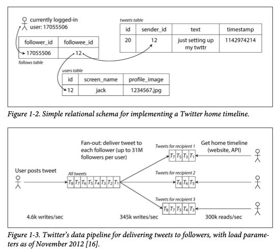
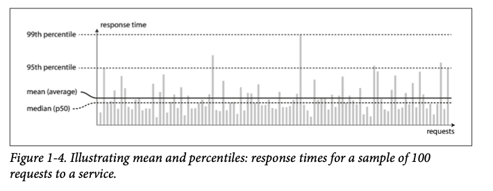
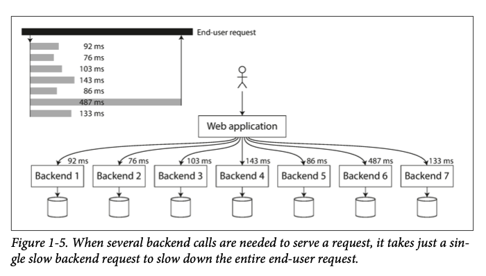

# Designing Data Intensive Application

- 의문
- 개요
  - Data-intensive
  - Data-intensive application helper tools
- Reliable, Scalable, Maintainable Applications
  - Reliability
  - Scalability
    - 부하(Load)의 기술(describing)
    - 퍼포먼스의 기술
    - Load를 처리하는 접근법
  - Maintainability
    - Operability: Making Life Easy for Operations
    - Simplicity: Managing Complexity
    - Evolvability: Making Change Easy

## 의문

## 개요

### Data-intensive

- Data-intensive
  - 데이터가 주된 challenge
    - 데이터의 양
    - 데이터의 복잡도
    - 데이터의 속도
- c.f) compute-intensive
  - CPU cycle이 bottleneck

### Data-intensive application helper tools

- NoSQL
- message queues
- caches
- search indexes
- frameworks for batch
- stream processing
- ...

위의 기술의 조합으로 data-intensive application을 작성

## Reliable, Scalable, Maintainable Applications

시스템을 설계 및 제작 및 운영하는데에 가장 중요한 3가지 요소

- Reliability
  - 정의
    - 시스템에 갑작스런 fault들이 등장해도 계속해서 올바르게 동작하는 것
      - fault는 용인하되, failure는 용인하지 않음
      - 당연히 일반적인 상황에서는 계속해서 올바르게 동작해야 함
    - *Availability와 비슷한 개념? 같은 개념?*
- Scalability
  - 정의
    - 시스템이 증가된 부하를 잘 처리할 수 있는 능력
    - 시스템이 커질 수록, 그러한 성장을 다루는 합리적인 방법 존재하는 것
- Maintainability
  - 정의
    - 서로 다른 시스템의 개발자들이 생산성 있게 일을 할 수 있는 것
- (Security)
  - 정의
    - 보안

### Reliability

- faults
  - 정의
    - 잘못될 수 있는 것들
  - 종류
    - Hardware faults
    - Software faults
    - Human errors
  - c.f) fault-tolerant / resilient
    - 정의
      - faults를 예측하고, 그것들을 잘 다룰 수 있는 것
        - predict가 아닌 tolerant
        - 단, security는 predict가 바람직
      - faults를 다 막을수는 없으나, failure는 막자
- failure
  - 정의
    - 전체적인 시스템이 유저에게 필요한 모든 서비스들을 제공할 수 없는 경우
- fault-tolerant system 만들기 위한 전략
  - 일부러 fault를 많이 만들어보자
- faults의 종류
  - **Hardware faults**
    - 개요
      - 하드웨어 에러의 경우 일반적으로, 독립적이고 서로 약한 상관관계를 갖음
    - 예시
      - Hard disks crash
        - 평균적으로 10 to 50 years에 망가짐
        - 따라서 1만개의 디스크가 있으면, 평균적으로 한개의 디스크가 고장난다고 생각해야 함
      - RAM faulty
      - power grid blackout
      - unplug the wrong network cable
    - 해결 방법
      - redundancy
        - disk의 경우 RAID 설정을 함
        - server의 경우, dual power supplies, hot-swappable CPU를 사용
        - data center에서는 백업 전원을 위한 배터리와 디젤 생성기를 갖고 있을 수 있음
      - software
        - 머신을 리부팅해야할 때, *rolling upgrade*를 사용하여 하나의 노드를 한 타이밍에 리부팅 할 수 있음
  - **Software Errors**
    - 개요
      - 소프트웨어 에러는 예측하기 더 어렵고, 노드에 걸쳐서 서로 상관관계가 있으므로, 상관관계가 옅은 하드웨어 faults보다 더 많은 시스템 faults를 일으킬 가능성이 큼
    - 예시
      - 특정 bad input을 넣으면 application server가 크래시 되는 경우
      - CPU, memory, disk space, network bandwith와 같은 공유 자원을 다 사용해버리는 *runaway process*
      - cascading failures
        - 하나 컴포넌트에 있어서의 fault가 다른 컴포넌트에 fault를 일으키고, 그것이 더 많은 faults를 일으키는 경우
    - 해결 방법(작은 방법들의 결합)
      - 시스템 안의 전제와 상호작용을 주의깊게 생각하는 것
      - 철저한 테스팅
      - 프로세스 격리
      - 프로세스가 크래시되고 재시작하는 것을 가능하게 하는 것
      - measuring
      - monitoring
      - production 모드에서 시스템 행동을 분석하는 것
  - **Human Errors**
    - 개요
      - 사람은 reliable하지 않음
        - 대부분의 큰 인터넷 서비스의 faults중에서 hardware faults는 오직 10-25%만 차지하고 나머지는 human configuration error임
    - 해결 방법
      - 에러가 날 기회를 최소화하는 방향으로 시스템을 디자인 함
        - 잘 설계된 추상화, APIs, admin 인터페이스는 올바른 일을 하기 쉽게 독려하고, 옳지 않은 일을 하기 어렵게 함
        - 하지만, 인터페이스가 너무 제한적이면 사람들은 work around를 찾으려 하므로, balance를 맞추는 것이 좋음
      - 사람들이 가장 많이 실수를 저지르는 장소와 그것들이 system failures를 야기할 수 있는 곳을 decouple해야 함
        - 사람들이 실제 대이터를 기반으로 쉽게 실험할 수 있는 *sandbox* non-production 환경을 제공하자
      - 모든 레벨에서 테스트를 철저히 함
        - unit test -> 전체 시스템 integration tests -> 수동 테스트
        - 코너 케이스도 잘 파악하자
      - human error로부터 빠르고 쉬운 recovery가 가능하도록 함
        - 빠르게 configuration 변화를 roll back하거나, 새 코드를 점진적으로 roll out하거나, 데이터를 recompute하는 툴을 제공
      - 자세하고 명확한 모니터링을 구축
        - performance metrics
        - error rates
      - 좋은 관리 관습과 training을 구현

### Scalability

- 배경
  - 현재 reliable한 시스템이 미래에 reliable한 것을 보장하지 않음
- 정의
  - 증가된 부하를 잘 처리할 수 있는 능력
- scalability에 대한 관점
  - '만일, 해당 시스템이 특정한 방식으로 성장한다면, 그러한 성장을 잘 처리하기 위한 우리의 옵션은 무엇인가?'
  - '그러한 추가적인 부하를 다루기 위한 컴퓨팅 자원을 어떻게 추가할 수 있는가?'

#### 부하(Load)의 기술(describing)

- **load parameters**
  - rps
    - request per second
  - ratio of reads to writes in a database
    - tps같은 것들이라던지?
  - the number of simultaneously active users in a chat room
  - hit rate on a cache
  - ...
- 현재 시스템의 부하를 간결하게 기술해야 함
  - 그래야, 부하의 증가에 대한 질문에 답을 할 수 있음

트위터의 예시

- 트위터의 경우, tweet의 insert와 timeline보기가 코어 로직
  - timeline보기에서는 자신이 팔로우하고 있는 모든 사람들의 트윗을 볼 수 있어야 함
  - tweet을 하는경우, 자신을 팔로윙 하고 있는 사람들에게 모두 자신의 트윗을 보여줘야 함
    - 평균적으로 한 트윗은 75명의 팔로워에게 메시지를 전해줘야 함
    - 하지만 어떤 사람은 300만명의 팔로워를 갖고 있음
- scalability 해결 방식
  - hybrid
    - 셀럽(팔로워가 매우 많은 극소수의 사람들)의 트윗은 캐싱을 하지 않고, RDB JOIN을 사용함
    - 셀럽이 아닌 사람의 트윗은 캐싱을 해서 각 유저가 볼 수 있도록 함

#### 퍼포먼스의 기술

response time 그래프

backend response time bottleneck

- 시스템의 퍼포먼스
  - throughput
    - 개요
      - the nuber of records we can process per second or
      - total time it takes to run a job on a dataset of a certain size
      - Hadoop과 같은 batch processing system에서 중요
  - response time
    - 개요
      - 클라이언트가 리퀘스트를 보내고 리스폰스를 받을 떄 까지의 시간
      - 대부분의 온라인 시스템에서 중요
    - 특징
      - 개개의 response time이 아닌, distribution으로 생각해야 함
      - percentile로 분석하는 것이 좋음
        - median response time이 200ms => 절반의 리퀘스트가 200ms 이내로 response 반환하고, 나머지는 그것보다 더 시간이 걸린다는 이야기
        - outlier는 99th, 95th, 99.9th를 확인
          - AWS의 경우 99.9th로 늦게 response를 받는 customer가 가장 많은 서비스를 사용하는 큰손일 수 있으므로 매우 중요함
          - 하지만 99.99th의 response time을 optimize하는것은 큰 의미가 없을 수 있음
      - 인위적인 load를 생성하기 위해서는, response time을 기다리지말고, 계속해서 request를 보내야지 production환경과 비슷한 metaphor를 제공할 수 있음
      - 백엔드 서비스에서 high percentile은 전체 유저의 response time을 저하시키므로 매우 중요
        - monitoring을 하자!
    - c.f) Latency vs Response time
      - Response time
        - 클라이언트의 관점
          - 네트워크 딜레이 + 큐잉 딜레이 + 서버의 request 프로세싱 등 전부를 합한 값
      - Latency
        - waiting time
          - 리퀘스트가 서버에 의해 처리되기 까지 기다리는 duration
- 현재 부하를 알게 된 이후에, 부하를 증가시키면 어떻게 되는지를 조사할 수 있음
  - 예시
    - load parameter의 값을 증가시키고, system resources(CPU, memory, storage, network bandwith 등)를 그대로 두면, 시스템의 퍼포먼스가 어떠한 영향을 받는지?
    - load parameter의 값을 증가시킬 때, 현재의 퍼포먼스를 유지하기 위해서는 system resources를 얼마나 증가시켜야 하는가?

#### Load를 처리하는 접근법

- 개요
  - load 증가가 될 떄마다, architecture를 다시 생각해야 함
- Scaling up vs Scaling out
  - 두 방식을 mix하는 경우가 가장 적절할 때가 많음
- 전략
  - **stateless, stateful machine에 대한 관점**
    - 기존
      - stateless인 서비스를 다수의 머신에 배치, stateful 데이터 시스템을 single node에 배치
    - 현재
      - distributed data system
        - 분산 시스템의 추상화가 잘 되어있어야 함
  - **어떤 operation이 common이고 어떤 operation이 rare인가에 대한 전제를 잘 해야함**
  - **general-purpose building blocks + patterns**

### Maintainability

- 배경
  - 대부분의 소프트웨어 비용은 초기 개발이 아닌, 유지 보수에 의한 것이 많음
    - 버그 고치기, 시스템 운영, failure 조사, 새 플랫폼에 적용, 새로운 use case에 대비한 수정, 기술 부채 상환, 새 기능 부착
- **Maintainable한 소프트웨어를 제작하기 위한 핵심 개념**
  - Operability
    - 운영팀이 시스템을 쉽게 운영할 수 있도록 하는 것
  - Simplicity
    - 새 엔지니어가 시스템을 이해하기 쉽게 함
      - 복잡도의 제거가 중요함
  - Evolvability
    - 미래를 위한 소프트웨어 변화를 쉽게할 수 있도록 함
    - (= extensibility, modifiability or plasticity)

#### Operability: Making Life Easy for Operations

**가시화**

- Operation team
  - 미션
    - 소프트웨어가 부드럽게 동작하도록 하는것
    - 시스템의 헬스 체크, 나쁜 상태면 바로 회복시키기
    - system failures, degraded performance의 문제 해결
    - 보안 패치를 포함한 소프트웨어와 플랫폼을 최신 상태로 유지
    - 서로 다른 시스템들의 관계를 알고 있어서, 문제가 되는 변화가 문제를 일으키기 전에 피함
    - 미래에 나타날것으로 생각되는 문제 해결(capacity planning)
    - 좋은 관습, 툴, 설정을 정립해둠
    - 복잡한 유지보수 일을 행함
      - 애플리케이션의 플랫폼 변경 등
    - 시스템 보안 유지
    - production 환경을 안정적으로 유지할 수 있도록 도와주는 프로세스 정립
    - 해당 시스템에 대한 기관의 지식을 보존
- 좋은 operability
  - 의미
    - **making routine tasks easy**
    - 운영 팀이 높은 가치의 작업에 노력을 집중할 수 있게 함
  - 방법
    - 런타임 행동과 시스템 내부를 가시화 해서 모니터링 함
    - 자동화와 기본 틀들의 연동
    - 개별 머신에 대한 의존 회피
      - 일부의 머신을 다운 시켜도, 전체 시스템은 동작하도록
    - 문서화, operational model 정립
      - 만약 X를 하면 => Y가 일어남
    - default behavior를 잘 정립하고, administrator가 override할 수 있도록 함
    - self-healing을 구현하고, administrator가 수동적으로 컨트롤 할 수 있도록 함
    - Exhibiting predictable behavior, minimizing surprises

#### Simplicity: Managing Complexity

- 개요
  - 단순성이 시스템의 주요 목표가 되어야 함
- 단순성을 위한 툴
  - Abstraction
    - 많은 구체적인 구현을 깔끔하고 알기 쉬운 facade뒤에 감추는 것
    - 예시
      - 고수준 프로그래밍 언어
        - 기계어, CPU 레지스터, syscall 등을 추상화
      - SQL
        - 디스크나 인메모리 데이터 구조, 다른 클라이언트로부터의 동시성 request, 크래시 이후의 비일관성 등을 추상화

#### Evolvability: Making Change Easy

- 개요
  - 시스템은 지속적으로 변화할 것임
- 해결
  - Agile
    - TDD
    - Refactoring
  - Simplicity / Abstractions
    - 쉽게 이해할 수 있으면 쉽게 수정이 가능하다
- 참고
  - 데이터 시스템에서는 Agility대신에 evolvability라는 용어를 사용
