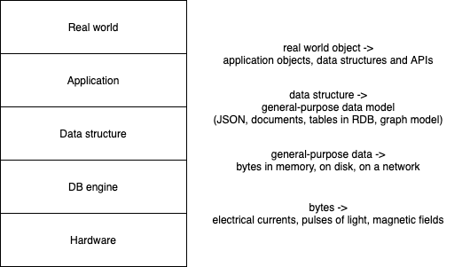
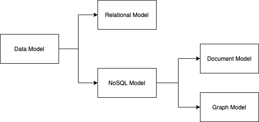
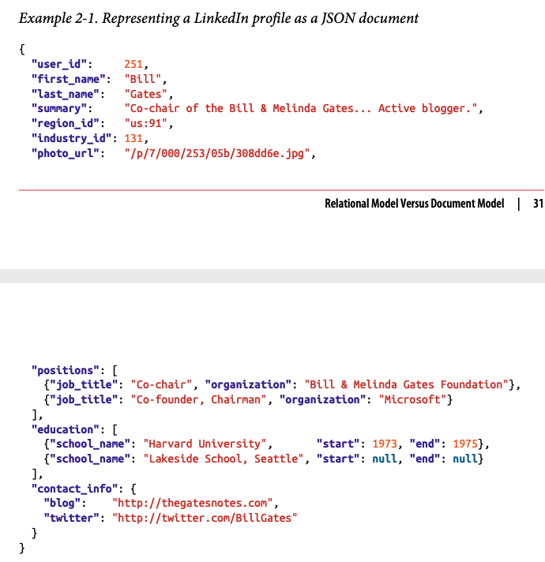
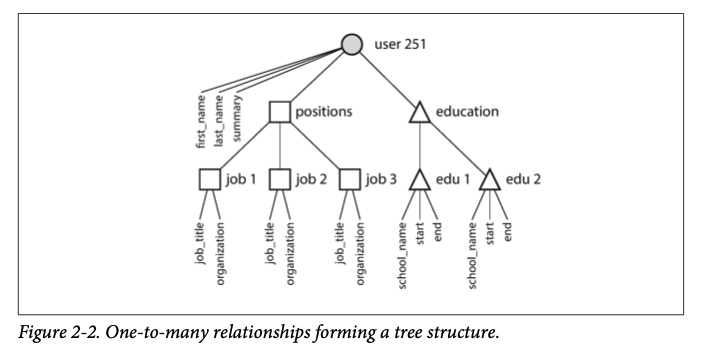
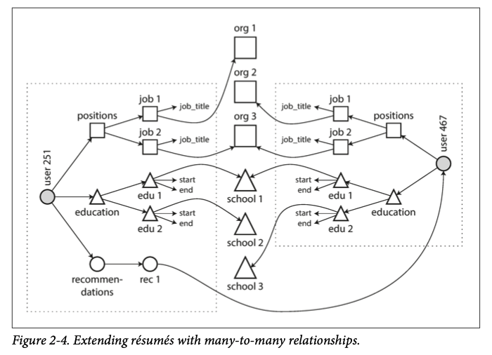

# Ch2. Data Models and Query Languages

- 의문
- Data model 개요
- Relational Model vs Document Model
  - Relational model
  - The Birth of NoSQL
  - Object-Relational Mismatch
  - Many-to-one and Many-to-Many Relationships
  - History of many-to-many relationship resolution
  - document model vs relational model
    - Schema flexibility
    - Data locality for queries
    - Convergence of document and relational databases

## 의문

## Data model 개요

Data model과 추상레이어



- 데이터 모델이 소프트웨어 개발에 가장 중요한 요소중 하나
  - 작성되는 소프트웨어의 관점에서 중요할 뿐 아니라
  - 문제 해결의 생각적 기반이 됨
- 대부분의 애플리케이션은 데이터모델의 추상화 계층으로 구현됨
  - 핵심
    - **각 레이어는 깔끔한 데이터 모델을 제공하므로써, 아래 레이어의 복잡도를 감춤**
  - 1 application level
    - 실 세상을 object, data structure, data structure를 다루는 api로 환원
  - 2 data structure level
    - 데이터 스트럭처를 JSON, XML document나 RDB의 table이나 graph model로 환원
  - 3 db engine level
    - JSON/XML/RDB/Graph 데이터를 메모리나 디스크나 네트워크상의 바이트로 환원
  - 4 hardware level
    - 바이트를 전자 전류, 빛의 pulse, 자기장 등으로 나타내도록 환원

## Relational Model vs Document Model

Data model category



### Relational model

- 개요
  - 데이터는 relations으로 구성되고, 각 relation은 소팅되지 않은 tuple의 collection으로 구성됨
- 역사
  - 1960, 1970
    - Business Data Processing으로부터 시작
    - Transaction processing, Batch processing을 처리하기 위함
    - RDB이외의 데이터베이스는 개발자가 데이터베이스 속에 있는 데이터의 내부 표현까지 생각했어야 했음
    - **RDB의 목적은 깔끔한 interface 뒤로 구현을 숨기는 것이었음**
  - 2000년대 까지도 계속해서 dominant

### The Birth of NoSQL

- 배경
  - RDB보다 매우 높은 **scalability를** 갖고, 매우 높은 **write throughput**을 갖는 데이터 베이스의 필요성
  - 상업 DB 제품 보다 오픈소스에 대한 선호의 확산
  - 관계 모델에 의해서 잘 서포트되지 않는 특별한 쿼리의 지원 필요성
  - 관계 스키마의 제약에 대한 실망과, **보다 다이나믹하고 표현적인 데이터 모델의 필요성**

### Object-Relational Mismatch

resume의 JSON document 표현



resume의 Tree 구조 표현



- **대부분의 애플리케이션의 개발이 object-oriented하게 되지만, SQL data model의 경우에는 관계형 테이블에 데이터가 저장되면, translation layer가 필요해짐**
  - e.g) ORM(ActiveRecord, Hibernate)
  - 하지만 ORM도 **Object-oriented model** 과 **SQL data model** 사이를 완전히 매우지는 못함
- 관계형 데이터베이스에서 1:다 관계를 다루는 방법(이력서의 예시)
  - positions, education, contact information을 전부 다 다른 테이블로 두고, foreign key 참조로 이어줌(JOIN사용)
  - XML, JSON 데이터 타입의 데이터를 하나의 행에 저장 가능
  - jobs, eductaion, contact info를 JSON이나 XML document로 encode하고, application이 structure와 content를 해석하도록 함
    - DB가 encoded column에 대해서 query하는것이 불가능해짐
- 1:다 관계는 Tree구조를 암시함
  - JSON으로 잘 나타낼 수 있음
- JSON의 단점
  - schemaless
    - 때로는 장점이 되기도 함

### ID 사용의 이점

- ID 사용의 이점
  - 사람에게 전혀 ID의 의미가 없기 떄문에, 변화할 필요가 없다는 점
  - ID가 나타내는 정보가 변화하여도 결국 ID는 계속 같은 채로 유지
    - 사람에게 의미가 있는 데이터의 경우, 미래에 변화한다면 전부다 바꿔야 하는 오버헤드 발생
  - normalization
    - duplication의 제거

### History of many-to-many relationship resolution

- Many-to-many relationship을 DB에서 어떻게 표현할 것인가?
  - hierarchical model
    - 개요
      - 모든 데이터는 tree로 나타내어짐(JSON과 비슷함)
    - 한계
      - 개발자가 데이터를 duplicate하게 저장할 것인지(denormalize), application level에서 서로의 record를 참조하도록 할 것인지 정해야 했음
  - network model
    - 개요
      - hierarchical model의 일반화
        - 각 record는 여러 parent를 가질 수 있음
    - 한계
      - 개발자가 특정 record를 fetch하려면, application code에서 access path를 지정해줘야만 함
        - 잘 작성했을 때, 최적화가 잘 된다는 장점도 있긴 함
      - 사장됨
  - relational model
    - 개요
      - query optimizer가 쿼리를 진행하는 순서나 사용하는 인덱스를 알아서 최적화해 줌
      - application에 새로운 기능을 추가하기 쉬움
      - 복잡한 query optimizer를 한번만 작성하면, 어느 상황에서든 쉽게 이용 가능
    - 한계
      - query optimizer가 엄청나게 복잡함
  - document model
    - 개요
      - hierarchical model은 nested data를 저장한다는 측면에서는 회귀이나, separate table에 데이터를 저장하기로 함

### document model vs relational model

- 공통점
  - many-to-one and many-to-many relationships을 표현하는 것 자체는 본질적으로 다르지 않음
    - **둘다, related item은 unique identifier에 의해서 참조됨**
      - relational model
        - foreign key
      - document model
        - document reference
- 비교적 장점
  - document model
    - schema flexibility
    - better performance due to locality
  - relational model
    - better support for joins
    - better support for many-to-one and many-to-many relationships
- 비교적 단점
  - document model
    - document안에서 직접적으로 nested item을 참조할 수 없음
      - the second item in the list of positions for user 251로 쿼리해야 함(hierarchical model의 access path와 유사)
      - 너무 깊은 레벨이 아닌 이상, 큰 문제는 아님
    - poor support for joins
      - 애플리케이션의 성질에 따라서 다름
        - many-to-many relationship이 많은 경우에 문제
        - application level에서 join을 emulate할 수 있으나, 더 비효율적이고 application이 복잡해질 가능성이 커짐
  - relational model

#### Schema flexibility

- ~schemaless~
- schema-on-read
  - 개요
    - data structure은 implicit 하고, 데이터가 읽혀질 때만 interpreted됨
  - 적절한 사용 예
    - colletion의 item이 어떠한 이유에서든지 서로 다른 구조를 갖는 경우
    - **데이터의 구조가 자신이 컨트롤 할 수 없는 외부로부터 결정이 될 때**
- schema-on-write
  - 개요
    - schema가 explicit하고, 작성된 데이터는 해당 형태를 유지하는것을 보증
  - 적절한 사용 예
    - 모든 record가 같은 데이터 구조를 갖는 것을 강제할 수 있는 경우

e.g) data format을 변화시킬 경우

document model db (schema-on-read)

```js
if (user && user.name && !user.first_name) {
  user.first_name = user.name.split(' ')[0]
}
```

rdb (schema-on-write)

```sql
ALTER TABLE users ADD COLUMN first_name text;
UPDATE users SET first_name = split_part(name, ' ', 1); -- PostgreSQL
```

- 방법1(위)
  - MySQL 이외의 대부분의 RDBMS는 `ALTER TABLE` 문을 a few milliseconds에 끝냄
- 방법2
  - `first_name` 칼럼을 default NULL로 두고, read time에 채우는 방법도 존재함(document db랑 비슷함)

#### Data locality for queries

- document model에서 애플리케이션의 document 전체를 접근할 때에는 storage locality로 인한 퍼포먼스 advantage가 존재
  - 만약 데이터가 여러 테이블에 나누어져 있으면, 데이터 모두 가져오려면, 다양한 index를 lookup해야만 함
- document는 작게 유지하는 것을 권장
- *data locality가 정확히 뭐지?*

#### Convergence of document and relational databases

- RDB
  - XML 지원
    - MySQL을 제외한 대부분의 RDBMS는 XML을 지원함
    - XML document의 local modification이 가능
  - JSON 지원
    - PostgreSQL, MySQL, IBM DB2는 JSON document를 지원함
- document db
  - join 지원
    - Rethink DB
  - application layer에서의 자동 join 지원
    - MongoDB
- 점점더 두 진영의 기능상 특징이 서로 닮아감

## Query Languages for Data

- SQL
  - declarative
    - 데이터의 패턴을 명시(WHAT)
    - HOW는 query optimizer에게 맡기자
      - index, join method, 순서 등 알아서 진행함
    - parallel execution을 가능하게 함
- IMS / CODASYL
  - imperative
    - 데이터를 어떻게 가져오는가를 명시(HOW)
- 번외
  - declarative query는 css도 마찬가지
    - 구체적으로 어떻게 배경화면이 초록색이 되는지는 지정하지 않음
    - `js`에서는 DOM API를 이용해서 직접 imparative하게 제어 가능

### 복잡한 버전의 resume



- normalizing과 ID 사용
  - ID 사용의 이점
    - 사람에게 전혀 ID의 의미가 없기 떄문에, 변화할 필요가 없다는 점
    - ID가 나타내는 정보가 변화하여도 결국 ID는 계속 같은 채로 유지
      - 사람에게 의미가 있는 데이터의 경우, 미래에 변화한다면 전부다 바꿔야 하는 오버헤드 발생
      - id에 대응하는 display Name만 변화시켜주면 되는 것
    - normalization의 key idea
      - duplication의 제거
    - updating이 쉬움
    - localization support가 가능
    - better search
  - ID를 사용하지 않으면
    - 중복된 값을 여러 테이블에 갖고 있어야 함
- normalizing과 document model의 한계
  - many-to-one 관계
    - e.g) 많은 사람들이 특정 지역에 산다 등
  - many-to-one 관계에 있어서, document model에서는 데이터를 가공하기 힘듬
    - 데이터를 가져오고, application layer에서 join 기능을 제공해야 함
  - 애플리케이션의 처음 버전은 join-free document model과 잘 맞아도, 기능이 추가되다 보면 어떻게 될지는 아무도 모름
    - e.g)
      - 위의 resume의 경우, orgnization이나 school이 entity가 되어야 할 수도 있음(organization의 webpage, school의 webpage 등)
      - recommendation이 추가가 되어서, recommendation을 작성하는 사람의 프로필 사진이 걸려있어야 하는 경우 등(many-to-many feature)
