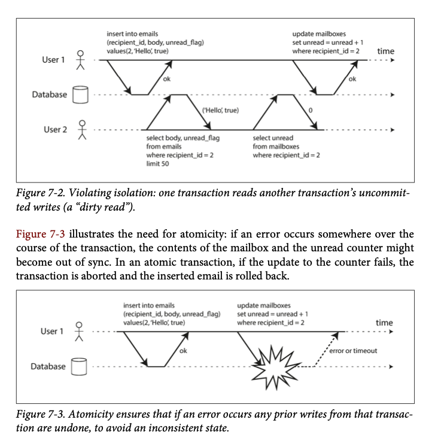

# ch7. Transaction

Some authors have claimed that general two-phase commit is too expensive to support, because of the performance or availability problems that it brings. We believe **it is better to have application programmers deal with performance problems due to overuse of transactions as bottlenecks arise, rather than always coding around the lack of transactions.**

James Corbett et al., Spanner: Google's Globally-Distributed Database(2012)

- 배경
  - Transaction
  - Single-Object and Multi-Object Operations
  - The need for multi-object transactions
  - Handling errors and aborts
- Weak Isolation Levels

## 배경

- 데이터 베이스가 잘못되는 수 많은 경우의 수
  - db software or hardware가 언제든지 실패할 수 있음(write operation 도중에)
  - application이 언제든 crash할 수 있음
  - network interruption가 예측불가능하게 db와 연결을 끊기게 할 수 있음
  - 여러 클라이언트들의 race condition
    - 한꺼번에 병렬적으로 데이터를 업데이트
    - 일부만 업데이트된 데이터를 읽을 경우

Reliability를 위해서는, 위의 경우를 모두 고려해야 함

- 모든 경우의 수 고려
- 테스팅 필요

### Transaction

- 정의
  - **information processing s.t indivisible individual operation**
- ACID
  - Atomicity
    - 모든 액션을 나눌 수 없음. 중간에 에러가 나면 rollback이며, 나지 않으면 commit
  - Consistency
    - 모든 불변량을 잘 지킬 수 있어야 함
  - Isolation
    - 다른 transaction과 독립적
      - 실제 transaction 처리는 concurrent하더라도 순차적으로 일어난 것 처럼 보여야 함
  - Durability
    - 한 번 commit된 transaction은 persistent함
  - definition/architecture:DB:Transaction 참고

### Single-Object and Multi-Object Operations

Isolation and atomicity violation example

- Multiobject transactions(Atomicity & Isolation)
  - 개요
    - 클라이언트가 하나의 transaction에서 여러 데이터 writes를 시도하는 경우
      - 데이터의 sync를 맞추기 위함
  - 특징
    - 어떤 read & write 연산이 같은 트랜젝션에 속하는 것인지 명시해줘야 함
      - 특정 TCP connection(비추)
      - DB내부의 transaction manager가 unique transaction identifier로 관리(추천)
        - `BEGIN TRANSACTION ... COMMIT`
          - 어떤 read & write 연산이 같은 트랜젝션에 속하는 것인지 명시해주는 방법
        - NoSQL에서는 operation grouping기능을 제공해주지 않는 경우가 많음
  - Multiobject transactions가 필요한 예시
    - email application에서 unread인 이메일의 개수를 보여주자
      - `SELECT COUNT(*) FROM email WHERE recipient_id = 2 AND unread_flag = true`
        - 너무 느리므로, 개수를 저장하는 summary table(`mailBoxes`)을 생성
    - 트랜잭션을 이용해서 atomic & isolated하게 writes연산을 묶어줌
- Single-object writes
  - 개요
    - single object에 대해서도 atomicity & isolation이 적용되어야 할 경우가 있음
      - 20KB JSON document를 DB에 저장할 경우,
      - 첫 10KB가 보내진 다음에 network connection interrupt가 발생하면 10KB fragment of JSON을 저장해야 하는가?
      - 이전 값을 ovewriting을 하던 도중에 전원이 나가면, 이전 값과 새 값을 함께 두어야 하는가?
      - 다른 client가 write operation이 진행중에 데이터를 읽으면, partially updated 데이터를 보여줘야 하는가?
    - **거의 모든 storage engine은 single object의 레벨에서 atomicity 와 isolation을 제공함**
  - 구현
    - atomicity
      - log를 이용해서 crash recovery
    - isolation
      - 각 object에 대한 thread lock
      - increment operation 제공
  - 참고
    - transaction을 일반적으로, multiple 오브젝트에 대해서 multiple operation을 grouping 하여 하나의 실행 유닛으로 만드는 매커니즘

### The need for multi-object transactions

- 배경
  - 대부분의 distributed datastores는 multi-object transations 지원을 포기함
    - high availability or performance가 필요한 경우
    - 분산 데이터베이스에서도 충분히 적용이 가능하긴 함
  - 정말 multi-object transation이 필요한가?
  - key-value data model과 single-object operation만으로 문제를 해결할 수는 없는가?
- multi-object transactions가 있으면 매우 편리한 경우(물론 없어도 되긴 하나, 복잡해짐)
  - RDB에서의, foreign key reference
  - *Document Data Model에서의, denormalized data가 업데이트 되는 경우*
  - secondary index의 갱신

### Handling errors and aborts

- 에러가 일어났을 경우의 abort & safe retry
  - transaction의 주요 기능
  - 만일, DB가 atomicity, isolation, durability를 훼손할 여지가 생기면 transaction 전체를 포기함
    - 일부는 이 사상을 따르지 않음(leader-less replication) - application이 error로부터 recovery를 제공해줘야 함
  - retrying aborted transaction
    - 간단하고 매우 효과적인 error handling
    - 완벽하지 않음
      - transaction은 실제로 성공했으나, server로부터의 성공했다는 메시지가 network failure로 인하여 전달되지 못한 경우
      - error가 overload로 인하여 발생한 경우 => 문제를 더 악화시킴
        - retry의 횟수를 정해놓거나, *exponential backoff* 를 사용
      - permanent error이후(constraint violation)의 retry는 효과가 없음
      - transaction이 side effect가 있는 경우
        - e.g) email을 보내는 경우
      - retry하는 도중에 클라이언트 프로세스가 fail될 경우
