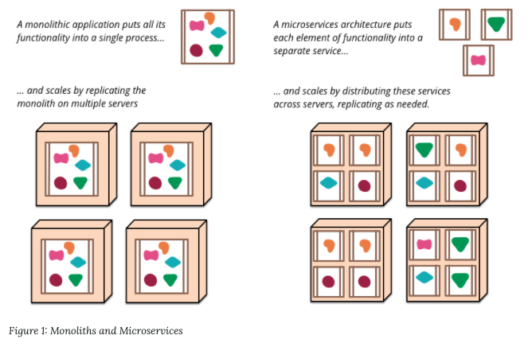
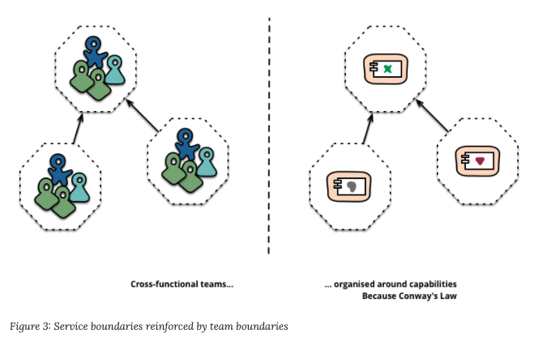

# Microservices

- 의문
- 개요
  - Microservice architectural style
  - monolithic vs microservice
- Characteristics of a Microservice Architecture
  - 1 Componentization via Services
  - 2 Organized around Business Capabilities
  - 3 Products not Projects
  - 4 Smart endpoints and dumb pipes
  - 5 Decentralized Governance
  - 6 Decentralized Data Management
  - 7 Infrastructure Automation
  - 8 Design for failure
  - 9 Evolutionary Design

## 의문

## 개요

마이크로서비스 아키텍처는 내연적 정의는 없고 외연적 정의로 정의됨

### Microservice architectural style

- 정의
  - 단일 애플리케이션을 소규모 서비스 제품군으로 개발하는 방법
    - 각각의 서비스는 자체 프로세스에서 실행되며, 경량 메커니즘(HTTP resource API등)으로 서로 통신함
- 특징
  - 각각의 서비스는 비즈니스 기능을 기반으로 구축되며, 각각 독립적으로 자동화된 배포 기계로 배포가능

### monolithic vs microservice

Monolithic app vs microservices

- monolithic
  - 개요
    - single logical executable
  - 특징
    - 리퀘스트 핸들링은 하나의 프로세스에서 진행
      - 애플리케이션은 classes, functions, namespaces 등으로 쪼개짐
      - 일부의 기능만 deploy 불가능
- microservice
  - 특징
    - 애플리케이션을 서비스의 결합으로 만듬
    - 각 서비스들은 다른 프로그래밍 언어로 작성 가능
    - 각 서비스들은 다른 팀들이 관리 가능
    - Unix 디자인 원칙에 근간

## Characteristics of a Microservice Architecture

- 1 Componentization via Services
- 2 Organized around Business Capabilities
- 3 Products not Projects
- 4 Smart endpoints and dumb pipes
- 5 Decentralized Governance
- 6 Decentralized Data Management
- 7 Infrastructure Automation
- 8 Design for failure
- 9 Evolutionary Design

### 1. Componentization via Services

- 배경
  - 컴포넌트를 plugging하는 식으로 시스템을 구성하고 싶은 욕구
    - **컴포넌트**
      - 독립적으로 대체가능하고 업그레이드 가능한 소프트웨어의 단위
  - 서비스 vs 라이브러리
    - 라이브러리
      - 프로그램에 링크되고, 메모리에서 호출되는 컴포넌트
    - 서비스
      - 프로세스 단위로 나누어지고, 서비스끼리는 웹 서비스 request나 rpc로 서로 통신함
        - 서비스는 꼭 하나의 프로세스인것은 아니고, 그 서비스에서만 사용되는 DB와 같이 묶일 수 있음(역할의 관점에서 봐야할듯)
- service as components 장점
  - **서비스 단위로 독립적으로 배포 가능**
    - 기존 monolithic방식
      - 프로그램 내부의 작은 컴포넌트라도 바뀌면 전체 app을 다시 re-deploy해야함
    - 서비스단위 컴포넌트화 방식
      - 물론 때로는 서비스 단위로 수정할때 다른 서비스와 인터페이스를 정합하는 등의 노력이 필요하나, 그것을 최소화 하는것이 옳은 방향
  - **명시적인 컴포넌트 인터페이스**
    - 프로그램 내부 컴포넌트
      - component의 encapsulation을 무너뜨려서 컴포넌트 사이의 overly-tight coupling이 발생할 수 있음
    - 서비스 컴포넌트
      - 매우 명시적이고, loosely coupled
      - remote call은 in-process call보다 비쌈
        - 따라서 **remote API들은 coarser-grained여야 함**
        - 하나의 행동을 또 쪼개지말고 그냥 덩어리채로 API를 작성해야 함

### 2. Organized around Business Capabilities

Cross functional team and architecture

- 비즈니스 기능 기반 서비스 조직 분할
  - 하나의 서비스는 해당 비즈니스 분야에 있어서 넓은 스택의 구현이 필요
    - 예시
      - UI, DB, 외부 연동
  - 하나의 팀이 cross functional

### 3. Products not Projects

- projects vs products
  - projects
    - 개요
      - 완성된 소프트웨어를 제공하고, 끝나는 경우
      - 임무가 끝나면 개발자들의 팀은 해체됨
        - 운영팀이 업무를 맡음
  - products
    - 개요
      - 한 팀이 해당 제품을 full lifetime동안 소유
        - 개발팀이 제품 배포에 모든 responsibility를 갖음
      - 개발자가 지속적으로 유저와 관계를 갖게 됨

### 4. Smart endpoints and dumb pipes

- 배경
  - 일반적인 IPC의 경우, 커뮤니케이션 매커니즘 그 자체에 엄청 공들이는 경우가 많음
  - 예시
    - ESB(Enterprise Service Bus)
      - Message routing
      - Choreography
      - Transformation
      - Applying business rules
  - microservice community
    - **smart endpoints and dumb pipes**
      - 조건
        - 서비스 끼리는 decoupled하고 잘 cohesive되어야 함
        - 서비스는 그들만의 domain logic이 있고, 클래식한 Unix에서처럼 filter의 역할을 해야함
          - 리퀘스트 받기
          - 적절하게 로직 적용하기
          - 응답 생성하기
        - 간단한 RESTish 프로토콜을 사용함
          - HTTP
          - lightweight messaging
            - dumb이므로 message bus는 정말 메시지 라우팅만 함
            - 메시지를 생성하고 소비하는 smart한 일은 service가 함

### 5. Decentralized Governance

- 개요
  - monolith에서는 하나의 기술 플랫폼에 종속된다는 문제가 생김
  - Microservices에서는 기술 플랫폼에 종속되지 않음
- 특징
  - *contract*에 관한 이야기는 잘 이해가 되지 않음
  - Amazon은 제품에 대해서 모든 권력은 하나의 팀이 가지고, 24/7 그 팀이 운영함
    - 새벽 3시에 일어나서 고치지 않으려고 열심히 만들게 됨

### 6. Decentralized Data Management

- 개요
  - **개념적인 모델의 탈중앙화**
    - 앱의 비지니스 기능에 따라서 model of world가 다 다름
      - e.g
        - 고객 영업 관점에서의 고객과 서포트 관점에서의 고객은 서로 다름
    - DDD에서는 여러개의 Bounded Context의 개념을 만들어서, 도메인을 분리하고 관계를 매핑함
      - monolith와 microservice architectures 둘다 도움이 되나, countext boundary가 나뉘어지면, 자연스럽게 서비스도 나누어질 수 있음
  - **데이터 저장소의 탈중앙화**
    - 마이크로 서비스에서는 각 서비스마다 독자의 데이터베이스를 갖음
      - 기술 자체가 다를 수 있음
    - **다양한 서비스의 update에는 분산 transaction대신, 결과적인 일관성과 compensating 연산으로 해결**
      - 성능을 위한 일부의 inconsistency는 어느정도 각오해야 함
