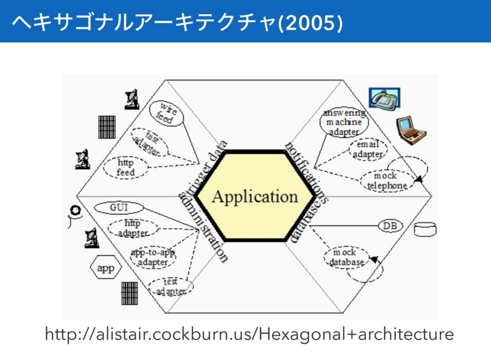
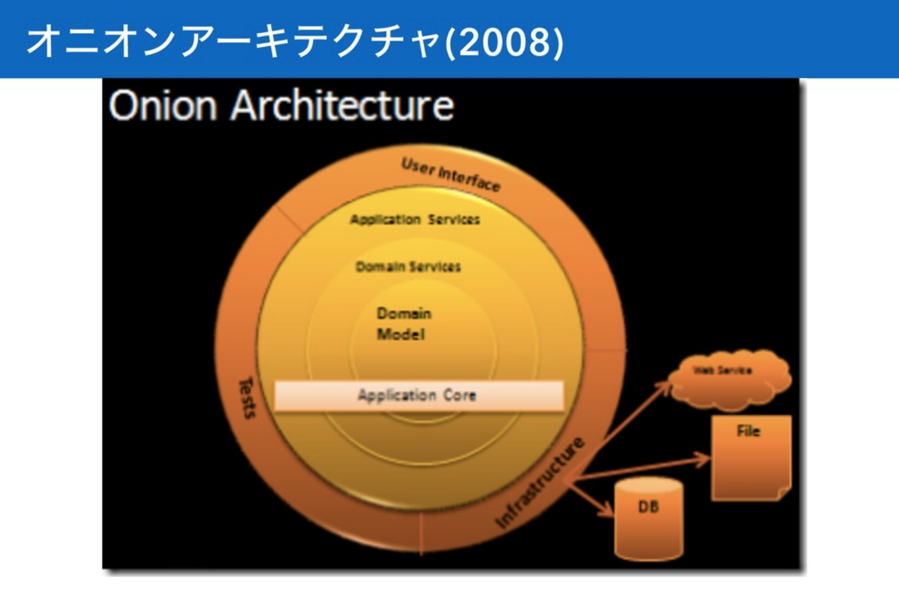
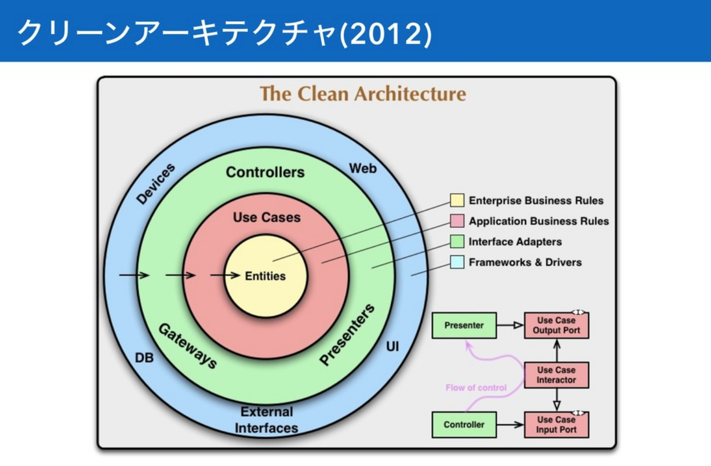

# 아키텍쳐 기본

- 참조
  - [미들웨어 실행환경의 다양화를 고려한 인프라스트럭처 아키텍처](https://speakerdeck.com/masayoshi/study-on-web-system-architecture-number-2)

## 어떠한 애플리케이션도 구현의 기본은 아키텍쳐

### 헥사고날 아키텍처

하나의 프로그램은 인터페이스와 애플리케이션과 도메인으로 나뉜다.

인터페이스는 `http`통신 부터 `cli`조작, `rpc`등 여러가지 방식이 있다.

즉, 웹 앱이라고 해서 반드시 웹으로만 통신하는 것이 아니라, 때떄로 프로그래머에게 편한 조작을 위해서 `cli`인터페이스를 만들 수 있다. 이는 어차피 도메인 로직만 차용해서 쓰면 쉽게 새로 인터페이스를 만들 수 있다.

관리자페이지는 `cli`보다 추상화된, 프로그래머가 아닌 사람들이 애플리케이션을 직접 관리하기 위해서 만들어진 페이지이다. 그러니까, 도메인 로직을 이용해서 관리를 위해서 만들어진 하나의 페이지라고 생각하면 된다. (관리자 페이지가 특별한 무엇이 아니라는 이야기)

앞으로 프로그램을 만들 때 헥사고날 아키텍쳐를 생각하면서 만들면 큰 도움이 된다고 생각한다. 애초에 UI와 도메인로직을 분리하므로써, 자연스럽게 레이어 아키텍쳐를 구성할 수 있게 될 뿐 아니라, 뷰와 도메인로직의 분리로 인해서 보다 복잡도가 낮은 프로그램을 만들 수 있기 때문이다.

단순히 UI뿐 아니라, DB와 같은 인프라 부분도 가장 바깥 레이어에서 다룸

크나큰 깨달음을 준 하테나에 감사한다.

### 어니언 아키텍처

### 클린 아키텍처

## 웹 애플리케이션의 기본

### 1. 교체 가능성

- 컴포넌트를 교체하기 쉽게 구현
  - 테스트 하기에 편함
  - 주로 DI(의존성 주입)의 방식으로 구현

### 2. 은폐성

- 내부의 로직을 몰라도, 사용할 수 있음(추상화)
