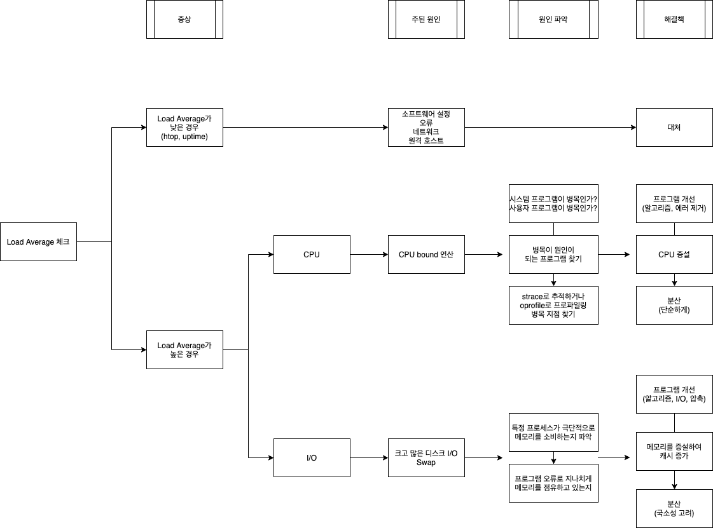
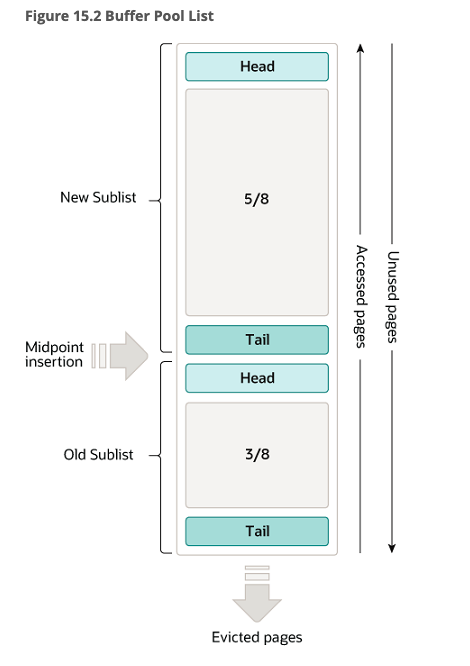

# 웹 개발자를 위한 대규모 서비스를 지탱하는 기술

- 의문
- Ch1. 대규모 서비스 웹 개발 오리엔테이션
- Ch2. 대규모 데이터 처리 입문
- Ch3. 캐시와 분산
  - OS의 캐시 구조
  - sar 명령으로 OS가 보고하는 각종 지표 참조하기
  - I/O 부하를 줄이는 방법
  - 참고) DB와 페이지 캐시
  - 국소성을 살리는 분산
- Ch4. 분산을 고려한 MySQL 운용
  - MySQL과 OS 캐시, 그리고 인덱스를 올바르게 운용하기
  - MySQL 분산(확장을 전제로 한 시스템 설계)
  - MySQL의 스케일아웃과 파티셔닝
- Ch5. 대규모 데이터 처리 실전 입문
  - 용도특화형 인덱싱
  - 이론과 실전 양쪽과의 싸움

## 의문

- OS캐시
  - *OS캐시를 활용할경우, 캐시가 더이상 disk의 최신 상황을 반영하지 못할경우, 어떻게 그것을 파악하며 캐시를 업데이트 해주는가?*
    - i-node, offset
    - 애초에 디스크에 write나 update를 하는경우에 캐시 데이터를 먼저 갱신하주는 것인가?
- Index
  - B트리, B+트리 구조 이해

## Ch1. 대규모 서비스 웹 개발 오리엔테이션

- 대규모 서비스가 고려해야할 점
  - Reliability
    - no failure, fault tolerant
      - 다중성 확보
  - Scalability(& Loadbalancing)
    - Scale up
      - 너무 비쌈
    - Scale out
      - 서버가 1대일 때에는 고려하지 않을 문제가 생김
        - 로드 밸런싱
        - 데이터 동기화
        - 네트워크 통신 latency
  - Maintainability
    - 서버 모니터링이 필요
      - 최대한 사람이 할 일을 없애기
  - 개발팀 관리
    - 개발 표준화
      - 프로그래밍 언어 통일
      - 라이브러리나 프레임워크 통일
      - 코딩 규약 표준화
      - 버전 관리 시스템 도입
    - 개발 표준화와 같은 것들이 잘 지켜지고 있는지 모니터링
- 대규모 데이터량에 대한 대처
  - 데이터의 계층
    - 하드 디스크 -> 메모리 -> 캐시 메모리 -> CPU
  - 하드 디스크는 느리다
    - 메모리나 캐시 메모리와 비교하면 10^6 ~ 10^9 배나 되는 속도차가 남
    - 디스크의 데이터를 메모리에 캐싱해둠
      - 데이터량이 많아지면, 캐시미스(데이터가 캐시에 존재하지 않는 경우)가 많아짐
  - 본질적 과제
    - 어떻게 하면 데이터를 적게 가져갈 수 있을까
    - 여러 서버로 분산시킬 수 있을까
    - 필요한 데이터를 최소한의 횟수로 읽어들일 수 있을까
- 시스템의 성장전략
  - bad
    - 너무 이른 최적화는 좋지 않다
    - 아무 생각이 없어도 안된다
      - 데이터 규모에 따른 I/O 부하 상승은 순조로운 증가가 아니다
  - good
    - 어느 정도의 수용능력 관리나, 서비스 설계시에 필요 이상으로 데이터를 증가시키지 않도록 하는 설계를 포함시키는게 좋음

## Ch2. 대규모 데이터 처리 입문

시스템이 부하가 있을 경우의 주원인 파악법및 대처법

과부하로 인한 시스템 성능의 병목: CPU or I/O

- 대규모는 어느정도인가?
  - 하테나 DB
    - entry 테이블
      - 1520만
      - 3GB
    - bookmark 테이블
      - 4500만
      - 5.5GB
    - tag 테이블
      - 5000만
      - 4.7GB
  - DB 쿼리
    - 테이블에서 인덱스를 사용하지 않은 쿼리로 검색하면, 200초가 걸림
      - `SELECT url FROM entry use index(hoge) WHERE eid = 9615899;`
- 대규모 데이터 처리의 어려운 점
  - 대규모 데이터는 어떤 점이 어려운가
    - 메모리 내에서 계산할 수 없다
      - 데이터를 디스크에 두고 검색을 해야 함
      - 디스크는 느리므로 I/O에 시간이 걸림
      - 어떻게 대처할 것인가?
- 메모리와 디스크의 속도차
  - 데이터 탐색
    - 개요
      - 디스크의 특정 원반에 있는 데이터를 찾는 것과, 메모리 내의 특정 번지에 있는데이터 찾는데에 드는 시간 차이
        - 10^5 ~ 10^6배
        - 10만 ~ 100만배
    - c.f) HDD vs SSD
      - 연속 읽기/쓰기
        - 3.5배 SSD가 빠름
      - 랜덤 읽기/쓰기
        - 10 ~ 60배 SSD가 빠름
  - 데이터 전송(버스)
    - 개요
      - 찾은 데이터를 디스크에서 메모리로 보내거나, 메모리에서 CPU로 보내는 등 컴퓨터 내부에서 전송하기 위한 속도
    - 비교
      - 메모리
        - 7.5GB/s
      - 디스크
        - 58MB/s
    - 결과
      - 100배정도 차이가 남
- 단일 호스트의 성능 끌어내기
  - 부하분산 이전에, 단일 서버 성능을 충분히 끌어내기
  - 추측하지 말라, 계측하라
    - 병목 규명작업의 기본적 흐름
      - Load Average(시스템 전체의 부하상황을 나타내는 지표) 확인
        - htop, uptime등의 명령어로 확인
        - (Load Average가 낮은데 시스템 전송량이 오르지 않을 경우)
          - 소프트웨어 설정이나 오류, 네트워크, 원격 호스트측에 원인이 있는지 확인
      - (Load Average가 높은 경우) CPU, I/O중 병목 원인 조사
        - 범인이 CPU인지 I/O인지 확인
          - sar, vmstat
        - CPU부하가 높을 경우
          - 절차
            - 사용자 프로그램의 처리가 병목인지, 시스템 프로그램이 원인인지 확인
              - top, sar
            - 프로세스의 상태나 CPU의 사용시간을 보면서 원인이 되고 있는 프로세스 찾기
              - ps
            - 프로세스를 찾은 후, 보다 상세하게 조사할 경우는 strace로 추적하거나 oprofile로 프로파일링해서 병목지점을 좁혀나감
          - 원인
            - 디스크나 메모리 용량 등 그 밖의 부분에서는 병목이 되지 않는 상태
            - 프로그램이 폭주해서 CPU에 필요이상의 부하가 걸리는 경우
        - I/O부하가 높을 경우
          - 절차
            - 특정 프로세스가 극단적으로 메모리를 소비하고 있지 않은지 파악
              - ps
            - 프로그램의 오류로 메모리를 지나치게 사용하고 있는 경우에 프로그램 개선
            - 탑재된 메모리가 부족한 경우, 증설. 증설이 힘들면 분산
          - 원인
            - 프로그램으로부터 입출력이 많아서 부하가 높음
            - 스왑이 발생해서 디스크 액세스가 발생하는 상황
          - 규명 사항
            - 메모리를 증설해서 캐시 영역을 확보함으로써 대응할 수 있는가
            - 원래 데이터량이 너무 많지 않은가
            - 애플리케이션 측의 I/O 알고리즘을 변경할 필요가 있는가
        - c.f) OS튜닝
          - 병목이 발견되면 이를 제거하는 작업
            - 원래 병목이 없었다면 거기서 더 성능향상을 꾀할 수 없음
- Scaling
  - 종류
    - scale up
      - 고가의 빠른 하드웨어를 사서 성능을 높이는 것
    - scale out
      - 저가이면서 일반적인 성능의 하드웨어를 많이 나열해서 시스템 전체 성능을 높임
  - 웹 애플리케이션과 부하의 관계
    - 프록시 <-> API 서버 <-> DB 서버
      - 프록시 <-> API 서버
        - CPU 부하
        - I/O 부하
          - 거의 없음(케이스 바이 케이스)
      - API 서버 <-> DB 서버
        - I/O 부하
          - disk
        - Master - Slave 동기화 문제
  - Scaling 대상
    - CPU
      - 비교적 간단함
        - 같은 구성의 서버를 늘리고 로드밸런서로 분산
        - 웹, API 서버, 크롤러
    - I/O
      - 비교적 어려움
        - DB
        - 대규모 데이터
- 대규모 데이터를 다루기 위한 기초 지식
  - 대규모 데이터의 특징
    - 메모리에서 처리하기 어려움
    - 디스크는 느림
  - 대규모 데이터를 다루기 위한 관점
    - 프로그램을 작성할 때
      - 어떻게 하면 메모리에서 처리를 마칠 수 있을까?
        - 디스크 I/O 최소화
        - 국소성을 활용한 분산 실현
      - 데이터량 증가에 강한 알고리즘 사용
        - e.g) 선형탐색 대신 이분탐색
      - 데이터 압축, 정보검색기술
        - 디스크 I/O 최소화
        - 메모리 캐싱이 쉬워짐
    - 프로그램 개발의 한층 아래 기초
      - OS 캐시
      - 분산을 고려한 RDBMS 운용
      - 알고리즘과 데이터 구조
  - c.f) 하테나의 API서버 대수와 DB서버의 대수
    - API서버: 10대
    - DB서버: 25대

## Ch3. 캐시와 분산

대규모 데이터를 다룰 때의 포인트

I/O 대책에 대한 기반은 OS에 있다

- 시나리오
  - OS가 캐시를 통해 대규모 데이터를 효율적으로 처리
  - OS캐시로 제대로 처리할 수 없게 되었을 때 분산에 대해 고려

### OS의 캐시 구조

- 메모리, 디스크, OS 캐시 구조
  - 디스크와 메모리 간 속도차는 10만배 ~ 100만배 이상
  - 메모리를 이용해서 디스크 액세스를 줄임
    - OS는 캐시 구조를 갖춤
- OS 캐시
  - 종류
    - 페이지 캐시
    - 버퍼 캐시
- 가상 메모리
  - 정의
    - 논리적인 선형 메모리 어드레스를 물리적인 물리 메모리 어드레스로 매핑하는 것
  - 특징
    - OS가 커널 내에서 메모리를 추상화
    - 페이지는 OS가 물리 메모리를 확보/관리하는 단위(4KB)
- Linux의 페이지(디스크) 캐시 원리
  - 과정
    - 1 프로세스가 디스크로부터 4KB 크기의 블록을 읽음
    - 2 해당 블록은 메모리상에 위치시켜야 함
      - 프로세스는 디스크에 직접 액세스 불가
    - 3 읽어낸 블록을 메모리에 씀
    - 4 OS는 그 메모리 주소를 프로세스에 논리적 주소로 알려줌
    - 5 프로세스가 해당 메모리에 액세스
    - 6 데이터 읽기가 마쳐도 메모리 블록을 해제하지 않고 남겨둠
    - 7 다른 프로세스가 같은 디스크에 접근할 때, 남겨둔 페이지 재사용
      - 페이지 캐시
  - 특징
    - 디스크의 데이터를 읽으면, 한 번은 메모리에서 데이터가 캐싱됨
      - 두번째 이후 메모리 엑세스가 빨라짐
      - *그래서 재부팅을 하지 않는게 더 빠름?*
    - 디스크 캐시는 VFS가 담당
      - VFS는 파일시스템 구현의 추상화, 페이지 캐시 부분 담당
    - 메모리가 전부 점유 되어있는 경우에는 LRU캐시 로직에 따라 가장 오래전에 읽은 메모리를 파기
    - 리눅스는 메모리가 비어있으면 전부 캐싱
      - 프로세스에서 메모리를 요청했을 때, 캐시로 인해 더 이상 메모리가 남아있지 않으면 오래된 캐시를 버리고 프로세스에 확보
      - 디스크에 데이터가 수 GB정도만 존재하면, 메모리를 8GB 정도 쌓아두면 전부 캐시에 올라감
  - 원리
    - 파일의 inode번호 + 파일의 위치 오프셋으로 캐싱
  - 활용
    - 메모리를 늘리면 페이지 캐시가 늘어나므로 I/O wait의 시간을 크게 단축할 수 있음

#### sar 명령으로 OS가 보고하는 각종 지표 참조하기

- sar(system activity report)
  - 개요
    - OS가 보고하는 각종 지표를 참조
  - 원리
    - sadc라는 백그라운드 프로그램이 커널로부터 리포트를 수집해서 저장
  - 커맨드
    - `sar 1 3`
      - 현재 데이터를 1초 간격으로 3회 봄
    - `sar -f /var/log/sa/sa04 | head`
    - `sar -u`
      - CPU 사용률 확인
      - 필드 설명
        - user
          - 사용자 모드에서 CPU가 소비된 시간의 비율
        - nice
          - nice로 스케쥴링의 우선도를 변경한 프로세스가 사용자 모드에서 CPU를 소비한 시간의 비율
        - system
          - 시스템 모드에서 CPU가 소비된 시간의 비율
        - **iowait**
          - CPU가 디스크 I/O 대기를 위해 Idle 상태로 소비한 시간의 비율
            - *그런데 CPU는 비동기적으로 디스크 I/O 처리를 하지 않는가? 왜 소비해?*
            - 여기서 말하는 iowait은 CPU의 상태가 idle인 경우에, pending I/O requests가 있는 경우에 계상되는 지표
              - 만약, pending I/O requests가 없으면, idle카운트가 올라감
        - steal
          - Xen등 OS의 가상화를 이용하고 있을 경우, 다른 가상 CPU의 계산으로 대기된 시간의 비율
        - idle
          - CPU가 디스크 I/O 대기 등으로 대기되지 않고, Idle 상태로 소비한 시간의 비율
    - `sar -q`
      - Load Average를 확인
      - 필드 설명
        - 실행큐에 쌓여 있는 프로세스의 수
        - 시스템상의 프로세스 사이즈
        - Load Average
    - `sar -r`
      - 메모리 사용 현황 확인
      - 필드 설명
        - kbmemfree
        - kbmemused
        - %memused
        - kbbuffers
        - kbcached
          - 커널 내에서 캐시용 메모리로 사용되고 있는 물리 메모리의 용량
        - kbswpfree
          - 스왑 영역의 남은 용량
        - kbswpused
          - 사용 중인 스왑의 용량
    - `sar -W`
      - 스왑 발생상황 확인
      - 필드 설명
        - pswpin/s
          - 1초 동안에 스왑인이 되고 있는 페이지 수
        - pswpout/s
          - 1초 동안에 스왑아웃이 되고 있는 페이지 수

### I/O 부하를 줄이는 방법

- 기본 자세
  - 캐시를 전제로 I/O를 줄이기 위한 대책을 세워가는 것이 유효
  - 포인트
    - 데이터 규모에 비해 물리 메모리가 크면 전부 캐싱 가능
      - 데이터 크기에 주목
    - 데이터 압축
      - 결국 캐싱
    - 경제적인 비용과 밸런스 고려
      - DB 서버의 경우 메모리를 늘리면 이득이 큼
      - API 서버의 경우 메모리를 늘리는 것이 이득이 크지 않을 수 있음
- 복수 서버로 확장시키기
  - 개요
    - 데이터를 전부 캐싱할 수 없는 규모일 경우
  - 특징
    - API 서버를 늘리는 것과 DB서버를 늘리는 것은 전혀 다른 이야기
    - CPU 부하 분산의 경우
      - API 서버를 단순히 늘린다
    - I/O 분산의 경우
      - 국소성을 고려함
      - 단순히 대수만 늘려서는 확장성을 확보할 수 없다
        - 캐시 용량이 부족해서 늘린다 해도, 캐시가 부족한 부분의 비율도 동일하게 늘려감
          - 병목
- I/O 부하 줄이기와 페이지 캐시
  - 개요
    - Linux는 가능한 한 남아있는 메모리를 페이지 캐시로 활용하려고 함
      - 디스크로 부터 데이터를 읽음
      - 그것이 페이지 캐시에 없고 메모리가 남아있음
        - 남아있지 않으면, 오래된 캐시를 버리고 새로운 캐시로 교체
      - 새로운 캐시 생성
    - c.f) 프로세스가 메모리를 필요로 할 경우에는, 페이지 캐시보다도 우선적으로 메모리 할당
    - 예시
      - DB서버가 저장 하는 데이터의 양이 20GB가 있고, 서버 메모리를 8GB에서 16GB로 증설한 경우, 효과는 어마어마함
        - 20%가 넘는 iowait이 거의 사라
  - 메모리를 증설할 수 없는 경우
    - 데이터를 분할해서 각각의 서버에 위치시키는 것을 검토
      - 데이터를 적절하게 분할하면, 서버 대수를 늘린 만큼 I/O 횟수만 줄어드는 게 아니라, 캐시에 올릴 데이터의 비율이 늘어나므로 상당한 전송량 향상을 기대할 수 있음
  - 페이지 캐시는 한번의 read에서 시작된다
    - 서버를 재부팅한 경우, 페이지 캐시가 전부 초기화 되고, 요청이 많은 DB서버를 캐시가 구축되지 않은 상태로 가동시킴
      - => 모든 DB액세스는 디스크 I/O를 발생시킴
      - => 대규모의 환경에서는 이때문에 DB가 Lock에 걸려 서비스 불능상태가 되기도 함
        - *그렇다고 Lock에 걸려서 서비스가 불능이 되기까지도 하는가?*
      - => 필요한 데이터 전체를 한 번 읽어들인 후에 프러덕션 환경으로 되돌리는 것도 필요함
        - 페이지 캐시 활용

### 참고) DB와 페이지 캐시

MySQL InnoDB buffer pool

- SQLite
  - https://www.sqlite.org/fileio.html#tocentry_132
  - 개요
    - SQLite 데이터베이스 파일의 내용물은 고정된 사이즈의 페이지의 집합으로 포맷이 되어있음
    - SQLite에 의해서 데이터베이스에 행해지는 읽기 쓰기 연산은 페이지 크기의 바이트 블록 단위로 이루어짐
    - 하나의 프로세스에서 동작하는 모든 SQLite DB 커넥션은 하나의 페이지 캐시를 공유함
      - *그런데 각 데이터베이스 커넥션마다 캐싱한다는 글도 있는데 뭐가 맞는거임?*
    - 읽기 연산
      - 페이지 캐시는 페이지 단위로 메모리에 데이터베이스 파일로부터 데이터를 캐싱함
        - 쿼리 수행전에 맞는 버전의 캐시부터 확인
    - 쓰기 연산
      - 데이터 베이스 파일을 구성하는 데이터베이스 페이지를 수정할 경우, 캐시부터 확인
      - 캐시가 있는경우, 페이지 캐시에 있는 캐시 버전을 수정함(dirty page)
      - dirty page를 VFS를 이용하여 database file로 복사
        - 페이지 캐시는 같은 페이지를 두번 업데이트 하는 경우, 데이터베이스 파일에 직접 작성하는 횟수를 줄여줌
- MySQL
  - https://dev.mysql.com/doc/refman/8.0/en/innodb-buffer-pool.html
  - Buffer pool
    - 개요
      - InnoDB가 테이블과 인덱스 데이터가 접근할 때 캐싱하는 메모리 속의 영역
      - 자주 접근하는 데이터를 메모리에서 직접 접근가능하게 해서, 성능향상
      - DB서버에서는 80%의 물리적 메모리가 buffer pool로 사용되기도 함
    - 특징
      - buffer pool은 페이지로 분리되어있고, 각 페이지는 다수의 행을 갖음
      - buffer pool은 페이지의 연결 리스트로 구현되어있음
        - LRU cache
      - DB 튜닝에 중요한 요소
      - WHERE 절이 없는 SELECT문에 대해 수행되는 테이블 스캔은 많은 데이터를 버퍼 풀로 가져옴
        - 가져온 데이터는 new sublist와 old sublist 사이에 삽입

### 국소성을 살리는 분산

본질적으로 디스크 I/O 대신 메모리 캐시를 사용하기 위함

- 국소성을 고려한 분산
  - 개요
    - 데이터로 액세스하는 경향에 대한 처리방식에 따라 특정한 방향으로 치우치는 경우
    - 본질은, disk I/O를 최대한 줄이고 데이터를 메모리에서 처리하기 위함
  - 예시
    - DB 서버 1에 A 액세스 패턴이 많고, DB 서버 2에 B액세스 패턴이 많을 경우
  - 방식
    - 1 파티셔닝
      - 테이블 단위 분할
        - 각 테이블 별 각기 다른 서버에서 관리
      - 테이블 데이터 분할
        - 특정 테이블 하나를 여러 개의 작은 테이블로 분할
        - e.g)
          - User테이블을 앞글자에 따라서 분할
    - 2 요청 패턴을 '섬'으로 분할
      - 개요
        - HTTP 요청의 User-Agent나 URL을 보고, 일반적인 사람이면 섬1, 일부 API요청이면 섬3, 봇들에 의한 접근이면 섬2와 같은 식으로 나누는 방법을 사용
          - 사람과 봇의 액세스 패턴이 다름
          - 외부 API를 제공하는 경우 액세스 패턴이 다름
- 페이지 캐시를 고려한 운용의 기본 규칙
  - 포인트
    - 1] OS 기동 직후에, 자주 사용하는 DB파일을 cat해줘서 페이지 캐시 사용
      - *실제로는 어떤 파일을 cat해주는가?*
    - 2] 성능 평가나 부하 테스트도 캐시가 최적화된 후에 실시해야 함
- 부하 분산의 기초지식
  - OS 지식
    - OS 캐시
    - 멀티스레드나 멀티프로세스
    - 가상 메모리 구조
    - 파일시스템

## Ch4. 분산을 고려한 MySQL 운용

- MySQL 스케일 아웃 전략
  - 인덱스
    - 인덱스는 제대로 걸자
  - OS page Cache
    - 데이터가 메모리에 올라가는 크기이면 메모리에 올리고
    - 올라가지 않으면 메모리 증설
    - 그래도 안되면 파티셔닝(데이터를 줄이던지, 메모리를 올리던지)
- DB 스케일아웃 전략
  - 인덱스의 중요성
  - MySQL 분산
  - 스케일아웃과 파티셔닝
- 분산을 고려한 MySQL 운용 세가지 포인트
  - OS 캐시 활용
    - 전체 데이터 크기에 주의해서 데이터량이 물리 메모리보다 가능한 적어지도록 유의
    - 메모리 부족하면 증설
  - 인덱스를 적절하게 설정하기
  - 확장을 전제로 한 설계

### MySQL과 OS 캐시, 그리고 인덱스를 올바르게 운용하기

- MySQL OS 캐시 활용
  - 개요
    - 스키마 설계 고려
      - 대량의 데이터를 저장하는 테이블은 레코드를 가능한 한 작아지도록 컴팩트하게 설계
      - e.g) 하테나 북마크에서 3억 레코드가 되는 테이블에 8바이트 칼럼 추가하면 8 x 3 = 3GB 가 추가되는 것
    - 정규화
      - 정규화 하면 쿼리가 복잡해져서 trade-off가 생기나, 테이블의 크기가 작아지는 효과가 존재
- 인덱스의 중요성
  - 인덱스
    - 개요
      - 데이터 탐색을 빠르게 하기 위한 데이터구조
      - 주로 트리를 이용
    - 성능 향상
      - 트리 구조에서의 탐색이 선형 탐색보다 빠름
      - B+ 트리로 인한 OS캐시 활용 및 디스크에서의 탐색 최적화
    - 구현
      - MySQL의 인덱스는 기본적으로 B+트리
        - 하드디스크 상에 구축하기에 알맞은 데이터 구조
        - 삽입 삭제를 반복해도 balance 유지
        - 검색을 할 때, 최대 트리 높이만큼의 횟수만 자식을 찾아가면 됨
      - c.f) 왜 이분트리가 아닌가?
        - B+트리는 각 노드를 디스크의 1블록 만큼할당(4KB)
          - 디스크의 랜덤 액세스를 최대한 줄이고 순차액세스를 하도록 함
          - OS가 캐싱도하게 함
        - 이분트리는 자식의 개수가 정해져있으므로 그렇게 하기가 힘듬
    - *c.f) B트리?*
- MySQL인덱스의 특성
  - 개요
    - 인덱스가 사용되는 것
      - WHERE, ORDER BY, GROUP BY 조건에 지정된 칼럼
    - 인덱스로서 작용하는 것
      - index, primary key, unique제약
    - 한 번의 쿼리에서 하나의 인덱스만 사용
      - 복합 인덱스를 사용해야 함
- 인덱스 작용의 확인
  - `EXPLAIN`명령
    - `explain select url from entry where eid = 9615899;`
      - table
        - entry
      - type
        - ref(인덱스 탐색), all(전탐색)
      - possible_keys
        - eid(인덱스 키), NULL
      - key
        - eid, NULL
      - key_len
        - 4(4 bytes), NULL
      - ref
        - const, NULL
      - rows
        - 1, 9620451
          - 실제 탐색한 행의 개수
      - extra
        - Using where, Using where
        - Using filesort, Using temporary(임시 테이블)와 같은 값이 나오는 경우도
          - 그다지 좋은 쿼리가 아님

### MySQL 분산(확장을 전제로 한 시스템 설계)

- MySQL의 replication 기능
  - 개요
    - master를 정하고, 마스터를 따라가는 서버 slave를 정하면, 마스터에 쓴 내용을 슬레이브가 폴링해서 동일한 내용으로 자신을 갱신
  - 활용
    - API 서버
      - 데이터 탐색 쿼리의 경우 로드밸런서를 경유해서 슬레이브로 질의
        - 로드밸런서 대신에 애플리케이션 레벨에서 분배까지 제어할 수 있음
        - MySQL proxy를 사용할 수도 있음
      - 데이터 갱신 쿼리의 경우 마스터로 직접 요청
  - 문제점
    - 마스터의 분산이 매우 어려움
      - 웹 애플리케이션에서는 90% 이상이 참조쿼리
        - 애초에 마스터가 병목이 되는 경우가 많지 않음
      - 분할 방법
        - 테이블 분할
        - NoSQL 사용
        - 애초에 쓰기 작업 횟수를 줄이는것도 중요
    - 마스터의 다중화는 어떻게 할것인가?

### MySQL의 스케일아웃과 파티셔닝

최후의 보루

- 파티셔닝(테이블 분할)
  - 개요
    - 테이블을 서로 다른 DB 서버에 두어서 분산하는 방법
      - 국소성을 활용
    - 최후의 카드
  - 특징
    - 파티셔닝을 전제로한 설계가 중요
      - JOIN 쿼리는 대상이 되는 테이블을 앞으로도 서버 분할하지 않을것이라고 보장할 수 있을 떄에만 사용 가능
        - FEDERATED TABLE을 사용하면 서로 다른 서버에서 테이블 JOIN 가능하다고 하긴 함
      - JOIN 대신 WHERE IN으로 대응하자
  - 장점
    - 부하가 내려가고 국소성이 늘어나서 캐시 효과가 높아진다
  - 단점
    - 운용이 복잡해진다
      - 용도가 다른 DB 서버가 여러개 생기므로, 어디에 어떤 DB가 있는지 파악하는게 매우 힘듬
    - 고장률이 높아진다
      - 적어도 하나의 DB 서버가 고장날 확률이 높아짐
      - 1마스터 3슬레이브 전략
        - 슬레이브가 고장나면 => 두개의 슬레이브 중 하나로 트레픽을 흡수해주고, 나머지 하나는 새로운 서버에 DB 데이터 복사해줌
        - 무정지를 위한 최소한의 서버 대수
      - 그래서 웬만하면 그냥 메모리를 늘려보는게 나을 수 있음
    - 다중화에 필요한 서버의 대수가 늘어난다
      - 4대짜리 DB서버군이 8대로 늘어나게 됨

## Ch5. 대규모 데이터 처리 실전 입문

- 굳이 대규모 데이터에 액세스하고자 하는 경우
  - 전문 검색
  - 유사문서계열 탐색
  - 데이터마이닝

### 용도특화형 인덱싱

- 인덱스 전용 서버
  - DB에서 정기적으로 cron 등으로 데이터를 추출해서 인덱스 서버로 넘김
  - 인덱스 전용 서버에 API를 이용하여 접근
- 용도 특화형 인덱싱
  - vs RDBMS
    - 범용적인 용도
  - 개요
    - 데이터를 정기적으로 뽑아냄
    - 뽀아낸 데이터에서 데이터 구조를 구축
      - 검색용 역 인덱스
      - 키워드 링크용 Trie
    - 구조화 데이터를 저장한 서버를 개발
  - 예시
    - 특정 문서가 20만 이상의 키워드 중에 무엇을 포함하는지 찾기
      - 배치 처리로 20만건의 키워드를 추출하고, 10만건이 들어간 거대한 정규포현을 만들어서 메모리에 읽은 후 매칭
      - Trie기반 정규표현을 사용해서 Common prefix search를 수행
    - 하테나 북마크의 텍스트 분류기
      - 카테고리 분류에 Complement Naive Bayes라는 알고리즘을 사용해서 분류
      - 문서에 포함된 단어의 출현 확률이 필요한데, 출현확률, 출현빈도만을 저장하는 서버를 가동
    - 전문 검색엔진
      - 검색 인덱스를 직접 만들기

### 이론과 실전 양쪽과의 싸움

- 실전
  - RDBMS에서 JOIN을 사용하지 않는 것
- 이론
  - 검색, 인덱싱
- 둘다 매우 중요함
