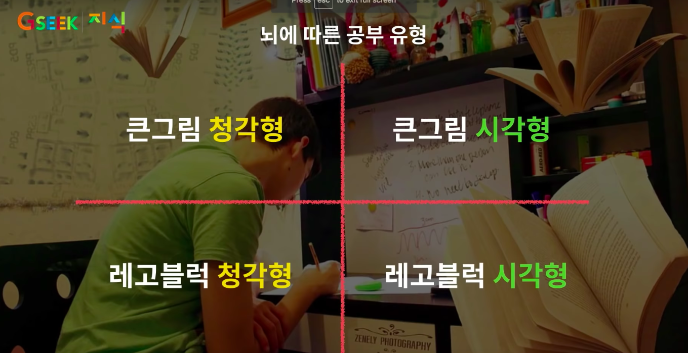

# 어떻게 공부를 할 것인가?

- 영재의 특징
- 영재들은 전두엽을 훨씬 활발하게 사용한다
- 자신만의 공부법을 찾는 것이 중요

## 나의 공부법

- 내가 좋아하는 공부
  - 공부법 자체에 매달리지 않아도 집중할 수 있음
  - pomodoro도 괜찮아 보임
- 내가 힘들어하는 공부 & 제한된 시간 안에서의 공부
  - pomodoro 공부법
    - 방식
      - 25분 집중 / 5분 휴식 -> 1 pomodoro
      - 4 pomodoro후 30분 휴식
    - 적절한 예시
      - 졸업 논문 작성
    - 도구
      - chrome확장 도구 이용

## 영재의 특징

- 공부는 누구에게 시키고, 명령을 받아서 하는 것이 아닌, 자기 자신이 하는것

### 생각하는 것이 중요하다

- 저건 왜 그런 것일까?
- 이건 왜 그런 것일까?

## 영재들은 전두엽을 훨씬 활발하게 사용한다

- 전두엽의 실행기능
  - 계획하기
  - 조직화 하기
  - 우선순위 정하기
  - 기억하기
  - 복습하기(점검하기)
    - 성공했다라는 보상감을 느낌
    - 동기부여
  - 사고의 유연성

### 다산 정약용

- 격물 치지
  - 사물을 연구한다.
  - 지식을 넓힌다.
  - 사물을 깊이 연구하면 지식은 저절로 넓혀진다.
- 메타인지 학습법
  - 생각하는 방법에 대한 생각(어떻게 생각해야 하는가?)
    - 이것을 왜 해야하는가? 이것을 어떻게 해야하는가?

> 내가 몇 년 전부터 독서에 대하여 깨달은 바가 큰데 마구잡이로 그냥 읽어내리기만 한다면 하루에 백번 천번을 읽어도 읽지 않는 것과 다를 바가 없다. 무릇 독서하는 도중에 의미를 모르는 글자를 만나면 그때마다 널리 고찰하고 세밀하게 연구하여 그 근본 뿌리를 파헤쳐 글 전체를 이해할 수 있어야 한다. 날마다 이런 식으로 책을 읽는다면 수백가지의 책을 함께 보는 것과 같다. 이렇게 읽어야 책의 의리(義理)를 훤히 꿰뚤어 알 수 있게 되는 것이니 이 점 깊이 명심해라. - 유배지에서 보낸 편지

### 칸트

- 칸트의 노트
  - 백색 간지를 사이에 넣어 제본
  - 행 사이를 넓게
  - 좌우 가장자리 비움
  - 디테일한 정리
- 노트에 자신의 생각을 잘 정리함

### 벤자민 프랭클린

- 자신의 행동을 관리하기 위한 계획
  - 시간 관리
  - 살아가면서 내가 무엇을 얻어야 할까에 대한 계획
    - 절제
  - 자기 관리
- 공부가 가장 잘 될때는, 성공(취)감을 느낄 때

> 나는 맨 처음에 '절제' 덕목을 놓아두었는데, 그 이유는 이렇다. 흥미가 줄어들 겨를이 없는 오랜 습관과 끊이지 않는 유혹의 힘을 이겨내고 24시간 동안 계속 경계 및 감시를 게을리 하지 않으려면 냉정하고 명석한 두뇌가 필요하다.
> 그리고 그것을 얻기 위해서는 절제 항목이 큰 도움이 되기 때문이다. 이 덕목이 몸에 잘 베어들어 자신의 것이 되고 나면 '침묵'을 보다 간단히 익힐 수 있으리라 생각했던 것이다. - 프랭클린의 자서전

## 자신만의 공부법을 찾는 것이 중요

**타인의 공부법은 어디까지나 참고**

### 인간의 머리 유형

- 큰 그림
  - 숲을 잘 보는 사람
  - 이해가 빠름
  - 100점을 맞추는 것이 힘듬
- 레고블럭
  - 나무를 잘 보는 사람
  - 앞에것이 안되면 뒤에것을 못나감 / 조금만 새로우면 처음보는 것으로 느낌
  - 당황하기 쉬움
- 시각형
  - 책이 눈에 보이듯 지식이 생각남
- 청각형
  - 지식을 말하고 듣고 하는 것이 더 기억에 남음
