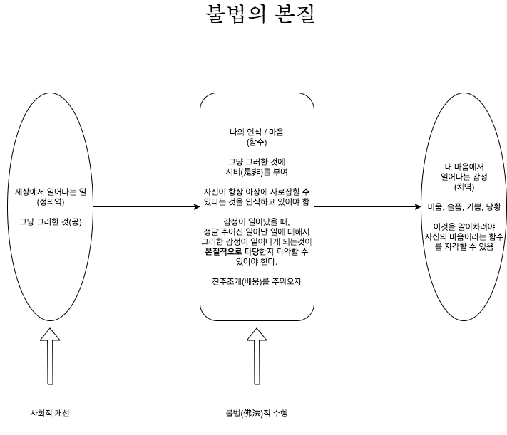

# 법륜 스님의 즉문 즉설 정리

- 취지
- 감상
- 공리
- 정리
- 촌철 살인

## 취지

법륜 스님의 즉문즉설은 스님이 직접 사람들의 고민을 들어주며 그것에 대한 스님의 말씀을 바로 전해주는 활동이다. 사람들의 고민들은 저마다 다 다르지만 어느정도 공통점을 갖는 경우도 있다. 이에 따라서 스님의 말씀도 정형화 되어있는 경우가 있다는 것을 발견했다. 이 글의 취지는 그러한 정형화된 스님의 말씀들을 알기 쉽게 정리하여, 새로운 발견을 찾기 위함이다.

## 감상

- 법륜 스님의 말씀은 누구나가 쉽게 이해할 수 있는 비유로 되어있다.
  - 그렇기 때문에 엄청난 설득력을 갖음
  - 이러한 비유는 단순한 내공에서 나오는 것이 아니라, 수 많은 즉문즉설을 경험하시면서 시너지효과를 일으킨 것
- 질문자에게 명령을 하는 것이 아니라, 질문자가 납득을 할 수 있게 조리있게 설명을 한다.
  - 설명의 방식으로 누구나가 쉽게 이해할 수 있는 비유를 사용
  - 때로는 다른 케이스와의 비교를 통해서도 설명
  - **스승은 깨달음을 주는 사람이 아니라, 꺠달음을 제자가 느낄 수 있도록 도와주는 사람**

## 공리

- 깨달음이란
  - **현실의 상황에 의거하여 일어난 자신의 마음상태가 모순적이라는 것을 파악하는 것**
    - 애초에 현실의 상황은 좋은것도 나쁜것도 아니고, 시비할 수 없음(공)
    - 그것을 모르기때문에 괴로움이 발생
    - 그런데 그것에 의하여 감정이 일어났다는 것은 그 사상으로 인한 자신의 마음의 물결이 일어났다는 것
    - **이럴때는 자신의 마음상태가 일어났다는 것을 깨닫고, 현실 상황의 본질을 추구하면 괴로워하지 않아도 되는 일이라는 것을 알게 됨**
    - 비유하자면, "자신의 마음" 이라는 함수가 정의역인 현실 상황, 치역인 자신의 마음상태를 매칭시켜준다고 일반인은 생각하지만 애초에 정의역에 대한 본질 해석이 잘못되었다는 것을 인식해야 함
    - **이를 개선하려면 치역이 항상 왜 생겨났는지를 파악할 수 있어야 하고, 그러한 치역(자신의 감정)이 일어났을때 정의역이 무엇이었으며 그것의 본질을 파악해서 잘못된 매칭이었다는것을 깨달아야 함**
    - 정의역(현실 상황)은 그저 정의역일 뿐, 그것을 치역(감정)으로 연결시키는 것은 함수(우리의 인식 / 마음)이다.
    - 물론 input을 변화시켜도 함수의 결과값은 변하나, 함수 자체의 로직이 잘못되어있으면 다른 input이 들어왔을때 에러(괴로움)를 발생시킬 가능성이 크다
- 불법의 요지
  - 누구나 어떤상황에 처해있던 행복할 권리가 있음
    - 새로운 걸 얻어서가 아니라 버려서 삶을 단순하고 가볍게 하는 것
  - 모든 괴로움은 무지로부터 일어난다
    - 그 누구도 좋은 사람, 나쁜 사람이 아니다
    - 괴로움이 발생하는 것은 무지 때문이다
  - 심리치료를 하는 것이지 / 바깥세상을 바꾸려는 것이 아님
  - **사회적으로는 전쟁을 하려 하는 사람들을 줄이는 것이 중요하나, 그것을 내가 미워하면 나에게 아무런 도움도 되지 않는다**
    - 이 미워하는 마음은 나만 괴롭게 한다
    - 이 괴로움을 어떻게 해결 할 것인가?
    - 나의 해방을 위해서는 성추행범을 용서해주되, 사회적 정의를 위해서는 성추행범을 고발해야한다
    - 어머니에게 죄송하다 라는 마음은 나만 괴롭지 어머니에게 아무런 도움이 되지 않는다
      - 이는 자기학대에 불과(의식의 낭비)
      - 대신 구체적인 행동을 하라
  - **불법의 요지는 어디까지나 나 자신의 마음을 편하게 하기 위한 요지. 그 외에 사회적인 법 / 경제 / 제도 등은 엄연히 다른 개념임을 잊지말자**
  - 내가 누구인가? 를 깨닫자
    - 지금
    - 여기
    - 왜
  - 세상에서 일어나는 모든 일은 / 그것 자체의 속성에 시비가 있는 것이 아니고 그냥 그런 것이다.
    - 그저 모든것은 내 마음이 만들어 낸 것이다.
  - 어떠한 일에 대해서 내 마음이 움직이면 그 움직이는 마음을 조용히 들여다 보자. 내가 이렇게 마음을 갖게 되는 본질은 무엇인가?
- c.f) 원시 종교의 요지
  - 눈에는 눈 이에는 이
    - 과잉 보복은 안된다
    - 상대가 눈을 뽑아가면 눈만 뽑아가고 / 이를 뽑아가도 이만 뽑아가라
    - 과잉 보복은 감정의 산물

## 정리

- 기본적으로 자기자신을 "왜"라는 질문으로 돌아보자(본질 파악)
  - 예시
    - 나는 대기업에 입사하지 못해서 슬프다
    - 왜 대기업에 입사하지 못해서 슬픈가
    - 돈을 많이 받지 못하기 때문이다
    - 왜 돈을 많이 못받는데 슬픈가
    - 돈이 없으면 행복하지 못하기 때문이다
    - 왜 돈이 없으면 행복하지 못하는가? 돈이 없어서 그런게 아니고 욕심이 있어서 그런게 아닌가?
- 취업 실패로 인한 자존감 문제
  - 작더라도 성공 사례를 만들자
  - 일단은 들어가기 쉬운 직장부터 들어가자
  - 다양한 경험을 쌓자
- 타인의 성격을 고치고 싶은 문제 / 타인과의 트러블
  - 타인이 그런 것은 당연한 것
  - 타인의 성격을 고치려고 하지 말라(애초에 성격이라는 것이 고치기 힘드니까 성격)
  - 당연한 것을 가지고 고민하지 말라
  - **타인에게 조언을 할 지언정, 강요는 하지 말라**
- 마음을 유여하게 갖을 수 있는 방법 / 돈 버는 방법 / ~ 하는 방법
  - 도꺠비 방망이는 존재하지 않는다
  - **물건이 뜨거우면 놓으면 되는데 사람들은 놓지 않으면서 뜨겁지 않는 방법을 찾는다**
- 세상의 모든것은 상대적인 것이며 절대적인 개념은 존재하지 않는다
  - 내가 절대적으로 잘나거나 못난 사람이 아니다.
  - 비교를 하면 상대적으로 잘나거나 못난 사람이 되는 것이다.
- 울컥하는 마음이 강해서 신경질적인 성격을 갖고 있는 문제
  - 화 나는 순간, 화 나는 마음을 알아차리자
  - 화를 낸 후에는 자신이 화를 냈다는 것을 알아채고, 참회기도를 하자
  - 화 뿐만 아니라, 슬픈 감정, 기쁜 감정이 있어도 그것을 알아 채고, "아 내가 지금 슬프구나" 하는 인식을 갖게 되면 마음이 진정된다. 내 자신의 감정을 인정하자.
- 부정적인 생각을 갖고 있는 타인에게 물들지 않기 위한 방법
  - 자기자신을 과대평가하지 말라
  - 불가에서 사람들이 출가하는 이유는 속세에 물들어버리기 때문이다
  - 그것에서 한 단계 나아가면 속세에서도 물들지 않고
  - 또 한 단계 나아가면 속세를 교화하는 사람이 된다
  - 부처가 되는 법
    - **상대가 성낼 때 한 번 웃을줄 알아야 한다**
    - 타인이 웃는 것을 트집잡으면 화제를 돌리자
- 직장내 갑질 / 타인의 악담 문제
  - 비유
    - 어떤 사람이 나에게 선물을 준다고 해서 내가 받았다
    - 받아서 열어보니, 그 속에는 온갖 쓰레기만 가득했다
    - **그렇다면 그것을 버리는 것이 현명한가? 갖고 있는 것이 현명한가?**
  - 현실
    - 마찬가지로, 타인이 나에게 대놓고 악담 / 나쁜행동을 했다면
    - 그 것을 마음에 품고 트라우마로 갖고 그것의 뚜껑을 열어서 상처를 계속 받는게 현명한가
    - 아니면 그것을 버리는 것이 현명한가?
  - 하지만 뚜껑 내부가 정말 선물인지 쓰레기인지 확실히 아는 것도 중요하다고 생각함
- 기독교 신자로서 지나치게 타 종교를 배척하는 느낌이 드는데 어떻게 하는게 좋은가?
  - 그리스도가 한 말 중에 가장 중요한 말
    - 주여 저들을 용서해주십시오
    - **저들은 자기가 잘못된 행동을 하고 있는 것을 모릅니다**
  - 자신을 죽게 한 사람들 조차도 용서하는 마음
    - **십자가 정신**
    - 이해 받으려 하지 말고 이해하려 하라
    - 받으려 하지 말고 주려고 하라
    - 싫어하려 하지 말고 사랑 하라
  - 이러한 사랑의 신념을 갖고 있는 그리스도가 타인이 다른 종교를 갖고 있다고해서 배척하려 할까?
  - 부처의 가르침도 비슷한게, 모든 번뇌는 무지에서 비롯된 것이라고 한다.
    - 누구나 깨달으면 부처가 될 수 있고, 고통 없는 삶을 살 수 있다.
- 욕심이란
  - ~ 을 하고 싶다 자체는 욕심이 아니다.
  - 어떠한 모순된 두가지를 하고싶으면 그것은 욕심이다.
    - 돈은 벌고 싶고, 매일마다 놀고 싶고
  - 욕심을 떨쳐내기 위해서는 선택을 해야하고 그것에 따른 과보를 받아야 한다.
    - 돈을 빌리고 값지 않으려고 하면 안된다.
- 마음과 생각의 차이
  - 생각
    - ~ 해야하는데 라고 생각하는 것
    - 의식적
  - 마음
    - ~ 하고 싶다 하는 것
    - 좋음 / 싫음
    - 신념과 관계가 깊음
    - 무의식적
  - 아침에 일어나야 하는데 일어나기 싫어서 사람들은 일어나지 못한다.
  - 아침에 일어나기만 하면 1000만원을 준다고 하면 누구나 일어난다.
    - 이는 마음의 문제
- 현재 민원 처리 담당을 하고 있는데, 행패를 부리는 사람이 와서 마음을 힘들게 하는 문제
  - 이러한 사람들 덕분에 나의 직업이 존재한다.
    - 민원이란 원래 그러한 일이다.
  - 5%의 법칙
    - 어딜가나 이상한 사람들은 반드시 존재한다.
    - 그것을 사회적으로 줄이는 것은 가능하나 없애는 것은 불가능하다.
    - 그러므로 그러한 사람들이 찾아오는 것은 어찌보면 당연한 자연의 이치라고 할 수 있다.
  - 행패를 부리는 사람은 기분나쁜 마음으로 경찰서까지 갔다가 다시와야하고 또, 돌을 찾아서 집어서 와야할 정도로 에너지를 많이 소비
    - 반대로 민원을 받는 사람은 그냥앉아있다가 행패를 부리는 사람이 오면 경찰에 신고하면 된다.
    - 사실은 내가 더 편한 입장에 있다.

## 촌철살인

- 인생을 내가 사는 것이 아니라 세상에 의해 살아지고 있기 때문에 인생이 꿈처럼 허망하고 뒤죽박죽인 것입니다.
- "야, 이놈아! 어디서 와서 어디로 가는지도 모르는 놈이 바쁘긴 왜 바빠?"
- 안으로 보지 않고 밖으로만 보니 눈에 보이는 것이 없는 것입니다.
- **자기 마음을 봐야 합니다. 진리는 밖이 아니라, 자신의 마음 속에 있습니다.**
- 마치 바다에 파도가 일듯 경계에 부딪힐 때마다 늘 갖가지 느낌과 생각이 일어남을 그때그때 알아차려야 합니다. 그래야 그 파도에 휩쓸리지 않을 수 있습니다.
- 이 세상에 일어난 모든 일은 단지 하나의 사건입니다. 일어난 일이 애초부터 재앙이나 복으로 일어나는 것이 아닙니다. 그것을 재앙으로 만드느냐 복으로 만드느냐는 자신에게 달렸습니다.
- 우리는 이렇게 스스로 모순인 경우가 매우 많지만 그런 모순을 자신은 모릅니다. 이 모르는 것이 바로 무지입니다.
  - 화를 내면서 '어, 내가 지금 화내고 있구나.' 하고 알아차리는 사람은 화를 내고는 있지만 거기서 벗어날 가능성이 있습니다. 그러나 "내가 언제 화를 냈다고 그래?" 이렇게 자기가 화를 내면서도 화 내고 있는 줄 모르는 사람은 벗어날 길이 없습니다.
  - 우리는 자기가 어리석은 줄을 모릅니다. 고치는 것은 둘째 치고, 아예 모르는 줄도 몰라요. 잘못했으면서도 잘못한 줄을 모르고, 틀렸으면서도 틀린 줄을 모릅니다. 그래서 자기 생각에는 아무 문제가 없는데 이상하게 괴롭고 슬퍼요. 마음에 근심과 걱정, 초조와 불안, 미움과 원망이 떠나질 않습니다.
  - 자기에 대해 아는 것이 그만큼 중요합니다. 일단 자기 상태를 있는 그대로 아는 것이 중요해요.
- 불교에서는 이 세상을 누가 창조했다고 합니까?
  - **이는 세상은 누군가가 창조했다고 하는 잘못된 전제에서 비롯**
  - 이처럼 우리 자신이 이렇게 잘못된 전제 위에서 출발하는 경우가 많다는 사실을 돌아봐야 합니다.
    - 남편이 술을 마셔서 못 살겠다고 하소연하는 부인의 생각에는 술을 마시면 안 된다는 전제가 깔려 있습니다. 그 전제 위에서 남편을 고치려 듭니다. 그런데 남편은 술을 마시면 안 된다는 전제를 받아들이지 않고 있습니다. 그러니 그런 전제 위에서는 3년이든 30년이든 아무리 기도를 해도 소원이 이루어지지 않습니다. 그런데 그 전제를 무너뜨려버리면 문제의 본질을 보게 됩니다.
    - "부처님, 우리 남편 술 많이 드시게 해주세요."
    - 이렇게 잘못된 전제 위에 서서 계속 헤매기 때문에 아무리 노력해도 인생 문제가 해결되지 않습니다. 이 고정된 사고방식, 생각하는 관점을 바꾸어서 돌아봐야 합니다.
- 산의 동쪽에 사는 사람들과 산의 서쪽에 사는 사람들과 자신의 마을에서 벗어난 사람
- 자기 생각속에 갖혀 사는 현대인, 군중 속의 고독
- 진짜 아닐 때 '예' 하는 마음
- 내가 아상에 사로잡히는 존재임을 인정하고 항상 자신을 점검해야 합니다.
  - 아상은 자기에게 사로잡히는 겁니다.
  - "지금 내가 일으키는 생각은 대부분 나의 주관적 생각이다. 그러니 적어도 고집은 하지 말아야 한다."
  - 내가 언제나 아상에 사로잡히는 존재임을 인정하고 항상 자신을 점검해야 합니다.
    - 프로그래밍에서도 언제나 소프트웨어가 복잡해질 것을 인정하고 항상 아키텍처를 점검해야 한다.
  - 관음의 진신을 친견한다는 것은 어떤 누구를 보는 것이 아니라 이런 과정을 통해서 자기의 모순을 자각하는 것이다.
- "무" 라고 하는 것의 의미를 탐구해야 해요.
  - 없다의 본질이 무엇인가?
  - 끝없는 본질 탐구
- 참선을 하는데에 중요한 세가지
  - 대신심
    - 부처님의 말씀, 스승의 말씀에 대한 깊은 믿음
  - 대의심
    - 큰 의문
  - 대분심
    - 이를 몰랐음을 분하게 여기고 알려고 하는 강력한 의지
- '나' 라고 하는 이것이 도대체 무엇인지 진지하게 탐구해야 합니다.
  - "네가 누구냐?" / "법륜입니다."
  - "법륜이 너냐, 네 이름이냐?" / "제 이름입니다."
  - "누가 네 이름 물었느냐? 네가 누구냐?" / "저요? 스님입니다."
  - "스님이면 다 너냐?" / "아닙니다."
  - "그러면 너는 누구냐?" / "?"
  - 이 세번만에 내가 알던 모든 것들이 딱 끝나버려요.
  - 이런 수준에서는 제아무리 똑똑한 척 잘난 척 위세 부려도 당장 직장 하나만 날아가면 정신 나간 허깨비 꼴이 되어 방황합니다.
  - 왜 이럴까요? 세 번 질문을 못 넘기기 때문에 그렇습니다. '나' 아닌 것으로 '나'를 삼고 제 것 아닌 것을 가지고 제 것인 양 으스대다가 그것이 사라져버리니까 당황해서 멍해지는 것이지요. 가짜이고 허상인 게 들통나버린 게지요. 그래서 '나' 의 본질을 진지하게 탐구해봐야 합니다.
  - 이 질문이 청천벽력같이 들려야 합니다.
  - 오늘부터 연구를 해 보세요. 상대방을 잘 알아봐요. '아, 사람의 마음이라는 게 이러하고 이런 식으로 움직이는구나.'
  - 앞서 말한 '무' 라는 것은 있다, 없다의 '없다' 가 아닙니다. 있는 것과 없는 것 중 선택하는 양자택일의 세계, 실제의 세계입니다. 이를 진여실상, 제법실상 이라고 합니다. 그걸 자기가 직접 보고 경험해 봐야 합니다.
- 저 너머
  - 이것은 누구의 것입니까?
    - 네 거, 내 거
    - 아, 그렇구나 하는 깨달음
- 좀 더 진지하게 공부해야 합니다. 지금 우리의 삶이 그대로 화두입니다. 언제나 삶에서 부딪히는 일을 자세히 살펴야 해요. 타성적으로 보지 말고 새로이 돌아봐야 합니다. 그렇게 해야 무슨 일이 일어나도 흔들리지 않는 삶을 살아갈 수 있어요.
  - **명백히 옳고 그르다고 생각했던 문제도 깊이 탐구해 보면 그렇지 않은 경우가 많습니다.**
- 깨달음이라는 것은 멀리 있는 것이 아닙니다.
  - 마음이 일어나는 곳마다 거기에 있어요.
- 원효대사는 '나' 와 '너' 를 함께 봄으로 해서 사물의 실제 모습인 진리, 실상에 눈을 떴어요. 옳니 그르니 이기니 지니 하는 것이 모두 한여름 밤의 꿈일 뿐이었어요. 세속이라는 것이, 세상의 부귀영화라는 것이 마치 한여름 밤의 꿈과 같은 줄 스스로 깨쳤던 것입니다.
  - 해골물 이야기. 바가지가 다른 바가지인가? 아니다, 같은 바가지다. 물이 다른 물인가? 아니다 같은 물이다. 같은 물, 같은 바가지인데 어찌하여 어제는 그렇게 달콤하고 오늘은 이렇게 구역질이 나오는가? 달콤한 것은 물이 깨끗하다 생각했기 때문이고 구역질을 하는 것은 물이 더럽다고 생각했기 때문에 그렇다. 그런데 같은 물이고 같은 바가지이다. 그러니 더럽고 깨끗함은 모두 마음에서 일어나는 것이구나. 더럽고 깨끗함이 바가지에 있는 것이 아니고 물에 있는 것도 아니고 모두 다 내 마음에 있구나.
  - 색즉시공 공즉시색
    - 제법이 다 공한 도리를 이름
    - 일체가 다 마음 가운데에 있는데 그 마음이라는 것이 사실은 실체가 없다
- 대승불교는 중생구제사상에 대한 것입니다. 또 더럽고 깨끗함이 둘이 아니라는 불이사상, 곧 공사상이 핵심이에요. 그런데 원효는, 이곳은 천민동네다, 주막이다, 부정한 곳이다, 내가 가면 안 되는 곳이다 하면서 아직도 세속적으로 분별하고 있었습니다.
  - 아직도 상에 사로잡혀 있었던 것입니다.
  - '어 내가 여기 오면 안 되는데' 하고 시비하는 마음을 일으키는 그것이 바로 중생이라는 뜻이었어요.
  - 원효는 이제야말로 완전히 자유로워졌습니다. 천민들이 사는 소와 부곡으로 거침없이 갈 수가 있었어요.
  - 그들을 구제하러 간 것이 아니에요.
  - **중생이라는 것은 본래 없습니다. 시비심을 일으키는 내 마음이 중생심이고 중생심을 일으키는 그 순간 내가 바로 중생이지요.**
  - **그들은 중생이 아니고 본래 부처입니다. 그러므로 그들을 구제하러 가는 것이 아니라 부처님께 배우러 가는 거예요.**
  - 그래서 그는 겸손한 마음으로 배우기 위해 그곳으로 갔습니다.
  - 그들과 친구가 되고 그들과 더불어 노닐고 그들한테서 배우려고요.
  - 그런데 또 다른 문제가 생겼어요. 천민들이 "아, 위대한 원효대사가 우리 동네에 오셨다." 하고 원효를 떠받들어 버렸습니다.
  - 내가 그전에 그들을 더럽다고 외면했을 때도 친구가 될 수 없었지만 반대로 그들이 나를 성인으로 떠받들어도 친구가 될 수 없습니다. 전에는 내가 문제였는데 이번에는 그들이 문제인가요?
  - 유명한 원효가 문제이니 그 유명한 원효를 버려야 했습니다. 그래서 공개적으로 요석공주와 스캔들을 일으켜 버렸습니다.
- 마음이 일어나는 순간, 깨달음은 찾아온다.
  - 사법계
    - 바다에 배를 타고 놀러나갔다가 풍랑을 만나 배가 뒤집혀 물에 빠져서 살려달라고 아우성치는 사람들
  - 이법계
    - 배 타고 바다에 나가면 풍랑에 휩쓸릴 테니까 큰 방파제를 딱 쌓아놓고 그 안의 호수에서만 배를 타고 노니는 것
  - 이사무애법계
    - 아주 큰 배를 만들어서 바람이 불든 파도가 치든 상관없이 넓은 바다를 배 타고 다니는 사람
  - 사사무애법계
    - 물에 빠진 김에 진주조개를 주워옵니다. 물에 빠지면 안 된다는 경계도 없습니다. 큰 배든 작은 배든 되는 대로 타고 놀다가 혹여 물에 빠지게 되면 진주조개를 캐옵니다. 물에 빠진 것도 아닙니다.
  - 이렇게 우리가 늘 보고 듣고 부딪히고 시비를 일으키는 삶 가운데에 도가 있습니다. **시비하는 마음을 낼 때 자기가 그 마음을 내는 줄 알아야 하는데 우리는 그것을 모릅니다.**
    - 그것이 원효대사의 해골물 입니다.
    - 밖을 보지 말고 안을 봐야 합니다.
- 탑 앞의 소나무가 되어라
  - 지금
  - 여기
  - 왜
- "여보게! 어떤 한 사람이 논두렁 밑에 앉아서 그 마음을 청정히 하면 그 사람이 바로 중일세. 그 곳이 절이야. 그게 바로 불교라네."
- **깨어있으려면 스스로에게 '내가 지금 여기에서 무엇을 하기 위해 있는가?' 를 늘 물어보고 자기가 그 목적에 맞게 제대로 하고 있는지 살펴야 합니다. 그것이 지금 깨어있는 것입니다.**
- **지금, 여기 왜, 이 세가지에 늘 깨어있으면 삶에 후회라는 건 있을 수가 없습니다. 깨어있지 못하기 때문에 지나고 보면 후회할 일이 생깁니다.**
- **공부라는 것은 어디서든지 배울 것이 있습니다. 길 가다가 넘어져도 배울 것이 있고, 시비가 붙어 싸우는 가운데에도 배울 것이 있고, 실수한 가운데에도 배울 것이 있고, 실패한 가운데에도 배울 것이 있습니다. 물에 빠지면 빠진 김에 진주조개를 주워오는 지혜가 필요합니다.**
- 내가 보기에는 틀린 일, 얼토당토않은 일도 그 사람의 입장에서는 잘한다고 하는 거예요. 인생 문제를 해결하려면 이런 현실을 인정해야 합니다.
  - 이렇다 보니 사람들은 모두 나름대로 억울한 마음을 갖게 됩니다.
  - 자기 딴에는 다 잘한다고 했는데 왜 자기더러 잘못했다고 하느냐고 억울해하고 분해하고 피해의식을 갖습니다.
  - 이를 불교 용어로 업 이라고 합니다. 습관 또는 무의식이지요.
  - 그 순간순간은 자기 나름대로 잘한다고 해서 여기 까지 온 거예요.
  - 그래서 다른 누가 만든 게 아니라 자기가 자기를 만든다고 말하는 것입니다. 거짓말할 때 거짓말하고 싶어서 거짓말하진 않습니다. 그 순간은 거짓말하는 게 낫겠다고 생각하기 때문이에요.
  - 그럼에도 우리는 결과가 이렇게 된 것을 남의 탓으로 돌립니다.
    - 남편을 잘못 만나서
    - 아내를 잘못 만나서
    - 부모를 잘못 만나서
    - 자식을 잘못 낳아서
    - 사장을 잘못 만나서
    - 그렇다며 남을 원망하고 고치려 듭니다.
    - 그래도 문제가 해결되지 않으면 자기보다 영향력이 크다고 생각되는 부처님, 하느님, 산신님, 용왕님을 찾아가 어떻게 좀 해결해 달라고 매달립니다.
    - 그래도 안되면 결국 운명론에 빠지게 됩니다.
  - 그러나 하나하나 따지고 분석하며 살펴보면 결국은 이 모든 것이 다 자기 내면으로부터 일어남을 알 수 있습니다.
  - **똑같은 비가 와도 밭에다 어떤 씨앗을 심었느냐에 따라서 어디에는 호박 싹이 트고 어디에는 참외 싹이 트고 어디에는 참깨 싹이 틉니다.**
- 일어나는 모든 일은 좋은 일도 아니고 나쁜 일도 아닙니다.
  - 넘어진 것은 나쁜 일이라 하지만
  - 넘어졌을 때 돈을 주웠다면 잘 넘어진게 됩니다.
  - 그것은 하나의 일일 뿐이에요.
  - 그것을 어떻게 자기의 삶에 유용하도록 만들어내느냐는
  - 오직 본인의 마음에 달렸습니다.
- 이렇게 체험으로 깨달은 것은 책을 보거나 이야기를 들어서 아는 것과는 완전히 다른 차원입니다.
- 이 세상에 피해자만 있고 가해자는 없어요.
- '내가 옳다', '네가 옳다' 이렇게 시비하는 것이 색입니다. 하지만 이쪽저쪽 이야기를 다 들어보면 그냥 두 사람의 생각이 다른 것이지 누가 옳고 누가 그르다고 할 수 있는 것이 없습니다. 이것이 바로 공이에요.
  - **공이지만 이쪽으로 가면 이쪽말이 맞고 저쪽으로 가면 저쪽말이 맞아서 색즉시공 입니다**
  - 이는 모두 마음에 따라 일어난다는 것입니다. 이것이 곧 **일체유심조** 입니다.
  - 제법실상
    - 모든 존재의 있는 그대로
    - 사실대로
  - 하지만 우리는 세상을 거꾸로 보고 있습니다. 이것을 전도몽상이라고 합니다.
  - '저 나쁜 인간', '저 죽일 놈', '저 원수' 라고 하지만 사실은 이 모두가 내가 스스로 지어낸 상이고 우리가 그 상에 사로잡혀 집착하고 있을 뿐입니다.
  - 고문을 받은 일은 좋은일도 아니고 나쁜 일도 아닙니다.
  - 그것을 통해서 교훈을 얻으면 나에게 좋은 일이 되고, 원한에 사무처 괴로워한다면 인생의 큰 불행이 되지요
  - 인생을 살면서 일어나는 어떤 일도 좋은 일도 없고 나쁜 일도 없습니다. 좋은 일이라고 했던 게 내일 가면 나쁜 일이 될 수도 있고, 나쁜 일이라 했던 게 내일 가면 좋은 일이 될 떄도 있습니다.
- 자기 뜻과 맞지 않는다고 남을 미워하는 것은 잘못되었다는 말입니다. 그러니 우리가 사람을 만나 함께할 때는 우선 그 사람을 있는 그대로 인정해야 합니다.
  - 모든 것을 자기 마음대로 하고 싶으면 혼자 사는 게 낫습니다.
- 많은 사람들이 세상이 복잡하다고 말합니다. 그런데 세상이라는 것은 복잡하고 말고 할 것 없이 그냥 그런 거예요.
  - 날씨도 그렇습니다. 오직 사람만이 덥고 춥다고 변덕을 부릴 뿐 지금처럼 늘 그랬습니다.
  - 인간은 맑지 않은 것을 시비하고, 비 오는 것을 시비합니다.
  - 자기 관념의 틀로 이해가 될 때에는 세상이 한눈에 들어오는 것 같다가도 자기 관념의 틀에 세상이 맞지 않으면 당장 세상이 복잡하고 혼란스럽다고 한탄합니다.
  - 자기가 세상을 잘못 보고 있다는 생각은 하지 않아요.
  - 사람에다 옷을 맞춰야 하는데 옷에다 사람을 맞추는 것과 같습니다.
  - 세상은 그냥 그런 것입니다.
  - **누가 날 이렇게 괴롭힐까요? 내가 나를 괴롭히는 것입니다**
  - 스스로를 아끼고 사랑해야 합니다
    - 이는 남에게서 사랑을 받는 출발점
    - **내가 누구인가?**
  - **약은 아픈 사람이 먹을 때 약이지 아프지 않은 사람이 먹으면 독이 됩니다.**
  - 우리는 항상 불평불만이 많습니다. 세상이 온통 뒤죽박죽인 것만 같습니다.
    - 그런데 이렇게 불평불만 거리가 많은 것이 이번만, 아니면 올해만 그런 것일까요? 세상은 작년에도 그랬고 재작년에도 그랬습니다. 내년 내후년도 그럴 것입니다.
    - 이것만 해결이 되면 제 소원이 없겠다 이렇게 말하지만 결코 그렇지 않습니다.
    - 이렇게 인생을 살면 살수록 바빠지고 살면 살수록 복잡해집니다. 자유로워지기는커녕 걸리는 것이 점점 더 많아져요.
  - 세상의 이치를 깨우쳐, 일이 없어서 한가한 게 아니라 일이 많은 가운데 한가하고, 인연을 다 끊어버려서 자유로워지는 것이 아니라 온갖 인연이 있는 가운데 자유로워야 합니다.
    - 연꽃이 진흘강 속에서 피지만 진흙에 물들지 않듯이 우리도 온갖 혼잡함 가운데서 자유로워야 합니다(사사무애법계)
    - 연잎이 진흙에 물들지 않는 것은 연잎이 스스로 매끄럽기 때문이지요. 내가 걸림이 없다면 이런 혼탁한 세상에서도 나는 걸릴 게 없습니다. 그래서 꾸준히 정진해야 하는 것입니다
  - **따로 수행도량이 있는 것이 아닙니다. 내 삶터가 그대로 수행도량이고 나에게 순간순간 일어나는 이 모든 시비분별심이 수행과제입니다.**
  - **내일 무슨 일이 일어날지 모르는 이 인생사에서 무슨 일이 일어나도 아무 문제가 없는 삶을 살아가는 것을 해탈, 열반이라고 합니다. 비가 오면 비가 오는 대로 좋고 맑으면 맑은 대로 좋고 추우면 추운 대로 좋고 또 더우면 더운 대로 좋아요. 그렇게 자유롭고 행복한 삶을 살아가시길 바랍니다.**

## 의문

마음 공부를 하며 법륜 스님을 직접 뵌다면 물어보고 싶은 의문들을 모아두었다.

- 관념적인 것을 벗어던지라고 스님은 말씀하시는데, 관념적 이라는 것은 무엇을 뜻하는 것입니까?
- 우리나라에게 있어서 "독도"라는 것은 영토에 포함이 되는 것인데 어찌 이것을 "독도"도 아니고 "다케시마" 도 아니라고 할 수 있습니까? 둘다 아니라면 영토적 개념에서는 어떻게 생각해야 합니까? 어디에인가는 포함이 되어야 하지 않겠습니까? 이것이 현실 아닙니까? 아상에서 벗어나야하지만 타인에게 아상에서 벗어나야한다고 주장하는 거 자체가 아상이 아닙니까?
  - 독도의 개념은 사회적인 관점이고, 상대방이 독도를 다케시마로 부르는 것을 미워하는 것은 우리의 마음의 문제. 후자는 불교의 교리로 마음의 해결이 가능하나 전자는 사회적으로 해결해야 한다.
