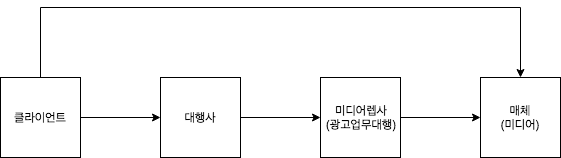

# 디지털 마케팅

- 영재님에게 들은 자료 정리

## 디지털 마케팅 생태계

- 클라이언트
  - 광고를 의뢰하는 의뢰주
  - 비용절감과 내부 자원을 활용해서, 대행사를 거치지 않고 직접 매체사와 계약을 진행하고 광고도 직접 만드는 경우가 있음
  - 다양한 광고 대행사로부터 경매방식으로 광고안을 모집받음
- 광고 대행사(Agency)
  - 종합 광고 대행사
    - 광고주의 위탁에 의한 시장조사, 광고기획 수립, 매체의 선택, 광고물 제작, 매체와의 광고계약 등을 대신해줌(커버하는 범위가 넓음)
    - 예시
      - 제일기획
      - 이노션 월드와이드
      - HS Ad
      - 대홍 기획등
  - 독립 광고 대행사(특수대행사)
    - 광고의 여러 작업 가운데 특정 서비스만을 전문적으로 제공
    - 광고 관련 프리랜서들이 모여 있는, 광고 제작 에이전시가 여기에 속함
    - 소규모의 회사가 대부분
- 미디어 렙사
  - media representative
  - 어떤 메체에 광고를 줄것인가? 광고대행사에게 매체제안, 운영
  - 각 매체별로 서로 다른 기준(e.g 사진의 해상도가 서로다른 문제, 동영상의 해상도 문제 등)들을 종합해서 쉽게 처리할 수 있도록 도와줌
    - 광고주와의 관계에서 을
    - 미디어회사와의 관계에서도 을
- 매체사(미디어)
  - 예시
    - 페이스북
    - 네이버
    - 구글
    - 유튜브

## 마케팅 팀

- 큰 기업의 경우
  - 마케터
  - 데이터 분석가
  - 개발자
- 작은 기업의 경우
  - 일당백
