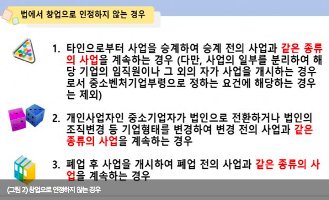
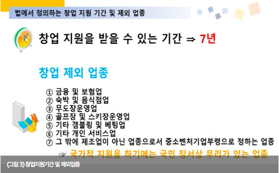

# 비즈니스와 법률

- [법을 알면 창업이 쉬워진다](http://www.zdnet.co.kr/column/column_view.asp?artice_id=20180523135024)

## 창업 지원법(한국)

- 국가에서 창업을 지원하는 것은 **법제화 되어있음**
- 법 적용은 우선순위가 있음(하위법은 상위법의 내용을 벗어나지 않은 한도내에서 유효)
  - 헌법
  - 법
  - 시행령(대통령령)
  - 시행규칙(부령)
  - 조례
  - 규칙
  - 고시(공시, 공고와 동급 부류)
  - 예규(관례)
  - 민속습관

### 중소기업창업 지원법

중소기업의 설립을 촉진하고 성장 기반을 조성하여 중소기업의 건전한 발전을 통한 건실한 산업 구조의 구축에 기여함

### 중소기업창업 지원법 시행령

중소기업 창업 지원법에서 위임된 사항과 그 시행에 필요한 사항을 규정

### 중소기업창업 지원법 시행 규칙

중고시업 창업 지원법 및 같은 법 시행령에서 위임된 사항과 그 시행에 필요한 사항을 규정함

## 창업의 정의

- 국가가 창업을 정책적으로 지원하기 위해서 창업의 범위를 소극적이고 좁게 정의
- **같은 종류의 사업 범위는 인정하지 않음**
  - 기존 업종에 다른 업종을 추가해서 사업을 하는 경우에는 추가된 업종의 매출액이 총 매출액의 절반 미만이면 같은 종류의 사업으로 간주
- 창업 기간
  - 사업 개시일(사업자등록증 발부일)로부터 7년
