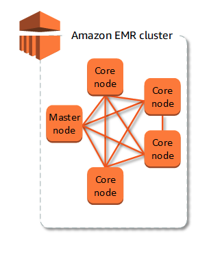

# Amazon EMR

- 의문
- 개요
  - EMR
  - 구조

## 의문

## 개요

- Tada에서는 데이터 파이프라인으로 사용
  - EMR에서 실서버 DB에 있는 데이터(아마도 레플리카?)를 Spark SQL을 사용하여 S3로 옮기고, S3에 있는 parquet파일을 GCS로 옮기고, 그것을 Bigquery로 넣어준다

### EMR

- AWS의 방대한 양의 데이터를 처리 및 분석을 도와주는 서비스

### 구조

EMR Cluster

- 클러스터
  - 개요
    - EC2인스턴스의 컬렉션
- 노드
  - 개요
    - 클러스터의 각 인스턴스
  - 노드 유형
    - 노드마다의 역할
    - 종류
      - 마스터 노드
        - 처리를 위해 다른 노드 간에 데이터와 작업의 배포를 조정
        - 작업상태 추적 / 클러스터 상태를 모니터링
      - 코어 노드
        - 작업을 실행하고 데이터를 저장하는 소프트웨어 구성요소가 있는 노드
        - 다중 노드 클러스터에는 1개 이상의 코어 노드가 존재
      - 작업 노드
        - 작업만 실행하고, HDFS(Hadoop Distributed File System)에 데이터를 저장하지는 않는 소프트웨어 구성 요소가 있는 노드(Optional)
