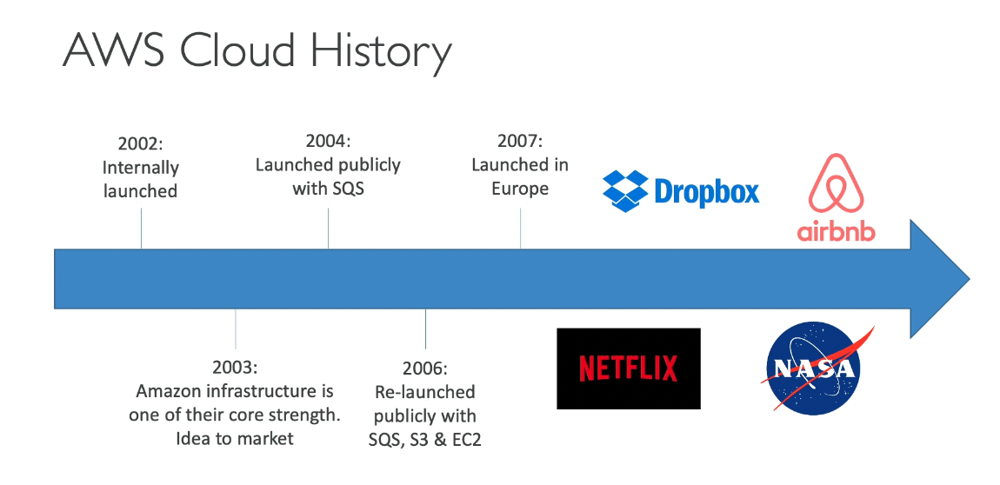

# AWS

- 의문
- 개요
  - 역사
- Region & AZ(Availability Zone)

## 의문

## 개요

### 역사

AWS의 역사

## Region & AZ(Availability Zone)

- Region
  - 개요
    - 데이터 센터들의 클러스터
  - 예시
    - `us-east-1`
      - 미국리전
    - `ap-northeast-2`
      - 서울리전
- AZ
  - 개요
    - 각각의 AZ는 여분의 파워와 네트워킹과 연결을 갖고 있는 하나 이상의 데이터 센터
      - AZ는 서로 분리 독립되어있음(재해에 독립적)
    - 서로 매우 큰 대역폭, 매우 적은 레이턴시 네트워킹으로 연결되어있음(사실상 LAN)
  - 예시
    - `ap-northeast-2a`
    - `ap-northeast-2b`
    - `ap-northeast-2c`
- AWS Points of Presence(Edge Locations)
  - 개요
    - 42개 나라의 84개 도시에 존재
    - 엔드유저에게 매우 적은 레이턴시로 컨텐츠를 제공
    - *그래서 이게 뭐야?*
