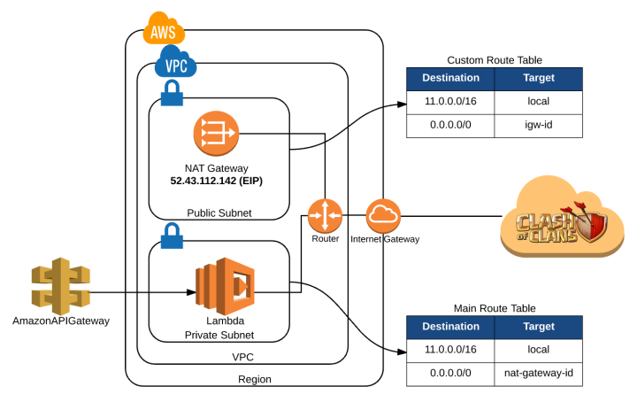

# AWS람다를 정적 아이피로 설정하기

- [참고](http://techblog.financialengines.com/2016/09/26/aws-lambdas-with-a-static-outgoing-ip/)

## 요약

- AWS의 서비스를 이용할떄, 특정 IP만 허용하고 싶은경우가 생기는데, 이러한 AWS 서비스를 이용하는 또다른 AWS서비스의 IP가 다이나믹하게 변화하면 IP필터링을 제대로 할 수 없어서 문제가 생김.
- 여기서는 AWS VPC를 이용해서 아이피가 지속적으로 변화하는 AWS lambda의 파블릭 IP를 고정해 본다.

## 용어

### 라우팅 테이블

**네트워크 트래픽을 전달할 위치를 결정하는데에 사용하는 라우팅이라는 규칙 집합**

### 인터넷 게이트웨이

- VPC의 인스턴스와 인터넷 간에 통신할 수 있게 해줌
- 인터넷 라우팅 기능(트래픽에 대한 VPC 라우팅 테이블에 대상을 제공)
- 퍼블릭 IPv4주소가 할당된 인스턴스에 대해서 NAT(네트워크 주소 변환)을 실행하는 두 가지 목적

### NAT(Network Address Transfer)

- 프라이빗 서브넷의 인스턴스를 인터넷 또는 기타 AWS서비스에 연결, 인터넷에서 해당 인스턴스와의 연결을 시작하지 못하게 할 수 있는 기능 + 포트 주소 변환
- 프라이빗 서브넷의 인스턴스에서 인터넷 또는 기타 AWS서비스로 트래픽을 전달한 다음 인스턴스에 응답을 다시 보냄
  - 트래픽이 인터넷으로 이동
    - 소스 IPv4주소를 NAT디바이스 주소로 대체
  - 응답 트래픽이 해당 인스턴스 이동
    - NAT디바이스에서 주소를 해당 인스턴스의 프라이빗 IPv4주소로 다시 변환

## 아키텍처

- VPC생성
- 서브넷 생성
  - 파블릭 서브넷
  - 프라이빗 서브넷
- 인터넷 게이트웨이와 새로운 라우터 설정
  - 새로운 라우터는 모든 트래픽을 이 게이트웨이로 가도록 함
  - 그리고 파블릭 서브넷과 연결
- 파블릭 서브넷에 NAT 게이트웨이 생성
  - 파라이빗 서브넷의 리소스가 인터넷 접근을 가능하도록 함
  - Elastic IP가 필요
  - 디폴트 라우트 테이블 갱신
- AWS람다 서비스 생성
  - API Gateway(http통신이 가능하게 하는것) 생성
  - 보안 아이디 설정
  - 앞서 생성한 프라이빗 서브넷과 연결

## 해석

1. 외부에서 람다를 API 게이트웨이를 이용해서 호출
2. 프라이빗 서브넷에 있는 람다가 API를 이용해(e.g http request) 비즈니스 로직을 호출
3. http request는 가장먼저 메인 라우터를 참조. 모든 아웃바운드 리퀘스트가 파블릭 서브넷에 있는 nat-gateway를 통과
4. nat-gateway의 라우터를 참조. 모든 아웃바운드 아이피는 인터넷 게이트웨이를 통과(이떄에 elastic ip에 의해서 고정 ip가 부여)
5. 인터넷 게이트웨이는 외부의 인터넷과 연결
