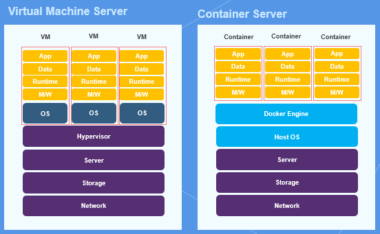
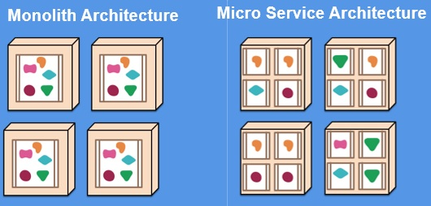

# Kubernates 기초

- 정의
- 사전지식
  - 컨테이너
  - 컨테이너 장점
- 왜 쿠버네티스인가
- 관련 지식

## 정의

- 컨테이너 오케스트레이션 플랫폼
  - 구글이 오픈소스로 공개
  - 컨테이너가 많아져도 관리와 운영을 효율적으로 하게 하기 위한 플랫폼
- 기능
  - 스케줄링
    - 컨테이너를 비교적 가장 여유로운 노드에 자동 배치
    - 작업 노드가 죽으면 실행중이던 컨테이너를 다른 노드에 옮겨줌
  - 클러스터링
    - 여러 개의 노드를 묶어 하나처럼 사용
    - 모든 컨테이너가 내부 통신
  - 서비스 디스커버리
    - 컨테이너가 자동으로 배치되어 있기 때문에, 어디에 배치되었는지 찾아줌
  - 로깅 및 모니터링
    - 로그를 관리하고 직접 다른 툴을 사용해 보여줄 수 있음

## 사전지식

### 컨테이너

- 어떤 물체를 격리하는 공간
- 애플리케이션과 애플리케이션을 구동하는 환경을 격리한 공간
- 클라우드 환경에서 많이 적용되고 있음

### 컨테이너 장점

#### 1. 가상머신과 컨테이너의 차이점

- 가상 머신
  - 가상머신 서버에서는 하이퍼바이저로 하드웨어를 가상화하고, 그 위에 Guest OS가 설치된 가상 머신들을 구동시킴
- 컨테이너 서버
  - 운영체제 레벨에서 CPU, RAM, Disk, Network등의 자원을 격리하여 컨테이너에 할당하기 때문에 게스트 OS가 따로 필요 없음
- 요소 비교
  - 효율성
    - 가상머신
      - 기업 입장에서는 안정적인 운영을 위해서 1개의 VM에서 1개의 서비스를 구동
      - 가상머신의 모든 자원을 사용하는 것이 아니므로 오버헤드 발생
    - 컨테이너
      - OS커널을 공유하므로 자원을 필요한 만큼 효율적으로 사용
  - 신속성
    - 가상머신
      - 크기가 최소 몇 GB
      - 배포에 수 분에서 수십 분
    - 컨테이너
      - MB의 단위
      - 배포에 수 초
  - 라이센스 비용 절감
    - 가상머신
      - 가상머신의 개수만큼 Guest OS의 라이센스 비용 발생
    - 컨테이너
      - HostOS 1대의 라이센스 비용만 발생
  - 안정성
    - 가상머신
      - 정확히 할당된 자원 내에서 가상머신이 운영되므로, 컨테이너에 비해 안정적
    - 컨테이너
      - OS커널 공유하므로, 하나의 컨테이너가 무리하게 자원을 사용하게 될 수 있음
      - 자원을 사전에 지정하면, 컨테이너 장애가 발생
      - 쿠버네티스로 해결

#### 2. 개발 환경 이전 솔루션

- 애플리케이션과 애플리케이션을 구동하는 환경을 그대로 담아서 환경 이전 가능
- Do not run in my computer 문제 발생하지 않음
- c.f) 가상 머신
  - Vagrant를 사용해서 가상머신을 쉽게 생성하고 관리할 수 있음
  - 하이퍼바이저에 논리적인 가상 하드웨어 머신을 생성한 다음, 가상머신에 OS를 설치하고 일일이 모든 설정을 해야 하는 기존의 VM가상화 작업을, 단 몇줄의 명령어로 처리할 수 있는 서비스

#### 3. 마이크로 서비스화 솔루션

- 모노리틱
  - 애플리케이션을 배포할 때 오랜 시간이 소요되거나, 작은 부분을 수정했을 뿐인데 애플리케이션 전체에 문제가 발생하는 경우도 존재
- 마이크로서비스
  - 애플리케이션을 기능별로 나누어 변경과 조합이 가능하게 한 것
  - 이를 컨테이너로 구성하면, 애플리케이션을 기능 혹은 서비스 단위로 신속하게 배포 가능
  - 컨테이너는 독립적인 구조이므로 하나의 변경 사항이 다른 기능들에게 영향을 미치지 않음

## 왜 쿠버네티스인가

- 무중단 서비스 제공(Fault tolerance-FT)
  - 긴급 점검 서비스 일시중지가 없음
  - 점진적 업테이트를 통해서 서비스 중단없이 업데이트 가능
  - 특정 컨테이너에 장애가 발생해도 바로 복제 컨테이너 생성 / 유지 가능
  - c.f) High Availability와의 차이
    - 컨테이너가 죽은 몇초동안에는 장애가 발생할 수 있음
    - 이를 대비해 쿠버네티스는 동일한 서비스를 제공하는 컨테이너를 이중, 삼중으로 만들어 HA를 유지할 수 있음
- Vendor Lock In 해결
  - 클라우드 환경 자체를 이전하고 싶을때 발생하는 문제(VLI)를 해결할 수 있음
  - 도커 컨테이너 기반의 오픈소스

## 관련 지식

- 테라폼(terraform)
  - 다양한 클라우드에 가상머신을 배포하는 인프라 프로비저닝 도구
  - Infrastructure As A Code의 개념
    - 자원을 코드화해서, 코드로 쉽게 Cloud 자원을 생성, 변경 및 삭제
- Docker file을 사용하다보면 Linux위에 Centos나 Ubuntu를 깔기도 하는데, 그러면 Guest OS를 설치하는 것이 아닌가?
  - 아니다. Host OS가 Linux고 컨테이너의 Base Image를 Centos로 구동하게 되면, Linux와 Centos의 다른 부분(diff)만 따로 패키징 하는 것
