# Boolean Function and Gate Logic

## 중요한 개념

Boolean algebra, Boolean functions, gate logic, elementary logic gates, Hardware Description Language (HDL), hardware simulation.

## 불린 로직

- 0과 1의 값으로 무엇을 할 수 있을까?
  - 불린 처리
    - `(x AND y)`, `(x OR y)`, `NOT(x)`
  - 불린 합성(식)
    - `NOT(0 OR (1 AND 1))` == 0
  - 불린 함수
    - f(x, y, z) = `(x AND y) OR (NOT(x) AND z)`
    - x, y, z의 모든 가능성을 테이블로 만들어서 따져볼 수 있음
    - 위를 공식(formula), 아래를 사실 테이블(Truth table)이라 한다.
  - 불린 항등식
    - 어떠한 불린 식이 항상 같은 값을 갖게 되는가?
    - 교환 법칙(Commutative Laws)
      - `(x AND y)` = `(y AND x)`
    - 결합 법칙(Associative Laws)
      - `(x AND (y AND z))` == `((x AND y) AND z)`
      - `(x OR (y OR z))` == `((x OR y) OR z)`
    - 분배 법칙(Distributive Laws)
      - `(x AND (y OR z))` == `(x AND y) OR (x AND z)`
      - `(x OR (y AND z))` == `(x OR y) AND (x OR z)`
    - 드모르간의 법칙(De Morgan Laws)
      - `Not(x AND y)` == `Not(x) OR Not(y)`
      - `Not(x OR y)` == `Not(x) AND Not(y)`
    - 위의 불린 항등식은 전부 사실 테이블(Truth table)로 증명 가능하다.
    - 불린 항등식을 이용해서(boolean algebratic manipulation) 식을 간단하게 정리할 수 있다. or 사실 테이블을 쓸 수 도 있다.

## 불린 함수 합성

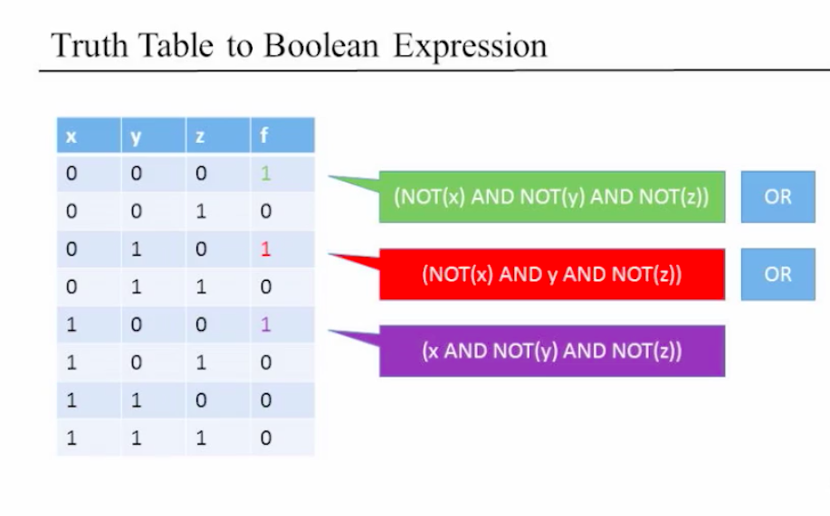

- 불린 함수의 표현 방식
  - 불린 식
  - 사실 테이블
- 지금까지는
  - 불린 식 -> 사실 테이블
- 앞으로는
  - 사실 테이블 -> 불린 식
  - 컴퓨터를 만드는데에 필요함(추상화)
- 방법
  - 사실 테이블의 결과값이 1이되는 모든 행에 대해서 각각의 행의 조건이 실현 가능한 불린 식을 따로 구한다.
  - 그 각각의 불린 식을 OR로 묶는다.
  - 그 식을 간단화 한다.
    - `(NOT(x) AND NOT(y) AND NOT(z)) OR (NOT (x) AND y AND NOT(z)) OR (x AND NOT(y) AND NOT(z))`
    - `(NOT(x) AND NOT(z)) OR (x AND NOT(y) AND NOT(z))`
    - `(NOT(x) AND NOT(z)) OR (NOT(y) AND NOT(z))`
    - `NOT(z) AND (NOT(x) OR NOT(y))`
    - 그럼 가장 짧은 최적화 식은 어떻게 찾을까?
      - NP-hard 문제
- 위의 작업에서
  - 모든 불린 함수는 `AND`, `OR`, `NOT`으로 모두 표현 가능하다
  - **모든 불린 함수는 `AND`, `NOT`으로 모두 표현 가능하다**
    - 드모르간의 법칙으로 증명 가능
    - `(x OR y)` == `(NOT(NOT(x) AND NOT(y)))`

### NAND

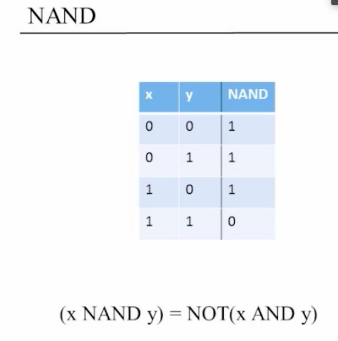

- **모든 불린 함수는 `NAND`로 모두 표현 가능하다**
  - `NOT(x)` == `(x NAND x)`
  - `(x AND y)` == `NOT(x NAND y)`
- 컴퓨터를 이 NAND 처리에 기반하여 만들어나간다.

## 게이트 로직(Gate Logic)

- 로직 게이트를 이용해서 불린 함수들을 구현하는 기술
- 로직 게이트란
  - 기초(Nand, And, Or, Not, ...)
  - 복합(Mux, Adder, ...)

### 기본 게이트 로직

#### Nand

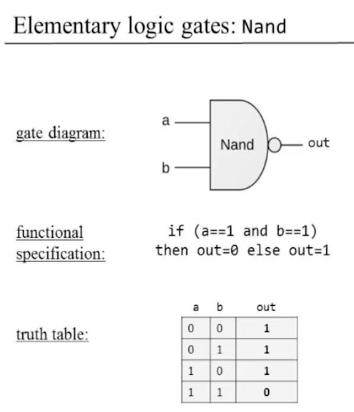

#### And, Or, Not

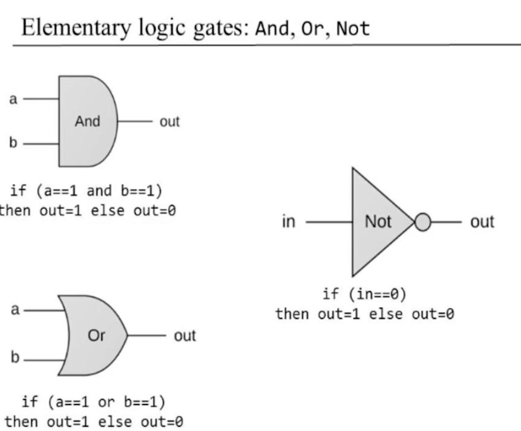

### 복합 게이트 로직

### 3 And

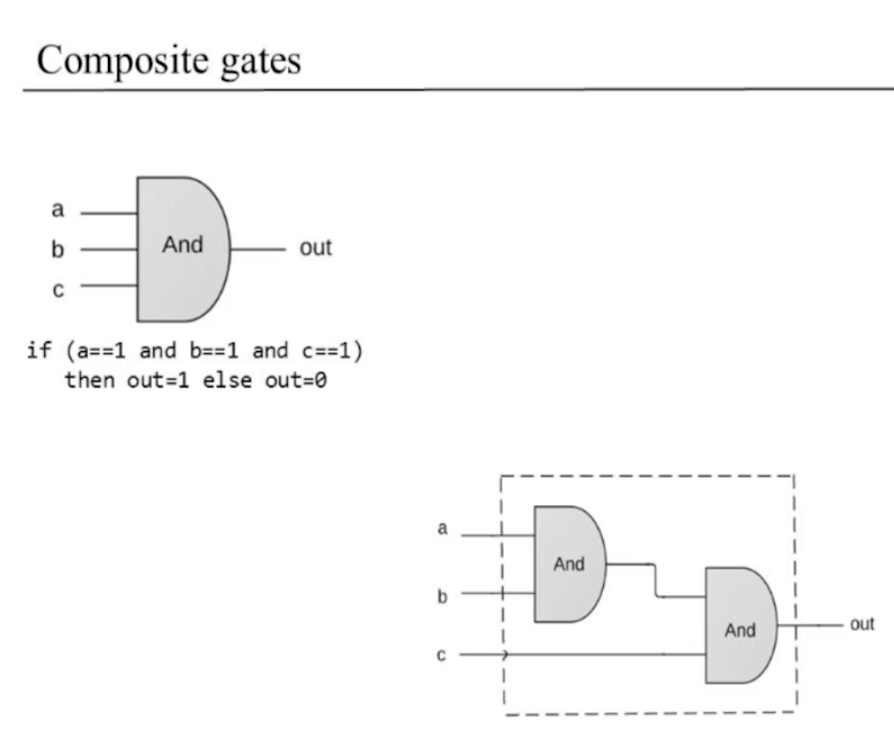

- 위의 점선은 인터페이스를 말한다.
- 유저는 점선 안의 내부에 대해서 알지 못하고, 3개의 입력값에 대한 and결과만 알 수 있다.
  - 게이트 인터페이스(gate interface)
    - 유저에게 이 게이트가 **무엇** 을 하는지를 알려준다.
    - **유일(unique)하다**
  - 게이트 구현(gate implementation)
    - 유저에게 이 게이트가 **어떻게** 그 무엇을 하는지를 알려준다.
    - 더 깊은 계층에서 일어나는 일
    - 같은 인터페이스여도 **다른 구현이 가능**
    - 다른 구현은 다른 장단점이 있으므로 그것을 생각하는 것이 중요.
  - 서킷 구현(circuit implementation)
    - e.g 전등 회로
    - 전자기학에 가까움
    - 이번 강의에서는 다루지 않음

## 하드웨어 기술 언어(Hardware Description Language)

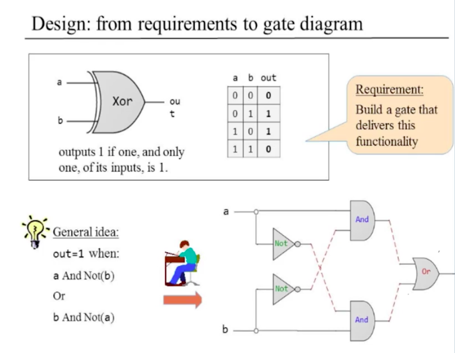

HDL을 이용한 기술

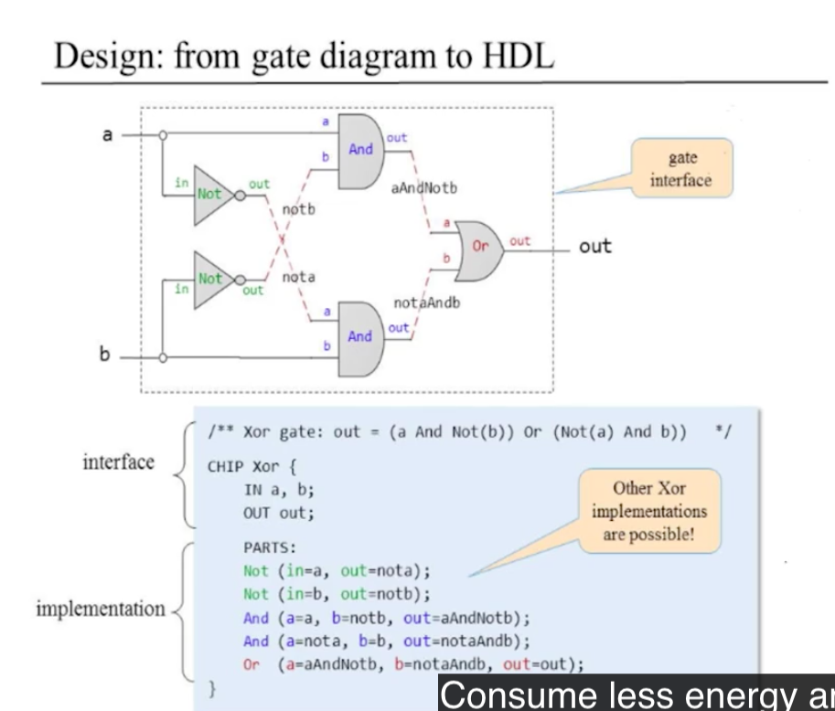

- 게이트 로직을 구현하는 언어
- 사실 NAND게이트만으로 모두 기술 가능하지만, AND, NOT, OR는 이미 구현되었다고 하자
- 방법
  - 어떠한 동작을 하는 게이트인지 먼저 생각(유저의 입장에서 인터페이스를 생각(input, output))
  - 사실 테이블에서 결과값이 1이되는 경우만을 생각해서 이어 나감
  - 게이트 다이어그램(gate diagram)을 작성
- HDL의 특성
  - 함수형 / 선언적 언어
    - 다이어그램에 대한 단순한 정적인 묘사일 뿐
    - 코드가 인터프리터에 들어가서 실제로 일을 한다.
  - HDL코드를 어떠한 순서로 작성해도 사용 가능(left -> right이 더 읽기 쉽다)
  - 칩 파트를 사용하기 전에 인터페이스를 반드시 알고 있어야 한다.
    - `Not(in=, out=)`, `And(a= ,b= ,out= )`, `Or(a= ,b= ,out= )`
  - 다음과 같은 파트는 앞으로도 많이 나올 것이다:
    - `partName(a=a, ...)`, `partName(..., out=out)`
    - 왜인지는 해보면 암
- 종류
  - VHDL, Verilog ...
  - 강의에서 사용되는 hdl
    - 다른 HDLs과 비슷
    - 더 작고 간단함

## 하드웨어 시뮬레이션

작성한 HDL이 정말 맞는지 아닌지 시뮬레이션 가능. 직접 실행, 테스트작성 가능.

- 종류는 아주 많음
- 작고 심플함
- 강의에 필요한 모든 도구 제공
  - www.nand2tetris.org 에서 내용 제공
- 칩 로직은 고수준의 언어로도 구현 가능
  - 고 수준의 계획과 테스트를 가능하게 하며, 그것이 끝나고 HDL코드를 작성하면 됨

### 하드웨어 작성 프로젝트

- 주체
  - 시스템 설계자(architects)
  - 개발자
- 시스템 설계자가 시스템의 구현을 위해 어떤 칩이 필요한지 판단
- 각각의 칩에 대해서 설계자는 다음을 만든다:
  - 칩 API
  - 테스트 스크립트
  - 비교 파일(compare file)
- 설계자가 준 여러가지 자료를 가지고 개발자가 칩을 작성
- **Module**, **Divide and Conquer** 전략으로 복잡한 시스템을 구성

### 멀티 비트 버스

- 비트의 배열
  - 관념적으로 모든 비트를 하나로 버스(bus(many, multiple in Latin))라는 존재로 바꿔서 생각하는 것이 편함
  - HDL도 버스를 제어하는 데에 편리한 도구들을 제공
- 문법
  - `a[16]`, `b[16]`, `out[16]` 이렇게 표현
  - Add3Way나, And4Way등에서 사용가능
- 강의의 HDL
  - part의 output 버스에 서브버스를 덮어 씌우기 가능
  - 내부 핀의 길이(width) 자동적으로 정해짐
  - false와 true값은 어떠한 길이의 버스에서도 사용 가능

## 과제1

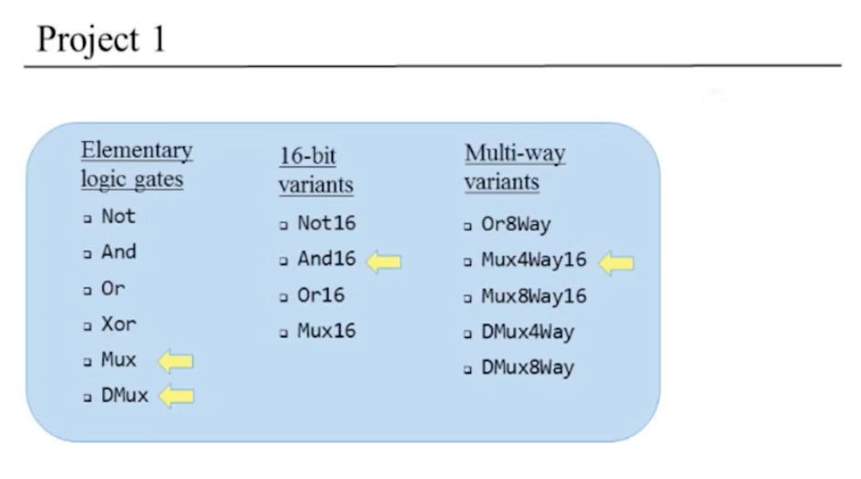

### 멀티플렉서(Multiplexor)

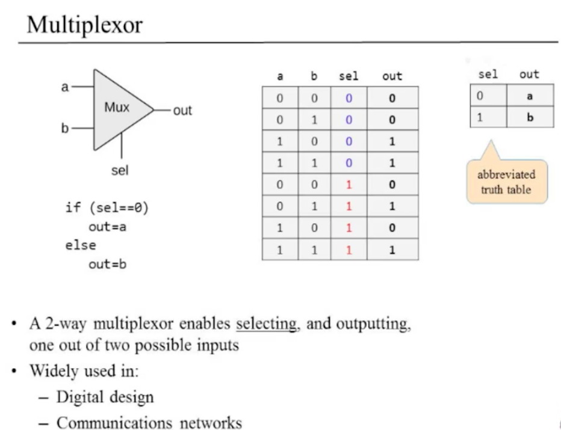

- 두개의 입력값중에서 `sel`에 따라서 하나의 결과값을 출력가능
- programable gate를 생성가능
  - 메타적으로 and나 or를 생성가능

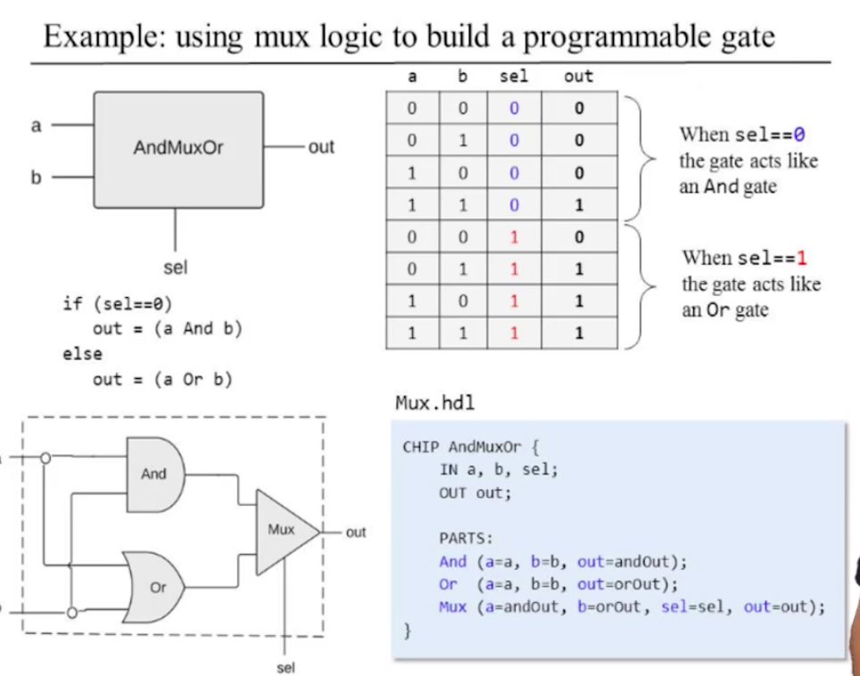

### 디멀티플렉서(Demultiplexor)

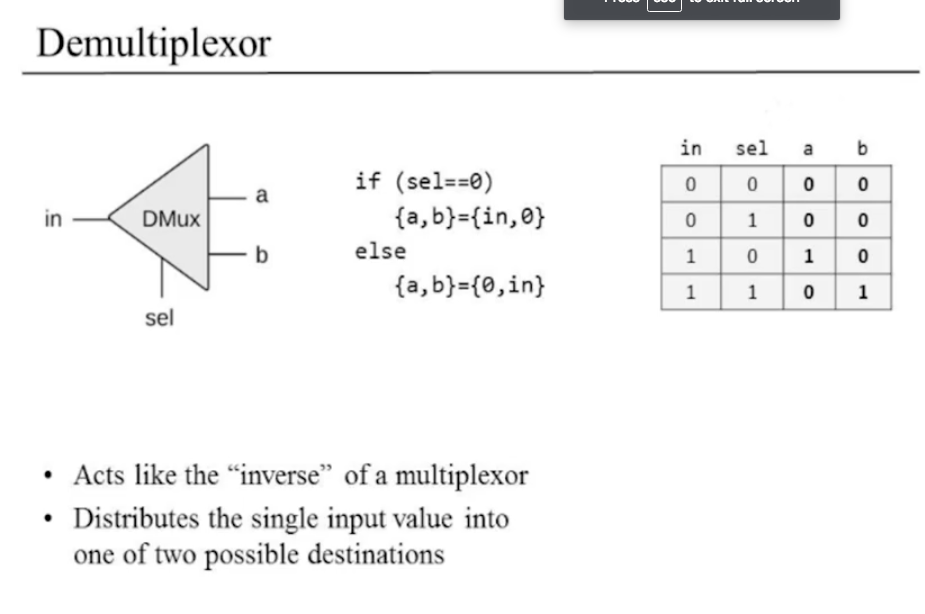

- 하나의 입력값을 `sel`에 따라서 두개중 하나의 out으로 출력가능

#### 멀티플렉서와 디멀티플렉서의 커뮤니케이션 네트워킹

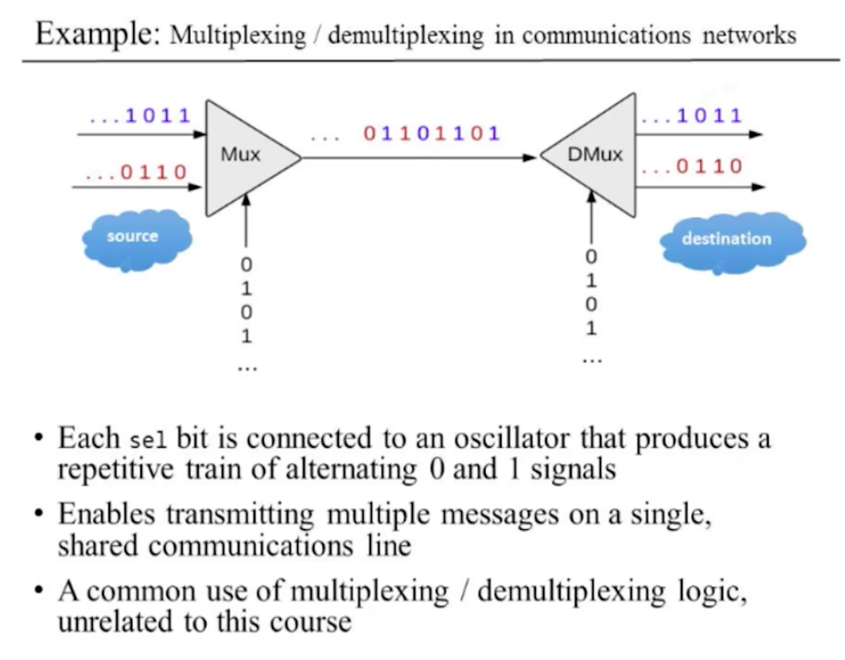

- Mux와 DMux를 이용해서 데이터 전송이 가능

### Mux4Way16

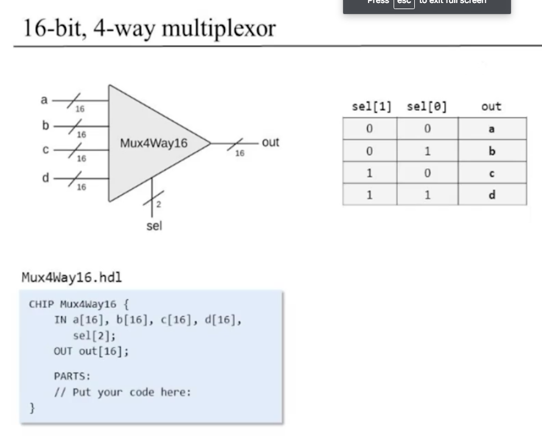
