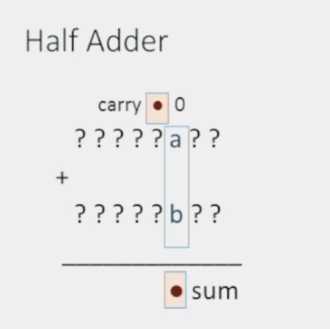
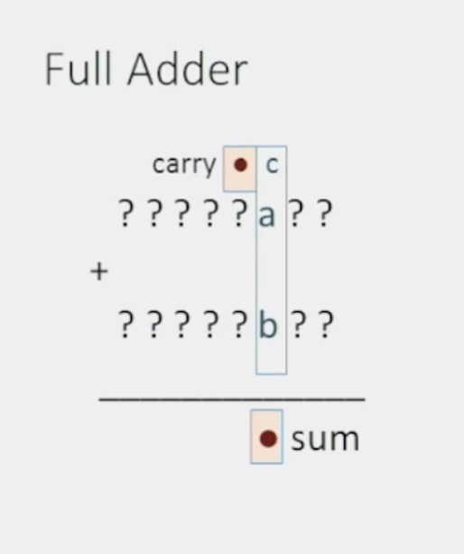
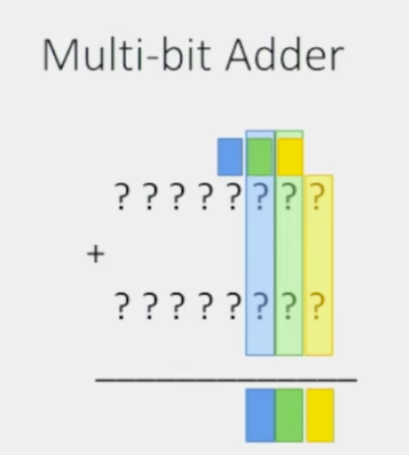
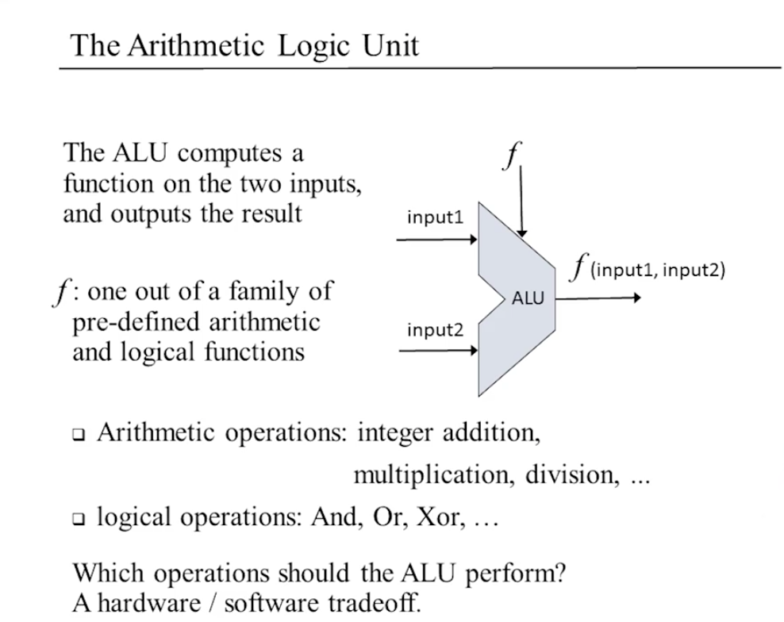
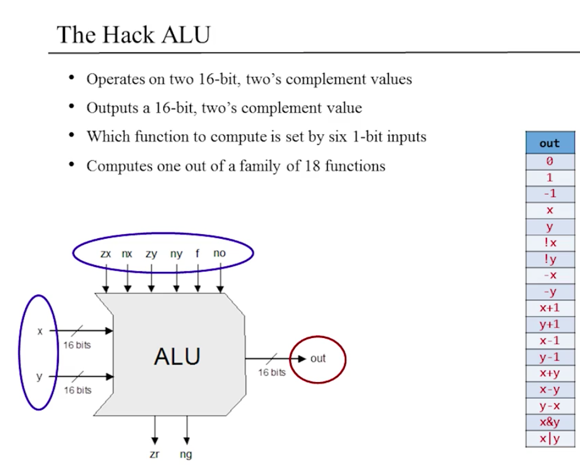
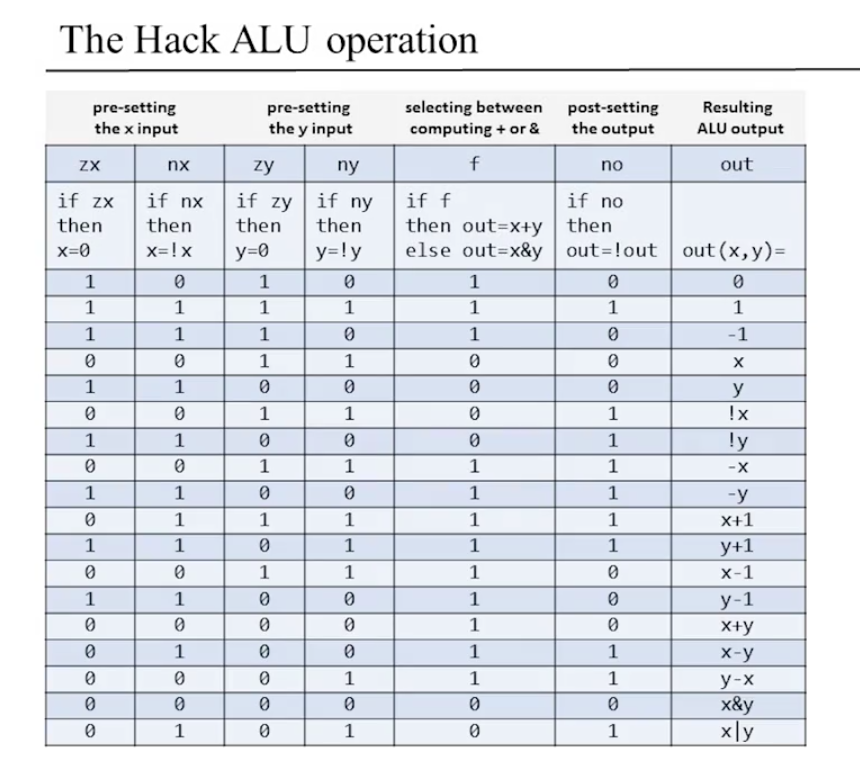
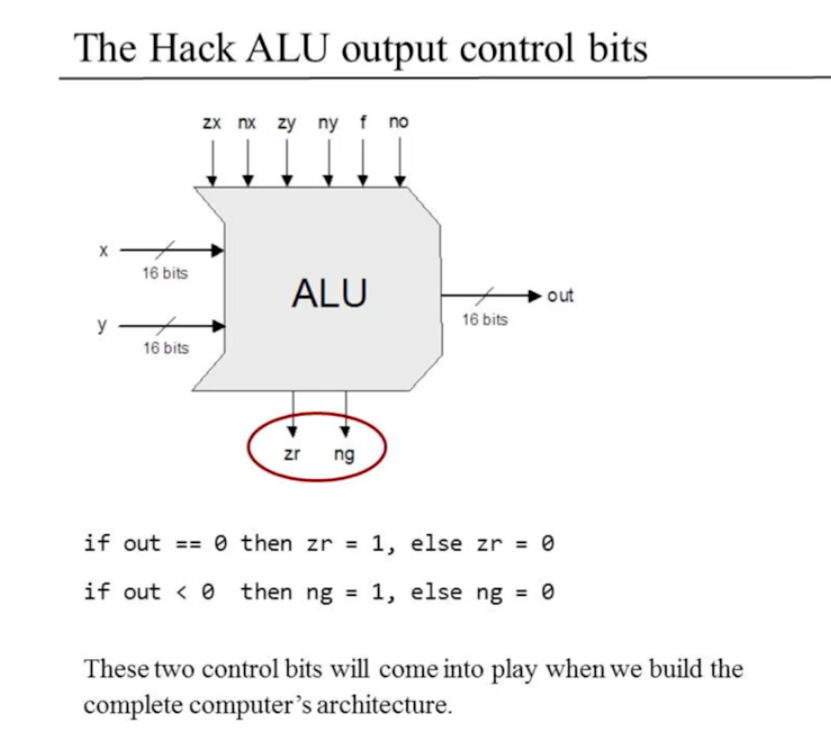

# Boolean Arithmetic and the ALU

## 중요한 개념

Binary numbers, binary addition, the two's complement method, half-adders, full-adders, n-bit adders, counters, Arithmetic Logic Unit (ALU), combinational logic.

## 0과 1로 무엇을 할 수 있을까?

- 숫자 나타내기
  - 0 = 0
  - 1 = 1
  - 2 = 10
  - 3 = 11 ...
- 음수까지 나타내기
  - 0111 1111 (127)
  - 1000 0000 (-1)

## 이진수의 덧셈

- 이진수의 조작
  - Addition: 만들어야 함
  - Subtraction: 덧셈을 알면 쉬움
  - Which is Greater?: 덧셈을 알면 쉬움
  - Multiplication: 소프트웨어 레이어에서 구현
  - Division: 소프트웨어 레이어에서 구현

### 덧셈 방법1: 십진수 변환

```
 0001 0101
+
 0101 1100

= 21 + 92
= 113
```

### 덧셈 방법2: 이진수 에서

```
 00010101
+
 01011100

=01110001
```

위의 계산을 기계에서 하는 법을 배울 것임

### 넘침(Overflow)

```
 10010101
+
 11011100

01110001
```

- 위의 경우에는 넘친 자리수를 무시함

### Adder의 구현

- Half Adder - adds two bits
- Full Adder - adds three bits
- Adder - Adds two numbers

#### Half adder



#### Full adder



#### Multi-bit adder



## 음수(Negative Numbers)

표현 방식에는 여러가지가 있음

- Sign bit
  - 1000 == -0
  - -0은 무엇인가?
- 2의 보수법
  - 음수인 `-x`를 양수를 사용해 나타냄
  - `2^n-x`
  - 양수와 음수의 덧셈이 매우 쉬워짐
  - 넘침 비트는 무시
  - 표현이 모듈로(modulo) 2^n이면 덧셈도 모듈로 2^n임

### 보수 구하기

- 입력: x
- 출력: -x
- 2^n - x = 1 + (2^n-1) -x
  - 2^n - 1 == 1111...1
  - 어떠한 수x를 2진수로 만들고
  - x의 각 자리수를 뒤집은 뒤
  - 1을 더한다.

## Arithmetic Logic Unit



- 내장 함수 f를 바탕으로, 입력1과 입력2에 대한 출력을 함
- 함수를 적용하는 함수같은 느낌
- 얼마나 많은 내장함수를 만들것인가?
  - **하드웨어 vs 소프트웨어(OS) 트레이드오프(trade off)**
  - 하드웨어에 많은 내장 함수를 만들면
    - 빠름
    - 비용이 큼, 디자인이 복잡해짐

### Hack ALU



- 계산 대상: 두개의 16비트, 2의 보수 값을
- 계산 출력: 16비트, 2의 보수값
- 적용 함수: 어떠한 함수를 적용할 것인지를 6개 종류로 생각
- 18개의 함수들의 그룹에서 하나를 선택해 계산
- zr과 ng도 출력


- ALU가 원하는 함수를 사용해 계산하게 하기 위해서는 테이블에 있는대로 맞춰야 함

### Hack ALU Operation





- 위의 18개의 컨트롤 비트(control bits)들의 연산으로 표의 모든 연산 표현 가능
- zr과 ng는 완전한 컴퓨터의 아키텍처를 구성하면 의미를 알 수 있음

### Hack ALU에 대해서

- 간단함
- 엘레강트함
- 쉽게 만들 수 있음
  - 16비트 값을 00..00 으로 만들 수 있음
  - 16비트 값을 11..11 으로 만들 수 있음
  - 16비트 값을 반전시킬 수 있음
  - +나 \&를 16비트 값으로 계산할 수 있음
  - 끝

> Simplicity is the ultimate sophistication

### 질문

Q) ALU 최적화가 가능한 부분은 어디인가?
R) ADDER함수에서 긴 체인대신에 carry look ahead방식을 사용

> 유닛 테스트가 복잡성을 제어하는 데에 최고의 방법이다.
