# Memory

## Sequential Logic

- 여지껏 우리는 시간에 대한 내용을 무시해왔음
  - 입력값은 그냥 거기 있어서 항상 불변
  - 출력값은 즉시 계산됨
  - 이는 Combinatorial Logic이라 불림

시간을 고려해보자.

- 같은 하드웨어를 시간에 따라서 계속 사용하고 싶어함
  - e.g for i = 1 .. 100; ~
- 상태(State)의 기억
  - 메모리
  - 카운터
  - e.g for i = 1 .. 100; sum = sum + i
- 빠른 속도로 컴퓨터가 계산하길 원함

### 클럭

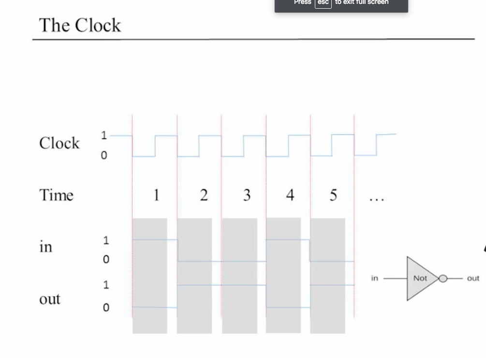

- 계속되는 물리적 시간을 임의의 시간적 길이로 조각조각 나눔
  - 시간1, 시간2, ...
  - 시간을 정수 단위로 분할
  - 하나의 로직 게이트가 상태가 변화하면 그것은 즉각적으로(instantly) 변화하는 것이 아니라, 어느정도 딜레이를 갖고 변화함
  - 클락 안에서 변화하고 있는 부분은 전부 무시하고, 결과만을 보여주는 것이 바람직.
  - 그러므로 클락은 하드웨어 내의 로직 게이트 변화 시간보다 약간 더 길어야 한다(변화를 흡수하는 시간).
  - Real Logical State만을 보여주기 원함

### Combinatorial Logic vs Sequential Logic

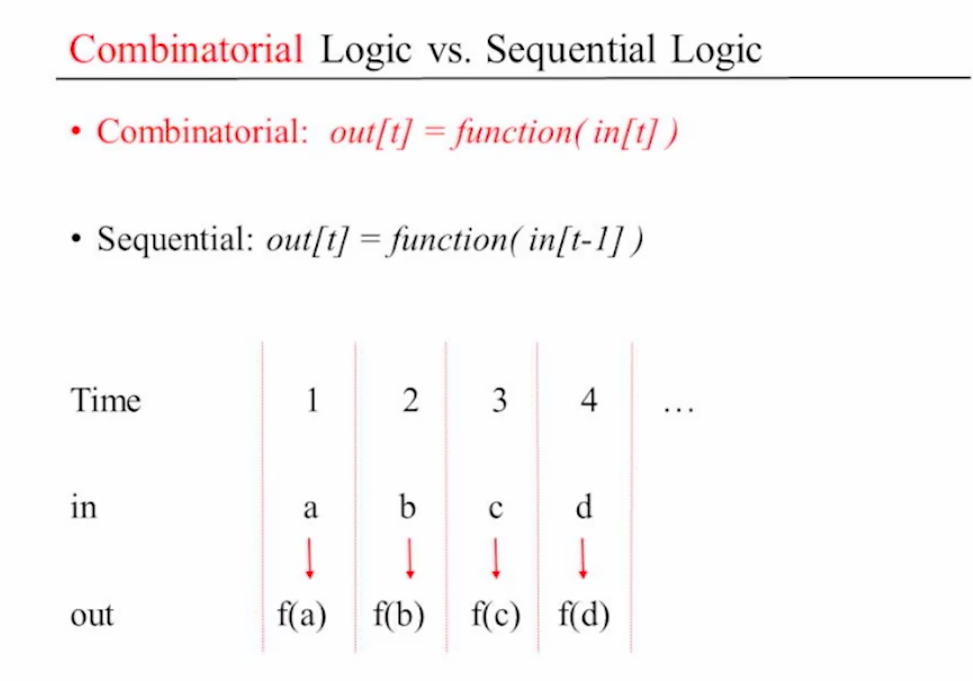

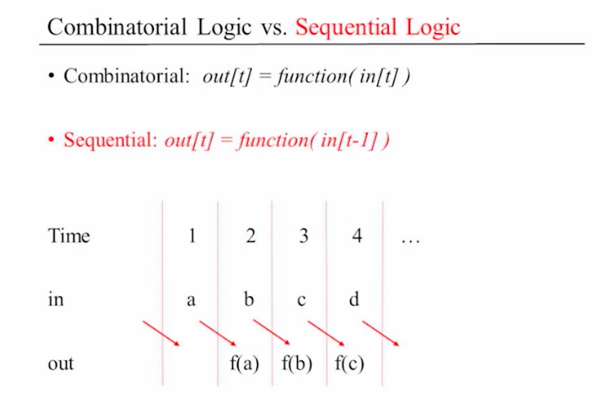

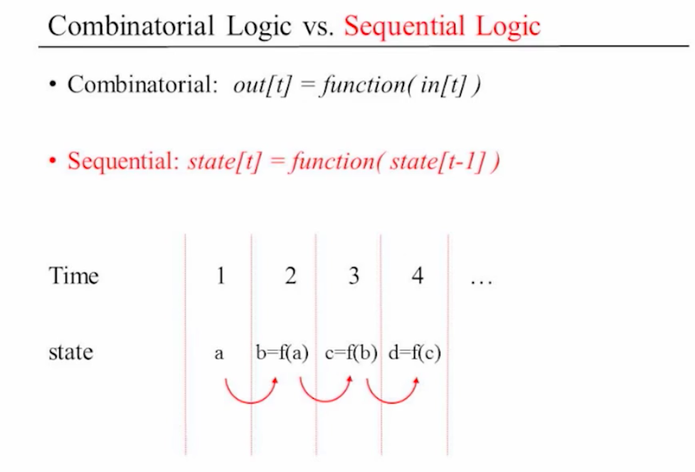

t는 시간

- Combinatorial: out\[t\] = function(in\[t\])
- Sequential: out\[t\] = function(in\[t-1\])
  - 앞선 클락의 입력값에 대한 다음 클락에서의 출력값을 생각해야함
  - 입력값과 출력값은 하드웨어 상에 같은 위치에 존재하는 것
  - 상태에 대해서 생각하다

## 플립플롭(Flip Flop)

`state[t] = function(state[t-1])`를 가능하게 해주는 도구

### 상태 기억하기

시간을 고려 => 상태라는 개념을 생각

- t-1시간 에서의 1비트를 기억해서, t시간에 사용하게 만드는 도구가 아직 없음
- t-1시간의 끝에서는 그러한 도구는 두가지 상태가 될 수 있다
  - 0을 **기억**
  - 1을 **기억**
- 이 도구는 두가지 가능한 상태 사이를 뒤집으면서 상태를 저장
- 위와 같이 두 상태를 **기억하며** 뒤집을 수 있는 게이트를 **Flip-Flop** 이라 불림

### D Flip Flop의 구현

- 1클럭 시간동안 1비트의 상태를 저장 하는 게이트
- 이 강좌에서는 기본적으로 제공
- Nand게이트에서 만드는 것이 가능
  - 1: un-clocked인 플립 플롭을 루프를 이용해서 생성(즉, combinatorial로직에서 구현이 가능)
  - 2: master-slave 설정을 통해서 클럭시간 동안 격리
- 매우 아름다움
  - 하지만 개념적으로 헷갈림
- 이 강좌에서의 시뮬레이터는 combinatorial loop를 금지하고 있음
  - 사이클은 하드웨어 연결에서 sequential 게이트를 통과할때만 유효

### 1비트 레지스터(계속해서 상태 저장: 1비트 칩)

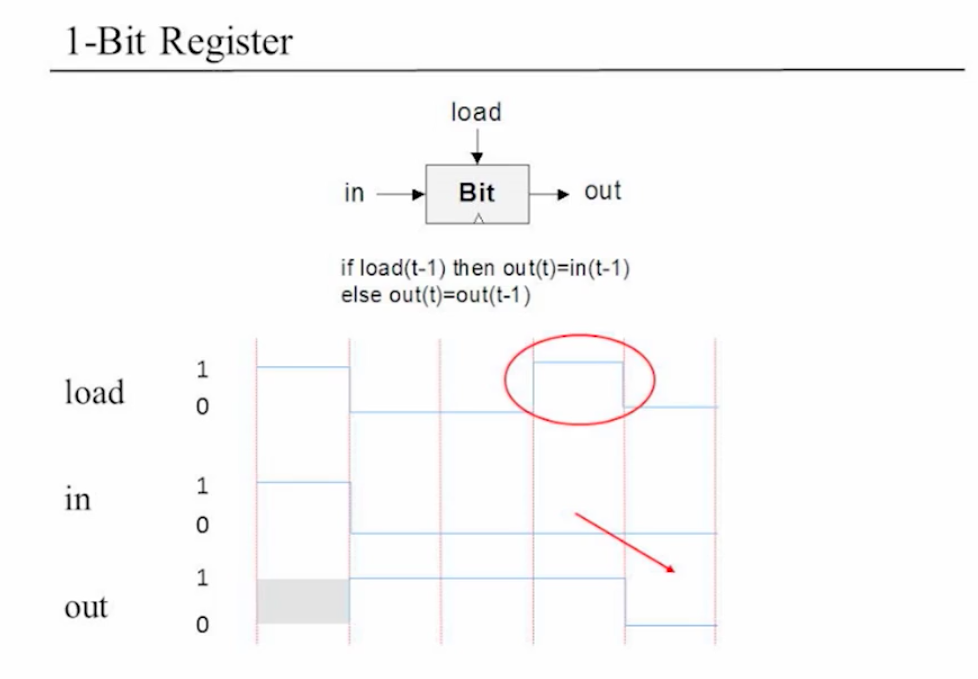

- 입력값을 새로운 입력값이 올 때 까지 영원히 기억하는 게이트

1비트 레지스터

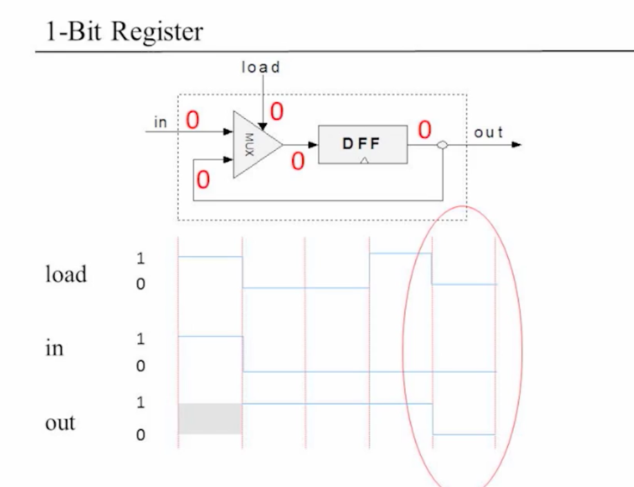

## 메모리 유닛(Memory Units)

- 메모리
  - 메인 메모리: **RAM** ...
  - 부 메로리: 하드 디스크, ...
  - 휘발성 / 비휘발성
- **RAM**
  - 데이터
  - 지시(함수)
- 관점
  - 물리적
  - **논리적**

### 가장 기본적인 메모리 구성요소: 레지스터

- 1비트 레지스터에서 16비트(word width)로 일반화
- 레지스터의 상태
  - 현재 레지스터 안에 저장된 값
- 레지스터 상태 읽기
  - out을 살펴봄
  - 이는 레지스터의 상태를 내보냄
- 레지스터 상태 쓰기
  - 상태를 v로 두려면
  - `in = v`, `load = 1`
  - 이는 레지스터의 상태가 v가 됨
  - 다음 클럭부터는 v를 out으로 내보냄

### RAM 유닛

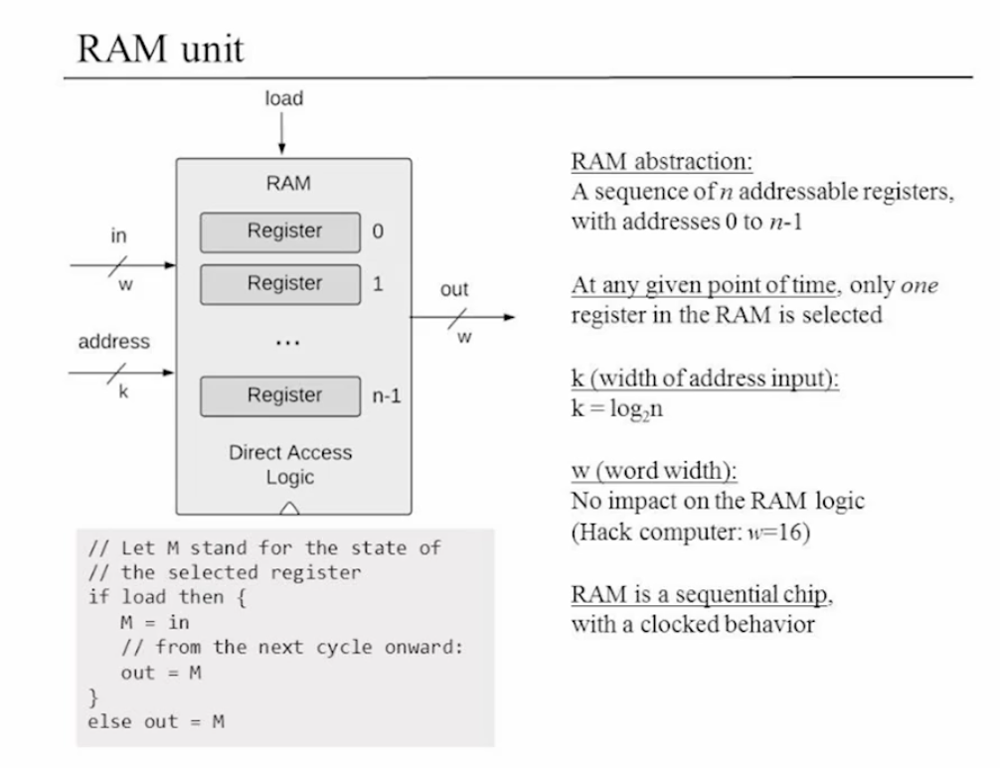

- 램 추상화
  - 주소가 0에서 n-1을 갖는 n개의 주소를 부여할 수 있는 레지스터들의 연속
  - 어떠한 주어진 시간에서도 오직 하나의 레지스터만 선택가능(연산가능)
  - k(주소 입력값의 길이)라면, k=log2n: 레지스터의 주소값
    - 레지스터 번호 7: 111
    - 레지스터 번호 0: 000
  - w(word with): 레지스터가 갖을 수 있는 데이터 단위
    - Hack computer는 w=16
  - 램은 연속적(sequential) 칩이다.
    - 클럭 타임에 영향을 받음
- 램 속의 레지스터 읽기
  - `set address = i`
  - out이 레지스터 i의 상태를 출력
- 램 속의 레지스터 쓰기
  - `set address = i`
  - `set in = v`
  - `set load = 1`
  - 레지스터 i의 상태가 v가됨
  - 다음 클럭부터는 v를 출력
- Random Access Memory의 의미?
  - RAM의 사이즈에 상관없이 모든 레지스터는 항상 같은 시간(아주 짧은 시간)에 접근할 수 있다.

## 카운터(Counters)

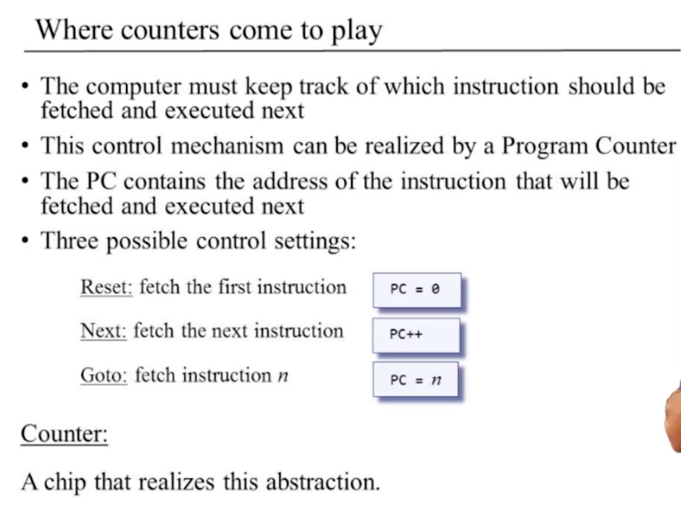

- 컴퓨터가 다음으로 실행해야 할 지시(명령)의 RAM상의 위치를 나타내는 칩
- 순서대로 실행
- 반복적인 작업 / 조건적인 작업을 구현하기 위해 사용
- 이를 PC(Program Counter)라고 함
- 기능
  - Reset
  - Next
  - GOTO

### 카운터 추상화

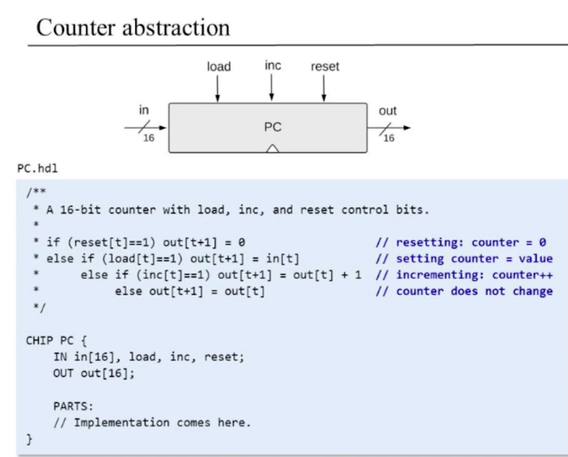

## Project3

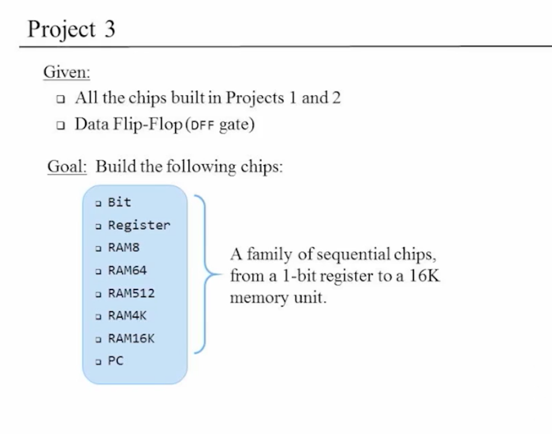

### 1-bit chip

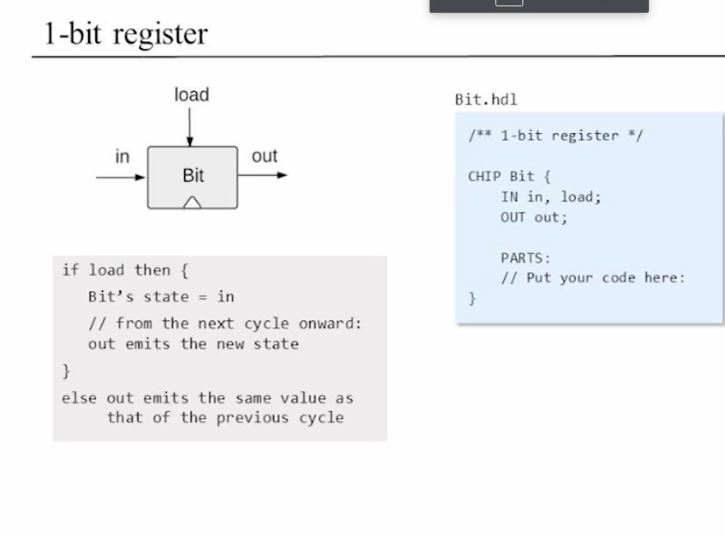

### 16-bit register

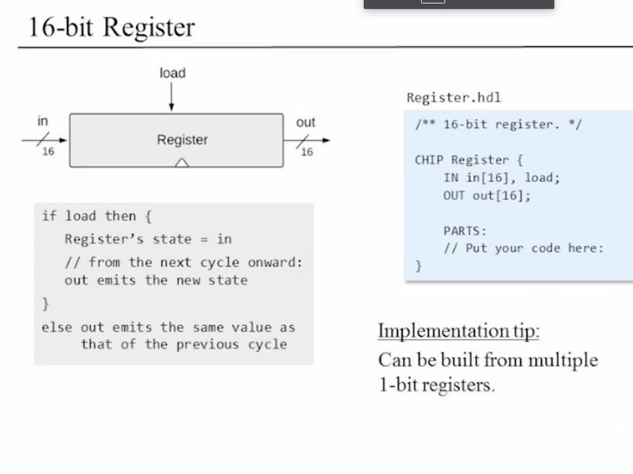

### 8-register RAM

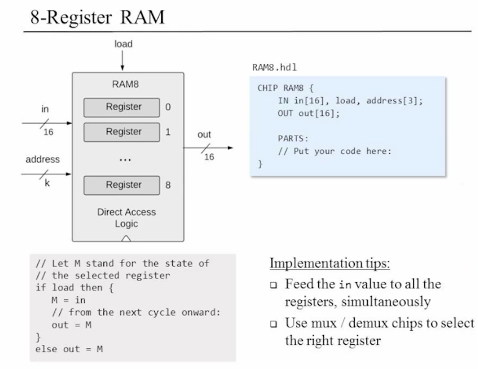

### RAM8, 64, 16K

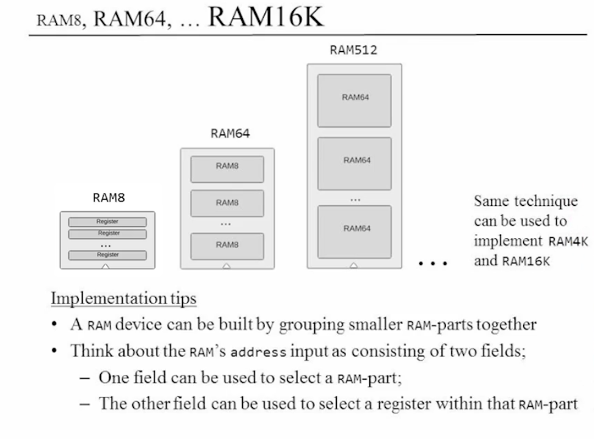

### PC(Program Counter)

## Perspective

Q) 플립플롭 게이트가 블랙 박스였는데 어떻게 만드는가?
R) 두개의 낸드게이트를 루프로 엮음

Q) 컴퓨터는 RAM만 저장하는 매체로 가지는가?
R) ROM이라는 다른 것이 있다. 부팅하기 위해서 사용된다. 플래시 메모리도 존재한다. RAM과 ROM의 좋은 점을 채택

Q) 캐시메모리란 무엇이며 왜 필요한가?
R) 메모리는 값이 비싸다. 더 빠르고 더 클 수록 더 비싸다. 그래서 보통 매우 작으나 빠른 메모리나 매우 크나 느린 메모리를 만들게 된다. 많이 쓰는 데이터는 작으나 빠른 메모리에서 CPU가 사용하고, 가끔 쓰이는 데이터는 매우 크나 느린 메모리를 사용한다. 이런 것을 캐시라고 한다.
