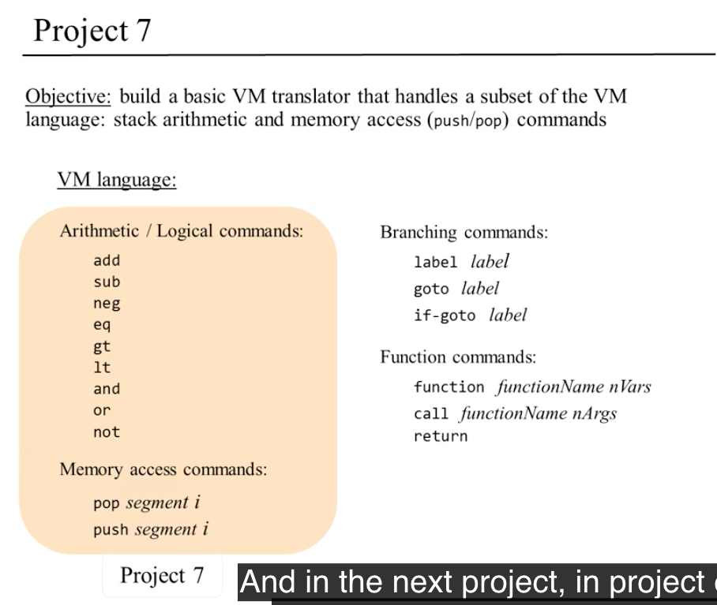

# Stack Arithmetic

## 키워드

- two-tier compilation, virtualization, virtual machines, VM abstraction, stack processing, pointers, VM implementation, VM translators

## 앞으로의 길

### 헬로 월드의 아래에서

- 의문
  - 프로그램은 어떻게 실행되는가?
  - 어떻게 컴퓨터는 스크린에 문자를 표시하는가?
  - `class`, `function`의 개념은 어떻게 제어하는가?
  - `do`, `while`은 어떻게 제어하는가?
  - 함수는 어떻게 실행되는가?
  - 운영체제는 어떻게 작동하는가?
- 고수준의 언어
  - 위의 질문을 몰라도 고수준의 언어는 **추상화** 되어있으므로 작업할 수 있음
- 추상화
  - 규모가 크고 복잡한 시스템에서 사용자가 쉽게 시스템을 사용할 수 있도록 하기 위해서 정말 중요한 개념. **Not how, what**
  - 하지만 누군가는 반드시 저 수준의 레벨을 생각해야만 함
    - assembler
    - virtual machine
    - compiler
    - operating system

### 고수준에서 저수준 프로그래밍으로


### 시작하기 전에

- 하드웨어 파트보다는 더 어려움
  - 직접 프로그램을 짜야함

## 프로그램 컴파일 프리뷰


Write once run anywhere

- 티어1: 가상 머신
  - VM코드(바이트 코드) 생산
- 티어2: 가상 머신 구현(추상화)
  - VM코드를 각각의 기계에 맞는 기계어로 변환
  - 플랫폼에 맞춰서 코드를 변환해줌
- 원리
  - 고수준의 언어와 저수준 프로그래밍의 격차가 워낙 크기 때문에, 그 중간의 격차를 두개의 레이어로 추상화 함
    - 컴파일러
    - VM 구현(번역기)
  - 큰 하나의 일을 두개의 간단한일로 분할
- 가상화(Virtualization)
  - 90년전 앨런 튜링의 컴퓨터 구현 논문에서 알 수 있음
  - 다른 기계를 실행하는 기계 / 다른 프로그램을 실행하는 프로그램 => 프로그램은 데이터다
  - 사유(reasoning)하는 것에 대한 사유

## VM 아키텍처의 추상화: 스택

- 가상 머신의 언어는 어떻게 디자인해야할까?
  - 목표의 균형
    - 충분히 높은 추상화가 되어있어서 고레벨의 언어와의 갭이 크지 않아야 함(해석가능함)
    - 충분히 낮은 레벨의 구현이 되어있어서 저레벨의 언어를 다루기 쉬워야 함
  - 스택 머신
    - 아키텍처(스택)
    - 명령

### 스택

- 스택연산
  - push
    - 현재 메모리 포인터에 있는 값을 스택에 추가
  - pop
    - 현재 탑에 있는 스택의 값을 메모리 포인터로 돌려놓음
  - add
    - 스택의 탑 두개의 원소를 추출해서 둘을 더하고 결과를 스택에 추가함
  - neg
    - 스택의 탑 원소를 추출해서 음수로 변환한 뒤에 스택에 다시 추가함
  - eg
    - 스택의 탑 두개의 원소를 추출해서 둘이 같은 원소라면 true를 탑으로 추가
  - or
    - ...
- 일반적인 함수를 스택에 적용하기
  - 스택으로 부터 원소를 pop함
  - 함수에 pop한 원소를 인자로 전달
  - 스택에 그 결과를 push함
- 이러한 연산들은 어디에서 오는가?
  - 일단은 스택 머신의 기능에 집중하자


### 스택 머신 모델

- 스택 머신의 조작
  - 산술 / 논리 명령
  - 메모리 영역 명령
  - branching 명령
  - 함수 명령

### 산술 / 논리 명령


## VM 추상화: 메모리 영역

### 변수의 종류


- 변수의 종류
  - 인자
  - 지역 변수
  - 스테틱(static) 변수
- VM은 가상 메모리 영역을 갖음
  - 인자
  - 지역
  - 스테틱
  - 상수
  - ...
- VM 자체는 심볼릭 변수 이름을 알아보지 못함. 모든 변수들은 (가상) 메모리 영역의 참조로 변환됨
  - 이는 모든 가상 머신에서 마찬가지(JVM)

### 메모리 영역


- 정의
  - VM에서 고수준 프로그램의 변수를 분류해서 저장하기 위한 수단
- 종류
  - local
  - argument
  - this
  - that
  - constant
  - static
  - pointer
  - temp
- 문법
  - `push segment i`
    - segment: argument, local, static, constant, this, that, pointer, temp
    - i는 음이 아닌 정수
    - 스택에 추가
  - `pop segment i`
    - segment: 마찬가지
    - i는 음이 아닌 정수
    - 스택에서 탑 요소를 추출

### 숨겨진 코드


- `let static 2 = argument 1`
  - 이는 다음과 같음:
  - `push argument 1`
  - `pop static 2`
- 스택은 상태가 변하지 않음

## VM 구현: 스택

- 이제까지 했던 연산은 전부 허상(imaginary)임
- 위의 작용을 실제의 폰노이만 기계가 구현할 수 있도록 해야함
- **큰 문제를 한번에 하려고 하지말고, 쪼개려고 생각하자**

### 포인터 조작


### 스택 머신의 구현


- 전제
  - SP(스택 포인터)는 RAM[0]에 저장됨
  - 스택 베이스 주소는 256
- 예시
  - 스택에 값 17을 추가함
  - 로직
    - `*SP = 17`
    - `SP++`
  - 구현

```
// 스택에 17의 값을 추가
// 이는 17대신 i로 치환하면 일반화 가능
`@17`
`D=A`
`@SP`
`A=M`
`M=D`
`@SP`
`M=M+1`
```

### VM 번역기 관점


- VM 명령을 핵 어셈블리 코드로 변환

## VM구현: 메모리 영역

### local 영역 구현


- API
  - push xxx i
  - pop xxx i
- 스택에서 SP와 같이 로컬 영역은 LCL(RAM1)이라는 기준 메모리 영역(주소 포인터)을 지정
- LCL은 local영역의 첫 요소의 주소를 갖는 포인터임

### 인자(argument), this, that

- 고수준의 언어를 저수준의 언어로 컴파일링 할 때 컴파일러는:
  - 메서드의 지역 변수와 인자를 각각 메모리의 **로컬, 인자 영역** 으로 매핑함
  - 메서드가 현재 실행하고 있는 객체(object)의 필드와 배열의 엔트리(entries)를 각각 **this와 that 영역** 으로 매핑함

#### argument, this, that 영역의 구현


- API
  - push xxx i
  - pop xxx i
  - 다 구현하는 방법이 로컬과 같음
- 각각 그자체의 메모리 영역을 갖음
- 어디에 기준 위치를 정할지는 상관없음
  - 매우 재미있는 과제
  - 운영체제, 컴파일러와 함께 어디에 둘지 결정함

### 상수(constant)

- 고수준의 언어를 저수준의 언어로 컴파일링 할 때 컴파일러는:
  - 상수를 포함하는 고수준의 동작을 상수 영역을 포함하는 VM동작으로 해석함

#### constant 영역의 구현


- API
  - push constant
  - pop은 없음
- 완벽히 가상의 영역

### 스테틱(static)

- 고수준의 언어를 저수준의 언어로 컴파일링 할 때 컴파일러는:
  - 스테틱 메서드에 있는 변수를 스테틱 영역으로 매핑함

#### static 영역의 구현


- API
  - push
  - pop
- 과제
  - 스테틱 변수는 프로그램의 모든 메서드에서 접근 가능해야 함
- 해결
  - 글로벌 공간에 그것들을 저장함
  - VM 번역기가 각각의 VM 참조의 static i(Foo.vm 파일안에 있는)를 어셈블리 참조인 Foo.i로 번역
  - 핵 어셈블리는 임의의 변수를 RAM[16], RAM[17] ... RAM[255]로 관리하기 때문에 가능(스택 밖의 영역)
- 이 부분은 핵 기계의 특징. 다른 부분은 다른 모든 기계에 적용 가능

### 임시(temp)

- 고수준의 언어를 저수준의 언어로 컴파일링 할 때 컴파일러는:
  - 가끔씩 몇몇 변수들을 임시적인 저장 용도로 사용해야 함
  - 핵 VM에서는 8개의 그러한 임시 변수들을 제공

#### temp 영역의 구현


- API
  - push
  - pop
- RAM[5] ~ RAM[12]까지 사용

### 포인터(pointer)

- 고수준의 메서드 코드를 저수준의 코드로 컴파일링 할 때 컴파일러는:
  - this와 that 영역의 기준 주소(base addresses)를 트래킹 하기 위한 코드를 생성하는데, 이를 포인터 영역에서 다룸

#### pointer 영역의 구현


- API
  - push pointer 0/1
  - pop pointer 0/1
  - 0은 this, 1은 that을 의미
  - THIS나 THAT을 제공해서 구현
- e.g
  - push constant 2000
  - pop pointer 1
  - **that7이 매핑되는 RAM의 주소는 2007**

## VM 언어 전체 구현 목록


## VM 에뮬레이터(emulator)

- 에뮬레이터: 어떤 하드웨어나 소프트웨어의 기능을 다른 종류의 하드웨어나 소프트웨어로 모방하여 실현시키기 위한 장치나 프로그램
- VM 에뮬레이터
  - 컴파일된 잭(Jack) 프로그램을 실행
  - 프로그램을 테스팅(시스템상에서)
  - VM 명령을 실험
  - VM의 내부를 관찰(스택, 메모리 영역)
  - VM추상화가 어떻게 호스트 플랫폼에서 실현되었는지 관찰
- 목적
  - 추상화 된 입력과 출력을 관찰
  - 실제 구현을 관찰


## 핵 플랫폼에 있어서의 VM구현


- 번역기를 만들기 위해서는:
  - 번역 되는 언어(source language)와 번역 하는 언어(target language)를 둘다 아는 것이 좋음
  - 가상의 데이터 구조가 호스트 컴퓨터에 어디에 놓이는지 알 수 있는 지식

### 타겟 언어(번역의 결과가 되는 언어)


### 핵 플랫폼에 있어서의 VM 매핑의 기준


- VM 매핑의 선택지:
  - 어떻게 VM의 데이터 구조를 호스트 하드웨어 플랫폼을 사용해서 매핑할 것인가?
  - 어떻게 VM의 명령들을 호스트 기계어를 사용해서 표현할 것인가?
    - 사실 이는 정답이 존재하는 것이 아님 하지만 기본 매핑을 추천
- 기본 매핑(standard mapping)
  - 선생님이 알려준 대로 하는 방법
  - 장점
    - 다른 소프트웨어 시스템과의 호환성
    - 기본 테스팅 가능

## 권장 VM 번역기 만들기


- 인터페이스
  - 입력
    - VM 코드(fileName.vm)
  - 출력
    - 생성된 어셈블리 코드(fileName.asm)
- 구현
  - 권장 아키텍처
    - Parser
      - 각각의 VM 커맨드를 언어적 요소로 파싱
    - CodeWriter
      - 파싱된 VM코드를 어셈블리 코드로 변환
    - Main
      - 프로세스를 관할(VMTranslator)
      - 입력, 출력
      - 입력된 파일을 다루는 Parser인스턴스 생성
      - 출력될 파일을 다루는 CodeWriter인스턴스 생성
      - 입력된 파일을 한줄 한줄 읽으면서 각각의 라인을 파싱하고 핵 어셈블리 코드를 생산

### Parser


- Parser
  - Constructor
  - hasMoreCommands
  - advance

### CodeWriter


- 파싱된 VM 명령으로 부터 어셈블리 코드를 생성

## 큰 그림


## VM 번역기 만들기: 파트1



- 목표
  - VM 번역기의 부분집합을 만듬
    - 스택 연산 명령
    - 메모리 접근 명령
    - 각각의 명령마다 어떠한 명령인지 앞에 주석 달게 프로그래밍 하기
- 테스팅
  - 내장 CPU 에뮬레이터를 이용
- 권장 테스트 순서
  - 1. `xxx.vm`파일을 VM 에뮬레이터에서 실행해보고, 프로그램 자체가 어떻게 동작하는지 관찰
  - 2. `xxx.vm`파일을 내가 쓴 VM 번역기로 번역함. 결과는 `xxx.asm`이 되어야 함
  - 3. 생성된 `xxx.asm`파일의 내용을 봐서 잘 동작하는지 확인
  - ~~4. `xxx.asm`파일을 CPU 에뮬레이터로 불러들이고 실행해서 결과를 확인~~
    - 가상 공간과 스택을 초기화 하지 않았으므로 결과를 확인할 수 없음
  - 4. 테스트 스크립트를 실행해서 결과를 조사
  - 5. 문제가 있으면 번역기를 고치고 다시 순서 2로 돌아감

## 관점

### Q) VM이 매우 오래된 아이디어라고 하는데, 얼마나 오래 되었는가?

- PC의 시대는 1970년대부터 시작. 당시 PC는 아무런 소프트웨어 없이 출시 됐는데 당시 유행한 Pascal이라는 언어는 메인프레임에서만 동작했다.
- 그래서 사람들은 다양한 컴퓨터에 Pascal컴파일러를 만들어서 썼는데, 다른 컴퓨터들은 다 다른 프로세스, 칩, 운영체제를 갖고 있음.
- 그래머 모든 컴퓨터마다 다른 컴파일러를 만들었어야 했는데, 이는 많은 고통과 버그를 야기했고 IBM과 애플은 경쟁 상태여서 개발자가 다른 경쟁사의 컴퓨터와 호환성있는 개발을 할 수 있게 하는데에 관심이 없었음
- 그래서 개발자들이 크로스 플랫폼 개발을 할 수 있게 하기 위해서 초기 아키텍트와 개발자들은 P-code(VM 언어와 비슷, 스택머신)라는 가상 머신을 개발해서 두 기계에 구현되게 됨. 이는 VM 번역기와 VM 언어와 같은 역할을 함
- 또 다른 개발자들은 기계어가 아닌, P-code를 생산할 수 있는 파스칼 컴파일러를 개발
- 그래서 파스칼 프로그램은 IBM과 애플 둘다 작동할 수 있었음
- 이는 고수준 언어가 서로 다른 하드웨어 플랫폼에서 동작할 수 있다는 최초의 예시가 됨
- VM 언어는 고수준 언어가 타겟 하드웨어의 많은 세부사항을 추상화 시키도록 도와줌

### Q) 우리의 VM이 얼마나 JVM과 가까운가?

- 자바의 가상머신은 중간 언어인 바이트 코드에 기초함.
- 물론 차이점은 있음.
  - 핵 가상머신 코드는 16비트 정수만을 인식, 자바는 정수, 부동소수점 등등을 지원
  - JVM이 더 표현적이다(expressive)
- 공통점도 있음
  - 스택 베이스
    - push / pop
  - 메모리를 가상 메모리 영역으로 접근
- 자바의 2티어 레이어 모델을 역사적으로 보는 것도 재미있음
  - 원래 자바는 1990 중반에 개발
  - 당시는 마이크로소프트가 일반 애플리케이션 개발에 지배적
  - 그래서 Sun마이크로 시스템즈는 매우매우 이식성이 좋은 컴퓨터 애플리케이션을 만들 수 있는 언어를 만들고싶어했음.
  - 그래서 정말 어느곳이든 작동할 수 있는 VM아키텍쳐를 생각함. 정말 전세계적으로
  - 자바 프로그램을 컴파일해서 얻은 자바 바이트 코드를 인터넷 어느곳으로든 베포해서 이러한 자바 바이트 코드를 클라이언트의 JVM이 이를 실행해서 완전한 이식성을 추구
  - 사실 너무 시대를 앞서간 생각이라 처음에는 삐걱거림
  - 그러나 2000년대 휴대폰이 등장함. 휴대폰은 정말 너무나도 많은 브랜드와 아키텍처가 존재했음. 그래서 자바가 정말 각광받게 됨. 그래서 매우 인기 많은 언어중 하나가 됨
  - 이와 같이 좋은 생각에는 생명이 있으며 이는, 자신만의 길을 찾게 된다.

### Q) 효율성

- VM 번역기는 미션 특화 프로그램임
  - 만일 VM 번역기가 비효율적인 코드를 생성해버리면 모든 이 가상 머신에서 돌아가는 애플리케이션은 비효율적일것
  - 그래서 실제로, 아키텍트와 VM 번역기 개발자는 매우 타이트하고 효율적인 코드를 생성하려 노력함
  - nand-tetris-part2에서는 이는 완전히 무시됨
- VM에서는 이제까지 사용했던 스택 아키텍처만 사용하지 않음
  - JVM에는 레지스터 머신이라는 추상화된 또 다른 아키텍처를 사용.
  - 이는 스택 머신보다 아름다운 디자인은 아니지만, 모바일 기기에서는 더 최적화된 코드를 생산해줌
