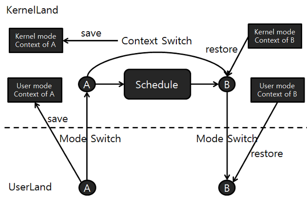
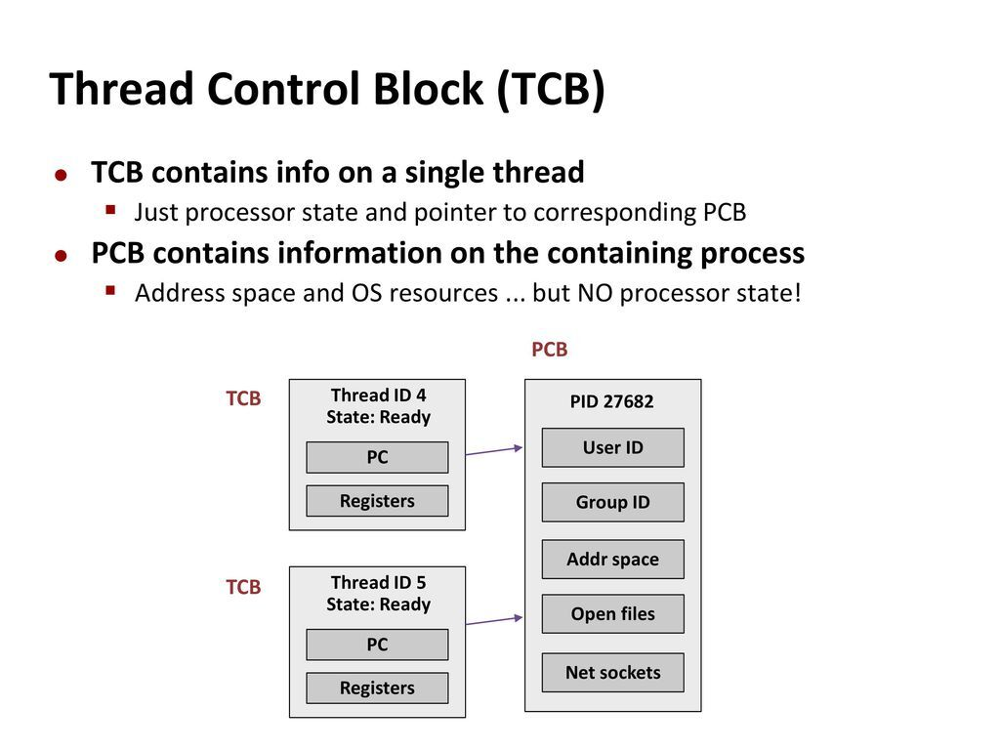

# 널널한 개발자 프로세스 & 스레드

- 의문
- 개요
- 컨텍스트 스위칭
  - 컨텍스트 스위칭과 모드 스위칭의 차이
  - PCB vs TCB 그리고, 컨텍스트 스위칭

## 의문

- 운영체제는 라이브러리인가?
  - 실행되는 운영체제의 역할은 무엇이고, 라이브러리는 어떻게 운영체제와 상호작용하는것인지?

## 개요

## 컨텍스트 스위칭

### 컨텍스트 스위칭과 모드 스위칭의 차이

컨텍스트는 레지스터 / 메모리 레벨(CPU의 실행 컨텍스트이므로)

- 리눅스에서의 컨텍스트 스위칭과 모드 스위칭의 차이
  - 프로세스 A가 유저모드에서 동작중에, 시스템 콜이나 인터럽트(타이머 인터럽트 등)에 의해 커널 모드 진입
  - 커널모드 진입시, 유저모드에서의 레지스트 컨텍스트가 프로세스 A의 커널스택에 저장
  - 커널스택에 저장된 A의 커널모드 레지스터 컨텍스트가 복원
  - 스케쥴 호출
  - A의 커널 컨텍스트가 메모리에 저장되고, 프로세스 B의 저장된 커널 컨텍스트를 레지스터에 복원
  - B의 커널 컨텍스트가 메모리에 저장되면서 B의 유저 컨테스트를 레지스터에 복원하면서 유저모드로 리턴

### PCB(Process Control Blcok) vs TCB(Thread Control Block) 그리고, 컨텍스트 스위칭

PCB와 TCB

- PCB
  - 개요
    - 프로세스를 제어하기 위한 구조체
      - PID, 우선순위, 메모리 정보, 파일 디스크립터들(소켓 포함)
      - 총 106필드
  - 특징
    - OS가 프로세스에 부여한 전산자원(VMS, 파일 디스크립터 등)및 권한은 스레드사이에 공유됨
- TCB(Thread Control Block)
  - 개요
    - 스레드를 제어하기 위한 구조체
      - PC, Register Set, PCB포인터
      - 총 24필드
- 컨텍스트 스위칭과 PCB & TCB
  - 개요
    - 같은 프로세스간의 스위칭
      - TCB정보 저장만 필요
    - 다른 프로세스간의 스위칭
      - PCB / TCB의 모든 정보 저장 필요
