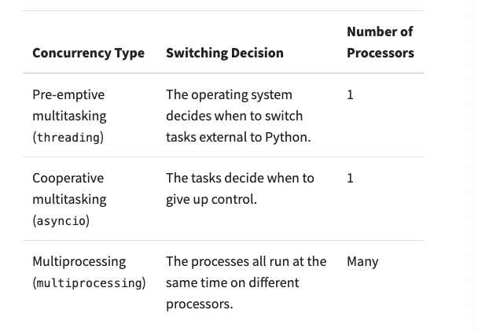
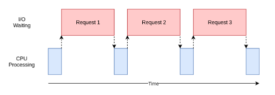
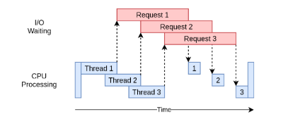
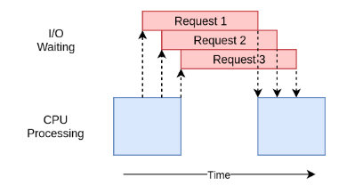

# Concurrency(python)

- 의문
- 순서대로 출력하기 문제
- What Is Concurrency?
- What Is Parallelism?
- When Is Concurrency Useful?
- How to Speed Up an I/O-Bound Program

## 의문

## 순서대로 출력하기 문제

- 문제
  - `printSecond`함수는 무조건 `printFirst`함수가 호출되고 나서 호출되어야 하고, 그 다음에 `printThird`함수가 호출되도록 코드를 작성하는 문제(각 `first`, `second`, `third`함수는 각각 서로다른 스레드에서 임의의 순서로 실행된다)
- 방법
  - Barrier
  - Semaphore
  - Condition
  - Lock
  - Event

```py
from threading import Barrier, Lock, Event, Semaphore, Condition

class Foo:
    def __init__(self):
        self.first_barrier = Barrier(2)
        self.second_barrier = Barrier(2)

    def first(self, printFirst):
        printFirst()
        self.first_barrier.wait()

    def second(self, printSecond):
        self.first_barrier.wait()
        printSecond()
        self.second_barrier.wait()

    def third(self, printThird):
        self.second_barrier.wait()
        printThird()

class Foo:
    def __init__(self):
        self.gates = (Semaphore(0),Semaphore(0))

    def first(self, printFirst):
        printFirst()
        self.gates[0].release()

    def second(self, printSecond):
        with self.gates[0]:
            printSecond()
            self.gates[1].release()

    def third(self, printThird):
        with self.gates[1]:
            printThird()

class Foo:
    def __init__(self):
        self.exec_condition = Condition()
        self.order = 0
        self.first_finish = lambda: self.order == 1
        self.second_finish = lambda: self.order == 2

    def first(self, printFirst):
        with self.exec_condition:
            printFirst()
            self.order = 1
            self.exec_condition.notify(2)

    def second(self, printSecond):
        with self.exec_condition:
            self.exec_condition.wait_for(self.first_finish)
            printSecond()
            self.order = 2
            self.exec_condition.notify()

    def third(self, printThird):
        with self.exec_condition:
            self.exec_condition.wait_for(self.second_finish)
            printThird()

class Foo:
    def __init__(self):
        self.locks = (Lock(),Lock())
        self.locks[0].acquire()
        self.locks[1].acquire()

    def first(self, printFirst):
        printFirst()
        self.locks[0].release()

    def second(self, printSecond):
        with self.locks[0]:
            printSecond()
            self.locks[1].release()


    def third(self, printThird):
        with self.locks[1]:
            printThird()

class Foo:
    def __init__(self):
        self.done = (Event(),Event())

    def first(self, printFirst):
        printFirst()
        self.done[0].set()

    def second(self, printSecond):
        self.done[0].wait()
        printSecond()
        self.done[1].set()

    def third(self, printThird):
        self.done[1].wait()
        printThird()

```


## What Is Concurrency?

- 정의
  - 여러 작업들을 동시에 수행하는 것 처럼 보이게하는 기술
- multiprocessing vs threading vs asyncio
  - multiprocessing
    - 정말 작업을 동시에 병렬적으로 수행하는 것
  - threading, asyncio
    - 하나의 processor에서 한가지 일을 순차적으로 수행하나, 계속해서 context switching하면서 여러 작업을 동시에 수행하는 것 처럼 보이게 함
    - threading
      - OS가 선점적으로(pre-emptive) 스케쥴링을 실행할 수 있도록 도와줌(OS가 실행을 interrupt함)
      - thread 사이의 context swithing이 임의로 생길 수 있음
        - `x = x + 1` 과 같은 식의 도중에서도 일어날 수 있음!(어셈블리 코드를 생각해보자)
    - asyncio(task)
      - 실행 흐름 자체가 자발적으로 실행의 context를 양보함(cooperative)
      - 자발적으로 양보하기 때문에, 언제 task가 swap되는지 명확히 알 수 있음

## What Is Parallelism?

- 다수의 CPU 코어를 가지고 작업을 수행하는 것
- python multiprocessing
  - 새 프로세스를 생성
    - 완전히 다른 프로그램으로 간주
    - 각 프로세스는 자원(메모리, 파일 헨들러 등)을 가짐
    - 각 프로세스는 각자의 python interpreter로 실행됨
  - 프로세스가 다르기 때문에, 멀티 프로세싱 프로그램에서는 각각 다른 코어에서 실행할 수 있음

Concurrency type의 비교



## When Is Concurrency Useful?

I/O-bound problem



CPU-bound problem


- I/O-bound 문제 vs CPU-bound 문제
  - I/O-bound 문제
    - 외부 자원에 접근하기 위해서 I/O를 자주 기다려야 해서 프로그램이 느려지는 문제
    - 특히 파일에 접근하거나, 네트워킹을 하나의 context에서 많이 수행할 때 발생함
      - 속도 향상을 위해서는, 외부 디바이스들을 기다리는 시간을 overlapping하는 것이 필요함
  - CPU-bound 문제
    - CPU 자원 자체가 부족한 경우
      - 속도 향상을 위해서는, 같은 시간에 더 많은 computation이 가능해야 함

## How to Speed Up an I/O-Bound Program

- 예시
  - 네트워크를 이용한 파일 다운로드

### threading version

스레딩을 이용한 문제 해결



스레딩을 이용하여 파일 다운로드

```py
import requests
import time
import concurrent.futures
import logging
import threading

# creates object that look like a global
# but is specific to each individual thread
# global하게 생성하지만 thread마다 고유하고 분리된 접근이 가능하게 함
thread_local = threading.local()

def get_session():
    if not hasattr(thread_local, "session"):
        # make requests session per thread
        # it assumes requests.Session is not thread safe
        thread_local.session = requests.Session()
    return thread_local.session

def download_site(url):
    try:
        session = get_session()
        with session.get(url) as response:
            logging.info(f"Read {len(response.content)} from {url}")
    except e:
        logging.info(e)

def download_all_sites(sites):
    # creating a thread pool
    # excutor -> control how and when each of the threads in the pool will run
    with concurrent.futures.ThreadPoolExecutor(max_workers=160) as executor:
        # running the passed-in function on each of the sites in the list
        # automatically run concurrently using the pool of threads
        executor.map(download_site, sites)

if __name__ == '__main__':
    format = "%(asctime)s: %(message)s"
    logging.basicConfig(format=format, level=logging.INFO, datefmt='%H:%M:%S')
    logging.getLogger().setLevel(logging.DEBUG)

    sites = [
        'https://www.jython.org',
        'http://olympus.realpython.org/dice'
    ] * 80
    start_time = time.time()
    download_all_sites(sites)
    duration = time.time() - start_time
    print(f"Downloaded {len(sites)} in {duration} seconds")
```

- race condition과 외부 라이브러리와 함께 스레딩을 적용할 경우, thread-safe인지 확인하는것도 매우 중요함

### asyncio Version

asyncio를 이용한 문제 해결(하나의 스레드)



- *asyncio의 기본(다시 해석하기)*
  - 개요
    - 일종의 python object인 event loop가 어떻게 / 언제 각각의 태스크를 실행하는가에 대한 것
    - 이벤트 루프는 각각의 task(일종의 코루틴)에 대해서 알고 있고, 이벤트 루프의 상태에 대해서 알고 있음
      - 두개의 상태를 가정(간편화를 위해서)
        - ready state
        - waiting state
    - 간단화된 이벤트루프는 두 리스트의 tasks를 관리함
      - ready task들중 하나를 선택하고, starts it back to running
      - 해당 태스크는 이것이 협력적으로 컨트롤을 이벤트 루프로 돌려줄 때까지 실행을 컨트롤함
      - 실행중인 태스크가 컨트롤을 이벤트루프로 돌려줄 때, 이벤트 루프는 태스크를 ready 혹은 waiting 리스트에 두고, waiting list에 있는 tasks의 각각을 보며, I/O operation completing에 준비되었는지를 봄
  - 특징
    - tasks는 자신이 직접 실행 컨트롤을 양보하기 전까지 자신이 컨트롤을 갖는다.
    - 절대로 operation도중에 방해를 받지 않음
    - 따라서, thread-safe를 걱정하지 않아도 됨
- `async` and `await`
  - `await`
    - task가 컨트롤을 event loop으로 양보하는 역할
      - await에 해당하는 call(I/O 작업)이 시간이 좀 걸리니, task가 컨트롤을 event loop으로 양보함
  - `async`
    - async에 해당하는 함수는 `await`을 사용하여 정의된다는 신호
      - 완벽한 정의는 아님

asyncio 코드 예시

```py
import asyncio
import time
import aiohttp

async def download_site(session, url):
    async with session.get(url) as response:
        print("Read {0} from {1}".format(response.content_length, url))

async def download_all_sites(sites):
    async with aiohttp.ClientSession() as session:
        tasks = []
        for url in sites:
            task = asyncio.ensure_future(download_site(session, url))
            tasks.append(task)
        # asyncio.gather이 모든 tasks가 끝날 때 까지 session context를 alive하게 유지하게 함
        await asyncio.gather(*tasks, return_exceptions=True)

if __name__ == '__main__':
    sites = [
        "https://www.jython.org",
        "http://olympus.realpython.org/dice"
    ] * 80
    start_time = time.time()
    # start up the event loop
    # tell which tasks to run
    # for python 3.7, asyncio.get_event_loop().run_until_complete() == asyncio.run()
    asyncio.get_event_loop().run_until_complete(download_all_sites(sites))
    duration = time.time() - start_time
    print(f"Downloaded {len(sites)} sites in {duration} seconds")
```

- I/O requests가 같은 스레드에서 동작함
- 문제점
  - `async`, `await`을 올바른 장소에 배치하는 것이 복잡함
  - asyncio를 잘 사용하기 위해서는 async 버전을 제공하는 라이브러리를 사용해야만 함
  - task들이 서로 cooperative하게 만들어야지만 성능 향상을 기대할 수 있음
    - event loop가 task가 컨트롤을 넘겨주게 강제할 수 없음(자발적으로 컨트롤을 넘겨주기 전까지)

### Multiprocessing Version

```py

```
