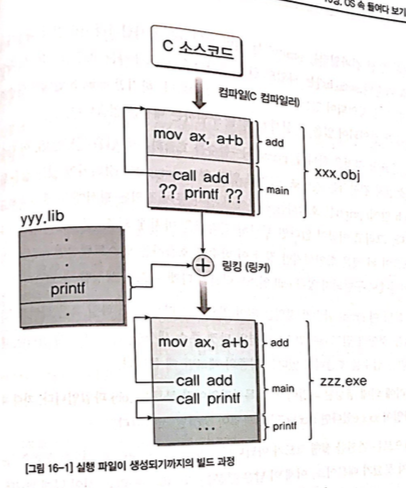
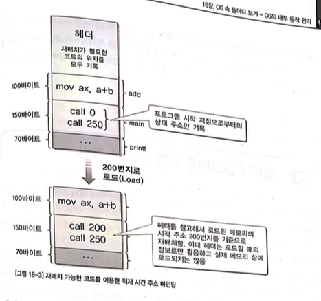
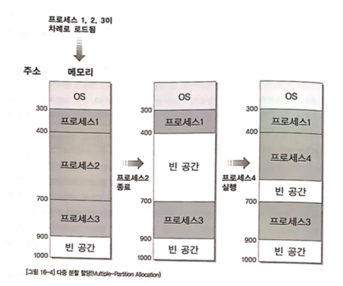
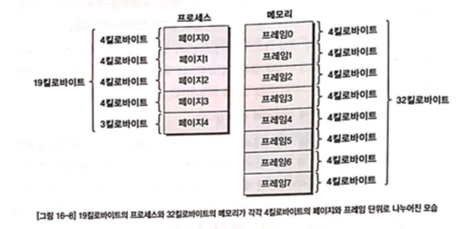
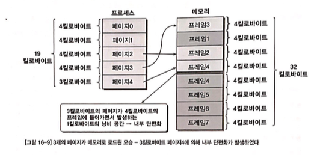
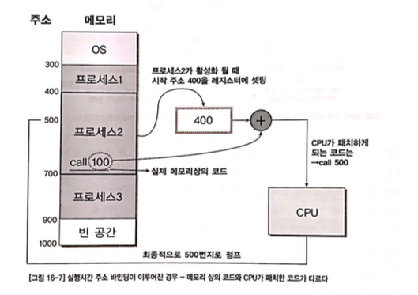
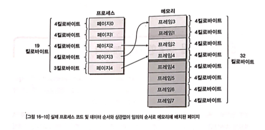
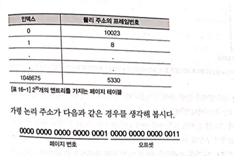
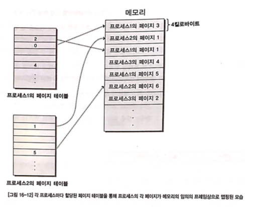
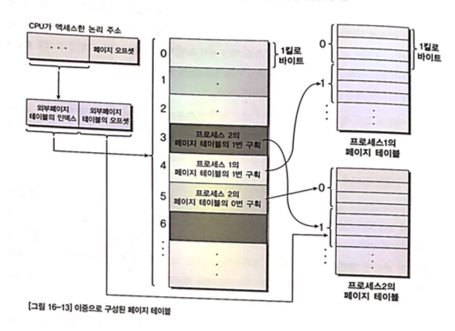

# OS 속 들여다 보기 - OS의 내부 동작 원리

- 프로세스 vs 메모리
- 프로그램이 실행되기까지
- 멀티 프로그램을 위한 메모리 관리
- 페이징
- 페이징을 활용한 가상 메모리
- 페이지 테이블을 위한 캐쉬 메모리 - TLBs
- 페이징을 통한 프로세스간 메모리 공유
- CPU의 시간표 - 스케쥴링
- 실시간 운영체제

## 의문

- *POSIX는 커널 level의 인터페이스인가? 아니면 shell level의 인터페이스인가?*
- *소켓이란 무엇인가?*
- *프로세스의 힙 segment는 stack segment와 같이 정해진 크기가 존재하는가?*
- *프로그램 코드 내에서 어떤 코드들이 적재시간 주소 바인딩의 대상이 되는가?*
  - 라이브러리 함수 호출
  - 라이브러리 전역변수 사용
- *프로세스간의 컨텍스트 스위칭과 스레드간의 컨텍스트 스위칭이 정확히 어떤 메커니즘으로 행해지는지?*
  - 하나의 프로세스가 실행되고 있을 때, 그 프로세스의 스레드들이 존재하면 그 스레드들 사이에 컨텍스트 스위칭은 가능하지만 외부 프로세스의 스레드들의 컨텍스트 스위칭은 불가능한것인지?
- *페이징을 활용할 때, 힙 영역이 엄청나게 크면 어떻게 하는가?*
  - 데이터도 결국 순차적으로 traverse하는 경우가 많으므로 일단 적당히 페이지를 프레임에 올려두고 프레임의 모든 영역을 넘으면 paging fault를 발생시켜서 스와핑
- *힙 영역이 엄청나게 클 경우, 프로세스의 메모리의 크기도 커지는가? 그럼 스택이랑 충돌날텐데?*
- *하나의 프로세스는 하나의 페이지만 프레임으로 올릴 수 있는가?*

## 개요

- 단편화
  - 멀티 태스킹을 지원하는 OS에서 메모리상에 동시에 여러 프로세스가 실행
  - 이 때, 이러한 프로세스 이미지들이 메모리에 로드되어 실행하다가 프로세스의 종료, 스와핑에 의해 메모리에서 다시 내려가기도 하는데, 이러한 과정이 반복되면 메모리가 연속적으로 사용되지 않고 중간중간 사용되지 않는 자투리 구간이 생김
  - 이런 구간이 또 다른 프로세스 이미지를 수용하기에 충분히 크지 못하면 사용되지 못하고 낭비됨
  - 이것을 탄편화라 함
- 페이징
  - 단편화를 해결하기 위한 방법

## 1. 프로세스 vs 메모리

### 멀티 프로그래밍 OS 에서의 프로세스

- 다른 프로세스와의 공존에 신경을 써야 함
  - 하드웨어 자원
    - CPU, 메모리, 마우스, 키보드, I/O장치
- CPU 공존
  - **스케쥴링으로 해결**
- 메모리 공존
  - 한 프로그램 마다 자신이 필요한 메모리의 주소를 분명히 해야함
  - 예시
    - 파워포인트 0~1000 번지
    - 워드 1001~2000 번지
  - 과거의 문제
    - 프로그램을 개발하는 시점에는 그 프로그램이 돌아갈 환경에 대해서 전혀 가정할 수 없음
      - 컴퓨터의 메모리 크기를 알 수 없음
    - 과거에는 하드웨어 메모리가 매우 적었음
      - 도스 시절 640kB 제약
      - 게임
        - 모든 이미지를 다 로드하는 대신, 매 스테이지마다 이미지를 로드
      - 워드 프로세서
        - 눈에 보이는 페이지의 데이터만 메모리에 유지하면서 페이지 스크롤을 할 떄마다 갱신
  - 과거의 해결
    - 개발자가 모든 것을 처리(오버레이)
      - 코드가 메모리의 몇 번지에 로드되어야 하는지
      - 로드하기 위해 기존의 어떤 코드나 데이터를 메모리에서 제거해야 하는지
  - 현재의 해결
    - OS가 똑똑해져서 개발자가 메모리를 어떻게 나눠야 하는지 등에 대해서 신경쓰지 않아도 됨
      - 오히려 직접 메모리를 지정해서 사용하는 것이 위험함
      - 항상 OS가 제공하는 API를 사용해서 메모리를 할당받거나, 프로그램상에서 변수를 선언해서 사용해야 함
      - 이렇게 하면 다른 프로그램에 의해 침범되는 걱정이 없음
    - 모든 프로그램은 모두가 각각 자신만이 사용할 수 있는 4GB 메모리를 할당 받아 사용(32비트 컴퓨터인 경우)
      - 10개의 프로그램이 동시에 동작하면, 총 40기가바이트의 메모리가 배정되어 있는 것
      - 심지어 각 메모리들이 모두 0번지부터 시작해 주소가 겹치는데, 서로 침범하지 않음
    - **가상 메모리(Virtual Memory)**
      - 각 프로세스 마다 받아 사용하는 고유의 메모리
      - 가상 메모리가 4기가바이트로 제한되는 이유
        - CPU가 32비트이기 떄문
          - 모든 레지스터가 32비트
          - PC레지스터도 32비트
            - 메모리 주소가 4기가바이트로 제한
        - CPU가 64비트라면
          - `2^64`비트의 크기를 갖는 가상 메모리를 한 프로그램이 사용 가능

## 2. 프로그램이 실행되기까지

- OS의 메모리 관리 기능을 이해하기 위해서는 프로그램이 어떤 과정을 거쳐 실행이 되는지 알아야 함

```c
#include <stdio.h>

int Add(int a, int b)
{
  return a + b;
}

int main()
{
  int Sum = Add(3,5);
  printf("3 + 5 = %d\n", Sum);
  return 0;
}
```

- (윈도우즈 에서는) 위의 코드를 타이핑하고 빌드 버튼을 누르면 `~.exe`와 같은 실행 파일이 생성될 것
  - 컴파일과정 뿐 아니라 **링킹(linking)** 과정도 존재



- 실행 파일이 생성되기 까지
  - 컴파일러
    - C 소스파일을 컴파일러가 해석
    - CPU에 따라 적절한 인스트럭션 생성
      - `call`, `mov`
      - 컴파일러가 위에서 부터 차례대로 소스를 보면서 가장 먼저 나온 `Add` 함수에 대해 코드를 생성
      - `main`함수의 코드 생성
        - `Add`함수가 존재하는지 살펴봄
        - `Add`함수 호출하는 코드 생성
        - `printf`를 호출하는 루틴을 만남
          - `printf`검사
            - `#include<stdio.h>`에 기술된 `stdio.h`파일도 함꼐 검사
            - 함수의 prototype만 구성되어있고 실제 `printf`를 구현하는 내용은 존재하지 않음
            - 인자등이 정의된 형식에 맞게 호출하고 있는지만 확인
            - 함수를 호출하는 `call` 인스트럭션의 타겟 주소 생성 불가(printf가 있었다는 체크만 해둠)
    - `.obj` 파일의 생성
      - 아직 완전한 실행코드가 아님
  - 링커
    - 컴파일러가 생성한 목적 파일과 따로 지정된 라이브러리 파일들을 모두 검사해서 취합하는 역할
    - 각종 라이브러리 검사후 합쳐서 실행 파일 생성(링킹)
      - 위의 경우 `yyy.lib`라이브러리 파일이 지정되어 있음
      - 링커는 `xxx.obj` 파일과 `yyy.lib`파일을 모두 검사해 합침
        - *결국 그럼, code segment에 라이브러리의 코드(yyy.lib)도 같이 올라가게 되는것인가?*
          - 그럴듯. 그렇지 않으면 코드를 실행할 수 있는 방법이 존재하지 않음
      - 최종적으로 `zzz.exe` 실행 파일을 생성
    - 함수의 호출 뿐 아니라 전역 변수를 참조할 때도 마찬가지
      - `extern int VAR` 라고 선언 되어있으면 `VAR` 변수의 공간을 실제로 생성하는 대신, `VAR`를 참조하는 곳마다 체크해둠
    - 링킹 작업 상세
      - 도스 파일
        - `com`
          - 절대주소를 사용한 링킹(컴파일 주소 바인딩)
          - 사용자가 점프할 절대주소나 데이터(변수)가 위치한 메모리의 절대주소 지정해서 사용가능
            - 세그먼테이션 개념을 사용해서 해당 세그먼트 안에서 절대주소처럼 사용할 수 있었음
          - 임베디드 시스템에서는 이와같이 절대 주소를 사용한 프로그램이 바람직
          - 문제
            - OS가 있는 환경에서는 절대 주소를 사용하는 것이 힘듬
              - OS도 하나의 프로그램이므로, 버전업이나 이 코드의 데이터 크기가 동적으로 변하는 경우에 절대주소 체계를 사용하면 재컴파일이 필요함
            - 멀티 태스킹 OS인 경우에는 더 심각해짐
              - 각 프로그램이 언제 몇개가 로드 될지 모르므로 시작 주소는 무조건 가변적임
        - `exe`
      - **재배치(relocation)및 적재 시간 주소 바인딩(Load Time Address Binding)**
        - 주소 바인딩
          - `call` 인스트럭션을 통해 다른 함수를 호출하려 하는데, 이때 호출될 함수의 주소를 언제 결정하는가 하는 문제가 있음
          - 컴파일 주소 바인딩
            - 컴파일(+링킹)하는 과정에서 주소가 결정됨
            - `call printf` -> `call 750`
          - 적재 시간(Load Time) 주소 바인딩
            - 프로그램을 메모리로 로드 하는 시점에서 주소를 결정하는 것
            - 컴파일러나 링커는 메모리 주소를 필요로 하는 인스트럭션에 표시만 해두고, 로드하는 시점에서 주소를 확정 짓도록 함
            - **OS의 프로그램 로더가 이를 결정**
            - **프로그램은 재배치(Relocaiton)가 가능한 형태로 컴파일 되어있어야 함**
              - 메모리 주소가 필요한 인스트럭션에서 0번지를 기준으로 한 상대적인 주소만 생성하고, 실행 파일의 헤더 등에 재배치가 필요한 인스트럭션이 어디에 위치하는 지를 표시해 둠
              - 로더가 프로그램을 실행하면서 로드된 시작 지점의 주소를 이들 상대주소에 더해 최종적인 타겟 주소 완성
          - 실행 시간(Execution Time) 주소 바인딩
            - 주소 결정이 최종적으로 CPU가 해당 인스트럭션을 막 실행시키는 시점에서 결정
              - 페이징 / 압축에서 필수 요건

적재시간 주소 바인딩



## 3. 멀티 프로그램을 위한 메모리 관리

- 핵심 키워드
  - 프로세스 문맥 전환
  - 스와핑
  - 다중 분할 할당
    - 압축
  - 실행 시간 주소 바인딩
  - 페이징
    - 구역성
- 멀티 태스킹을 지원하는 OS
  - 여러개의 프로세스가 잠깐씩 번갈아가며 실행되어 사용자입장에서는 동시에 여러 프로세스가 돌아가는 것처럼 느끼게 하는 것이 중요
  - 프로세스간 문맥 전환
    - A라는 프로세스를 실행하다가 B라는 다른 프로세스로 CPU의 실행 권한이 넘어갈때
      - A프로세스의 많은 정보를 어딘가에 보관해야 함
      - 레지스터 값 / 메모리 값
    - 메모리가 두 프로세스 중 하나의 정보만 수용할 수 있도록 작은 경우
      - OS는 문맥 전환과 함께 **스와핑(Swapping)** 이라는 과정을 거쳐야 함
    - **Swapping**
      - 개요
        - 컨텍스트 스위칭이 일어날 때, 기존 실행하던 프로세스의 문맥 정보(코드 / 데이터 / 레지스터 백업 값)를 메모리에서 보조 기억장치로 옮겨두고, 새로 실행할 프로세스의 문맥정보를 하드디스크에서 읽어오는 것
        - Roll out
          - 하드웨어에서 문맥 정보를 옮기는 것
        - Roll in
          - 재개되는 프로세스의 문맥 정보를 읽어서 메모리로 가져오는 것
    - 특징
      - 마이크로 세컨드 단위로 문맥 전환이 일어나야 함
      - 스와핑에서 대부분의 시간을 할애

### 문맥 전환이 스와핑에 많은 시간을 쏟는 것을 방지하는 방법

다중 분할 할당



- ① 대용량의 메모리가 가득 찰 때까지 가능한 모든 프로세스를 다 메모리에 보관 후 그것을 넘어서면 스와핑을 사용(다중 분할 할당 - Multiple Partition Allocation)
  - 하지만 결국 프로세스가 많아지면 스와핑에 시간이 오래걸린다는 같은 문제 발생
  - 외부 단편화(External Fragmentation) 문제 발생
- ② ① + 압축
  - 메모리상의 프로세스를 옮겨서 연속이 되도록 붙이는 방법
  - 문제
    - 프로세스가 실행되기 전에 인스트럭션들의 타겟 주소값이 모두 결정나버려 실행 중에 있는 프로세스들이 옮겨지면 엉뚱한 메모리를 참조하게 됨
- ③ ② + 실행시간 주소 바인딩
  - 실행시간 주소 바인딩이 필요(Execution Time Address Binding)
    - `call`과 같은 인스트럭션의 타겟 메모리 주소가 실제 그 인스트럭션이 CPU에 의해 패치되기 바로 직전에 결정나게 하는 방식
  - 문제
    - 압축을 어느 시점에 해야하는가?
    - 압축된 상태여도, 프로세스가 늘어나면 메모리가 가득차는 문제 발생
      - 가득 찬 이후에 생성되는 프로세스는 앞의 프로세스가 종료되어 자신이 들어갈 공간이 생길 때까지 무한정 대기하거나 스와핑 해서 문맥전환이 일어날 때 마다, Roll in, Roll out해야함

## 4. 페이징



- ④ 페이징
  - 개요
    - 프로세스 자체를 잘 쪼개서 메모리의 적당히 빈 공간마다 넣는 방식
    - 스와핑을 할 때에도, 프로세스 통쨰로 Roll out, Roll in 하지 말고, 필요한 부분만 조금씩 하기(통계적 사실을 기반한 방법)
  - 이론적 배경
    - 구역성(Locality)
      - 공간구역성(Spatial Locality)
        - 어떤 프로세스가 메모리의 한 곳을 일단 엑세스하기 시작하면 그 주변 데이터도 곧이어 사용될 확률이 높음
        - 배열로 선언된 변수는 대부분 루프를 돌면서 전체 혹은 일부를 순회하면서 검사하는 경우가 많음
      - 시간구역성(Temporal Locality)
        - 시간적인 관점에서 한 번 엑세스된 데이터는 곧이어 다시 엑세스 될 확률이 높음
        - 스택 영역은 함수 안에서 계속 엑세스 하므로 시간구역성이 있음
      - 구역성으로 인하여 프로세스의 코드와 데이터 전체 크기가 1메가 바이트라 할지라도 이 부분이 항상 다 쓰이는 게 아니라, 일정 시간 동안은 0~1000번지를 집중적으로 엑세스 하고, 다시 일정 시간 동안은 3000 ~ 5000번지를 집중적으로 엑세스하는 경향을 띔
        - 이 성질을 이용하여 애초에 프로세스 전체의 코드나 데이터를 전부 메모리에 올릴 필요가 없음을 알 수 있음
    - 구역성을 이용한 부분 스와핑
    - 필요한 부분을 1024바이트, 2048바이트 혹은 4096바이트의 일정한 크기로 나누어서 사용하면 외부 단편화가 생기지 않음
  - 예시


- 용어
  - 페이지
    - 프로세스에서 쪼갠 4킬로바이트 단위 구역
  - 프레임
    - 실제 메모리에서 쪼갠 4킬로바이트 단위구역
- 시나리오(요구 페이징)
  - PC에 전원이 들어옴
  - OS실행
  - 파워포인트 프로그램을 실행
  - OS가 프로세스라는 형식만 갖춰놓음
    - 과거처럼 파워포인트 실행파일에서 코드랑 데이터를 전부 메모리로 로드하지 않음
  - OS는 파워포인트 프로세스로 문맥 전환
  - CPU는 PC 레지스터가 가리키는 메모리 주소에서 인스트럭션을 패치해 옴
    - 패치하려는 메모리 주소에 정상적으로 프로세스 코드 혹은 데이터가 올라와 있는지 봄
      - *정상적 이라는 것은 어떻게 암?(e.g 실행되고있는 프로세스가 사용하는 메모리가 아닐 수도 있음)*
    - 지금은 파워포인트 프로세스만 있지, 코드나 데이터가 메모리로 로드된 상황이 아니므로 에러
  - Page Fault(인터럽트)에러
    - CPU는 현재 수행하던 것을 멈추고 인터럽트의 종류에 따라 이를 처리할 수 있는 코드가 있는 주소로 점프
  - 페이지 폴트는 OS가 처리
    - OS가 로드될 때, 페이지 폴트가 걸리면 페이지 폴트를 처리할 수 있는 코드로 점프하도록 미리 세팅
    - 해당 코드는 필요한 페이지를 메로리로 로드하는 것
  - 파워포인트 시작코드가 존재하는 시작 페이지를 메모리상에 쪼개진 프레임 중 한 곳 으로 옮김
  - CPU는 패치 하려다 실패한 것을 잊어버리고 하던 일을 계속 함
    - 메모리에서 인스트럭션을 읽어옴
  - 4킬로 바이트에 해당하는 한 페이지를 읽어왔기 때문에, 지역성에 의하여 페이지 폴트를 일으키지 않을 것임
  - 물론, 방금 패치한 인스트럭션이 우연히도 `call`이나 `jump`와 같은 인스트럭션인데, 점프하려는 곳이 같은 페이지 안에 있는 것이 아니라, 다른 페이지 안에 있는 경우는 또 다시 페이지 폴트가 발생할 것
    - 그럼 다시 폴트가 발생한 페이지를 읽어서 다시 메모리의 프레임 중 적절한 곳에 배치
  - 다시 아무일 없던듯 정상적으로 해당 인스트럭션이나 데이터를 엑세스 가능
- **요구 페이징(Demand Paging)**
  - 위의 시나리오와 같이, CPU가 실제 읽어갈 때마다 페이지가 메모리상에 로드되었는지 여부를 검사하고, 없다면 로드시키고 다시 수행을 재개하는 방식
    - *하나의 프로세스는 하나의 페이지를 하나의 메모리 프레임에만 올릴 수 있는가?*
  - 장점
    - 다중 분할 방식 때모다 훨씬 많은 프로세스가 동시에 수행 가능
      - 페이지 단위로 수행에 필요한 코드나 데이터가 올라가기 때문
    - 외부 단편화가 생기지 않음
      - 하지만 **내부 단편화(Internal Fragmentation)** 는 생길 수 있음
        - 4키로바이트 단위의 프레임에 4키로바이트 미만의 페이지가 로드 되는 경우도 있는데, 이 경우도 단편화이므로 이를 내부 단편화 라고 함
        - 외부단편화에 비하면 매우 작은 크기



- 요약
  - 멀티 태스킹 OS에서는 프로세스간의 컨텍스트 스위칭이 마이크로세컨드 단위로 빈번하게 일어남
  - 그럴 때, 프로세스의 레지스터나 메모리 상태(코드 / 데이터)를 하드 디스크로 옮기는데 이를 스와핑 이라고 함(롤아웃)
  - 프로그램 전체를 스와핑 하면 시간적 오버헤드가 너무 큼
  - 그래서 페이징이라는 개념을 도입
    - 프로세스를 페이지라는 단위로 자르고 컴퓨터 메모리를 프레임 단위로 맞춰서(책에서는 4키로바이트) 프로세스 실행
    - 구역성의 원리를 이용(통계적 개념)

---

### 참고) 실행시간 주소 바인딩



- 개요
  - `call`과 같은 인스트럭션의 타겟 메모리 주소가 실제 그 인스트럭션이 CPU에 의해 패치되기 바로 직전에 결정나게 하는 방식
- 구현
  - OS만으로는 힘듬(너무 큰 오버헤드)
    - 인스트럭션마다 OS로 제어권 넘김
    - 다음 인스트럭션 주소 바인딩을 위해 인스트럭션 수정
    - 다시 메모리에 저장
  - **하드웨어 레벨의 지원**
    - 메모리를 참조하는 인스트럭션은 CPU가 읽어갈 때 그냥 읽어가는 것이 아니라, 타겟 주소를 항상 특정한 레지스터 값과 더해서 읽는 것
      - 재위치 레지스터 활용(OS 레벨)
        - 프로세스 메모리상 시작 주소 저장
      - 컴파일러가 항상 0번지에서 시작하는 주소값으로 컴파일 해야 함(컴파일러 레벨)
      - CPU 레벨
        - 메모리 참조 인스트럭션인 경우 항상 주소 값을 재위치 레지스터의 값과 더해서 가져와야 함

## 5. 페이징을 활용한 가상 메모리

### 문제

- 요구 페이징(Demand Paging)중 페이지 폴트가 발생하면 어느 프레임에 페이지를 로드해야하는가?
  - 페이지를 임의의 프레임에 로드할 수 있어야 함
  - 하지만, CPU는 순차 수행을 따르는데, 페이지가 메모리상에 이리저리 배치되어 있으면 수차 수행이 불가능

### 해결



- 가상 메모리
  - 개요
    - 실제 물리 메모리 주소와 CPU가 읽고 쓰고 하는 메모리 주소가 1:1 매치가 되는 것이 아니라, 중간에 어떤 룰을 정해서 CPU가 요구하는 노리적 주소화 실제 메모리의 물리적 주소를 반환하자는 발상
    - 페이지의 순서가 프레임 위에서는 배치가 뒤죽박죽이므로, 단순히 PC 레지스터를 증가시켜서 코드를 읽기만 하면 안됨
  - 구현
    - 페이지 테이블 활용
      - 물리 주소
        - 실제 메모리 주소와 CPU가 읽으려 하는 논리 주소를 변환함
          - 몇 번째 프레임의 몇 번째 바이트에 원하는 데이터가 있는지
            - 위의 예시에서는 3 + 12 = 15비트
      - 논리 주소
        - 한 프로세스상에서 어느 페이지의 몇 번째 바이트에 위치해 있는가를 나타내야 함
          - 위의 예시에서는 3(페이지가 5개) + 12비트(페이지 하나는 2^12비트)
      - 예시
        - 만일 CPU가 위의 그림의 페이지4의 시작 부분에 있는 인스트럭션을 패치하려 한다면, 이 주소값이 그대로 메모리로 들어가는 것이 아니라 중간에 페이지 테이블을 통해 변환된 값이 메모리로 이동함
      - 컴퓨터 별 예시
        - 32비트 컴퓨터
          - PC 레지스터 제한
            - 2^32
          - 몇 번째 바이트
            - 4 * 2^10(4kb의 페이징)
          - 몇 번째 페이지
            - 2^20
        - 16비트 컴퓨터
          - PC 레지스터 제한
            - 2^16
          - 몇 번째 바이트
            - 4 * 2^10
          - 몇 번째 페이지
            - 2^4

예시



- 페이지 테이블 구성
  - 논리 주소상의 페이지 번호 -> 실제 메모리 상의 프레임 번호로 변환
  - 32비트 CPU의 경우
    - 20 비트가 페이지 번호로 할당되었으므로 2^20 = 1048576개의 항목을 가진 테이블을 만듦
    - 논리 주소의 페이지 번호 값으로 이 테이블의 몇 번째 행인가 하는 것을 결정
    - 그 행에는 실제 물리 주소에 필요한 프레임 번호를 적어둠
    - 페이지 번호가 1이고 오프셋이 3이면
      - 8번 프레임의 4번째 바이트부터 엑세스 하게 됨
  - 페이지 테이블을 각 프로세스마다 별도로 가지면 모든 프로세스는 메모리상의 어떤 위치에라도 임의의 페이지를 옮겨 놓을 수 있음





## 6. 페이지 테이블을 위한 캐쉬 메모리 - TLBs

## 7. 페이징을 통한 프로세스간 메모리 공유

## 8. CPU의 시간표 - 스케쥴링

## 9. 실시간 운영체제
