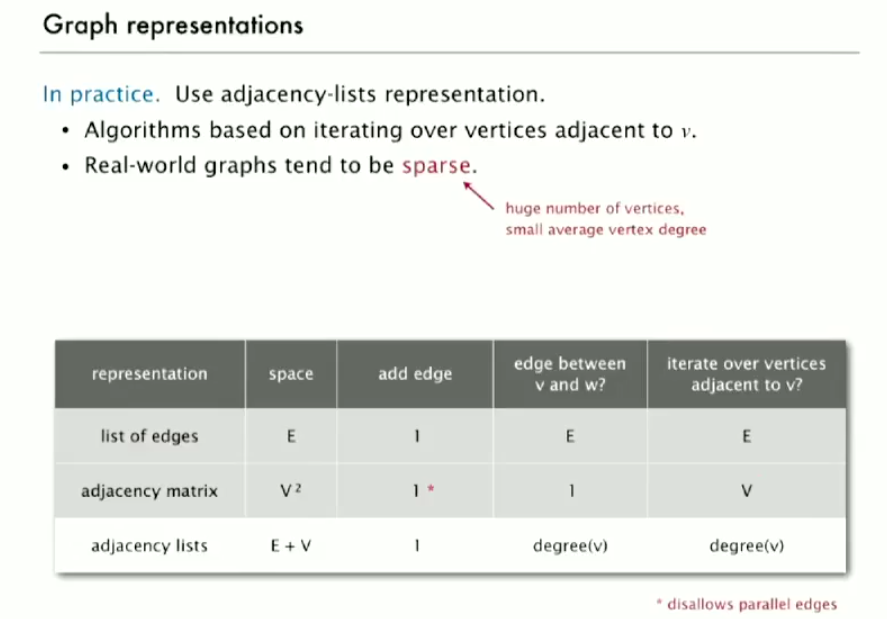

# 그래프

- 그래프
  - 엣지에 의해서 서로 연결된 점들의 집합
- 왜 그래프를 공부하는가?
  - 실제적인 적용
  - 많은 알고리즘이 알려져 있음
  - 재미있고 유용한 추상화
  - 컴퓨터 과학에서의 아주 핫한 분야
- 실제의 예
  - 단백질의 상호작용 분석
  - 인터넷 연결 분석
  - SNS 친구 관계

## 그래프 소개

### 그래프 용어

- 경로(Path)
  - 간선(edge)에 의해서 연결된 정점의 연속
  - 두 좌표 사이에 경로가 존재하면 두 정점 연결되었다고 함
- 회로(cycle)
  - 첫 정점(vertex)과 마지막 좌표가 같은 경로

### 그래프와 관련된 문제들

- 경로
  - 정점s와 t사이를 연결하는 경로는 존재하는가?
- 최단 경로
  - 정점s와 t사이를 연결하는 최단 경로는 무엇인가?
- 회로
  - 그래프에 회로가 존재하는가?
- 오일러 탐색
  - 모든 간선을 정확히 한 번만 사용해서 만들 수 있는 회로가 존재하는가?
- 헤밀턴 탐색
  - 모든 정점을 정확히 한 번만 사용해서 만들 수 있는 회로가 전재하는가?
- 연결
  - 모든 정점을 연결하는 방법이 존재하는가?
- MST(Minimum Spanning Tree)
  - 모든 정점을 연결하는 가장 최선의 방법은?
- Biconnectivity
  - 어떠한 정점이 삭제되면 그래프가 끊어지는 것이 존재하는가?
- Planarity
  - 간선과 간선이 교차되지 않는 그래프를 그릴 수 있는가?
- 그래프 동형사상(Isomorphism)
  - 두개의 인접 리스트는 같은 그래프를 나타내는가?
- 도전
  - 이러한 문제들은 쉬운가? / 어려운가? / 난이도를 알 수 없는가?

## 그래프 API

- 그래프 표현
  - 그래프 그림
    - 그래프 구조에 대한 직관을 제공
    - 그러나 직관은 때로 오해를 부름
  - 정점 표현
    - 강좌에서: 0 ~ V-1
    - 심볼테이블을 응용

그래프 API

```
public class Graph

Graph(int V) // V개의 정점을 갖는 그래프를 만듬
Graph(In in) // 주어진 입력을 바탕으로 그래프를 만듬
void addEdge(int v, int w) // v와 w사이에 간선을 만듬
Iterable<Integer> adj(int v) // 정점 v에 인접하는 정점을 전부 나타냄
int V() // 정점의 개수
int E() // 간선의 개수
string toString() // 문자열 표현
```

전형적인 그래프 프로세싱 코드

```java
// compute the degree of v
public static int degree(Graph G, int v)
{
  int degree = 0;
  for (int w : G.adj(v)) degree++;
  return degree
}

// maximum degree
public static int maxDegree(Graph G)
{
  int max = 0;
  for (int v = 0; v < G.V(); v++)
    if (degree(G, v) > max)
      max = degree(G, v);
  return max;
}

public static double averageDegree(Graph G)
{ return 2.0 * G.E() / G.V(); }

public static int numberOfSelfLoops(Graph G)
{
  int count = 0;
  for (int v = 0; v < G.V(); v++)
    for (int w : G.adj(v))
      if (v == w) count++;
  return count/2;
}
```

### 간선 집합 그래프 표현

- 간선의 리스트
- 인접 행렬
  - 2차원 배열로 나타냄
  - 정점 v-w가 연결되어있음
    - `adj[v][w] = adj[w][j] = true`
  - 엄청나게 정점이 많은 경우에 이용되지 않음
- 인접 리스트
  - 정점 인덱스 리스트의 배열
  - 가장 많이 쓰임
  - Bag오브젝트로 인접한 정점을 리스트로 관리
  - 현실의 그래프는 듬성듬성한 경우가 많기 때문

```java
public class Graph
{
  private final int V;
  private Bag<Integer>[] adj;

  public Graph(int V)
  {
    this.V = V;
    adj = (Bag<Integer>[]) new Bag[V];
    for (int v = 0; v < V; v++)
      adj[v] = new Bag<Integer>();
  }

  public void addEdge(int v, int w)
  {
    adj[v].add(w);
    adj[w].add(v);
  }

  public Iterable<Integer> adj(int v)
  { return adj[v]; }
}
```


