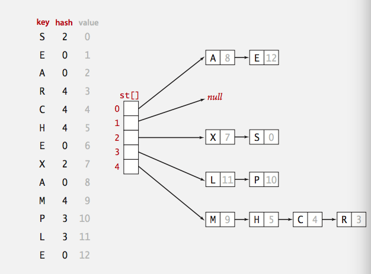

# Hash

심볼 테이블의 한 종류. 순서가 없으나, 삽입과 조회와 삭제가 정말 빠르다. `key-indexed table`에 데이터를 저장.

**해시 함수** 는 키(key)에대한 배열의 인덱스를 구하는 도구.

하지만 다음과 같은 문제도 존재:

- 해시 함수의 계산 문제: 애초에 해시 함수의 계산이 느리면 말짱도루묵
- 동등함 테스트: 두 키가 같은지 테스트
- 충돌 해결: 우연히 같은 배열의 인덱스가 되는 키값을 어떻게 처리할 것인가?

## 해시 함수의 계산

키 => 해시함수 => 테이블 인덱스

- 이상적인 목표: 키를 균등하게 움직여 테이블 인덱스를 생성한다.
  - 효율적으로 계산 가능
  - 각각의 테이블 인덱스는 각각의 키랑 대응

또한 키의 데이터 타입에 따라 다른 해시 함수의 접근 방식이 필요하다.

## Java의 해시 코드 컨벤션

- 모든 자바 클래스는 `hashCode()`메서드를 상속하고 이는 32비트 `int`를 반환한다.
  - c.f golang에서는 `uint64`를 반환.
- 최소한의 조건
  - `x.equals(y)`이면, `x.hashCode() == y.hashCode()`이어야 한다.
- 바람직한 조건
  - `!x.equals(y)`이면 `x.hashCode() != y.hashCode()`이다.
- 구현
  - 기본: `x`의 메모리 주소
  - 커스텀: `Integer, Double, String, File, URL, Date ...`

### Integers, booleans, doubles를 키로 갖는 해시의 구현(JAVA)

#### 정수형: Integer

```java
public final class Integer
{
  private final int value;
  ...

  public int hashCode()
  { return value; }
}
```

#### 소수점: Double

```java
public final class Double
{
  private final double value;
  ...

  public int hashCode()
  {
    long bits = doubleToLongBits(value);
    return (int) (bits ^ (bits >>> 32));
  }
}
```

#### 불린: boolean

```java
public final class Boolean
{
  private final boolean value;
  ...

  public int hashCode()
  {
    if (value) return 1231;
    else return 1237;
  }
}
```

### 문자열의 해시 구현

```java
public final class String
{
  private final char[] s;
  ...

  public int hashCode()
  {
    int hash = 0;
    for (int i = 0; i < length(); i++) {
      hash = s[i] + (31 * hash); // s[i]는 ascii값 또는 unicode의 code point
    }
    return hash;
  }
}
```

Q) 위의 함수의 경우, 만약 문자열이 매우 길어서 해시 함수의 타입 범위(int)를 벗어나면?
R) 8 ~ 9 개의 캐릭터를 일정한 간격으로 확인한다. 대신, url같이 아주 안좋은 충돌이 일어날 수 있다. 아니면 그냥 overflow를 냅두고 `(key.hashCode() & 0x7fffffff) % M;`을 계산해줄 수도 있다.

### 유저 정의 데이터 타입의 경우(다양한 타입의 혼재)

- 각각의 필드를 `31*x + y`룰로 결합하라
- 필드가 원시타입(integer나 boolean)의 경우는 그 타입을 `hashCode()`를 이용해서 래핑
- 필드가 null이면 0을 반환
- 필드가 참조(reference)타입이면 `hashCode()`를 사용하라.
- 필드가 배열이면 각각의 요소에 `hashCode()`를 적용하라(deepHashCode())

사실 이론상 모든 키는 비트 문자열로 나타낼 수 있으므로 일반적인 해시 함수가 존재 가능하다.

### Moduler 해싱

해시 코드는 자바의 경우 `int`이므로 -2^31 ~ 2^31-1 까지 가능하다.

해시 함수는 `int`범위 내의 M - 1 까지를 배열의 인덱스로 활용 가능하다. 여기서 M이란 `소수 혹은 2^n`

```java
private int hash(Key key)
{ return (key.hashCode() & 0x7fffffff) % M; }
```

### Uniform hashing assumption

- 각각의 키는 0 ~ M - 1사이의 정수에 동등하게 배치될 것이다.
- 통과 공: 공을 각각 임의로 M개의 통에 던진다.
- 생일 문제: 임의의 두개의 공이 처음으로 같은 통에 있게되는것은 확률적으로 `루트(파이 * M / 2)`번 던진 후 이다.
- 쿠폰 수집: 모든 통에 공이 적어도 하나이상은 들어가 있게되는 것은 확률적으로 `MlogM`번 던진 후이다.
- 부하 분산: M번의 던지는 행위 후, 가장 많은 공이 들어간 통은 `O(logM/loglogM)`개의 공을 갖고 있다.

## 충돌

- 두개의 다른 키가 같은 테이블 인덱스로 배정되는 것
  - 메모리가 비정상적으로 많은 경우가 아니면 피할 수 없음
  - 그러므로 충돌을 효율적으로 다뤄야 한다.

### 방법 1: Separate chaning

- 크기가 `M < N`인 연결 리스트를 사용
- API
  - 삽입
  - 참조
  - 삭제



```java
public Value get(Key key) {
  int i = hash(key);
  for (Node x = st[i]; x != null ; x = x.next ) {
    if (key.equals(k.key)) return (Value) x.val;
  }
  return null;
}

public void put(Key key) {
  int i = hash(key);
  for (Node x = st[i]; x != null ; x = x.next ) {
    if (key.equals(x.key)) {
      x.val = val;
      return;
    }
    st[i] = new Node(key, val, st[i]);
  }
}
```

- M이 너무 크면 너무 많은 빈 체인이 생김
- M이 너무 작으면 체인이 너무 길어짐
- 그러므로 M이 N/5에 가까워지게 선택하면 최적

### 방법 2: Linear probing

- 새로운 키의 테이블 인덱스가 충돌하면 다음으로 빈 칸을 찾아 그곳에 값을 저장한다.
- 배열의 크기 M은 반드시 저장하고자 하는 키-값의 페어의 수 보다 커야한다.
- API
  - 삽입
  - 참조
  - 삭제

```java
public class LinearProbingHashST<Key, Value>
{
  private int M = 30001;
  private Value[] vals = (Value[]) new Object[M];
  private Key[] keys = (Key[]) new Object[M];

  private int hash(Key key) {  }

  public void put(Key key, Value val)
  {
    int i;
    for (i = hash(key); keys[i] != null ; i = (i + 1) % M ) {
      if (keys[i].equals(key))
        break;

    keys[i] = key;
    vals[i] = val;
  }

  public Value get(Key key, Value val)
  {
    int i;
    for (i = hash(key); keys[i] != null ; i = (i + 1) % M )
      if (keys[i].equals(keys[i]))
        return vals[i];

    return null;
  }
}
```

- 연속적인 아이템의 블록이 생성될 수 있는데, 이를 **클러스터** 라고 한다.
- 새 키들의 테이블 인덱스는 이러한 클러스터의 중간에 처음 위치하게될 확률이 높아진다.
  - 수학적으로 `M`사이즈의 해시 테이블에 `M/2`개의 키가 들어 있으면 `3 / 2`번의 자리 옮김이 필요하다.
- M이 너무 크면 너무 많이 빈 배열이 생김
- M이 너무 작으면 탐색 시간이 커짐
- 그러므로 N/M이 `1/2`정도가 되도록 하는것이 최적

## 번외

- 해시 전쟁
  - 해시 함수의 논리적 약점을 이용함.
  - 공격자는 해시 함수를 분석해서 항상 같은 테이블 인덱스가 생성되는 키를 이용해서 시스템을 공격
  - 계속 같은 테이블 인덱스에 값이 쌓여서 효율 저하
- 한방향 해시 함수(one-way hash functions)
  - MD4, MD5, SHA-0, SHA-1, SHA-2, WHIRLPOOL, RIPEMD-160
  - 같은 테이블 인덱스(해시 값)을 갖는 두 키를 찾기 매우 어렵다.
  - 전자 서명, 메시지 다이제스트, 비밀번호 저장

## Separate chaning vs Linear probing

- Separate chaining
  - `delete`를 실현하기 쉬움
  - Performance degrades gracefully
  - Clustering less sensitive to poorly-designed hash function
- Linear probing
  - 공간을 효과적으로 사용
  - 보다 좋은 캐쉬 퍼포먼스

## 발전된 해시 형태

- Two-probe hashing: separate-chaining variant
  - 해시 테이블의 두 개의 인덱스를 구하고, 각각의 체인중에 더 짧은 곳에 값을 저장
  - 가장 긴 체인의 길이를 줄여주는 효과가 있음
- Double hashing: linear-probing variant
  - linear probing에서 테이블 인덱스를 하나 보다 크게 건너 뛴다.
  - 클러스터링을 없애는데에 효과적
  - 테이블이 거의 가득 차게 도와준다.
  - 삭제를 구현하기 더 힘들어짐
- Cuckoo hashing: linear-probing variant
  - 해시 테이블의 두 개의 인덱스를 구하고, 이미 값이 들어있는 인덱스가 아닌 곳에 넣는다. 그리고 재귀적으로 실행한다.
  - 최악의 경우라도 항상 `O(1)`이다.

## 해시 테이블 vs 균형 탐색 트리

### 해시 테이블

- 코딩하기 쉬움
- 순서가 없는 키에 대해서 다른 대안이 없음
- 간단한 키에 대해서는 매우 빠름
- 자바에서는 지원이 잘 됨(캐시 기능이 있어서 성능 최적화 되어있음)

### 균형 탐색 트리

- 성능 보장이 확실함
- ordered ST operation 지원
- `compareTo()`가 `equals()`보다 코드하기 쉽다.
