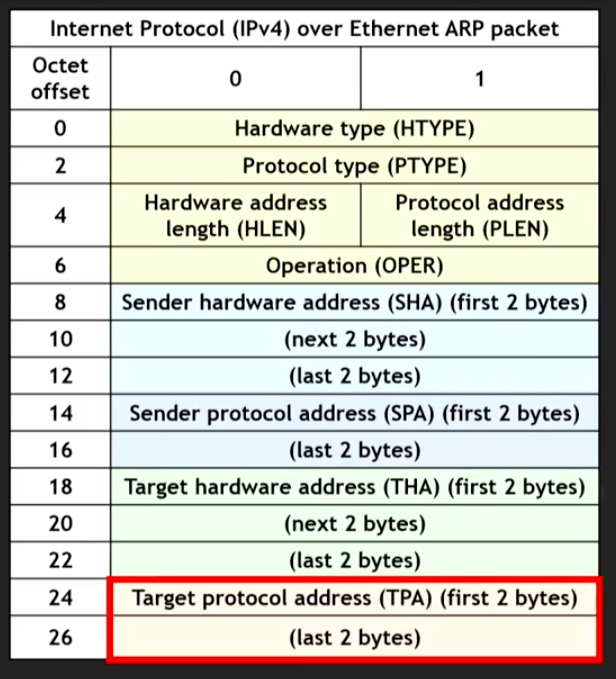

# Internet Routing & Function

## 게이트웨이 vs 라우터

- 게이트웨이
  - 컴퓨터 네트워크에서 서로 다른 통신망, 프로토콜을 사용하는 네트워크 간의 통신을 가능하게 하는 컴퓨터나 소프트웨어를 두루 일컫는 용어
  - 다른 네트워크로 들어가는 입구 역할(네트워크 포인트)
  - **개념**
- 라우터(공유기)
  - 패킷의 위치를 추출하여 그 위치에 대한 최상의 경로를 지정하며 이 경로를 따라 데이터패킷을 다음 장치로 전향시키는 장치
  - **장비**

## IGP vs EGP

### IGP(Interior Gateway Protocol)

- 라우터가 AS(Autonomous System, 자치적 시스템) 안에 있는 라우팅 정보를 교환하기 위한 프로토콜
  - 회사 네트워크
  - 캠퍼스 네트워크
  - ISP(Internet Service Provider) 네트워크
- IGP 카테고리
  - LS(Link-State) 라우팅 프로토콜
  - DV(Distance-Vector) 라우팅 프로토콜
- IGP의 예
  - OSPF(Open Shortest Path First): 가장 많이 사용
  - RIP(Routing Information Protocol)
  - IS-IS(Intermediate System to Intermediate System)
  - EIGRP(Enhanced Interior Gateway Routing Protocol)

#### OSPF(Open Shortest Path First)

- 인터넷 상에서 가장 많이 사용되는 IGP 라우팅 프로토콜
- IPv4, IPv6 그리고 CIDR주소를 위한 라우팅 프로토콜
- 인터넷 게이트웨이나 라우터에 의해서 사용됨
- LSR(Link State Routing)알고리즘 사용

##### 동작

- 라우터가 LS(Link State)정보를 같은 AS 네트워크 안에 있는 다른 라우터로부터 얻음
- 네트워크 연결 맵(트리 구조)가 링크들의 비용 값을 포함해서 만들어짐
  - 트리의 루트노드는 내 노드(출발지 노드)가 됨
  - 거기서 부터 모든 다른 노드에게 가지를 뻗어나감
- LS 라우팅 알고리즘은 출발지 노드(루트 노드)에서 모든 다른 노드까지의 최단 거리 트리를 구하는데에 사용됨(루프를 제거)
  - SPT(Shortest Path Tree)는 가장 적은 코스트의 라우팅 경로를 **다익스트라 알고리즘**을 사용해서 구할 수 있음
- 게이트웨이/라우터는 SPT 라우팅 경로에 기반한 그들의 라우팅 테이블을 설정하고 갱신함
- 만일 네트워크에 변화가 감지되면 앞의 동작을 다시 반복

**다익스트라 최소비용 트리 알고리즘의 예시**

##### OSPF 링크 비용 요소

- 라우터의 거리
- RTT(Round-Trip Time)
- 목적지에 도착하기 위한 hop의 개수(routers/switches)
- 스루픗(throughput): 비트/s, 패킷/s
- availability
- reliability

##### OSPF 라우팅 타입

- IR(Internal Router)
  - 모든 라우팅 인터페이스가 같은 네트워크 구역에 포함됨
- ABR(Area Border Router)
  - 서브 구역 네트워크를 핵심 네트워크에 연결함
- BR(Backbone Router)
  - 핵심 네트워크를 연결함
- ASBR(Autonomous System Boundary Router)
  - 여러가지 라우팅 프로토콜을 사용하여 AS사이를 연결해줌

라우터는 다양한 역할을 갖을 수 있음

#### MOSPF(Multicast Open Shortest Path First)

- 멀티캐스트 라우팅(multicast routing)을 지원하기 위한 OSPF 확장
- 그룹 멤버십 정보를 멀티캐스트 라우딩 경로 설정에 라우터들이 사용할 수 있도록 공유함
- 대체 멀티캐스팅 체계는 다음을 포함:
  - OSPF + PIM(Protocol Independent Multicast)

#### OSPF Subdivided Networks

- 운영과 제어 요건에 기반한 분리
  - 운영의 단순화
  - 트래픽과 자원 사용의 최적화
  - 보안 강화
  - 빠른 라우팅 갱신
- 서브 구역 네트워크와 핵심 네트워크를 생성하는 네트워크 서브 분리(Subdividing)

#### OSPF-TE(Traffic Engineering)

- 들어오는 노드에서 나가는 노드로 부터까지의 IP 패킷의 라우팅 제어의 TE QoS(Quality of Service)
- TE는 에러와 실패로 인한 서비스 장애를 최소화 함
  - 신뢰성 증가
- TE는 인터넷 트래픽의 성능 최적화를 위한 모델링, 묘사, 측정을 가능하게 함
- TE는 IP와 IP가 아닌(광학 네트워크) 네트워크에서 사용 가능

### EGP(Exterior Gateway Protocol)

- AS들 사이 혹은 외부의 라우팅 정보를 교환하기 위해 사용되는 프로토콜
- 라우팅 경로 선택은 다음에 기반한다:
  - 네트워크 정책들
  - 네트워크 관리자가 설정한 규칙
- 현재 인터넷은 BGP4(Border Gateway Protocol version 4)를 사용함(2006년부터)

### BGP(Border Gateway Protocol)

#### eBGP(external BGP)

- AS들 사이에서 사용되는 BGP 라우팅

#### iBGP(internal BGP)

- AS내부에서 사용되는 BGP 라우팅

#### BGP 보안

- BGP 라우팅은 보통 다른 ISP들에 속함
  - 각각의 라우터는 다른 암호화와 보안 정책을 사용할 수 있음
  - 라우터와 게이트웨이는 다른 ISP들에 의해서 제어되므로, 보안 셜합이 힘들 수 있음
  - 그래서 BGP 라우터는 서로의 설정과 갱신된 정보를 교환 해야함
    - 통합이 좋지 못하면, 보안적 취약점이 됨
  - 만일 서로 다른 암호화와 보안 설정이 사용되면, 인증과 사칭 BGP 메세지, 말웨어의 방어를 하기 어려워 질 수 있음

### ARP(Address Resolution Protocol)

- 논리적인 IP주소(인터넷 네트워크에서 유일한 호스트 주소)에서 물리적인 MAC주소(네트워크 속의 하드웨어 주소, 네트워크 카드/랜선)를 얻음
- IPv4/IPv6 주소를 장치의 DLL(Data Link Layer) 주소에 매핑함
  - IPv4주소 <=> 매핑 <=> 이더넷(IEEE 802.3) MAC(Medium Access Control)주소
- IPv6 네트워크는 NDP(Neighbor Discovery Protocol)를 ARP의 기능을 구현하기 위해서 사용
  - IPv6주소 <=> 매핑 <=> Wi-Fi(IEEE 802.11) MAC(Medium Access Control)주소
- RFC 826(1982)와 인터넷 표준 STD 37에 규정됨
- IANA(Internet Assigned Numbers Authority)가 ARP 인자 값을 관리

- 4계층에서 필요한 서비스 구분 번호는 애플리케이션 에서 입력
- 3계층에서 필요한 IP주소는 사용자가 통신하기 위해서 디바이스에 입력
- 2계층에서는 따로 입력이 되지 않음 주소를 디바이스 스스로 결정해주어야 함
  - 논리적인 IP주소를 기반으로 물리적인 MAC주소로 바꾸어주는 주소해석 프로토콜
  - 목적지 IP주소가 같은 네트워크일 경우에는 해당 장비를 직접 찾는 Request 메시지를 브로드 캐스트로 보냄
    - 호스트 MAC주소를 직접 얻음
  - 다른 네트워크일 경우에는 직접 브로드캐스트를 보낼 수 없으니, 게이트웨이로 데이터를 전달하기 위해 게이트웨이 에게 요청을 보냄.
    - 그러므로 게이트웨이의 MAC주소를 얻게 됨

## NAT(Network Address Translation)

### 일대일(One-to-One) NAT

- 기본(Basic) NAT이라 불림
- 두개의 모순되게 주소를 할당받은 IP 네트워크를 서로 연결 가능하게 해줌
  - IPv6를 사용하는 회사 외부의 컴퓨터와 IPX를 사용하는 회사 내부의 컴퓨터를 연결하게 해줌

### 일대다(One-to-Many) NAT

- IP Masquerading(변장)
- 하나의 공인 IP 주소 속에 숨겨진 IP 주소 공간(많은 사적 IP들이 존재)
- 장점
  - 보안 강화
  - IPv4 주소 절약

## RPC(Remote Procedure Call)

- 원격 컴퓨터에 존재하는 함수/프로시저를 실행할 수 있게 해주는 프로그램
- RPC는 그 함수가 로컬 환경 컴퓨터에서 동작하는 것과 같게 함
- 예측하지 못한 경우에 대비하는 장애 복구 절차가 필요
- 요청과 응답
  - 클라이언트는 원격 서버에게 요청 메시지(Request message)를 설정 인자와 함꼐 보내므로써 RPC를 시작함
  - 서버는 클라이언트에게 응답함

## FTP(File Transfer Protocol)

- 서버에서 클라이언트 컴퓨터로 파일을 옮기기 위한 프로토콜
- TCP/IP위에 동작하는 FTP를 1985년에 제정함
- FTP 접속 프로토콜은 보통 `username`과 `password`를 필요로함
- FTP와 TLS(Transport Layer Security) 보호인 FTPS가 주로 사용됨

### FTP 활성화(Active) 모드

- 클라이언트는 FTP 커맨드와 포트를 서버에 보내서 어떠한 포트를 클라이언트가 열어 놓았는지를 요청함
- 서버는 FTP 서버 데이터 포트(20)에서 클라이언트의 포트로 데이터를 보냄

### FTP 수동(Passive) 모드

- 클라이언트가 방화벽 뒤에 있거나, 서버로부터 받아들이는 TCP연결을 승낙할 수 없을 경우에 사용
  - 클라이언트는 PASV 커맨드를 서버에 보내서 제어 연결(control connection)을 사용함
  - 서버는 자신의 IP주소와 포트 번호를 보냄
  - 클라이언트는 데이터 연결 시도해서 임의의 포트를 통해, 서버의 IP 주소와 포트 번호와 연결함

FTP 활성화 모드, 수동 모드 둘다 IPv6를 지원

### FTP 데이터 전송 모드

#### Stream 모드

- 연속적인 흐름으로 데이터를 보낼 때 사용
- FTP는 최소한의 가공만

#### Block 모드

- FTP가 데이터를 블록으로 분할한 뒤 TCP연결을 통해서 전달

#### Compressed 모드

- 데이터 압축(run-length 암호화)을 적용

## E-mail

### POP3 vs IMAP

- 둘다 TCP/IP를 사용하는 이메일 회수 애플리케이션
- POP3(Post Office Protocol version 3)
  - 많은 확장을 갖고 있음
  - RFC 1939
- IMAP(Internet Message Access Protocol)
  - 많은 확장을 갖고 있음
  - 버전4
- TSL, STARTTLS, SSL을 이용한 암호화가 가능

#### POP3

- 단순한 구현
- 이메일을 서버에서 자신의 디바이스로 옮김

#### IMAP

- 다양한 이메일 디바이스로부터 서버에 존재하는 유저의 이메일 박스를 완전히 제어 가능
- 다양한 디바이스를 지원하므로 더 인기 있음
- 더 복잡한 쿼리
- 이메일이 지워지기 전까지 서버에 계속 남음

### SMTP

- 인터넷 이메일 프로토콜
- 문자 기반 TCP/IP 사용 프로토콜
- 서버들 사이에 이메일을 주고 받는데에 주로 사용

## VPN

- 인터넷 네트워크와 암호화 기술을 이용하여 논리적 사설 통신 시스템 구축
  - 원래는 물리적으로 같은 전용망으로 연결되어 있으나, 인터넷과 암호 기술을 이용해서 그것을 모방
- 원리
  - 하나의 라우터가 관장하는 서브넷의 모든 컴퓨터들은 사설 IP를 할당받고 각 장치사이는 사설IP로 통신
  - 라우터가 인터넷에 연결되면, 라우터를 이용해서 외부와 통신
  - 외부는 사설IP존재 모름
  - 공유기를 이용하여 VPN구축하면 이 공유기를 VPN서버 라고 할 수 있음
  - 서브넷의 외부의 컴퓨터가 공유기를 이용해서 구축한 VPN을 활용하면, 그 컴퓨터에서 오고 가는 모든 패킷은 공유기를 거치게 됨.
  - VPN에 접속한 컴퓨터가 보낸 패킷이 공유기로 전달된 후에, 공유기가 그 패킷을 다시 전달하는 시점에서는 사설IP를 이용하게 됨. 즉, VPN에 접속한 컴퓨터에 추가로 사설 IP를 할당
  - 그러므로 서브넷 속의 다른 물리적으로 연결된 컴퓨터와 통신 가능
  - VPN에 접속한 컴퓨터에서 인터넷에 보내는 패킷은 사설IP를 할당받은 컴퓨터가 인터넷과 통신하는 과정과 같으므로, 공유기가 인터넷에 전달하는 패킷은 공유기가 할당받은 공인 IP를 이용
  - **강한 익명성 보장(모든 통신 과정을 암호화)**
- 프로토콜
  - PPTP
  - L2TP
  - OpenVPN
  - SSTP
