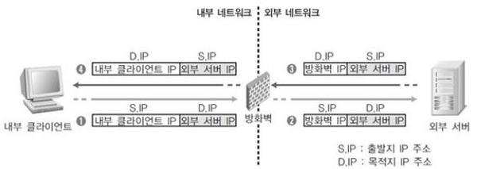
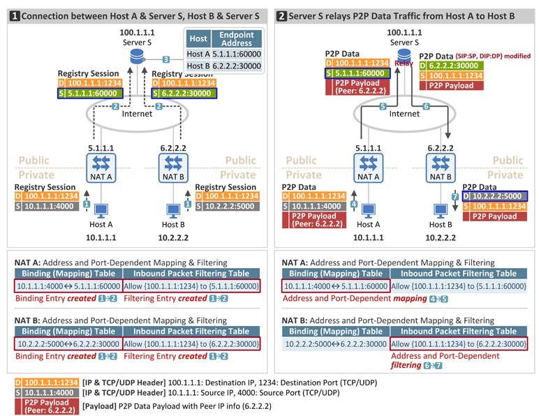
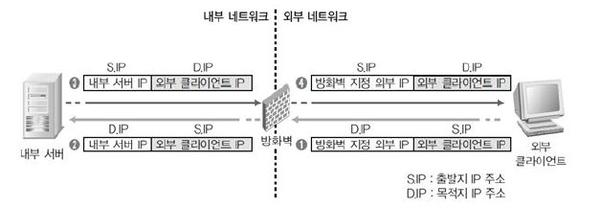

# NAT(Network Address Translation)

## 정의

- 클라이언트가 사설 IP로 설정되었을 경우, 서버로 부터 응답을 받게 해주기 위한 주소변환 기술(사설 IP를 라우팅이 가능한 공인 IP로 변경)

## 필요성

- 공인 IP 부족 문제 해결
  - 서브넷 에서는 사설 IP이용, 외부 인터넷 접속시에는 사설 IP를 공인IP주소로 변환하여 사용
- 외부로 부터 내부망 보호
- ISP변경에 따른 내부 IP변경 최소화

## NAT 종류

### 1. Normal NAT(Port NAT) - N:1(N개의 사설 IP 주소: 1개의 공적 IP 주소)

- N개의 사설 IP를 하나의 공인 IP와 각각 다른 포트로 변환
- 포트 범위: 10000 ~ 60000
- 내부의 클라이언트가 서버로 서비스를 요구하는 경우, 전송된 패킷의 출발지 주소를 방화벽의 외부 IP로 설정하면, 서버의 응답은 방화벽으로 들어옴
- 방화벽은 내부 사설 클라이언트에서 전송된 패킷의 주소변환 정보를 갖고 서버로 보내온 응답을 해당 클라이언트에 전달

### 2. Reverse NAT(Static NAT) - 1:1(1개의 사설 IP 주소: 1개의 공적 IP 주소)

- 외부에서 내부 서브넷에 접속해야 하는 서버가 있는경우의 주소 변환
- 외부에서 지정된 공인 IP로 접속을 요구하면, 방화벽에서는 해당 공인 IP에 지정된 사설 IP로 패킷을 전달해 통신이 이루어짐

### 3. Redirect NAT

- 목적지 주소를 재 지정할 때 사용
- 서브넷 안의 웹 서버(192.168.10.100)의 장애가 발생하면 방화벽에서 여분의 서버(192.168.10.101)로 목적지를 변경
- 외부에서는 웹 서버의 공인 IP로 접속해 올 것이므로, 그것을 방화벽이 적절하게 리다이렉트 시켜줌

### 4. Exclude NAT

- 특정 목적지로 접속할 때 만 설정된 NAT를 적용 받지 않도록 할 때 사용
