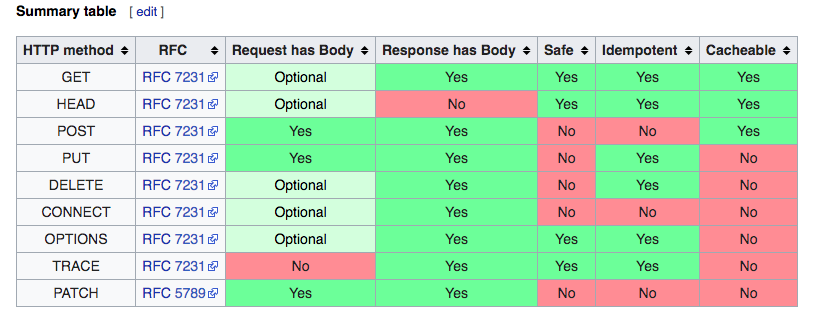

# HTTP vs HTTPS

- 의문
- HTTP
- HTTPS

## 의문

- *TLS의 경우에는 Transport Layer TCP연결의 3-way-handshake가 끝나고 또 handshake를 하는 것인가?*
  - 그렇다.
  - 그렇다면 엄청 비효율적일 것 같은데, 왜 HTTP보다 더 빠르다는 건지?
    - 이것은 HTTP/2가 HTTP/1.1 보다 빠른데, HTTP/2는 HTTPS를 지원하는 환경에서만 지원하기 때문(웹 브라우저 기준)

## HTTP

- 정의
  - 분산, 협력, 하이퍼미디어 정보 시스템을 위한 애플리케이션 프로토콜
- 활용
  - WWW을 위한 데이터 커뮤니케이션의 기반
    - 하이퍼 링크를 포함하는 텍스트 문서 유서가 쉽게 접근할 수 있음
- 역사
  - 팀버너스리가 CERN에서 1989년에 개발
  - HTTP 표준은 IETF와 W3C가 협력해서 제정
  - RFC(Requests for Comments)에도 등재됨
  - HTTP/1.1
    - RFC 2068 in 1997
  - HTTP/2
    - 2015
  - HTTP/3
    - 2018
- 기술 개요
  - Client-Server 모델
    - client-server 컴퓨팅 모델에서의 request-response 프로토콜의 기능을 함
      - e.g
        - 클라이언트는 웹브라우저
        - 서버는 애플리케이션을 운영하는 컴퓨터 웹사이트 호스팅
    - request
      - 헤더
        - UA(User Agent)
          - 유저를 대표해서 행동하는 소프트웨어
          - 웹 브라우저
          - 웹 크롤러
          - 모바일 앱
      - 바디
    - response
      - request에 대한 status information
      - message body에 요청받은 내용
  - 특징
    - 중간 네트워크 요소를 허락
      - 캐시 서버
      - 웹브라우저 캐시
      - HTTP 프록시 서버
    - TCP프로토콜을 염두해 둔 디자인
      - 예외적인 경우 UDP를 사용할 수 있음
        - HTTPU
        - SSDP
    - HTTP 리소스들은 URL(URI를 사용해서)에 의해서 네트워크 상에 위치됨
  - 세션
    - HTTP 세션은 request-response 트랜젝션의 연속을 나타냄
      - 클라이언트는 서버의 특정 포트로 TCP 연결 시도
        - 서버는 해당 포트에서 클라이언트의 메시지를 대기
        - 서버는 메시지를 받으면 `HTTP/1.1 200 OK` 와 같은 메시지와 요청받은 리소스를 반환
    - Persistent connection
      - HTTP/1.1
        - keep-alive 매커니즘 적용
          - 다수의 리퀘스트에 커넥션 재사용가능
          - TCP 3-way-handshake로인한 레이턴시 줄여줌
        - 대역폭 최적화 개선
        - HTTP 파이프라이닝
          - 각각의 응답을 기다리기 전에 다수의 리퀘스트를 보냄
    - HTTP session state
      - HTTP는 stateless 프로토콜
        - HTTP 서버가 각 유저의 status를 저장하지 않음
      - HTTP cookies를 이용해서 state를 구현하는 경우도 있음
  - 인증
    - challenge(= Nounce, 질문)-response(answer)
      - basic access authentication
      - digest access authentication



  - 메시지 포맷
    - Request message
      - 구성
        - request line
          - `GET /images/logo.png HTTP/1.1`
        - request header fields
          - `Accept-Language: en`
          - `Content-Type: application/json`
        - empty line
        - message body
      - Request methods
        - 동일한 리소스에 대해서 바람직한 동작을 나타내기 위해서 HTTP 메서드를 정의
        - HTTP/1.1
          - GET
          - HEAD
            - 전체 리소스를 가져오지 않아도 리소스의 메타데이터를 참조 가능
          - OPTIONS
            - 특정 URL에 대해서 서버가 지원하는 HTTP methods를 반환
          - TRACE
          - POST
          - PUT
            - Idempotent(멱등) - 여러번 같은 리퀘스트를 보내도 서버는 같은 state를 갖음
          - DELETE
            - Idempotent(멱등)
          - PATCH
            - 리소스의 일부의 업데이트에 사용
          - CONNECT
    - Response message
      - 구성
        - response line
          - `HTTP/1.1 200 OK`
        - response header fields
          - `Content-Type: text/html`
        - empty line
        - message body
      - Status codes
        - 1XX
          - 정보
        - 2XX
          - 성공
        - 3XX
          - 리다이렉션
        - 4XX
          - 클라이언트 에러
        - 5XX
          - 서버 에러
  - 암호화된 연결
    - HTTPS
      - 가장 선호되는 방법
  - 세션 예시

Client request

```
GET / HTTP/1.1
Host: www.example.com
```

Server response

```
HTTP/1.1 200 OK
Date: Mon, 23 May 2005 22:38.34 GMT
Content-Type: text/html; charset=UTF-8
Content-Length: 138
Last-Modified: Wed, 08 Jan 2003 23:11:55 GMT
Server: Apache/1.3.3.7 (Unix) (Red-Hat/Linux)
ETag: "3f80f-1b6-3e1cb03b" >> 리퀘스트한 리소스의 캐시 버전이 서버의 현재 버전과 같은지 확인하기 위함
Accept-Ranges: bytes >> 클라이언트가 원하는 리소스의 특정 부분만 필요할 때 유효
Connection: close

<html>
  <head>
    <title>An Example Page</title>
  </head>
  <body>
    <p>Hello World, this is a very simple HTML document.</p>
  </body>
</html>
```

## HTTPS

- 정의
  - HTTP의 확장 안전한 커뮤니케이션을 하기 위해서 사용됨
  - communication protocol(HTTP)이 TLS를 사용해서 암호화됨
    - TLS 위의 HTTP
- 목적
  - 웹사이트 인증
  - 프라이버시 보호
  - 데이터의 integrity 보호
    - man-in-the-middle attack 회피
    - 공격자의 방해 없이 커뮤니케이션을 잘 하고 있다는 것을 보장
- 개요
  - 브라우저에게 트래픽 보호를 위한 추가 암호화 레이어인 SSL/TLS를 사용하도록 함
  - 서버의 certificate가 인증되면 커뮤니케이션 전체가 보호받음
  - cipher suites를 사용
  - TLS 위의 HTTP
    - 암호화
      - URL, query parameters, headers, cookies
      - 호스트 주소와 포트 번호는 TCP/IP 프로토콜 내용에 해당되므로, 그것은 노출됨
        - 그래서 보안적으로 데이터 크기나, 호스트 ip주소와 보트 번호 등은 추론 가능(내용은 못봄)
  - 웹 브라우저는 HTTPS 웹사이트를 브라우저에 이미 설치된 CA(Certificate Authorities)기반으로 어떻게 신뢰할지 알고있음
    - CA의 인증서들은 이렇게 신뢰되고 있음
  - 다음 조건을 전부 만족하면 유저는 웹사이트로의 HTTPS 커넥션을 신뢰할 수 있음
    - The user trusts that the browser software correctly implements HTTPS with correctly pre-installed certificate authorities.
    - The user trusts the certificate authority to vouch only for legitimate websites.
    - The website provides a valid certificate, which means it was signed by a trusted authority.
    - The certificate correctly identifies the website
    - The user trusts that the protocol's encryption layer (SSL/TLS) is sufficiently secure against eavesdroppers.
- 활용
  - 안전하지 못한 네트워크에서 특히 중요(공공장소 와이파이 등)
    - 패킷 스니핑 반지
  - 개인정보 유출 방지에 중요
  - HTTP/2 지원
  - HTTP Strict Transport Security(HSTS)와 HTTPS를 같이 사용하는것을 추천
  - 서버 접근 관리의 용도로도 사용됨
    - 각 유저마다 certificate를 생성하고 필터링
- 보안
- 구현 방식
  - TLS 레이어는, request 전에 메시지를 암호화하거나, 메시지가 도착하면 복호화 하는 역할(Application 레이어와 TCP 레이어 사이)
  - 서버
    - 관리자가 웹 서버를 위한 공개 키 인증서를 작성해야 함
      - 해당 인증서는 브라우저가 갖고 있는 CA로부터 서명되어있어야 함
    - 웹 브라우저는 기본적으로 major CA 가 서명한 인증서 리스트를 분배받았고, 그 인증서들이 CA에 의해서 서명되었다는 것을 확인할 수 있음
    - 인증서의 획득
      - 상업적 CA가 존재하는데, Let's Encrypt 가 편리하게 인증서를 발급 / 갱신 할 수 있도록 도와줌
