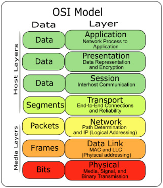

# 네트워크

## 의문

- *의문) Ethernet interface연결마다 nameserver를 바꿀 필요가 있는가? 애초에, default gateway가 DNS요청을 알아서 처리해주면 되지 않는가?*
  - 애초에 valid한 DNS는 어떻게 파악되는가? default gateway로부터 파악되는가?

## 개요

### 중요한 질문

- 그 데이터를 어디로 보낼 것인지 어떻게 알 수 있는가?(what)
  - Network
  - Datalink
- 받은 데이터가 무엇인지 어떻게 알 수 있는가?(where)
  - Application

## 네트워크 기본 개념

### 등장인물

- 호스트
  - 네트워크에 연결된 머신
- 라우터
  - 데이터를 하나의 네트워크에서 다른 네트워크로 이동시킬 수 있는 호스트

### 데이터

- 데이터
- 세그먼트
- 패킷
  - 구성
    - header
      - 발신지/목적지 호스트와 식별을 위한 정보를 포함
    - payload
      - 컴퓨터가 전송하기 원하는 실제 응용 데이터(e.g image, HTML)
- 프레임
- 비트

## 네트워크 계층



- Application layer
  - what에 관련된 레이어
  - 응용프로그램과 서버들이 통신하는 데 사용하는 "언어"를 포함
  - **HTTP의 경우는, TCP 연결이 된 후에, application layer에서 어떤 데이터를 어떤 형식으로 주고 받을지에 대한 프로토콜**
    - 클라이언트와 서버가 존재하여, 서로 Request, Response 형식으로 커뮤니케이션
    - Request
      - Req header
      - Req body
    - Response
      - Res header
      - Res body
  - *그렇다면 RPC의 경우, TCP 연결이 된 후에, 특정 데이터를 받을 경우, 원격에서 remote procedure를 호출하고 그 결과를 반환하는 프로토콜인가?*
    - RPC
      - 별도의 원격 제어를 위한 코딩 없이, 다른 주소 공간에서 함수나 프로시저를 실행할 수 있게 하는 **프로세스간 통신 기술**
- Transport layer
  - what에 관련된 레이어
  - End-to-End connection
  - Reliability
- Network layer
  - where에 관련된 레이어
  - 패킷을 옮기는 방법 정의
    - IP(Internet Protocol)
  - Path determination
  - Logical Address
- Datalink layer
  - where에 관련된 레이어
- Physical layer
  - how에 관련된 레이어

### Network layer

서브넷 예시


- 인터넷의 연결 형태는 분산되어 있음
  - **서브넷** 이라고 불리는 좀 더 작은 네트워크들로 구성
  - 모든 서브넷들은 상호 연결되어 있음
  - LAN은 단일 서브넷
- 라우터(게이트웨어)
  - 하나 이상의 서브넷과 연결된 호스트로, 데이터를 하나의 서브넷에서 다른 서브넷으로 전송 가능
  - 기본적으로 라우터는 근거리 서브넷과 인터넷으로 연결되는 링크 주소(uplink address) 두가지 주소를 갖음
- 한 호스트가 다른 호스트와 통신하기 위해서는 다른 호스트의 IP 주소를 알아야 함

### 컴퓨터의 IP 주소 검색

- 하나의 호스트가 여러 IP 주소를 가질 수 있음
- `ifconfig(interface configuration)`
  - 개요
    - Unix 계열의 운영체제에서 **네트워크 인터페이스 설정을 위한 관리 소프트웨어**
      - 하나의 호스트가 네트워크 별 여러 IP 주소를 가질 수 있음
      - 하나의 호스트가 네트워크 별 여러 MAC address를 가질 수 있음
    - 리눅스 머신상에 활성화 된 주소들을 보기 위한 커맨드
  - 용도
    - IP 주소 / netmask 세팅
    - 인터페이스의 enabling & disabling
    - MAC(medium access control) address의 변경

#### c.f) Mac OS의 ifconfig에서 나오는 네트워크의 예시

- `lo`
  - Loopback interface
- `en`
  - Ethernet, WIFI
- `p2p0`
  - Point to point link(VPN)
- `stf0`
  - Six to four
- `bridge0`
  - Software bridge between other interfaces
- `awdl0`
  - Apple Wireless Direct Link (Bluetooth) to iOS devicesx`

### 서브넷

- 개요
  - 일정 순서에 따르는 IP주소들을 가진 소흐트들로 연결된 그룹
  - 보통 호스트들은 물리적 네트워크 상에 존재
- 표현
  - `10.23.2.0/255.255.255.0` (Subnetmask)
  - `10.23.2.0/24` (CIDR)
- 정의
  - 네트워크 접두사
    - 서브넷에서 모든 주소들이 공통적으로 갖고 있는 부분
    - 위의 서브넷 예시 그림에서는 `10.23.2.0`
  - 서브넷 마스크
    - `255.255.255.0`

## 라우트와 커널 라우팅 테이블

리눅스 커널 라우팅 테이블(`route -n`) 예시


- 위의 라우팅 테이블 해석
  - 총 9개의 네트워크
- 참고
  - `ifconfig`
    - 해당 컴퓨터의 interface configuration
  - `route`
    - 해당 컴퓨터가 네트워크 커뮤니케이션을 하기 위한 서브넷에 대한 연결정보

---

- 배경(앞서 서브넷 예시에서)
  - 서브넷 내부의 호스트가 다른 서브넷 내부의 호스트와 연결하는 것은 직접적으로 가능
  - 인터넷상의 다른 호스트들에 도달하려면 `10.23.2.1`의 라우터를 통해 통신해야 함
- 리눅스 커널이 위의 배경에 해당하는 두가지 경우를 구별하는 방법
  - 라우팅 테이블(`route -n`)
    - Destination
      - 네트워크 접두사
    - Genmask
      - 그 네트워크에 해당하는 넷마스크
    - Gateway
      - Gateway 주소가 존재하는 경우 + Flags `G`
        - Destination/CIDR의 서브넷과 네트워크 통신을 하기 위해서는 데이터를 게이트웨이를 통해서 전송해야 함
      - Gateway 주소가 `0.0.0.0`
        - 서브넷과 직접 연결이 가능
  - 참고
    - 호스트가 특정 주소로 데이터를 보낼 때, route table 상에서 여러 서브넷 주소와 일치하면, 커널은 **일치하는 가장 긴 목적지 접두사를 선택함**
    - 예시
      - 위의 라우팅 테이블 예시에서, 만약 호스트가 `192.168.20.22`로 데이터를 보내려고 하면, `0.0.0.0/0`보다 더 긴 목적지 접두사를 가진 `192.168.20.0/24`로 데이터를 보냄

### Default gateway

- 개요
  - `0.0.0.0/0`을 담당하는 Gateway

## 기본 ICMP와 DNS툴

- ICMP(Internet Control Message Protocol)
  - 연결과 라우팅에 관한 문제 해결 서포트
- DNS(Domain Name Service)
  - 여러 이름들과 IP 주소를 연결시켜서 숫자로 된 많은 주소들을 기억할 필요가 없게 해줌

### Ping

- 개요
  - 가장 기본적인 네트워크 디버깅 툴중 하나
  - ICMP echo request 패킷을 호스트로 보내서, 송신 호스트로 패킷을 돌려 보내도록 수신 호스트에 요청
    - 수신 호스트가 패킷을 받고 이에 응답하도록 설정된다면, ICMP 에코 요청 패킷을 되돌려보냄
- 특징
  - `ping`을 하였을 때, 순차적으로 패킷이 다시 도달하는 것이 일반적으로 순차적으로 도달하나, 문제가 있는 경우, `icmp_req`의 값이 중간에 건너뛰는 경우가 발생
  - 보안 유지를 위해서 일부 호스트들은 ICMP echo request에 response를 하지 않음

### DNS와 host

- `host domain_name`
  - 도메인 네임에 대응되는 IPv4 주소 출력
- `host ip`
  - ip주소에 대응되는 호스트네임 출력
  - 도메인 관리자가 설정해주지 않는 경우가 많음

## 물리적 계층과 이더넷

- **인터넷은 소프트웨어 네트워크**
  - 하지만, 네트워크 계층은 일종의 하드웨어 위에 놓여야 함
- 이더넷의 특징
  - 이더넷 네트워크상의 모든 장치는 MAC(Media Access Control) 주소를 갖음 == hardware address
    - 호스트의 IP 주소와는 별개로, 호스트의 이더넷 네트워크 안에서 고유한 주소여야 함
    - 예시
      - `10:78:d2:eb:76:97`
  - 이더넷 네트워크상의 장치들은 **frame** 으로 메시지를 전송
    - source, dest mac address와 같은 메타 데이터를 포함
  - 이더넷은 단일 네트워크상의 하드웨어라는 범주를 벗어나지 않음
    - **한 호스트에 두 개의 다른 이더넷 네트워크를 갖고 있는데, 그 호스트가 두 개의 네트워크에 연결되어 있는 경우, 프레임을 하나의 이더넷 네트워크에서 다른 이더넷 네트워크로 직접 전송 불가능**
      - **단, 특별한 이더넷 브릿지를 설정하는 경우에 한하여 가능**
      - 따라서, 인터넷과 같이 더 높은 네트워크 계층이 필요함
    - 관례상 각각의 이더넷 네트워크는 보통의 인터넷 서브넷
    - 프레임이 물리적 네트워크를 떠날 수 없더라도, 라우터는 프레임 밖으로 데이터를 꺼내서 다시 포장하고, 이를 다른 물리적 네트워크상의 호스트로 전송 가능
      - 인터넷에서 일어나는 일
    - 참고
      - *도커의 경우에는 docker network로 브릿지 구성이 가능*

## 커널 네트워크 인터페이스에 대한 이해

- 개요
  - 물리적 계층과 인터넷 계층은 서로 연결이 되어야 함
    - **인터넷 계층이 하드웨어로부터 독립적인 융통성을 유지하도록 허용하는 방식을 채용**
- 리눅스 커널
  - 두 계층 사이에 경계를 유지하고 연결하기 위한, kernel network interface를 제공
  - 인터넷 쪽의 IP 주소 설정들을 물리적 장치상의 하드웨어와 연결 시킴
    - 네트워크 인터페이스는 `eth0`, `wlan0` 처럼 하드웨어들을 가리키는 이름을 갖음
- 참고
  - `ifconfig`
    - 일부 하드웨어 정보와 주로 인터페이스에 연결된 소프트웨어 계층을 검토하고 설정하기 위해 설계된 것임
  - `ethtool`
    - 이더넷 카드상의 세팅을 보여주거나 변경하기 위한 소프트웨어

## 네트워크 인터페이스 설정

리눅스 머신을 인터넷에 연결하기 위한 과정

1. 네트워크 하드웨어를 연결하고, 커널이 이를 위한 드라이버를 갖추고 있는지 확인. 드라이버가 존재하면, `ifconfig -a` 명령에서 하드웨어에 부합하는 커널 네트워크 인터페이스를 보여줌(*네트워크 드라이버가 존재하면 자동적으로 ifconfig에서 사용가능한 네트워크가 뜨는가? 그럼 IP나 MAC Address같은 정보는 어떻게 정해지는것인지?*)
2. 네트워크 이름 또는 비밀번호를 선택하는 등의 물리적 계층 설정을 추가적으로 수행(유선인 경우 필요가 없음)
3. IP 주소와 넷마스크를 커널 네트워크 인터페이스와 연결(bind) 해서 커널 장치 드라이버(물리적 계층)와 인터넷 서브시스템(인터넷 계층)이 서로 소통할 수 있게 해준다(*IP 주소와 Netmask를 그냥 자기 맘대로 설정할 수 없을텐데 어떻게 설정해서 연결하는지? DHCP?*)(`ifconfig`)
4. default gateway를 포함하여, 추가적으로 필요한 라우트 추가(`route`)

**위의 과정은 직접 자신의 컴퓨터에서 WIFI를 끄기전 `ifconfig`를 수행해보고, 끄고나서 `ifconfig`를 수행해보는 것으로 쉽게 파악이 가능하다(끄기 전에는 en0에 inet4, inet6 관련 데이터가 존재하나, 끄고나서는 사라짐)**

- IP 주소와 넷마스크 수동 설정
  - `ifconfig interface address netmask mask`
- Default gateway 설정
  - `route add default gw gw-address`
- Default gateway 설정 삭제
  - `route del -net default`
- 클라이언트들을 위해 가능하면 라우트를 간단하게 유지하는 것이 중요
  - 되도록 디폴트 라우터만 사용하게
  - *if, 다수의 서브넷이 필요하고, 그들간에 전송을 할 기능이 필요하다면, 라우터들로 하여금 각기 다른 로컬 서브넷들 간에 라우팅에 관한 모든 일을 담당하는 디폴트 게이트웨어로써 동작하도록 설정*
    - 무슨 소리인지?

## 부트 활성화 네트워크 설정

- `init` 프로세스 활용
  - 부팅 시간에 수동 설정을 실행하는 스크립트를 실행하게 하면 됨
    - 연속적인 부팅 이벤트 속에서 `ifconfig`, `route`같은 툴들을 실행

### 수동 네트워크 설정과 부트 활성화 네트워크 설정의 문제

- 개요
  - 현대의 네트워크들은 매우 역동적
    - 대부분의 머신들이 고정 IP 주소를 갖지 않음
    - **머신에 IP 주소와 다른 네트워크 정보를 저장하기보다, 머신이 그 네트워크에 처음 접속하게 될 때, 물리적인 로컬 네트워크상의 어딘가로부터 이런 정보를 받게 됨**
      - e.g) `route -n monitor`을 띄워놓고, wifi를 껐다가 켜보자
      - 대부분의 네트워크 클라이언트 응용프로그램들은 일단 동작하기만 하면, 머신이 사용하는 IP 주소를 신경쓰지 않음
      - **특히 DHCP 툴들은 일반적인 클라이언트에 기본적인 네트워크 계층 설정을 수행**
- 특징
  - 무선 네트워크는 설정을 위해 네트워크 이름, 인증, 암호화 기법 등 추가적인 요소들을 넣음
- 역동적 네트워크 시스템의 과제
  - 머신이 다수의 물리적 네트워크 인터페이스를 보유하고 있다면 어떤 것을 사용해야 할지 어떻게 결정하는가?
  - 머신은 물리적 네트워크 인터페이스를 어떻게 설정해야 하는가?
  - 일단 물리적 네트워크 인터페이스가 연결되면 머신은 인터넷 계층 같은 소프트웨어 네트워크 계층을 어떻게 설정해야 하는가?
  - 연결 옵션을 사용자가 선택할 수 있도록 허용하려면, 어떻게 해야 하는가? 사용자가 무선 네트워크를 선택하도록 어떻게 허용할 것인가?
  - 만약 네트워크 인터페이스에서 연결이 끊어진다면 머신은 어떻게 해야하는가?
- 위의 과제를 해결하기 위해서, 물리적 네트워크를 관찰할 수 있고, 사용자가 납득할 수 있는 규칙들을 근거로 커널 네트워크 인터페이스를 선택할 수 있는 시스템 서비스를 사용해야 함. 또한, 사용자가 원할 때, 설정을 바꿀 수 있고, 루트 사용자가 아니더라도 무선 네트워크를 변경할 수 있어야 함
  - **네트워크 설정 매니저 사용**

## Network Manager

- 개요
  - **시스템이 부팅할 때, 시작되는 데몬이며, 시스템과 사용자들이 보내는 이벤트들을 듣고, 여러 규칙들을 근거로 네트워크 설정을 변경**
- 동작
  - 사용 가능한 모든 네트워크 장치 정보를 수집하고, 연결에 관한 모든 목록을 검색하고, 이어서 한 가지를 활성화 하기로 결정
  - **e.g) 이더넷 인터페이스를 활성화 하는 방법**
    - 유선 연결이 가능하다면 이를 사용해서 연결을 시도 그렇지 않으면 무선 연결을 시도
    - 가능한 무선 네트워크 목록을 검색. 이미 전에 연결했던 네트워크가 사용 가능하다면 NetworkManager는 이를 다시 시도
    - 만약 이전에 연결한 적이 있는 무선 네트워크가 하나 이상이라면, 가장 최근에 연결한 것으로 선택
    - 연결이 성립되면, 연결이 끊어지거나 보다 나은 네트워크를 사용할 수 있게 되거나, 사용자가 강제로 변경하려고 할 때까지 이를 유지
- 특징
  - 부팅해서 고정적으로 동작하는 것이 아닌, 네트워크 접근마다 DNS, IP를 비롯한 각종 설정을 변경
- 종류
  - Linux: NetworkManager
  - Android: ConnectivityManager
  - 임베디드: Wicd

### Network Manager와 소통하기

- 의사소통 방법
  - 일반적으로 Desktop 상단 or 하단의 아이콘으로 상호작용 가능
  - 셸에서도 NetworkManager에 질문을 하고 제어 할 수 있는 몇 가지 툴들이 있음
    - `nm-tool` 명령
      - 현재 연결상태에 대해 빠르게 정리
    - `nmcli`
      - commandline에서 NetworkManager 제어
    - `nm-online`
      - 네트워크가 동작하는지 동작하지 않는지에 대해 알려줌

### Network Manager 설정

- `/etc/NetworkManager`
  - NetworkManager 설정 디렉터리
  - 설정 파일
    - `NetworkManager.conf`
- 특정 Interface는 NetworkInterface를 통해 관리하고 싶지 않을 경우가 존재
  - e.g) Loopback Interface
    - `NetworkManager.conf` 파일의 `ifupdown` 섹션에서 `managed`값을 false로 설정
- 네트워크 인터페이스가 활성화 또는 비활성화되었을 때를 위해서 추가적인 시스템 동작을 명시
  - 일부 네트워크 데몬은 정확하게 동작하기 위해서, 인터페이스를 듣기 시작할 때나 멈출 때를 알아야 함(e.g sshd)
  - `/etc/NetworkManager/dispatcher.d`에서 모든 것을 실행

## 호스트명 변환

- DNS를 사용하여 호스트명을 변환 하는 것

### 리눅스 시스템의 DNS 검색(축약 버전)

- 응용프로그램이 호스트명에 대한 IP 주소를 찾는 함수를 호출 > 해당 함수는 시스템의 공유 라이브러리에 존재
- 공유 라이브러리 상의 함수가 실행되면
  - `/etc/nss-witch.conf` 에 적혀있는 규칙들에 따라 검색 실행
    - e.g) DNS로 가기 전에 `/etc/hosts`파일을 확인
- 함수가 이름 검색을 위해 DNS를 사용하기로 결정하면, 추가 설정 파일을 참고로 하여 DNS 네임 서버를 찾음(네임 서버는 IP로 되어있음)
- 함수는 DNS 검색 요청을 네임 서버로 보냄
- 네임 서버는 호스트명에 대해 IP 주소로 응답하고, 함수는 이 IP 주소를 응용프로그램으로 반환

### `/etc/hosts`

- 개요
  - 호스트명 검색 무효화

`/etc/hosts`의 예시

```
127.0.0.1	localhost
255.255.255.255	broadcasthost
::1             localhost
# Added by Docker Desktop
# To allow the same kube context to work on the host and the container:
127.0.0.1 kubernetes.docker.internal
# End of section

# To resolve python socket.gethostnameby(socket.gethostname()) error problem
127.0.0.1 yeongyuminui-MacBookPro.local

192.168.10.51 Jira.vuno.local
192.168.10.51 kb.vuno.local
```

### `/etc/resolv.conf`

- 개요
  - DNS 서버의 전통적인 설정 파일

`/etc/resolv.conf`의 예시

```
nameserver 203.248.252.2
nameserver 164.124.101.2
```

- *의문) Ethernet interface연결마다 nameserver를 바꿀 필요가 있는가? 애초에, default gateway가 DNS요청을 알아서 처리해주면 되지 않는가?*

### 캐싱과 제로 구성 DNS

- intermediate daemon을 실행하여 네임 서버의 요청을 도중에 잡아서 가능하면 캐시에 저장된 response를 네임 서버 요청으로 반환
  - `dnsmasq`, `nscd` 데몬

### `/etc/nsswitch.conf`

- 개요
  - 사용자 정보와 비밀번호처럼 시스템상의 여러 가지 이름과 관련된 우선권 설정을 제어
