# Parallel Computing (Coursera course)

- 의문
- 개요
  - Parallel computing
  - why Parallel computing?
  - Parallel Programming vs Concurrent Programming
  - Parallelism Granularity
  - Classes of Parallel Computers
- Parallelism on the JVM1
- Parallelism on the JVM2

## 의문

## 개요

### Parallel computing

- 정의
  - 많은 계산이 동시에 이루어지는 computation의 한 종류
- 기본 원리
  - computation은 smaller subproblems로 나누어지고, 각각이 동시에 해결됨
- 전제
  - 병렬 computation을 지원하는 병렬 하드웨어가 존재해야 함
- 역사
  - Parallel computing은 초기 computing역사 부터 존재해왔음
  - IBM이 20세기에 첫 상업 parallel computer를 제작
  - power wall
    - 다중 CPU core의 시작

### 왜 Parallel computing?

- Parallel Computing은 sequential programming보다 훨씬 어려움
  - sequential computations을 parallel subcomputations으로 분리하는 것 자체가 매우 어렵고 심지어 불가능 할 때도 있음
  - 프로그램 자체가 올바르다는 것을 보증하기가 어려움(새로운 에러 타입 때문)
- **Speedup!!!**
  - 위와 같은 엄청난 복잡도를 감수하는 이유

### Parallel Programming vs Concurrent Programming

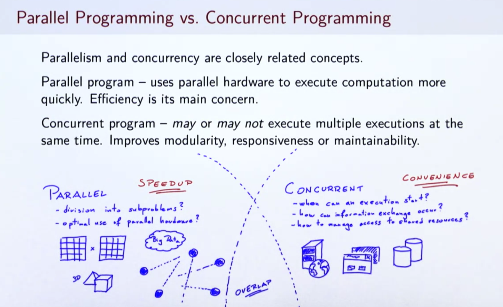

- Parallel program
  - 병렬 하드웨어를 사용하여 계산을 빨리 행하는 것이 주 목적(**Efficiency(speedup)**)
    - divisin into subproblems
    - optimal use of parallel hardware
  - 예시
    - matrix multiplication
    - data processing
    - computer graphics rengering
    - simulation of fluid movement
- Concurrent program
  - 동시에 많은 execution을 할 수도 있고 안할 수도 있음(**modularity, responsiveness(이건 무슨 의미일까), maintainability**)
    - when can an execution start
    - how can information exchange occur
    - how to manage access to shared resources
  - 예시
    - web servers
    - user interfaces
    - databases
- 두 개념의 관계
  - 두 개념은 서로에게 영감을 받기도 하고, 영향을 주고 받으나, 어느한쪽이 super set은 아님

### Parallelism *Granularity*

Parallelism granularity 1: bit-level

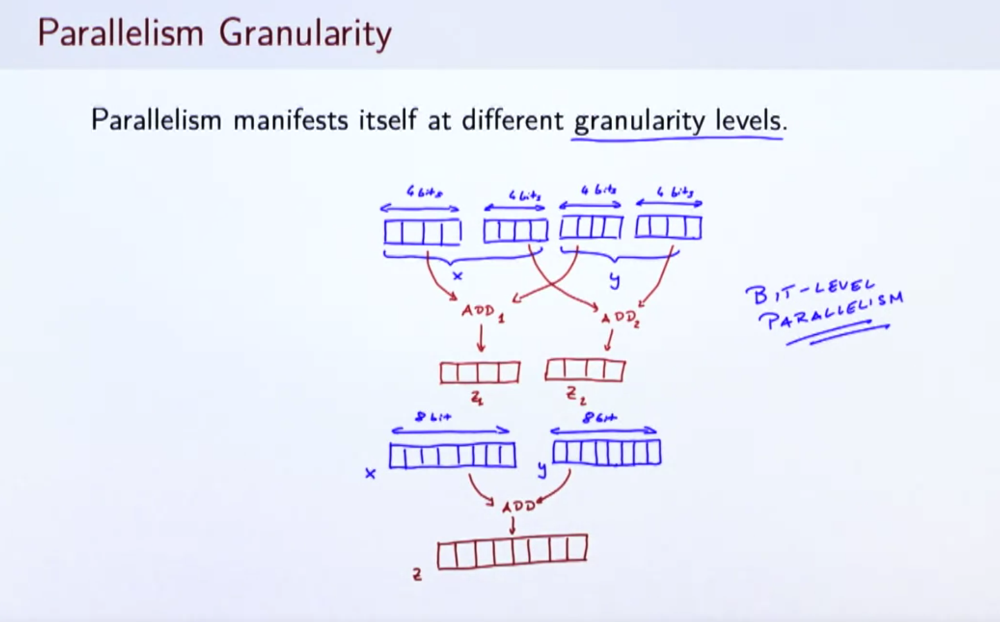

Parallelism granularity 2: instruction-level

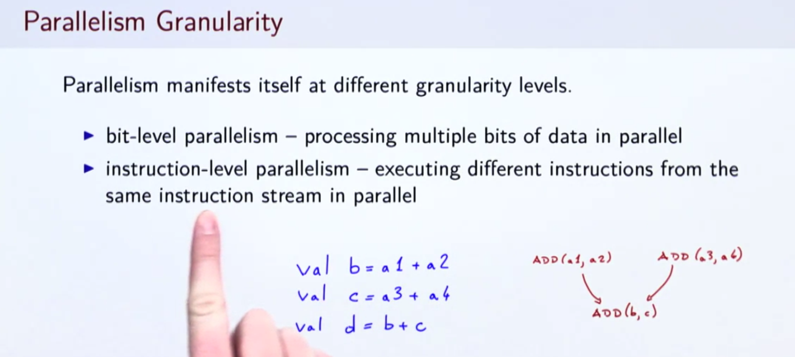

Parallelism granularity 3: task-level

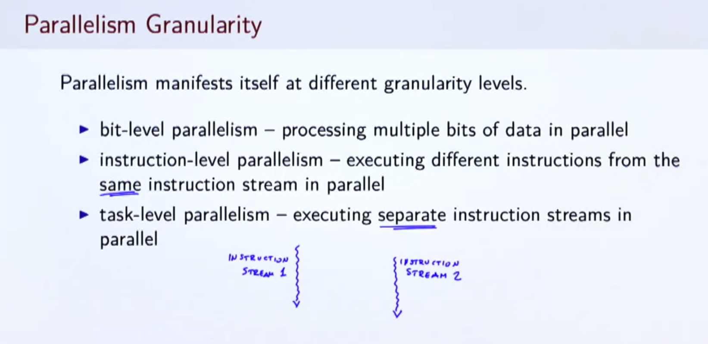

- 개요
  - Parallelism manifests itself at different granularity levels
- 종류
  - ① bit-level parallelism
    - processing multiple bits of data in parallel
  - ② instruction-level parallelism
    - executing different instructions from the same instruction stream in parallel
  - ③ task-level parallelism
    - executing separate instruction streams in parallel

### Classes of Parallel Computers

classes of parallel computers

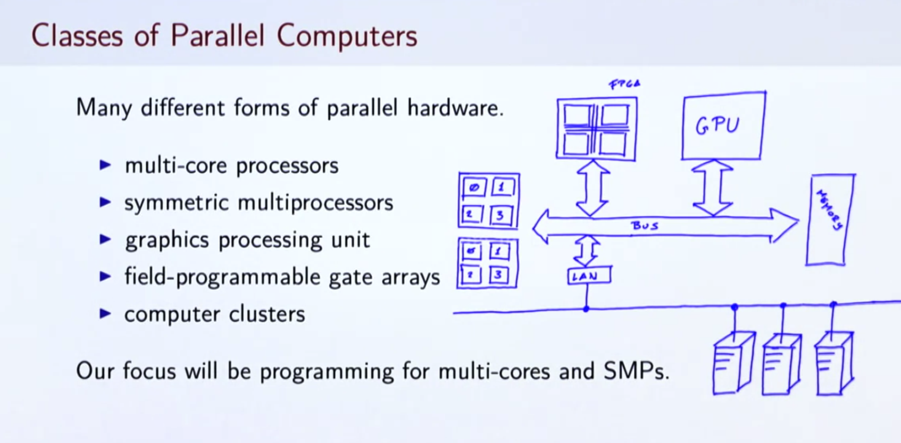

- multi-core processors
- symmetric multiprocessors(SMP)
  - 메모리를 공유하는 여러개의 동일한 프로세서이며, *버스* 로 이어져있음
    - *버스가 뭐지?*
  - multiple execution units는 같은 칩에 존재하지 않음
  - SMP 자체가 다중 코어 프로세서를 포함할 수 있음
- graphics processing unit(co-processor)
  - 호스트 프로세서로부터 요청이 있을 때, 계산에 참여
- field-programmable gate arrays(co-processor)
  - rewire itself for a given task
- computer clusters

## Parallelism on JVM1

### Processes

- OS
  - 개요
    - 하드웨어, 소프트웨어 자원을 관리하고, 프로그램 실행을 스케쥴링하는 소프트웨어
    - *multiplexes* many different processes and a limited number of CPUs 이므로, 실행의 time slice를 갖고, 이 매커니즘을 multitasking이라고 함
- Process
  - 개요
    - OS에서 실행되는 instance of a program
  - 같은 프로그램은 한 번 이상 혹은 동시에 같은 OS에서 실행될 수 있음
    - 실행될 때 마다, CPU의 실행 시간, 메모리 주소 공간, 파일 핸들러, net reports 등의 자원을 배속 받음
  - 각 프로세스는 PID라는 unique identifier를 할당받음
  - parallel programming의 관점에서
    - 하나의 프로세스는, *the most coarse-grained unit of coherency on a short term memory system* 임
  - **서로 다른 두 프로세스는 각자의 메모리를 직접적으로 접근할 수 없음(격리됨)**
    - 보안상의 이유
    - 대신 프로세스끼리 커뮤니케이션 하기도 힘듬

### Threads

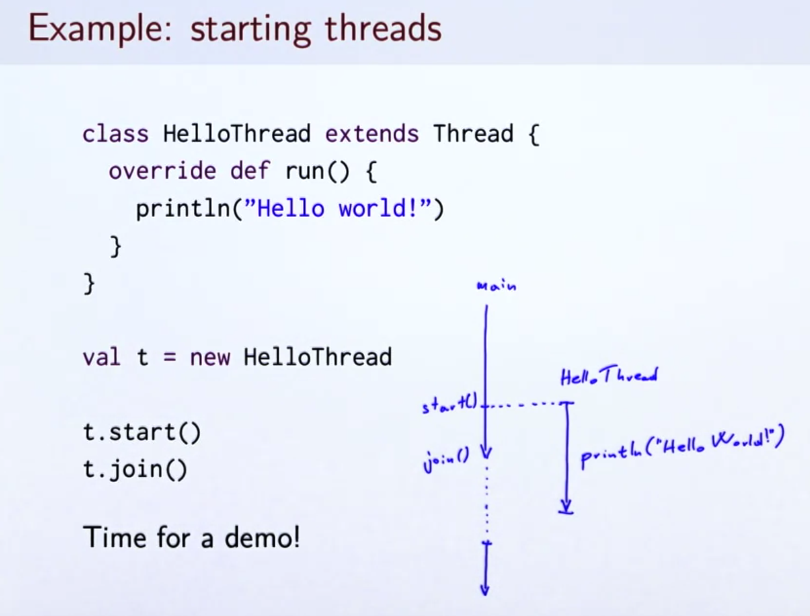

- 개요
  - 각 프로세스의 multiple independent concurrency unit(실행 흐름)
- 특징
  - 같은 프로그램에서 시작할 수 있고, 같은 메모리 공간을 공유함
  - 각 스레드는 program counter와 program stack을 갖음
- JVM과 thread
  - 스레드의 생성과 시작
    - 각 JVM 프로세스는 **main thread**와 함께 시작
      - sequential programming에서는 main thread하나만 존재
  - 추가 스레드 시작을 위해서 필요한 절차
    - ① Define a Thread subclass
    - ② Instantiate a new Thread object
    - ③ Call start on the Thread object

### Atomicity

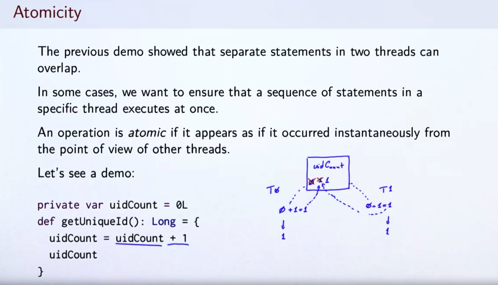

- operation is atomic
  - 다른 스레드의 관점에서 사실은 여러개의 operation이 하나의 operation인 것 마냥 동시에 동작하는 것 처럼 보일 때 위와 같이 표현
- synchronized block을 사용하여 atomicity를 달성
  - 특정 오브젝트 x에 대한 synchronized call이후의 code block는 두 스레드에 의해 동시에 실행되지 않음

## Parallelism on the JVM2

### Synhronized block

```scala
package example

object Hello {
  private val x = new AnyRef {}
  private var uidCount = 0L

  def getUniqueId(): Long = x.synchronized {
    uidCount = uidCount + 1
    uidCount
  }

  def startThread() = {
    val t = new Thread {
      override def run() {
        val uids = for (i <- 0 until 10) yield getUniqueId()
        println(uids)
      }
    }
    t.start()
    t
  }

  def main(args: Array[String]): Unit = {
    startThread() // Vector(11, 12, 13, 14, 15, 16, 17, 18, 19, 20)
    startThread() // Vector(1, 2, 3, 4, 5, 6, 7, 8, 9, 10)
  }
}
```

### Composition with the synchronized block

- nesting이 가능
- 아래의 예시에서 `global.synchronized` 블록을 사용하면 전체 시스템이 블로킹되므로 보다 정밀한 `synchronization`방법을 사용

```scala
class Account(private var amount: Int = 0) {
  def transfer(target: Account, n: Int) =
    this.synchronized {
      target.synchronized {
        this.amount -= n
        target.amount += n
      }
    }
}
```

### Deadlocks

- 개요
  - 두개나 그 이상의 스레드들이 monitor ownership과 같은 자원을 가지고 경쟁하며, 기존에 획득한 리소스를 release하지 않고 각각이 끝나기를 기다리는 고착 상태를 말함

Deadlock 해결법1

```scala
val uid = getUniqueUid()
private def lockAndTransfer(target: Account, n: Int) =
  this.synchronized {
    target.synchronized {
      this.amount -= n
      target.amount += n
    }
  }

def transfer(target: Account, n: Int) =
  if (this.uid < target.uid) this.lockAndTransfer(target, n)
  else target.lockAndTransfer(this, n)
```

- 해결
  - 자원의 획득을 항상 같은 순서대로 하는 방법
    - 자원에 대한 관계의 정렬을 가정

### Memory model

JVM memory model

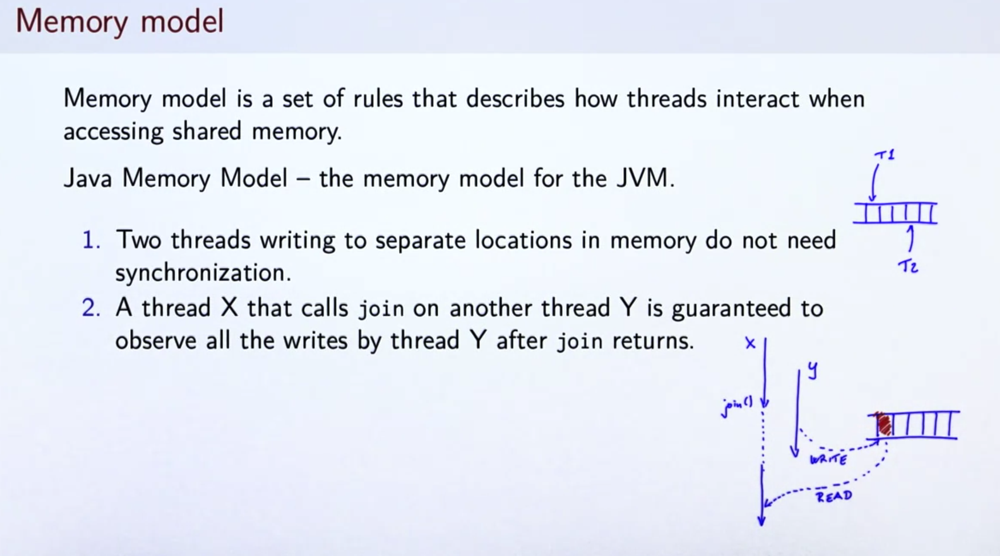

- 개요
  - shared memory를 접근할 때, 어떻게 스레드가 상호작용하는가에 관한 룰의 집합
- Java Memory Model
  - JVM의 메모리 모델(아래는 일부)
    - ① 메모리의 서로다른 장소에 작성하는 두 스레드는 synchronization이 필요 없음
    - ② 스레드 Y에 join을 호출하는 스레드 X는 `join`이 반환된 후, Y에 의한 모든 작성을 관찰할 수 있음

### Summary

- 이 코스에서 parallelism의 구현은 대개 다음의 개념으로 이루어짐
  - threads
  - synchronization primitives such as `synchronized`

## Running Computations in Parallel

### Basic parallel construct

p-norm split the sum into two

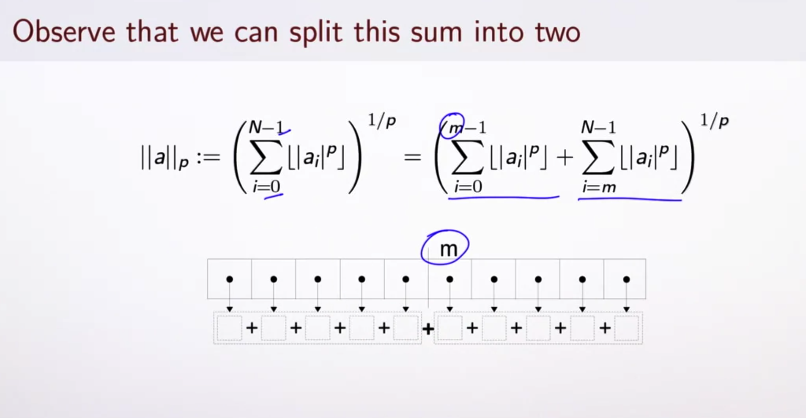

recursive algorithm for an unbounded unber of threads

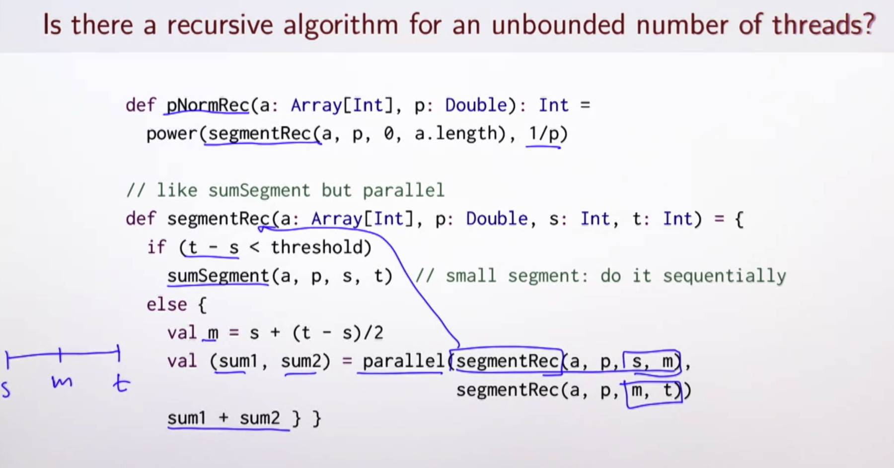

signature of parallel

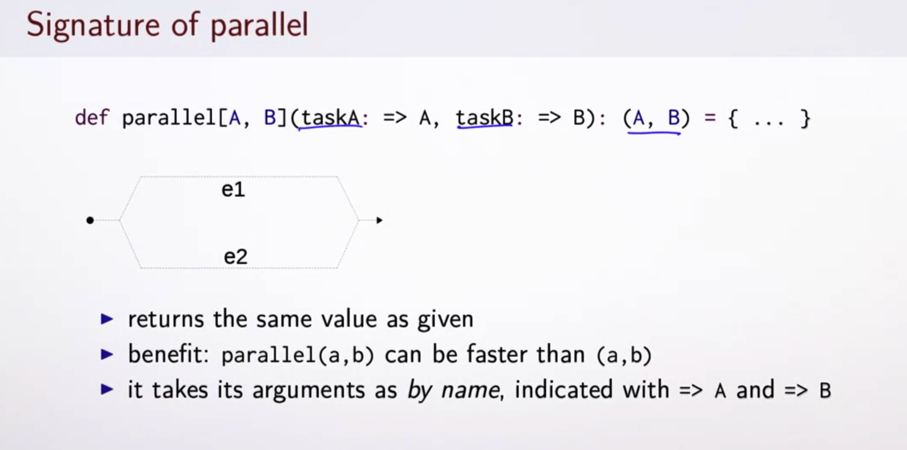

parallel is a control structure

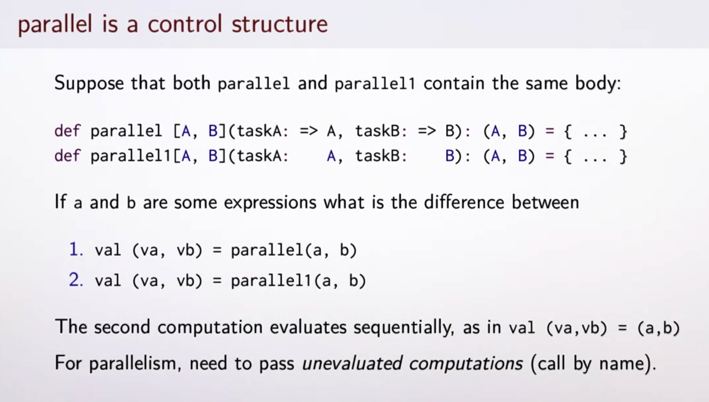

- 식 e1, e2가 주어졌을 때, 두 식을 병행으로 계산하고 결과의 페어를 반환한다고 가정
  - `parallel(e1, e2)` 사용
  - e.g) p-norm

### What happens inside a system when we use parallel?

- 효율적인 parallelism은 다음의 지원이 필요함
  - language and libraries
  - virtual machine
  - operating system
  - hardware
- `parallel` 구현의 한가지 예시(JVM thread를 사용)
  - OS thread와 연결하여 사용
  - OS는 멀티 코어에 서로다른 스레드를 스케쥴링 할 수 있음
- 충분한 자원만 제공된다면, parallel program은 더 빠르게 동작함

### Underlying Hardware Architecture Affects Performance

```scala
def sum1(a: Array[Int], p: Double, s: Int, t: Int): Int = {
  var i = s; var sum: Int = 0
  while (i < t) {
    sum = sum + a(i)
    i = i + 1
  }
  sum
}

val ((sum1, sum2), (sum3, sum4)) = parallel(
  parallel(sum1(a, p, 0, m1), sum1(a, p, m1, m2)),
  parallel(sum1(a, p, m2, m3), sum1(a, p, m3, a.length))
)
```

- 위의 코드를 실행하더라도 생각 보다 많은 speed up은 관찰되지 않음
  - **Memory is bottleneck**
    - 위의 코드 계산의 실행시간은, RAM에서 전체 array를 CPU로 가져오는 시간보다 무조건 많음
    - **결국, 멀티코어 뿐 아니라, compuation을 위한 다른 공유자원(메모리 등) 역시 생각해야 함**

## First-class Tasks

### More flexible construct for parallel computation

task를 이용한 parallel programming

```scala
val (v1, v2) = parallel(e1, e2)

val t1 = task(e1)
val t2 = task(e2)
val v1 = t1.join
val v2 = t2.join

t = task(e) // starts computation e "in the background"
```

- 위 코드 설명
  - t는 task, e를 계산
  - current computation은 t와 함께 병행젹으로 진행됨
  - e의 결과를 얻기 위하여 `t.join`을 사용
    - `t.join`은 result가 계산될 때 까지 blocking함
    - *만약 오류가 나서, 계산이 평생 마무리 되지 않는다면?*
  - `t.join`은 같은 결과를 빠르게 반환(병렬 처리를 했으므로)

### Task interface

```scala
// In terms of the value computed the equation task(e).join == e
def task(c: => A): Task[A]

trait Task[A] {
  def join: A
}

// we can omit writing .join
implicit def getJoin[T](x: Task[T]): T = x.join
```

Starting Four Tasks(p-norm)

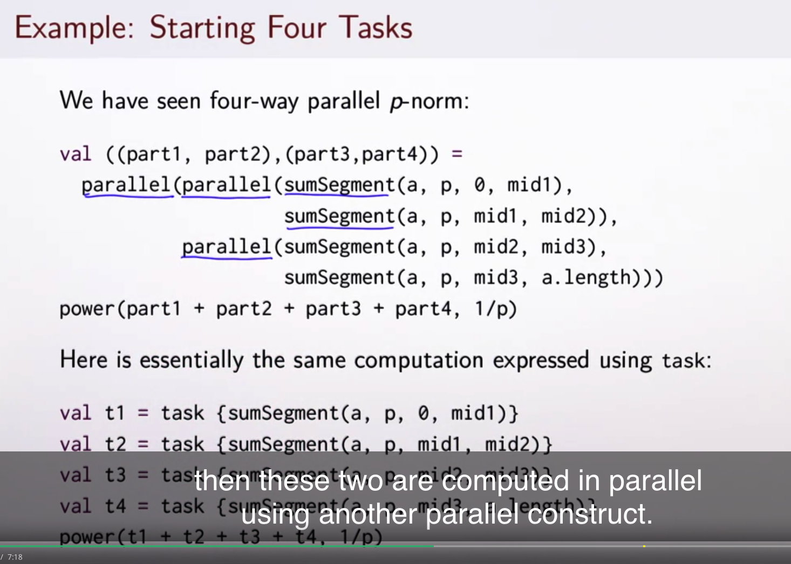

Parallel wrong example

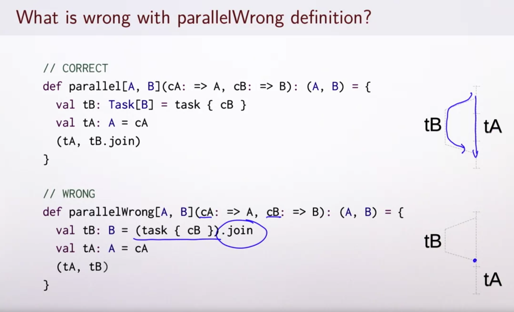

## How Fast are Parallel Programs?

### How long does our computation take?

- **Performance**
  - parallelism의 동기!!
- estimate하는 방법
  - 종류
    - empirical measurement(실증 측정)
    - asymptotic analysis(점근 해석 - big O notation)
      - input이 점차 커지는 경우
      - 하드웨어 parallelism이 가능한 경우에 특히 중요해짐
  - 관점
    - examine worst-case bounds

### Asymptotic analysis of sequential running time

- Big-O notation

Analysis of recursive functions1

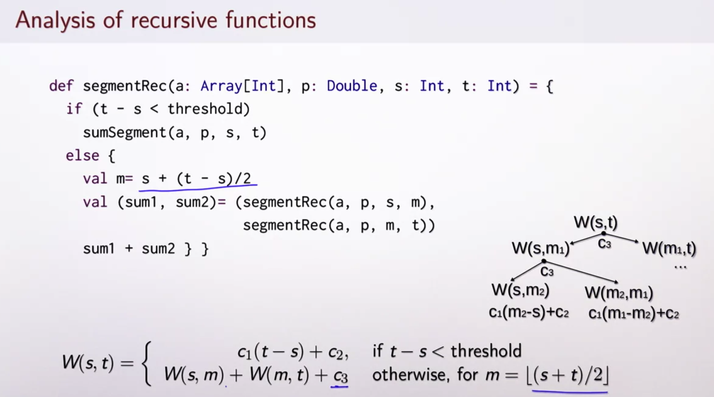

*Analysis of recursive functions2*

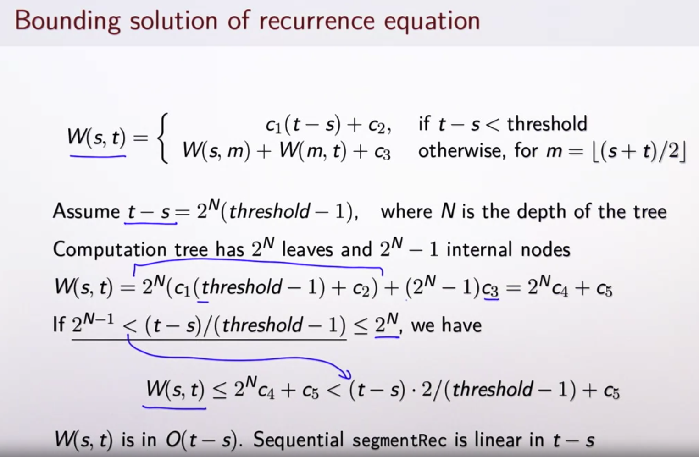

이해가 안돼서 다시 봐야 할듯

*Solving recurrence with unbounded parallelism*

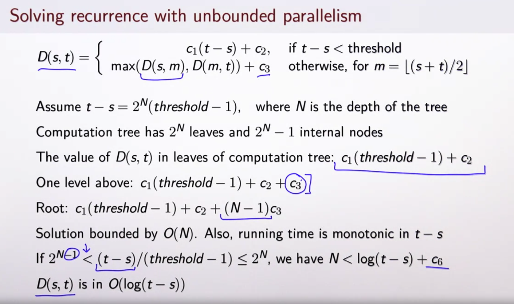

- imperative function
  - `O(t-s)`
- recursive function
  - `O(t-s)`
- unbounded parallelism
  - `O(log(t-s))`

### Work and Depth

- parallel code의 asymptotic complexity
  - 특징
    - 사용가능한 parallel resources에 의존
- Work(`W(e)`)
  - **parallelism이 없을 경우 e가 가져야 할 step의 숫자**
    - simple sequential execution time
- Depth(`D(e)`)
  - **unbounded parallelism을 가정할 경우, step의 숫자**
    - maximum of running times for arguments of parallel
- Rules for depth(span) and work(`D <= W`라고 가정)
  - depth and work when using parallel
    - `W(parallel(e1, e2)) = W(e1) + W(e2) + c2` (일 자체는 줄지 않음)
    - `D(parallel(e1, e2)) = max(D(e1), D(e2)) + c1` (병렬 처리를 가정하므로, depth는 가장 긴 친구만 고려)
  - depth and work when not using parallel
    - `W(f(e1, ..., en)) = W(e1) + ... + W(en) + W(f)(v1, ..., vn)` (함수 f의 인자로 들어가는 식 e1, ..., en을 평가하는 데에서나오는 work를 더하고 나서 f함수 실행에 대한 work를 더함 - call by value)
    - `D(f(e1, ..., en)) = D(e1) + ... + D(en) + D(f)(v1, ..., vn)`
      - `vi`는 `ei`의 값
      - 만약, `f`가 integer에 대한 primitive operation이라면, `W(f)`, `D(f)`는 `vi`에 상관 없이 상수

### Computing time bound for given parallelism

- 가정
  - `W(e)`, `D(e)`에 대해서 알고 있고, `P`개의 parallel thread가 존재
  - `P`에도 불구하고, `D(e)`보다 더 빨리 작업을 끝낼 순 없음(계산의 dependency 때문)
  - `D(e)`에도 불구하고, `W(e)/P`보다 더 빨리 끝낼 수 없음(모든 work는 다 끝나야 함)
- Running time
  - `D(e) + W(e)/P`
    - **depth에 의한 overhead + 병렬처리로 인한 계산량 분배로 인한 총 계산 시간 단축**
- W, D가 주어졌을 때, P에 의해서 프로그램이 어떻게 행동할 지 예측할 수 있음
  - `P`가 constant이나, input이 늘어날 때에는, sequential one과 같은 time complexity를 갖음
  - infinite resource(`P -> ∞`)에도 불구하고 `D(e)`에 의한 non-zero complexity를 갖음
- `segmentRec`의 결과
  - 분석
    - work W: `O(t-s)`
    - depth D: `O(log(t-s))`
  - Running time
    - `b1log(t-s) + b2 + (b3(t-s) + b4) / P`
      - P가 bounded인 경우: O(t-s)
        - constant에 따라서 sequential보다 빠르긴 할 것임
      - P가 상승하면, depth가 cost의 대부분을 차지하게 되고, running time이 `O(log(t-s))`이 될 것

### *Amdahl's Law*

- 두 부분의 sequential computation을 가정
  - part1: computation time의 `f` 만큼을 갖음(e.g 40%)
  - part2: computation time의 `1-f` 만큼을 갖음(e.g 60%) 그리고 속도를 향상 시킬 수 있음
- 만일, 우리가 part2를 2배 빠르게 한다면 총 speedup은
  - *`1/(f+(1-f)/P)`*
    - 왜지?
- part2를 무한히 스피드업 시켜도, 2.5배의 speed up만 가능
  - limit(P -> ∞)
