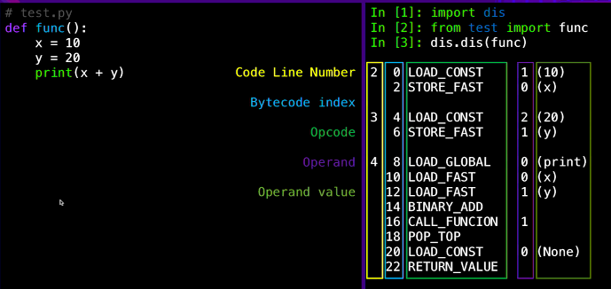
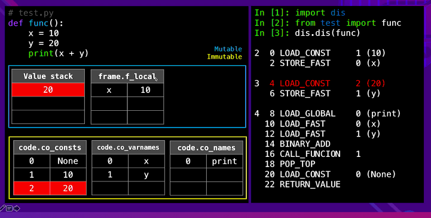

# 코루틴

- 의문
- 개요
  - 코루틴이란
  - subroutine과의 차이
  - thread와의 비교
  - generator와의 비교
  - mutual recursion과의 비교
- coroutine의 응용
- coroutine in python

## 의문

## 개요

### 코루틴이란

- *non-preemptive multitasking* 을 위한 subroutine의 일반화 버전의 컴퓨터 프로그램 컴포넌트
- 용도
  - cooperative tasks
  - *exceptions*
  - event loops(이벤트 루프를 코루틴에서 돌리고, 이벤트를 받으면 메인 함수로 이벤트와 함께 컨트롤을 돌림. 메인 작업이 끝나면 다시 이벤트 루프 코루틴에서 돌림)
  - iterators(특정 iterable의 하나의 원소들을 가져오면서 동작을 수행하고 그 수행이 끝나면 다음 원소로 넘어감)
  - infinite lists and pipes
    - infinite list의 데이터를 한번에 다 가져오는 것은 무한하므로 불가능한데, iterator에서 했던 것 처럼, 일부의 원소를 하나씩 coroutine에서 가져오도록 하고, 그것을 가지고 main 에서 작업을 하고 다시 coroutine에서 가져오도록 하는 방식으로 프로그램을 돌릴 수 있음
      - e.g) 개미수열의 예시

      ### 유용한 예시

      - consumer-producer 관계
        - 하나의 루틴이 아이템을 생성해서 큐에 넣는 역할을 담당
        - 나머지 하나의 루틴이 아이템을 큐의 아이템들을 제거하고 그것들을 사용
        - 효율성을 생각해서, 아이템들을 한번에 여러개를 넣거나 제거하는 것을 생각

```
var q := new queue

coroutine produce
  loop
    while q is not full
      create some new items
      add the items to q
    yield to consume

coroutine consume
  loop
    while q is not empty
      remove some items from q
      use the items
    yield to produce
```

### subroutine과의 차이

- subroutine은 coroutine의 special case
  - `yield`를 하지 못하는 coroutine
- 코루틴은 다른 코루틴들을 호출함으로 exit한 뒤에 나중에 다시 제어 흐름을 가져와서 동작할 수 있음
  - coroutine instance는 state를 유지하고 있음
- `yielding`으로 호출한다면 caller-callee의 관계가 아니라, 완전히 symmetric한 관계이다

### thread와의 비교

- 공통점
  - coroutine은 thread와 비슷
- 차이점
  - coroutine은 cooperatively multitasked, threads는 preemptively multitasked
    - cooperatively multitasked: context switch가 일어나지 않음. 현재 실행 흐름을 가지고 있는 쪽이 자주적으로 control을 yield함
    - preemptively multitasked: 컴퓨터 시스템이 임시적으로 context switch에 간섭함
    - 결국 coroutine은 concurrency이나 parallelism이 아님
  - coroutine은 coroutine간의 switching에 system call이나 blocking call을 포함하지 않음
    - mutexes나 semaphore를 사용할 이유가 없음. 따라서 os지원도 불필요

### generators과의 비교

- generator는 semicoroutine으로 불리고, coroutine의 부분집합
  - yield를 여러번 할 수 있고, suspending / re-entry를 여러 entry point에서 할 수 있다는 것은 동일
  - coroutine은 yield후 yield한 값을 가지고 즉각적으로 실행하는 장소를 컨트롤 할 수 있으나, generator는 그러지 못하고, 대신, control을 generator의 호출자로 이동시킴
    - 즉, generator는 주로 iterator의 작성을 간단화 하는 데에 사용되기 때문에 반환 값을 parent routine으로 넘겨줄 뿐
- generator을 사용해서 coroutine을 구현할 수 있음
  - top-level dispatcher routine(trampoline)이용
    - generator로 부터 받은 tokens을 가지고 control을 넘길 주체를 찾는 역할

```
var q := new queue

generator produce
  loop
    while q is not full
      create some new items
      add the items to q
    yield consume

generator consume
  loop
    while q is not empty
      remove some items from q
      use the items
    yield produce

subroutine dispatcher
  var d := new dictionary(generator -> iterator)
  d[produce] := start produce
  d[consume] := start consume
  // generator는 직접 coroutine호출을 못하니까, dispatcher가 top-level에서 control을 넘겨주는 역할을 함
  var current := produce
  loop
    current := next d[current]
```

### mutual recursion과의 비교

- coroutine을 state machines or concurrency 를 위해서 사용하는 것은 tail calls를 사용하는 mutual recursion과 유사함
- coroutine이 더 flexible하고 efficient함
  - `return`대신 `yield`하고, `restart`대신 `resume`하기 때문에, state를 가지고 있을 수 있고(변수와 execution point), yields는 tail poisition에 의존하지 않는다
  - coroutine은 state를 parameter로 건네줄 필요가 없음

## [coroutine의 응용](https://en.wikipedia.org/wiki/Coroutine)

- *State machine*
- Actor model
  - 각 actor는 각자의 procedures를 갖고 있으나, 그것들은 자원해서 control을 포기해서 central scheduler에게 컨트롤을 넘겨줌(cooperative multitasking)
- Generator
  - streams에 유용 - input/output - generic traversal of data structures
- Communicating sequential processes
- *Reverse communication*
  - mathematical software

## coroutine in python

### 개요

```py
import asyncio

async def coroutine1():
    # 1. 이벤트루프에서 첫번째 태스크인 coroutine1을 실행
    print('coro1 first entry point')
    # 2. 실행 시점이 이벤트루프로 복귀
    await asyncio.sleep(0.1)
    # 5. 1초 뒤 프린트
    print('coro1 second entry point')

async def coroutine2():
    # 3. 이벤트루프에서 두번째 태스크인 coroutine2를 실행
    print('coro2 first entry point')
    # 4. 실행 시점이 이벤트루프로 복귀
    await asyncio.sleep(0)
    # 6. 2초 뒤 프린트
    print('coro2 second entry point')

loop = asyncio.get_eveny_loop()
loop.create_task(coroutine1())
loop.create_task(coroutine2())
loop.run_forever()
```

위의 코드를 완전히 이해하는 것이 목표!

### Frame object

파이썬 바이트 코드의 이해1



파이썬 바이트 코드의 이해2



- 정의
  - 함수를 실행할 때 필요한 정보를 갖고 있는 오브젝트
- 특징
  - 함수를 실행되는데에 사용됨
  - Call stack
  - Value stack
  - Local variables
  - 마지막에 실행된 바이트코드의 인덱스가 존재
- 속성
  - `frame.f_locals`
    - 지역 변수의 상태를 나타냄
  - `frame.f_back`
    - 자신을 호출한 프레임을 가리킴
      - 자신이 실행하는 함수가 종료되면, `f_back`프레임으로 다시 돌아감
      - 스택 프레임들은 f_back들로 연결된 것임
    - 인터프리터 내부에는 `ThreadState`라는 오브젝트를 갖고 있는데, 이는 현재 실행하고 있는 프레임을 멤버로 가지고 있음
      - 따라서, 함수 내부에서 함수가 실행되면 새로운 프레임 객체가 만들어지고, 새롭게 생성된 frame의 f_back은 자신을 호출한 함수를 가리키고, `ThreadState`가 현재 실행중인 frame으로 갱신을 함
  - `frame.f_lasti`
    - 해당 함수가 가장 최근에 실행한 가장 최근에 실행한 바이트코드의 인덱스(위의 예시에서는 리턴 함수)
  - `frame.f_code`
    - 코드 객체(`== func.__code__`)
    - 속성
      - `func.__code__.co_code`
        - 함수의 바이트코드 바이너리(opcode, operand 등)
      - `func.__code__.co_consts`
        - 함수 내에서 사용된 상수들
      - `func.__code__.co_varnames`
        - 함수에서 사용된 지역변수 이름들
      - `func.__code__.co_names`
        - 함수내에서 사용된 전역변수 이름들

### 코루틴의 바이트 코드 이해

제너레이터의 이해

```py
def generator():
    recv = yield 1
    return recv

# 0 LOAD_CONST 1 (1)
# 2 YIELD_VALUE
# 4 STORE_FAST 0 (recv)

# 6 LOAD_FAST 0 (recv)
# 8 RETURN_VALUE

gen = generator()
gen.send(None) # 1
gen.send(2) # 2

gen = generator()
gen.send(None) # 1

lasti = gen.gi_frame.f_lasti
lasti # 2 -> YIELD_VALUE를 의미(어디까지 제너레이터가 진행되었는지)
```

- 코루틴
  - 특징
    - 제너레이터 기반
    - thread state와 유사하게, frame 오브젝트를 갖고 있음
    - frame 오브젝트
      - 코루틴이 어디까지 실행되었는지 알고 있음
      - 지역 변수들의 상태 저장(함수 일시정지 후 재개 가능)
- `yield from == await`
  - 기능
    - **제너레이터 내부에서 또 다른 제너레이터(subgenerator)를 사용하기 위함**
      - 따라서 코루틴을 이해하기 위해서는 제너레이터를 이해하는 것이 중요함
- `await`
  - 기능
    - **제너레이터 안에서 서브제너레이터를 실행하는 것과 거의 유사 ~ yield from**
- `send`함수의 내부
  - 스레드의 state를 가져옴
    - `PyThreadState *tstate = PyThreadState_GET();`
  - generator의 gi_frame을 가져옴
    - `PyFrameObject *f = gen->gi_frame;`
  - argument 처리를 해줌
    - `*(f->f_stacktop++) = result;`
    - 프레임의 value stack의 top에 argument를 넣어줌
      - 그래서 generator안으로 값을 넘겨줄 수 있었음
  - 스레드 state의 현재 실행중인 frame을 generator의 f_back으로 넘겨줌(콜스택)
    - `f->f_back = tstate->frame;`
      - generator의 실행이 끝나면 tstate의 frame으로 다시 돌아옴
  - **`result = PyEval_EvalFrameEx(f, exc);`**
    - 프레임을 실행하는 함수
    - 바이트의 OP코드는 이 함수 내부에서 실행됨
  - `Py_CLEAR(f->f_back);`

### Event Loop for non-preemptive multitasking

`asyncio.sleep()`에 대한 설명(완전히 같은 구현은 아님)

```py
async def sleep(delay, result=None, *, loop=None):
    if delay <= 0:
        await __sleep0()
        return result

    if loop is None:
        loop = events.get_event_loop()
    future = loop.create_future()
    # event loop에 delay이후에 set_result를 호출하도록 스케쥴링 함
    # future, result는 future.set_result의 파라미터로 들어감
    h = loop.call_later(delay, future.set_result, future, result)

    # await future은 yield from이며 send와 같음
    # Q) 이 send된 값은 어디에서 받고 있는가?
    return await future

# __sleep0의 내부구현
@types.coroutine
def __sleep0():
    yield

# Future의 내부구현
class Future:
    def __await__(self):
        if not self.done():
            # This tells task to wait for completion
            # self를 yield한 값을 어디에서 받고 있는가? -> Task객체
            yield self
        if not self.done()+
            raise RuntimeError("await wasn't used with future")
        return self.result()

    __iter__ = __await__ # yield from과 compatible하게 만들어줌


# Future를 래핑한 친구
class Task(Future):
    def _step(self):
        try:
            # coroutine을 직접 send
            # coroutine과 event loop에 관련된 부분은 대부분 이곳에 존재
            result = self.coro.send(None)
        except StopIteration as exc:
            self.set_result(exc.value)
        except Exception as exc:
            self.set_exception(exc)
        else:
            # e.g) asyncio.sleep(0)에서 yield만 했을 경우(== yield None)
            if result is None:
                # 다시 스케쥴링
                self._loop.call_soon(self._step)
            # 원래의 구현에서는 Future를 체크하는것이 아니라, 어떠한 flag값을 체크하는데, 이해에 큰 무리가 없음
            elif isinstance(result, Future):
                # Future자체에 self._step을 add_done 콜백으로 등록
                result.add_done_callback(self._step)

    def __init__(self, coro, *, loop=None):
        super().__init__(loop=loop)
        self._coro = coro
        self._loop.call_soon(self._step)


class Future:
    # Q) promise오브젝트의 then같은 느낌?
    def add_done_callback(self, fn):
        self._callbacks.append(fn)

    # Q) promise오브젝트의 resolve 함수 같은 느낌?
    def set_result(self, result):
        self._result = result
        self._state = _FINISHED
        # 바로 callback들을 실행하는 것이 아님
        self._schedule_callbacks()

    def _schedule_callbacks(self):
        callbacks = self._callbacks[:]
        if not callbacks:
            return

        self._callbacks[:] = []
        for callback in callbacks:
            # callback함수들을 이벤트루프에 스케쥴링함(태스크 큐에 삽입)
            self._loop.call_soon(callback, self)
```

- 태스크가 생성(create_task)
- 태스크의 `_stop`이 `call_soon`에 의하여 스케쥴링 됨
- `_stop`메서드에서 coroutine을 send
  - 헤당 코루틴 내부에 값이 없을 때, `_step`이 다시한 번 스케쥴링 됨
    - *근데, 그럼 무한루프가 되는 것이 아닌가?*
  - 값이 있는 경우에는, `_stop`을 `Future`의 add_done_callback에 넘겨줌
- 추후에 Future가 완료되어서 값이 `set_result`즉, 값이 세팅되면 해당 콜백들이 이벤트루프에 스케쥴링 됨

핸들 오브젝트(함수를 래핑한 친구)

```py
class Handle:
    def __init__(self, callback, args, loop):
        self._callback = callback
        self._args = args
        self._loop = loop

    # 넘겨주었던 callback을 실행함
    def _run(self):
        self._callback(*self._args)


class TimeHandle(Handle):
    def __init__(self, when, callback, args, loop):
        super().__init__(callback, args, loop)
        self._when = when

    # 비교연산자가 있기 때문에, 정렬이 가능
    def __gt__(self, other):
        return self._when > other._when
```

### Making Custom Event Loop

Custom Evevnt loop 만들기

```py
# nodejs의 event loop와 매우 유사
class CustomEventLoop(AbstractEventLoop):
    def __init__(self):
        # timer handle를 갖음(특정 시간이 되면 실행될 친구들을 갖고 있음)
        self._scheduled = []
        # 수행할 준비가 된 handle 오브젝트들이 존재
        self._ready = deque()

    def create_future(self):
        return Future(loop=self)

    def create_task(self, coro):
        return Task(coro, loop=self)

    def time(self):
        return time.monotonic()

    # just for not making exception
    def get_debug(self):
        pass

    def _timer_handle_cancelled(self, handle):
        pass

    # many other public functions
    def call_soon(self, callback, *args):
        handle = Handle(callback, args, self)
        self._ready.append(handle)
        return handle

    def call_later(self, delay, callback, *args):
        timer = self.call_at(self.time() + delay, callback, *args)
        return timer

    # Q) 애초에 근데, 어떻게, 지금 상황이 몇초가 지난것인지 알 수 있는지?
    def call_at(self, when, callback, *args):
        timer = TimerHandle(when, callback, args, self)
        heappush(self._scheduled, timer)
        return timer

    def run_forever(self):
        while True:
            self._run_once()

    def _run_once(self):
        while self._scheduled and self._scheduled[0]._when <= self.time():
            timer = heappop(self._scheduled)
            self._ready.append(timer)

        len_ready = len(self._ready)
        for _ in range(len_ready):
            handle = self._ready.popleft()
            handle._run()

        timeout = 0
        if self._scheduled and not self._ready:
            timeout = max(0, self._scheduled[0]._when - self.time())
        time.sleep(timeout)
```

- 한계
  - 위의 코드에서는 `timeout`이 0인경우 spinning(무한루프)
  - `timeout`이 무한대에 가까우면 Freezing
- **위의 한계를 극복하기 위하여 Selector를 도입**
- Selector
  - 기능
    - 운영체제의 polling함수를 설정할 수 있도록 만든 래핑 클래스
    - 각 운영체제마다 사용하는 poll이 다름
    - defualtselector는 운영체제에 맞는 selector를 가져옴

Selector 예시 코드

```py
import selectors
import socket

ssocket, csocket = socket.socketpair()
ssocket.setblocking(False)
csocket.setblocking(False)

selector = selectors.DefaultSelector()
selector.register(ssocket.fileno(), selectors.EVENT_READ)
selector.select(timeout=None) # wating here(blocking until a registered event comes)

ssocket.recv(1) # b'\0'


# from other threads
csocket.send(b'\0')
```

개선된 Custom Event Loop

```py
class CustomEventLoop(AbstractEventLoop):
    def __init__(self):
        self._scheduled = []
        self._ready = deque()
        self._selector = selectors.DefaultSelector()
        self._ssocket, self._csocket = socket.socketpair()
        self._ssocket.setblocking(False)
        self._csocket.setblocking(False)
        self._selector.register(self._ssocket.fileno(), selectors.EVENT_READ)

    def call_soon_threadsafe(self, callback, *args):
        handle = self.call_soon(callback, *args)
        self._csocket.send(b'\0')
        return handle

    ...

    def _run_once(self):
        while self._scheduled and self._scheduled[0]._when <= self.time():
            timer = heappop(self._scheduled)
            self._ready.append(timer)

        len_ready = len(self._ready)
        for _ in range(len_ready):
            handle = self._ready.popleft()
            handle._run()

        timeout = None
        if self._ready:
            # 바로 실행해야 하는 친구들이 있으면 실행
            timeout = 0
        elif self._scheduled:
            # 0번의 쨰와 현재 시간이 차 시간만큼 나중에 실행
            timeout = max(0, self._scheduled[0]._when - self.time())

        events = self._selector.select(timeout)
        if events:
            self._ssocket.recv(1)
```
