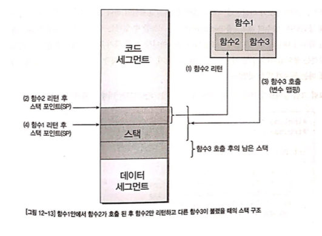
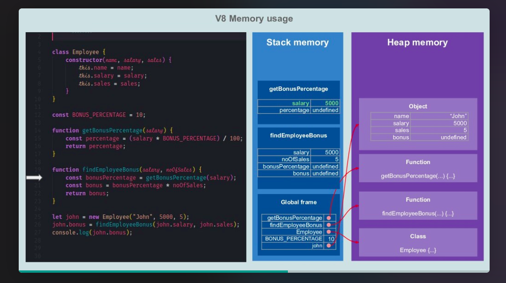

# 메모리 나누기 - 코드, 데이터, 스택, 힙

## 목차

- 용어 참고
- 개요
- 코드 및 데이터 세그먼트
  - 관심사의 분리
  - 컴퓨터의 시동과 exe파일 실행 흐름
- 스택 세그먼트
  - 지역변수 vs 전역변수
  - 함수와 메모리
  - 정리
- 힙 세그먼트

## 의문

- *함수의 경우 스택 세그먼트를 사용하면 되는데, 실행 흐름은 어떻게 관리되는가?*
- *Go언어의 Slice의 경우에는 어떤 세그먼트의 메모리를 사용하는가?*
  - array를 확장 시켜나가니, 그냥 stack인지?
  - 내장 구현이 struct로 되어있으니 heap?
    - 근데 struct라고 해도 모든 필드의 타입이 선언되어있으므로, stack?
- 클로저의 변수는 stack에 저장되는가? heap에 저장되는가? 클로저의 변수가 object일 때에는 어떻게 되는가?

## 용어 참고

- 펌웨어
  - 어떠한 장치의 하드웨어의 low-level 컨트롤을 제공하는 특정 컴퓨터 소프트웨어의 클래스
  - 주로 ROM이나 Flash memory에 저장됨
  - 몇몇 펌웨어는 한 번 설치되면 평생 바뀌지 않는데, 업데이트 되는 경우도 많다.
    - 업데이트 되는 경우에는, bug fix나 장치에 새로운 기능 추가 때문
  - 보안에도 신경써야 한다.
  - 예시
    - BIOS(Basic Input/Output System)
      - 매우 기본적인 기능만 수행
    - 임베디드 시스템에서의 펌웨어
      - 오직 해당 펌웨어만 실행이 되는 경우도 존재하며, 이 펌웨어가 장치의 모든 기능을 제공하는 역할 담당
      - 세탁기 프로그램
- BIOS(Basic Input/Output System)
  - 컴퓨터의 펌웨어
  - 부팅 전 하드웨어를 테스트(POST: Power On Self Test)하고 한 번 초기화 하여 사용을 준비
  - 소프트웨어와 하드웨어 간의 설정 및 정보 전달의 매개 역할
  - 지금은 UEFI(Unified Extensible Firmware Interface)를 사용
- UEFI(Unified Extensible Firmware Interface)
  - BIOS를 대체하는 펌웨어 규격
  - 바이오스 제약 사항 극복
  - 새로운 하드웨어를 더 유연하게 지원하기 위해서 개발
  - 부팅 프로그램 관리
- 부트스트랩
  - PC의 전원을 켠 후 OS를 시작할 때까지의 전체적인 흐름

## 개요

- 물리적으로 하나인 메모리를 프로그램상에서 논리적인 단위로 몇 가지 구분을 함
  - (코드 세그먼트, 데이터 세그먼트, 스택 세그먼트, 힙 세그먼트)
- 전역 변수 vs 지역 변수
  - 엑세스 범위
  - 라이프 사이클

## 1. 코드 및 데이터 세그먼트

- 변수 선언 = 메모리의 특정 부분을 컴파일러가 기억했다가 그 곳을 다른 용도로 사용치 않게 하는 것
  - 초기화 과정이 없으면 어떤 값이 들어있는지 아무도 모름
  - 일부 컴파일러는 선언만으로 0으로 초기화 하는 경우도 있음
- 초기화
  - 선언된 변수에 해당하는 메모리에 상수값을 대입
  - 예시
    - `mov byte ptr [ebp-4], 2Ch`

```c
#include "stdafx.h"
#include <stdio.h>

int global = 1;

int main(int argc, char* argv[])
{
  int local = 2;
  return 0;
}
```

- 위의 코드 분석
  - `global`이라는 변수는 컴파일 된 코드 안에 1로 초기화 된 것이 나타나지 않음
  - `local`이라는 변수는 컴파일 된 코드 안에 2로 초기화 된 것이 나타남
    - `mov byte ptr [ebp-4], 2`
- 메모리 분석
  - 메모리에는 글로벌 변수에 해당하는 메모리 주소의 값이 1로 초기화 되어있음
- 이유는?
  - global 변수가 데이터 세그먼트에 해당되는 변수이기 때문

### 관심사의 분리

- 프로그램이 사용하는 메모리도 관심사의 분리(세그먼테이션)가 중요
  - 방식
    - 특정 주소를 기준으로 그 주소의 전 메모리는 인스트럭션들만 작성
    - 그 후 메모리는 데이터를 작성
  - 특성
    - **일부러 메모리와 인스트럭션을 섞어서 쓸 수도 있다**
    - CPU는 오직 PC 레지스터가 가리키는 메모리 값을 읽어와 인스트럭션으로 취급하여 실행할 뿐
    - **논리적인 분리일 뿐.** 따라서, 프로그래머가 직접 나누어야 함

### 컴퓨터의 시동과 exe파일의 실행의 흐름


- 컴퓨터의 시동(컴퓨터를 동작시키면 `0x100`번지의 메모리부터 프로그램이 동작하도록 설정(PC = `0x100`). 이 위치에는 ROM BIOS가 위치함)
- 컴퓨터에서 직접 제공 기능
  - BIOS(Basic Input/Output System) / UEFI 프로그램의 동작
    - ROM BIOS
      - 요즈음은 플래시 메모리에 ROM BIOS 프로그램을 위치시킴
      - 지금은 UEFI라는것을 인텔에서 주로 쓴다고 함
    - POST 후
    - 설정된 부트 순서대로 부트로더를 시동
  - 부트로더의 시동
    - 부트로더란 운영체제(이하 OS)가 시동되기 이전에 미리 실행되면서 커널이 올바르게 시동되기 위해 필요한 모든 관련 작업을 마무리하고 최종적으로 운영 체제를 시동시키기 위한 목적을 가진 프로그램을 말한다.
    - BIOS로 부터 제어권 넘겨 받음
    - RAM 사용 가능하도록 초기화
    - root 파일 시스템 준비
    - RAM상에서 계속 실행
    - 하드웨어 초기화
    - 특정 운영체제 커널을 메모리에 올림
    - 제어권을 운영체제 커널에 넘겨줌
- 운영체제 별 기능
  - exe파일 실행
  - `LoadLibrary`라는 윈도우즈 API 함수 호출
    - 코드와 데이터 세그먼트의 내용이 함께 메모리로 복사됨
      - 데이터 세그먼트에 맵핑된 변수는 프로그램 이미지가 메모리로 로드되는 순간 함께 초기화 됨
      - 따로 코드 상에서 초기화 할 필요 없음
    - exe파일 안에는 데이터 세그먼트 내용 뿐 아니라 코드 세그먼트의 내용도 포함
      - 덩치 큰 OS를 탑재한 시스템
        - 메타 데이터적인 형태로 데이터 저장
        - 메모리를 로드하는 과정에서 메타 데이터를 해석해서 메모리상의 데이터 세그먼트 부분을 적절히 초기화
      - 임베디드 시스템
        - 바이너리 이미지(exe파일) = 실제 데이터 및 코드 세그먼트 전체
        - 코드와 데이터 세그먼트의 크기가 100kB이면, 실제 이미지 크기도 100kB

## 2. 스택 세그먼트

```
mov dword ptr [ebp-4],2
```

- local 변수는 왜 초기화 코드가 따로 있는가?
- local 변수는 ebp라는 레지스터를 통해 접근하는가? - 전역 변수는 명확한 메모리 주소로 접근

### 지역변수 vs 전역변수

- 전역변수
  - 액세스 범위
    - C코드 어느곳이든 접근 가능
  - 라이프 사이클
    - 프로그램이 실행되는 내내 그 값을 유지
- 지역변수
  - 액세스 범위
    - 함수 안에서만 접근 가능
  - 라이프 사이클
    - 함수의 실행이 끝나면 더이상 참조되어지지 않음
    - *클로저는?*
  - 함수마다의 독립성을 높이기 위해서 사용됨
  - 각 함수만의 고유 데이터 세그먼트를 따로 만들어서 할당하게 함

### 함수와 메모리

- 주어진 입력에 대해 적절한 처리를 해서 출력(리턴값)을 내보내는 단위
- 함수를 메모리 상에서 관리하는 법


- 방법1: 모든 함수를 데이터 세그먼트에 변수의 개수만큼 넣는 방식
  - 단점
    - 메모리 활용이 매우 비효율적임


- 방법2: 메모리 세그먼트에 함수가 호출할 떄만 메모리 공간을 확보하고 값을 리턴하면 메모리공간을 비워주는 방식
  - **함수가 내부적으로 사용하는 변수들은 함수가 호출되는 동안만 필요**
  - 따라서 함수가 호출되는 시점에서 변수를 위한 메모리 공간을 할당해주고, 함수가 리턴하는 시점에서 다시 회수하는 방식으로 메모리 절약
  - 함수마다 사용하는 변수 크기가 다른경우, 가장 많은 변수를 사용하는 함수를 기준으로 메모리 공간 확보하고, 해당 공간에 함수가 불릴 때마다 함수의 변수들을 맵핑해서 사용
  - 단점
    - 모든 함수가 동시에 불리지는 않지만, 여러개의 함수가 동시에 불리는 경우가 존재




- 방법3: 스택 세그먼트 사용
  - 공간의 시작 어드레스는 스택 포인터라는 특정한 레지스터에 기억
  - 함수가 호출되면 스택 포인터 기준으로 함수에 필요한 변수들의 메모리 크기 만큼 맵핑
    - 콜러(Caller)
      - 다른 함수를 호출한 함수
    - 콜리(Callee)
      - 호출 받은 함수
  - 콜리 함수가 리턴하면 단순히 스택 포인터를 해당 콜리 함수에 할당되어 있던 만큼 감소시키면 됨
    - 콜러가 먼저 리턴되는 경우는 없다
  - 장점
    - 동시에 여러 함수가 호출되어도, 서로의 변수 영역을 침범하지 않음
    - 메모리 절약
    - 재귀호출을 사용할 수 있음
      - 스택 오버플로우는 조심해야 함
        - 스택 세그먼트의 메모리 사이즈가 동시에 호출되는 함수들이 다 이용하지 못할 만큼 작아서 생기는 에러

재귀 호출의 예

```c
#include "stdafx.h"
#include <stdio.h>
#include <conio.h>

int RecCall(int nVal, int nUntil)
{
  int nSum;
  printf("Current Value : %d\n", nVal);
  if (nUntil == nVal) {
    nSum = nVal;
  } else {
    nSum = nVal + RecCall(nVal + 1, nUntil);
  }
  printf("Sum down to %d is %d\n", nVal, nSum);
  return nSum;
}

int main(int argc, char* argv[])
{
  int nSum = RecCall(0, 5);
  getch();
  printf("Total sum from 0 to 5 is %d\n", nSum);
  return 0;
}
```

- 스택 세그먼트의 크기를 어떻게 설정할까?
  - 1) 그냥 전체 메모리에서 미리 선점된 영역들과 Code segment, Data Segment를 제외한 모든 영역을 할당
    - 임베디드에서는 이런식으로 사용됨
    - 단점
      - 복잡한 OS의 경우, Heap영역도 고려해야 함
      - 가상 메모리도 고려해야 함
  - 2) 재귀함수의 스택까지 모두 고려한 메모리 배정
    - 단점
      - 생각보다 컴파일러가 알기 힘듬
  - 3) 경험적이고 막연한 값으로 결정
    - VC++ 에서는 1메가 바이트 정도
      - 링커 옵션에서 `/STACK`을 통하여 제어 가능
      - 1메가 바이트는 웬만한 프로그램으로는 충분히 큼

### 정리


- 전역 변수
  - Data Segment 이미지 안에 매핑
  - 프로그램이 종료되지 않는 이상 항상 같은 메모리 공간에 맵핑 & 그 주소로 접근 가능
- 지역 변수(스택에 저장된 데이터)
  - Stack Segment 동적 할당
    - 지역 변수의 할당은 동적이나, 스택 세그먼트의 크기는 컴파일 타임에 정해짐
  - ebp라는 레지스터를 매개로 지정
    - ebp는 SP(스택 포인터)
    - 컴파일 시점에는 변수들의 메모리 주소 모름
      - 함수 내의 변수들은 순서가 정해져 있으므로, 해당 변수가 맵핑된 시작 주소를 알면 상대적인 순서로 위치 알 수 있음
      - 시작 주소는 SP가 현재 가리키고 있는 주소
    - 스택 포인터에서부터 상대적인 거리를 이용해 변수를 접근
- stack segment
  - 멀티 스레딩 애플리케이션은 각 thread마다 stack을 갖고 있음
  - stack segment의 변수는 이미 정해져있고, finite하고 static(컴파일 타임에 이미 데이터의 크기가 정해짐)

## 힙 세그먼트


일반적인 OS에는 위와 같은 메모리 구조를 갖으나, 임베디드 시스템에서 어셈블리어로 간단한 애플리케이션을 만들경우, 굳이 스택, 데이터 세그먼트와 같은 세그먼트를 구분할 필요가 없음

C와 같은 고등언어의 경우에는 세그먼테이션을 컴파일러가 자동으로 해줌

### 문제제기 - 간이 워드프로세서 프로그램을 만들어보자

- 사용자가 입력하는 텍스트를 C언어에서 어떻게 추상화 할 것인가?
  - 글자 struct
    - `char character`
    - `int LineNo`
    - `int ColNo`
  - 텍스트
    - 방법 1
      - 위의 글자 struct를 전역 메모리에 배열로 선언
      - 문제
        - 배열의 크기가 이미 정해져있으므로 그 이상 타이핑을 할 수 없음
          - 그렇다고 너무 큰 공간을 할당할 수는 없음(비효율)
        - 글자를 삭제할 경우
          - 텍스트의 중간 글자를 삭제하면 그 뒤의 글자들을 다 1칸씩 배열의 뒤로 옮겨줘야 함
    - 방법 2
      - 배열이 아닌 링크드 리스트 활용(이때, `malloc`을 사용)
      - 힙 segment의 등장


### 힙 세그먼트

- 힙
  - 프로그램이 실행되면서 필요할 때마다 **동적으로 메모리를 할당** 할 수 있는 공간
  - 필요 예제
    - 얼마만큼의 데이터를 입력 받을 지 모르는 경우
    - 중간중간 데이터가 갱신되며 한정된 메모리 안에서 새로운 데이터를 사라진 데이터가 차지한 공간에 맵핑 시키는 작업
  - 하나의 프로세스안에서 여러 스레드가 힙을 공유
  - dynamic한 성질 때문에 다루기가 힘들고, 메모리 관리 문제가 발생하는 원인이 되는 경우가 많음. 그래서 **언어 자체에서 자동 메모리 관리 솔루션을 도입하는 경우가 많음**
  - 일반적으로 힙 세그먼트에 저장되는 데이터
    - global variables, reference types(objects, strings, maps, 다른 복잡한 데이터 타입)
  - 할당된 heap 영역보다 프로그램이 더 데이터를 많이 사용하면 `out of memory errors`가 발생
  - **보통 메모리 관리라고 하면, heap memory를 관리하는 것에 대한 것을 다룸**
- 힙 vs 스택
  - 스택은 엄밀한 의미에서 동적 할당이라고 할 수 없음
    - 실행하는 함수의 입장에서 생각
    - 프로그램을 작성하고 컴파일 하기 전에 이미 결정나는 정적 변수의 하나
  - 함수의 내부에서는 여전히 변수를 동적으로 할당할 수 없음
    - 키보드 입력을 받아서 그 때마다 새로운 글자를 위한 변수를 할당하려 해도 방법이 없음
- 힙의 동적 할당 방식(OS나 컴파일러에 따라 다름)
  - 프로그램 실행
  - 힙 공간 확보
    - 힙 세그먼트
    - 일반적으로는 하나만 생성
  - 프로그램에서 필요한 시점에 메모리를 할당하도록 적절한 함수를 불러줌
    - `malloc`
  - malloc이 호출되면 힙 공간을 보고, 남은 힙 공간중에 malloc 함수를 부를 때 인자로 넘어오는 할당 크기보다 조금 큰 연속된 공간이 존재하는지 탐색
  - 발견되면 확보된 공간의 가장 첫 부분에 할당된 메모리 관리에 필요한 모든 정보 저장
    - 메모리 헤더
      - 할당된 블록의 크기
      - 다음 힙 세그먼트의 시작 주소
      - 이전 힙 세그먼트의 시작 주소
  - 메모리 헤더 바로 다음 주소 리턴
  - 리턴된 주로를 포인터로 선언된 변수에 저장하고 그 뒤에 사용
  - 메모리의 동적인 해제
    - `free`


**C에는 다양한 동적 메모리 할당 함수가 존재. >> 책 내용 참조**

### Memory management

Mark & Sweep GC


- Memory management
  - Manual
    - 메모리를 할당하는 것과 free하는 것이 프로그래머의 손에 달려있음
      - `malloc, realloc, calloc, free`
  - Automatic
    - 현대 언어에서는 메모리 할당과 관련해서 자동적으로 관리해주는 경우가 많음
    - Garbage collection(GC)
      - 사용되지 않는 메모리 할당을 freeing하므로써 heap memory를 관리
      - 단점
        - GC 프로세스가 특정 간격으로 실행되고, 그래서 pause times라는 작은 오버헤드가 발생

#### GC(Garbage Collector)


- Mark & Sweep GC(Tracing GC)
  - 개요
    - 두개의 페이즈로 이루어진 가비지 컬렉션 알고리즘
      - ① 현재 사용되고 있는(alive) 오브젝트를 마킹
      - ② 사용되지 않는 오브젝트를 free함
  - 채택하고 있는 언어
    - JVM(다른 GC알고리즘 선택 가능), C#, Ruby, JavaScript(V8은 Reference counting GC도 도입), Golang
    - C & C++에서도 외부 라이브러리를 도입하면 사용가능
- Reference counting GC
  - 개요
    - 모든 오브젝트가 변경 될 때 reference count라는 것을 갖고, reference count는 변경을 하기 위해서 참조될 때 늘어나거나 줄어든다. 그리고 count가 0이 되면 가비지 컬렉션이 진행
    - *cyclic references* 를 다룰 수 없기 때문에 매우 바람직하다고는 할 수 없음
  - 채택하고 있는 언어
    - PHP, Perl, Python
    - 보통은 다른 GC도 함께 사용
- Resource Acquisition is Initialization(RAII)
  - 개요
    - *하나의 오브젝트의 메모리 할당은 오브젝트의 lifetime(생성부터 제거까지)에 묶여있음*
      - 정확한 의미?
  - 채택하고 있는 언어
    - C++, Ada, Rust
- Automatic Reference Counting(ARC)
  - 개요
    - Reference Counting GC와 비슷하나, 런타임 프로세스중에 특정 간격으로 실행하는 것이 아니라, `retain`, `release`라는 명령어가 컴파일 타임에 코드에 삽입됨
    - 프로그램 자체가 멈추는 것이 아닌, 프로그램 실행중에 retain / release 명령어를 만나면 자연스럽게 실행하면서 count가 0인 오브젝트를 free
    - cyclic references를 다룰 수 없어서, 개발자가 특정 키워드를 이용해서 다뤄줘야 함
  - 채택하고 있는 언어
    - Clang compiler, Objective C, Swift
- *Ownership*
  - 개요
    - RAII와 ownership model의 결합
    - any value must have a variable as its owner(and only one owner at a time) when the owner goes out of scope the value will be dropped freeing the memory regardless of it being in stack or heap memory.
  - 채택하고 있는 언어
    - Rust

### V8의 메모리 관리

하나의 Resident Set의 구조


V8 엔진의 메모리 사용(stack & heap)



- V8엔진
  - 개요
    - JavaScript가 single-threaded 이므로, V8은 single process per JS Context
      - Service Worker를 사용하면, 새 V8 process를 worker마다 생성할 것임
    - 동작하는 프로그램은 언제나 V8 프로세스 안에서 할당된 메모리에 의해서 표현됨(**Resident Set**)
  - Heap Memory
    - V8이 오브젝트나 동적 데이터를 저장하는 장소
    - GC가 동작하는 구역
      - GC는 Young and Old space에서만 메모리 관리
  - Stack
    - V8 프로세스 당 하나의 stack이 존재
    - static data가 저장됨
