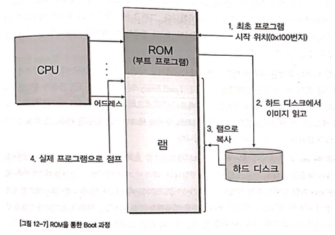

# 메모리 나누기 - 코드, 데이터, 스택, 힙

## 목차

- 용어 참고
- 개요
- 코드 및 데이터 세그먼트
- 스택 세그먼트
- 힙 세그먼트

## 용어 참고

- 펌웨어
  - 어떠한 장치의 하드웨어의 low-level 컨트롤을 제공하는 특정 컴퓨터 소프트웨어의 클래스
  - 주로 ROM이나 Flash memory에 저장됨
  - 몇몇 펌웨어는 한 번 설치되면 평생 바뀌지 않는데, 업데이트 되는 경우도 많다.
    - 업데이트 되는 경우에는, bug fix나 장치에 새로운 기능 추가 때문
  - 보안에도 신경써야 한다.
  - 예시
    - BIOS(Basic Input/Output System)
      - 매우 기본적인 기능만 수행
    - 임베디드 시스템에서의 펌웨어
      - 오직 해당 펌웨어만 실행이 되는 경우도 존재하며, 이 펌웨어가 장치의 모든 기능을 제공하는 역할 담당
      - 세탁기 프로그램
- BIOS(Basic Input/Output System)
  - 컴퓨터의 펌웨어
  - 부팅 전 하드웨어를 테스트(POST: Power On Self Test)하고 한 번 초기화 하여 사용을 준비
  - 소프트웨어와 하드웨어 간의 설정 및 정보 전달의 매개 역할
  - 지금은 UEFI(Unified Extensible Firmware Interface)를 사용
- UEFI(Unified Extensible Firmware Interface)
  - BIOS를 대체하는 펌웨어 규격
  - 바이오스 제약 사항 극복
  - 새로운 하드웨어를 더 유연하게 지원하기 위해서 개발
  - 부팅 프로그램 관리
- 부트스트랩
  - PC의 전원을 켠 후 OS를 시작할 때까지의 전체적인 흐름

## 개요

- 물리적으로 하나인 메모리를 프로그램상에서 논리적인 단위로 몇 가지 구분을 함
  - (코드 세그먼트, 데이터 세그먼트, 스택 세그먼트, 힙 세그먼트)
- 전역 변수 vs 지역 변수
  - 엑세스 범위
  - 라이프 사이클

## 코드 및 데이터 세그먼트

- 변수 선언 = 메모리의 특정 부분을 컴파일러가 기억했다가 그 곳을 다른 용도로 사용치 않게 하는 것
  - 초기화 과정이 없으면 어떤 값이 들어있는지 아무도 모름
  - 일부 컴파일러는 선언만으로 0으로 초기화 하는 경우도 있음
- 초기화
  - 선언된 변수에 해당하는 메모리에 상수값을 대입
  - 예시
    - `mov byte ptr [ebp-4], 2Ch`

```c
#include "stdafx.h"
#include <stdio.h>

int global = 1;

int main(int argc, char* argv[])
{
  int local = 2;
  return 0;
}
```

- 위의 코드 분석
  - `global`이라는 변수는 컴파일 된 코드 안에 1로 초기화 된 것이 나타나지 않음
  - `local`이라는 변수는 컴파일 된 코드 안에 2로 초기화 된 것이 나타남
    - `mov byte ptr [ebp-4], 2`
- 메모리 분석
  - 메모리에는 글로벌 변수에 해당하는 메모리 주소의 값이 1로 초기화 되어있음
- 이유는?
  - global 변수가 데이터 세그먼트에 해당되는 변수이기 때문

### 관심사의 분리

- 프로그램이 사용하는 메모리도 관심사의 분리(세그먼테이션)가 중요
  - 방식
    - 특정 주소를 기준으로 그 주소의 전 메모리는 인스트럭션들만 작성
    - 그 후 메모리는 데이터를 작성
  - 특성
    - **일부러 메모리와 인스트럭션을 섞어서 쓸 수도 있다**
    - CPU는 오직 PC 레지스터가 가리키는 메모리 값을 읽어와 인스트럭션으로 취급하여 실행할 뿐
    - **논리적인 분리일 뿐.** 따라서, 프로그래머가 직접 나누어야 함

### 컴퓨터의 시동과 exe파일의 실행의 흐름



- 컴퓨터의 시동(컴퓨터를 동작시키면 `0x100`번지의 메모리부터 프로그램이 동작하도록 설정(PC = `0x100`). 이 위치에는 ROM BIOS가 위치함)
- 컴퓨터에서 직접 제공 기능
  - BIOS(Basic Input/Output System) / UEFI 프로그램의 동작
    - ROM BIOS
      - 요즈음은 플래시 메모리에 ROM BIOS 프로그램을 위치시킴
      - 지금은 UEFI라는것을 인텔에서 주로 쓴다고 함
    - POST 후
    - 설정된 부트 순서대로 부트로더를 시동
  - 부트로더의 시동
    - 부트로더란 운영체제(이하 OS)가 시동되기 이전에 미리 실행되면서 커널이 올바르게 시동되기 위해 필요한 모든 관련 작업을 마무리하고 최종적으로 운영 체제를 시동시키기 위한 목적을 가진 프로그램을 말한다.
    - BIOS로 부터 제어권 넘겨 받음
    - RAM 사용 가능하도록 초기화
    - root 파일 시스템 준비
    - RAM상에서 계속 실행
    - 하드웨어 초기화
    - 특정 운영체제 커널을 메모리에 올림
    - 제어권을 운영체제 커널에 넘겨줌
- 운영체제 별 기능
  - exe파일 실행
  - `LoadLibrary`라는 윈도우즈 API 함수 호출
    - 코드와 데이터 세그먼트의 내용이 함께 메모리로 복사됨
      - 데이터 세그먼트에 맵핑된 변수는 프로그램 이미지가 메모리로 로드되는 순간 함께 초기화 됨
      - 따로 코드 상에서 초기화 할 필요 없음
    - exe파일 안에는 데이터 세그먼트 내용 뿐 아니라 코드 세그먼트의 내용도 포함
      - 덩치 큰 OS를 탑재한 시스템
        - 메타 데이터적인 형태로 데이터 저장
        - 메모리를 로드하는 과정에서 메타 데이터를 해석해서 메모리상의 데이터 세그먼트 부분을 적절히 초기화
      - 임베디드 시스템
        - 바이너리 이미지(exe파일) = 실제 데이터 및 코드 세그먼트 전체
        - 코드와 데이터 세그먼트의 크기가 100kB이면, 실제 이미지 크기도 100kB

## 스택 세그먼트

```
mov dword ptr [ebp-4],2
```

- local 변수는 왜 초기화 코드가 따로 있는가?
- local 변수는 ebp라는 레지스터를 통해 접근하는가? - 전역 변수는 명확한 메모리 주소로 접근

### 지역변수 vs 전역변수

- 전역변수
  - 액세스 범위
    - C코드 어느곳이든 접근 가능
  - 라이프 사이클
    - 프로그램이 실행되는 내내 그 값을 유지
- 지역변수
  - 액세스 범위
    - 함수 안에서만 접근 가능
  - 라이프 사이클
    - 함수의 실행이 끝나면 더이상 참조되어지지 않음
    - *클로저는?*
  - 함수마다의 독립성을 높이기 위해서 사용됨
