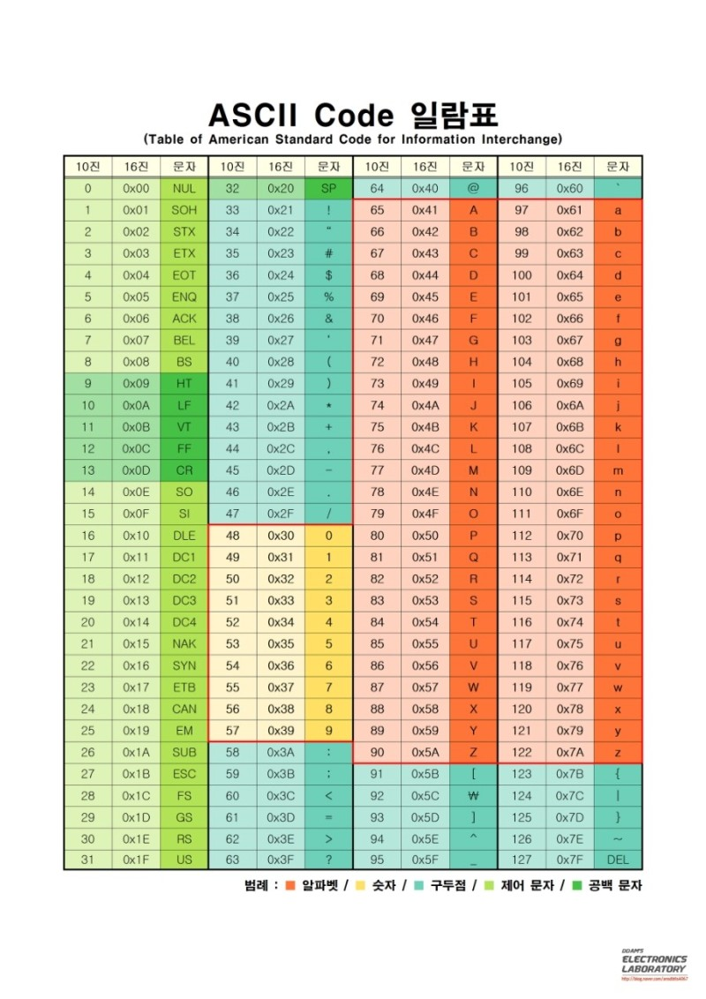
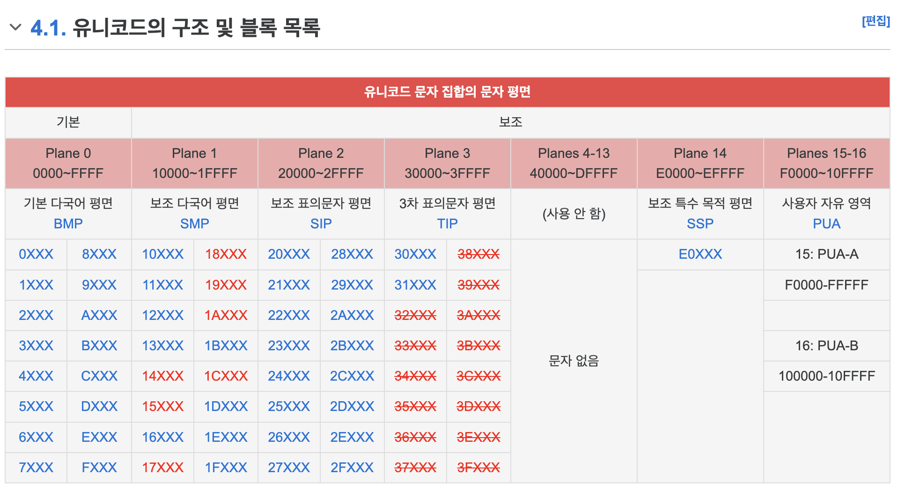
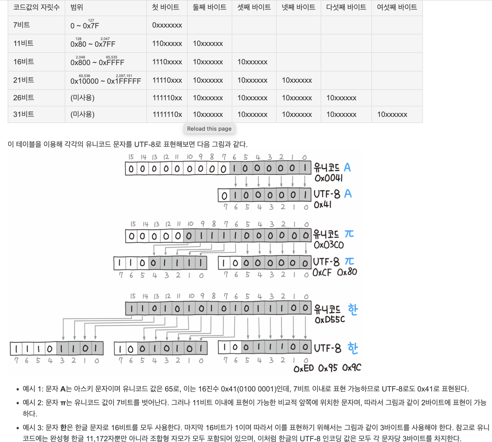

# 인코딩 규칙에 대한 모든 것

- 의문
- 개요
  - 역사

## 의문

## 개요

- 인코딩 규칙
  - 문자 - 숫자(바이너리) 매핑
    - 컴퓨터는 바이너리밖에 인식을 못하므로
  - 문자 <=> 숫자 <=> 바이너리
    - 결국 문자를 바이너리화 시키고 싶은거고, 바이너리에서 문자화 시키고 싶은것

### 역사

ASCII 코드

UNICODE 구조 및 블록 목록

UTF-8 인코딩 원리

- ASCII
  - 개요
    - 7비트로 하나의 문자 표현
    - 영문 / 숫자 / 일부 특수기호
  - 한계
    - 다양한 나라의 문자를 표현 불가
- UNICODE
  - 개요
    - 세계의 모든 문자를 비트로 표현하기 위한 글자에 숫자를 배당하는 방식
      - 단순하게 글자에 숫자만 배당
    - 유니코드와 유니코드 인코딩(UTF-8, UTF-16)은 다르다
  - 표현
    - `U+(16진수 숫자)` or `0x`(16진수 표기 관례)
  - 특징
    - 한글은 완성형으로 숫자와 매핑
      - 조합형(x)
- 인터넷의 등장
  - 다양한 문자를 숫자로 표현할 수 있는 표준 인코딩에 대한 필요성을 느끼게 됨
  - UTF-8로 대동단결
  - URL encoding
    - UTF-8을 사용하는데, 16진수앞에는 %를 붙임
    - ASCII문자라 하더라도 예약된 의미를 가진 문자의경우(/, &, =), 문자 그 자체의 의미로서 전달하고 싶으면 이스케이프 처리가 필요함
- **UTF-8**
  - 개요
    - UNICODE기반으로 1-4 바이트 가변길이를 이용하여 하나의 문자 표현
    - ASCII 코드는 1바이트 + UNICODE(2-4바이트)
  - 특징
    - 표준 인코딩에 대한 수요로 인해서 등장
    - 아스키 코드와 하위호환 유지
    - 한글은 3바이트
      - 헤더 + UNICODE 숫자
- UTF-16
  - 개요
    - UNICODE기반으로 2바이트와 4바이트 가변길이를 사용하여 문자 매핑
  - 특징
    - ASCII문자도 2바이트를 사용해야함(0x00)
    - 리틀엔디안, 빅인디안 인코딩 방식이 따로 있음
      - 매직넘버를 보고 판단 가능
    - JVM에서는 문자열을 UTF-16방식으로 저장(메모리 등에 저장할때)
      - 다양한 문자가 사용되는 공간(ASCII제외)에서는 헤더로 인한 메모리 오버헤드 발생
      - UTF-16은 위의 경우에서 BMP(기본언어판)에 있는 2^16 = 65536 개의 문제가 16비트로 표현이 가능하고, 이들이 가장 자주사용되므로 UTF-8보다 효율적일 수 있음
      - 그래서 문자나 문자열을 저장할때 UTF-16인코딩을 사용
