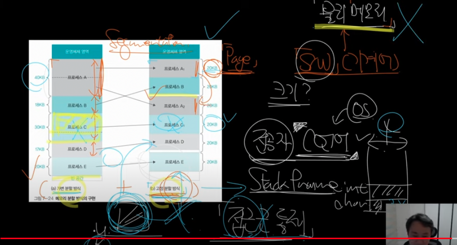
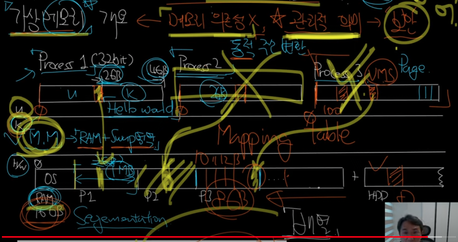
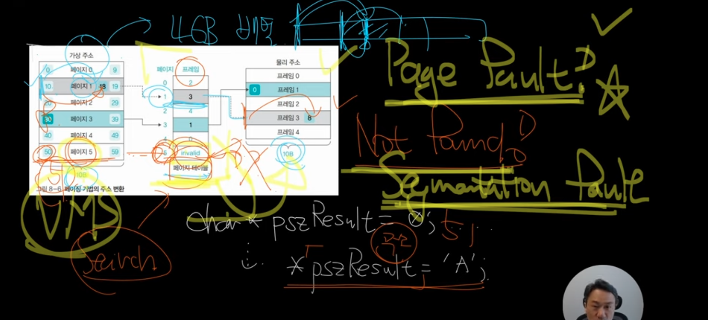
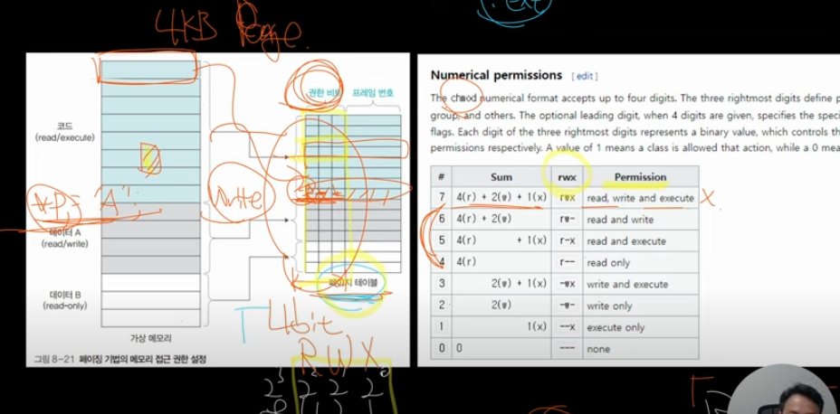

# 널널한 개발자 메모리

- 의문
- 개요
  - 메모리 시스템
  - 절대주소와 상대 주소
- 물리 메모리 관리
  - 메모리 오버레이와 스왑
  - (물리)메모리 분할 방식
- 가상 메모리 관리
  - 개요
  - 메모리 관리자(Memory Manager)
  - 가상 메모리 접근 통제

## 의문

- 가용 메모리가 충분히 있음에도, 왜 스왑 메모리를 사용하는가?
  - 프로세스가 sleep 상태로 잘 사용되지 않았을 수 있음

## 개요

### 메모리 시스템

- 개요
  - 1바이트 마다 주소가 붙음
  - 주소의 크기별로 ~bit 시스템이라는 말이 붙음
    - e.g) 32bit 시스템(4GB까지 밖에 램을 사용 못함)
- c.f) 64비트 플랫폼
  - 64비트 CPU & 64비트 OS
- MMU(Memory Manage Unit)
  - 개요
    - 메모리 관리자
  - 배치정책
    - 프로세스는 많은데, 메모리는 제한되므로, 메모리가 다 차면 메모리 공간 재배치(연산이 잘 안되는 프로세스의 메모리를 HDD로 옮김)
    - 배치 단위는 page(4KB 정도)
    - *세그먼트*
      - 코드 / 전역 / 힙 / 스택

### 절대주소와 상대 주소

- 메모리 주소 개요
  - 절대주소
    - 물리적인 메모리의 주소
  - 상대주소(논리주소 = 가상주소(가상메모리))
    - 논리적으로 0부터 놓은상태에서의 메모리의 주소

## 물리 메모리 관리

### 메모리 오버레이와 스왑

- 개요
  - 새로 프로세스가 메모리를 사용하려고 하면, 기존 메모리의 데이터를 지우고 그 공간을 사용함
  - 그런데, 메모리가 너무 작아서, 메모리를 사용하지 못하는 프로세스도 존재했으므로, HDD에 메모리를 저장하는 방법을 도입
    - 스왑
  - 당시에는 스왑이 매우 많이 일어났음
    - 기본적으로 2차 기억장치는 메모리보다 훨씬 느림
  - SSD 등장 이후 스왑 속도가 훨씬 빨라짐
- 스왑
  - 스왑(Page) In
    - 메모리에 있는 데이터를 HDD로 옮기는 것
  - 스왑(Page) Out
    - HDD에 있는 데이터를 메모리로 옮기는 것
- c.f) 최대 절전 모드
  - 메모리를 swap out 해뒀다가 다시 사용할때 swap in함

### (물리)메모리 분할 방식

물리 메모리 분할 방식

- 메모리 분할 방식
  - 가변 분할 방식
    - 프로세스가 필요한 메모리의 크기 할당을 가변적으로 함
    - 외부 단편화 문제가 발생
      - 메모리 조각모음을 해야 함(CPU 연산 필요 작업)
    - 세그먼테이션
  - 고정 분할 방식
    - 페이지 단위로 프로세스가 필요한 메모리를 크기를 고정적으로 함
    - 내부 단편화 문제가 발생
    - 페이지
- 현재 OS에서는 실제로는 가변 분할 방식, 고정 분할 방식을 같이 사용함
- c.f) 프레임 vs 페이지
  - 프레임
    - 메모리의 물리적 분할(하드웨어 레벨)
  - 페이지
    - 메모리의 논리적 분할(유저모드 레벨)

## 가상 메모리 관리

너무나도 중요한 내용!!

프로세스의 메모리 접근 통제가 이뤄지는 레이어

### 개요

가상 메모리와 물리 메모리의 연결

- 메모리
  - 1차 메모리
    - RAM
  - 2차 메모리
    - HDD(SSD)
- VMS(Virtual Memory Space)
- **c.f) 물리적 메모리 구성**
  - e.g)32비트 컴퓨터(4GB 메모리)
    - User 메모리 영역(OS도 여기에 포함)
      - 실제 유저가 사용할 수 있는 메모리는 1.8GB 보다 적음
        - 즉 `malloc(2GB)`불가
    - 커널 메모리 영역
      - 2GB
- 가상 메모리
  - 개요
    - 각 프로세스마다 메모리의 시작점을 0부터 시작하는 논리적 메모리
      - 선형구조
  - 장점
    - 관리적 측면에서 추상성 제공
      - 특정 프로세스가 죽어도, 해당 프로세스가 사용하던 공간을 빠르게 **자원 회수 가능**
      - **보안** - 접근제어
    - 물리 메모리의 의존성 제거

### 메모리 관리자(Memory Manager)

매핑 테이블 예시

- 개요
  - RAM + Swap영역(쓸 수 있는 메모리의 총량)
- 동적(runtime) 주소 변환
- 매핑 테이블
  - 개요
    - 페이지(가상) - 프레임(물리) 위치 매핑
  - *구현은 일반적으로 배열로*
- page(segmentation) fault
  - 페이지를 페이지 매핑 테이블에서 서치해도, 대응되는 프레임이 없을경우

### 가상 메모리 접근 통제

가상 메모리 접근 통제 원리와 매모리 매핑 테이블

- 메모리 접근 통제
  - 페이지 테이블에서 수행됨
  - 어떠한 메모리 페이지가 읽기 / 쓰기 / 실행이 가능한지 제어 및 관리함
  - RWX
    - Read
    - Write
    - Execute
- 메모리 영역(RWX)
  - 데이터(RW)
    - Static
      - RW: 전역 변수
      - R: 문자열 상수(리터럴)
    - Heap
    - Stack
  - 코드(RX)
- 주의
  - 위의 메모리 영역은 애플리케이션 코드에서 변경 가능하긴 함
    - 그런데 보안상 좋지 못함
- **DEP**(Data Execution Prevention)
  - 데이터 영역에 있는것을 실행하지 못하게 OS에서 막아줌
- 권한
