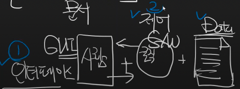
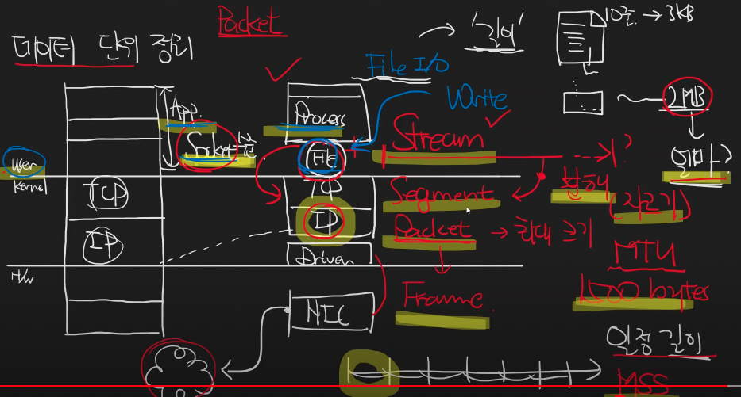
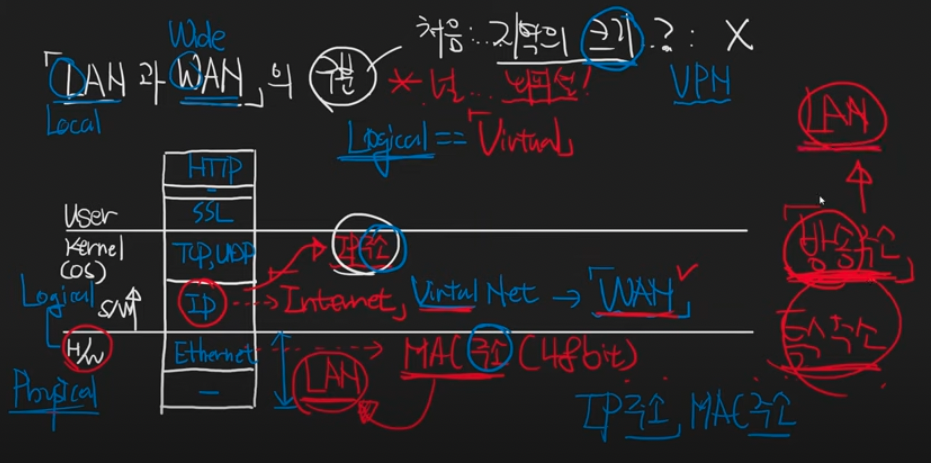
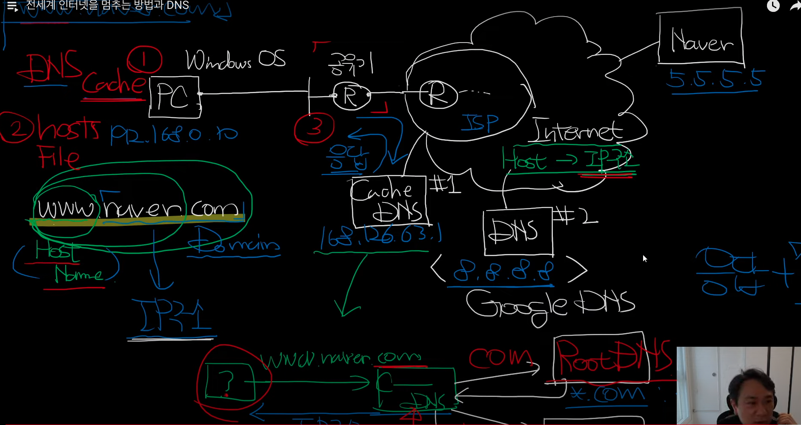
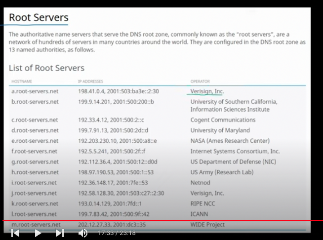
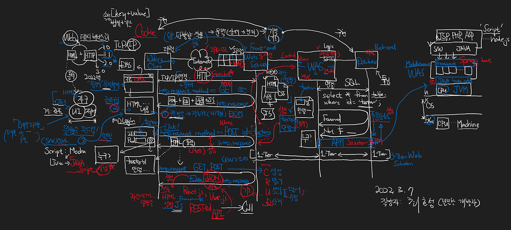

# 널널한 개발자 네트워크

- 의문
- 기초
  - 네트워크 레이어와 레이어 별 식별자
  - Host, Switch, Network 이들의 관계에 대해
  - IPv4주소 체계
  - 데이터 단위 정리
  - 인터페이스 선택의 핵심 원리
  - LAN vs WAN(널널한 개발자의 뇌피셜)
- TCP/IP
  - TCP 기초
  - 데이터 송수신과 TCP 구조
- DNS
- 웹 서비스

## 의문

## 기초

모든 소프트웨어의 구조

모든 소프트웨어는 인터페이스, 제어체계, 데이터로 이루어져 있음

- 인터페이스
  - GUI, API
- 제어체계(연산)
  - 소프트웨어
- 데이터

### 네트워크 레이어와 레이어 별 식별자

네트워크 레이어와 레이어 별 식별자

- **레이어 별 식별자**
  - Transport
    - Port
      - 노드 상의 프로세스
  - Network
    - IP
      - Host에 대한 식별자(인터넷에 연결된 노드)
      - IP주소는 하나의 MAC에 여러개 바인딩 가능
  - Access
    - MAC
      - NIC에 대한 식별자
      - 따라서, 한 컴퓨터에 NIC가 두개가 붙으면 그 호스트의 MAC은 두개
      - 변경 가능
- TCP 소켓
  - 개요
    - **TCP를 유저모드 애플리케이션 프로세스가 접근할 수 있도록 파일형식으로 추상화한 인터페이스**
  - 특징
    - 웹 서버가 아닌 이상에야, 일반적으로 같은 포트번호가 쉽게 재사용됨

### Host, Switch, Network 이들의 관계에 대해

- 호스트
  - 개요
    - 인터넷에 연결된 컴퓨터
- 엔드 포인트(단말)
  - 개요
    - 호스트인데, 네트워크의 이용 주체
  - 예시
    - 역할 따른 분류
      - Peer, Server, Client
- 스위치
  - 개요
    - 호스트인데, 네트워크를 구성하는 그 자체
  - **스위칭**
    - 패킷의 최적 경로를 선택하는 것
  - **라우팅 테이블**
    - 패킷의 최적화된 경로의 근거가 되는 기준
  - 예시
    - 역할에 따른 분류
      - 라우터(경로 선정을 위한 스위칭), 방화벽(보안을 위한 스위칭), IPS
    - 레이어에 따른 분류(식별자를 갖고 스위칭)
      - L2 스위치
        - MAC가지고 스위칭
      - L3 스위치
        - IP주소 가지고 스위칭
        - 대표적인게 라우터, 공유기(외부 IP를 내부 IP로 스위칭해줌)
        - 인터넷 = 라우터(L3스위치)의 집합체
      - L4 스위치
        - Port번호 가지고 스위칭
      - L7 스위치
        - HTTP 통신 프로토콜의 내용을 가지고 스위칭
          - 레이어가 높을수록 연산이 복잡해짐
- 네트워크
  - 예시
    - 인터넷 = 라우터의 집합체 + DNS

### IPv4주소 체계

IPv4 주소 체계

- IP 개요
  - 인터넷에서 호스트에 고유하게 부여된 식별자
- 192.168.60.14/24
  - Network ID
    - 192.168.60
  - Host ID
    - 14

### 데이터 단위 정리

네트워크 데이터 단위 정리

- 유저 레이어
  - 소켓수준에서는 stream 데이터 단위
    - 끝을 알 수 없는 데이터
- 커널 레이어
  - TCP
    - 세그먼트
  - IP
    - 패킷(세그먼트를 encapsulate)
      - MTU(Maximum Transmission Unit): 1.5KB
- 하드웨어 레이어
  - NIC
    - 프레임

### 인터페이스 선택의 핵심 원리

네트워크 인터페이스 선택의 핵심 원리 다이어그램

- 여러 네트워크 인터페이스가 있을때, 어떤 인터페이스를 선택하는가는 '메트릭 값'즉, 비용으로 결정한다
  - 비용은 OS나 장치 제조사마다 규칙과 노하우가 존재

### LAN vs WAN(널널한 개발자의 뇌피셜)

LAN과 WAN의 구분

- 기준
  - 물리적이냐 vs 논리적이냐
- 개요
  - 인터넷은 논리적(소프트웨어) 네트워크 = WAN
  - 이더넷은 물리적(하드웨어) 네트워크 = LAN = broadcast address가 적용되는 범위

## TCP/IP

### TCP 기초

TCP 커넥션

- TCP 소켓
  - 개요
    - **TCP를 유저모드 애플리케이션 프로세스가 접근할 수 있도록 파일형식으로 추상화한 인터페이스**
- TCP 연결
  - TCP 연결 됐다 = 3way handshake
    - 시퀀스 번호 교환
    - MSS(Maximum Segment Size)
    - flow-control 정책 교환(네트워크상의 문제 / 윈도우 사이즈 문제)
      - 정책 예시: SACK(Selective ACK)
- TCP연결은 보안성은 없음(spoofing)

### 데이터의 송수신과 TCP 구조

데이터의 송수신과 TCP 구조(보내는 쪽)

데이터의 송수신과 TCP 구조(받는 쪽)

- 보내는 쪽
  - 소켓 파일을 연다
  - 데이터를 TCP 버퍼로 copy한다
  - TCP 버퍼를 세그먼트로 분리하고 헤더를 붙인다
  - 세그먼트 청크를 IP레이어로 보낸다
  - ...
  - 대기
  - 수신측의 ACK segment를 받아서, `window size(ack를 보내는 세그먼트 내부) > 지금 보내려는 세그먼트 사이즈`(< Maximum Segment Size) => 다음 세그먼트 청크 보냄
    - 아니면 wait
- 받는 쪽
  - NIC에서 데이터를 전송받음
  - IP레이어에서 TCP레이어로 세그먼트 청크 보냄
  - TCP레이어의 윈도우(TCP 버퍼)에 세그먼트 청크 적재
  - 윈도우에 적재된 데이터를 애플리케이션이 읽어와서 활용
    - 그와 동시에 송신측에 ACK 세그먼트 보냄
  - 주의
    - TCP buffer에서 file buffer로 읽는 속도 > 전송속도 여야 속도가 느리지 않음

## DNS

- 세상의 인터넷을 멈추게 만드는 방법
  - Root DNA 13대를 멈추게 만들면 됨(왜냐면, Internet = Router + DNS)

### 개요

DNS의 질의 구조

루트 DNS들

- DNS 정의
  - 도메인 네임을 IP주소로 반환해주는 매핑 서버
- DNS 요청(www.naver.com 을 쿼리할 경우)
  - 로컬 머신
    - 메모리 DNS 캐시 서칭
    - host 파일 서칭
  - 공유기
    - 공유기(DNS 포워딩)가 대리로 반환
  - ISP
    - ISP가 제공하는 DNS에 쿼리(캐시에 존재하면 반환)
    - ISP가 RootDNS에 쿼리
      - *.com을 다루는 DNS 목록을 반환
    - *.com을 다루는 DNS목록 중 하나에 쿼리
      - *.naver.com를 다루는 DNS 목록을 반환
    - *.naver.com을 다루는 DNS목록 중 하나에 쿼리
      - www.naver.com에 대응되는 ip주소를 반환
- DNS에 주소 요청 반환값에는 항상 유효기간이 존재

## 웹 서비스

웹 서비스 구조

- Web Server
- WAS(Web Application Server)
- DB
