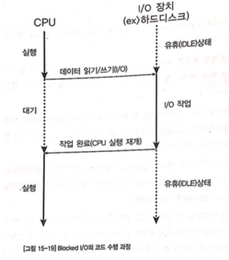

# 핵심 OS 요소

## 목차

- 의문
- 개요
- 프로세스 vs 스레드
  - 프로세스
  - 스레드
- 동기화
  - 배경
  - 동기화 방법
  - 어떻게 동기화 할 것인가?
  - 동기화의 문제
- Blocked I/O vs Non-Blocked I/O
- 멀티스레딩과 서버
- 윈도우즈의 최강자 서버 - IOCP

## 의문


- 한 프로세스 내의 서로 다른 두 스레드안에서 함수를 호출하면, 프로세스 메모리 영역의 스택은 어떻게 관리 될 수 있는가?
  - 스택은 따로 관리
  - 나머지 코드, 전역 데이터, 힙은 공유
  - 그렇다면 스택의 영역은 1/n 되는 것인가?
    - 아니다. 각각의 스택은 1MB로 고정(OS나 언어에 따라 다를 수 있음. 하지만 1/n이 아님)
    - *그런데 프로그램 실행의 자원 관리의 단위는 프로세스인데, 처음 프로세스를 실행할 때, 전체 스택 사이즈를 멀티스레딩까지 포함해서 어떻게 정하는가?*
- *스레드나 고루틴이 4kb다. 와 같은것은 무엇이 4kb라는 것인가?*
  - 공유되지 않는 오버헤드 영역
    - 스택 영역
    - 레지스터 상태
- *Non-Blocked I/O 구현을 위한 하드웨어 컨트롤러는 멀티스레드를 지원하는 프로그램인가?*
  - 각 스레드가 장치 I/O 담당
- *스레드의 스케쥴링과 프로세스의 스케쥴링의 차이?*

## 개요

- 프로세스 vs 스레드
  - 프로세스
    - 프로그램이 실행되기 위해 필요한 자원의 소유 단위
  - 스레드
    - 코드를 수행하는 단위
    - 단일 CPU에서는 문맥 전환이 일어나는 단위
    - 프로세스당 복수개의 스레드 허용
      - 프로세스에 속하는 자원의 일종
- Blocked I/O vs Non-Blocked I/O
  - Blocked I/O
    - I/O 작업이 끝나는 동안 CPU가 대기 상태에 머무르는 I/O 작업
  - Non-Blocked I/O
    - I/O 작업이 완료되기 전에 곧바로 리턴하고 CPU가 다른 일을 할 수 있게 되는 경우

## 프로세스 vs 스레드

- OS의 핵심기능 중 하나
  - 멀티 태스킹
    - 컨텍스트 스위칭
    - 프로세스

### 프로세스

- 프로그램이 수행되기 위한 자원 소유의 단위
  - **자원** 을 OS에 요청
    - 메모리
    - 핸들 값(이 값으로 OS에 다양한 장치를 요구함)
- (과거 / 임베디드 환경)실행 단위
  - CPU를 사용할 수 있는 권한이 필요
  - **CPU 수행시간을 분배받는 단위**
  - 하지만 워드 프로세서의 맞춤법 검사기 처럼 매 타이핑 마다 체크하기는 힘듬
  - 현재는 실행 단위가 아님

### 스레드


- 스레드란
  - 프로세스 자원에 속하면서 프로세스의 코드를 수행하는 단위
    - 하나의 프로세스로 동일한 자원을 사용하되, 실행 단위만 별도로 분리하는 개념
  - 1프로세스는 적어도 하나의 스레드는 소유해야 함
- 문맥 전환
  - CPU가 한 스레드의 코드 일부 수행하고 잠시 후 다른 스레드의 코드를 수행하려고 하는 것
  - 다른 스레드로 문맥 전환이 일어나면, 기존에 사용하던 레지스터 값을 다른 곳에다 저장해두고 새로 전환되는 문맥에서 축적된 레지스터 값을 복원해야 함
    - 메모리상에 보관
  - 문맥전환은 코스트가 크므로, 너무 자주일어나지 않도록 하는 것이 중요
  - *프로세스간의 문맥 전환은 결국 스레드간의 문맥전환과 차이가 없는 것인가?*
- 윈도우즈의 `CreateThread` API가 있음

스레딩을 이용한 프로그래밍의 예

```c
#include <stdio.h>
#include <WINDOWS.H>

int g_idx = 0;
unsigned int NewThread(void* pParam)
{
  while(1)
  {
    g_idx++;
  }
}

int main(int argc, char* argv[])
{
  CreateThread(
    NULL,
    0,
    (LPTHREAD_START_ROUTINE) NewThread,
    0,
    0,
    NULL
  );

  while (1)
  {
    printf("g_idx : %d\n", g_idx++);
  }

  return 1;
}
```

- 해설
  - `CreateThread()`함수에 스레드 우선 순위, 속성, 스택 사이즈 등 다른 필요한 정보 넣어줌
    - `NewThread()`라는 함수 주소를 넘겨줌
    - 메인 스레드와는 별개로 NewThread 함수를 수행
  - 프로그램 실행 > OS가 새로운 스레드 생성 > 다른 곳에서 프로그램 시작 > main 함수 호출 > 새로 스레드 생성 > 리턴 후 스레드 종료
- 멀티스레딩
  - 복수의 스레드가 존재하게끔 프로그램을 작성하는 것
  - 단점
    - 문맥 전환시 CPU가 레지스터를 저장하고 복구하는데 시간을 허비
    - 동기화 문제
      - 프로그램의 규모가 커지면 정말 다루기 힘들어진다.
      - 서로 다른 스레드가 같은 프로세스 자원을 공유 하지만, 서로 독립적으로 실행하므로 같은 자원이나 변수를 사용할 때 동기화 문제가 발생
      - 위의 코드는 `g_idx` 변수를 원하는 횟수만큼 증가 시키는 것이 불가능
      - 동기화 객체를 사용해야 함

## 동기화

### 배경

- 멀티스레딩은 효과는 효율적이지만 그 관리는 악몽이다.
  - 하나의 메인 스레드 외의 다른 스레드를 만들어 복수의 스레드가 동시에 돌아가는 프로그램 기법
  - 단일 CPU의 경우, 복수의 스레드가 논리적인 단위로만 동시에 코드가 수행되는 것 처럼 보임
    - 인스트럭션 레벨에서는 결국 한 번에 한 인스트럭션이 수행되는 것

예제 코드

```c
#include <stdio.h>
#include <WINDOWS.H>

int g_idx = 0;

unsigned int NewThread(void* pParam)
{
  while(1)
  {
    g_idx++;
    Sleep(50);
  }
}

int main(int argc, char* argv[])
{
  CreateThread(
    NULL,
    0,
    (LPTHREAD_START_ROUTINE) NewThread,
    0,
    0,
    NULL
  );

  while(1)
  {
    printf("g_idx : %d", g_idx);
    printf("g_idx * 2 = %d\n", g_idx * 2);
    Sleep(500);
  }
}
```

- 위의 코드를 실행하면
  - `g_idx`와 `g_idx * 2`의 출력값이 알맞게 싱크되지 않음
    - 어떤 값은 `g_idx`가 0 인데 `g_idx * 2`가 2인 경우도 존재
  - 이는 메인 스레드와 NewThread의 두 코드가 독립적으로 실행되기 때문
    - 우리가 원하는 '동시'는 논리적인 단위
    - 실제로 CPU가 코드를 실행하는 단위는 '인스트럭션'
  - 두 번의 `printf`코드는 서로 다르지만, 사실은 동일한 `g_idx`를 참조해야 하므로 논리적으로는 한 단위로 이루어져 있어야 함
    - 마치 DB의 Transaction과 비슷한 느낌이 든다
    - 이때에 동기화가 필요
  - 두 번의 `printf`가 수행되는 동안에는 `NewThread`가 `g_idx`값을 변경하지 못하도록 해야 함


### 동기화 방법

크리티컬 섹션을 이용한 동기화(Window specific)


- **멀티태스킹 OS에서 제공한 동기화 객체를 사용**
  - **크리티컬 섹션(Critical Section)**
    - 두 개의 스레드가 공용으로 사용하는 변수 등의 자원이 있을 경우, 프로그램상에서 공용의 크리티컬 섹션을 만듬
    - 한 스레드가 지정한 섹션을 사용(lock)
    - 다른 스레드는 사용하고 있는 스레드가 다 마칠 때까지(unlock) 대기 모드
      - 블로킹 상태
    - 미리 사용하던 스레드가 unlock함
    - 대기 하던 스레드가 섹션을 lock하고 해당 코드 수행

```c
#include <stdio.h>
#include <WINDOWS.H>

intg_idx = 0;
CRITICAL_SECTION g_csFor_g_idx;

unsigned int NewThread(void* pParam)
{
  while(1)
  {
    EnterCriticalSection(&g_csFor_g_idx); // lock

    g_idx++;

    LeaveCriticalSection(&g_csFor_g_idx); // unlock

    Sleep(50);
  }
}

int main(int argc, char* argv[])
{
  InitializeCriticalSection(&g_csFor_g_idx); // 초기화

  CreateThread(
    NULL,
    0,
    (LPTHREAD_START_ROUTINE) NewThread,
    0,
    0,
    NULL
  );

  while(1)
  {
    EnterCriticalSection(&g_csFor_g_idx); // lock

    printf("g_idx : %d", g_idx);
    printf("g_idx * 2 = %d\n", g_idx * 2);

    LeaveCriticalSection(&g_csFor_g_idx); // unlock

    Sleep(500);
  }

  DeleteCriticalSection(&g_csFor_g_idx); // 삭제
}
```


- **뮤텍스(Mutex)**
  - 크리티컬 섹션의 기능
  - 서로 다른 프로세스에 속한 스레드끼리 동기화 가능
- **세마포어(Semaphore)**
  - 크리티컬 섹션의 기능
  - 락을 한 번이 아니라 지정된 횟수만큼 여러 번에 걸쳐 가능

### 어떻게 동기화를 할 것인가?

- 원칙
  - 2개 이상의 복수의 스레드에서 함께 사용하는 자원(주로 변수)마다 동기화 객체(크리티컬 섹션이나 뮤텍스)를 생성해 둔다.
  - 각 공용 자원이 사용되는 논리적 단위마다 해당 동기화 객체로 묶는다.
  - 가능한 한 동기화 객체로 보호되는 논리적 단위를 작게 잡는다.

### 동기화의 문제

- 논리적 단위를 어디까지 끊을 것인가? 에 대한 판단이 매우 어려움
  - 무식하게 공용 자원을 사용하는 코드 함수 전체를 하나의 단위로 묶어서 락 / 언락
    - 성능면에서 엄청난 손해
- 논리적 단위의 누락 가능성 존재
  - 어디서 잘못됐는지 확인하기 매우 힘듬


- 멀티스레딩 프로그래밍에서의 데드락
  - **서로 다른 스레드가 각각 서로 다른 자원을 소유한 채 서로 소유한 자원을 요청하고 기다리는 경우 에 발생**
    - 개발자의 미스로 발생하며, 프로그램 수정 해결이 가능
    - c.f) 프로세스의 데드락
      - 그냥 재부팅하는 수 밖에 없음

데드락 코드 예시

```c
#include <stdio.h>
#include <WINDOWS.H>

int g_A = 0;
int g_B = 0;
CRITICAL_SECTION g_csA;
CRITICAL_SECTION g_csB;

unsigned int NewThread(void* pParam)
{
  while(1)
  {
    EnterCriticalSection(&g_csA);
    EnterCriticalSection(&g_csB);

    g_A++;
    g_B++;

    LeaveCriticalSection(&g_csB);
    LeaveCriticalSection(&g_csA);

    Sleep(50);
  }
}

int main(int argc, char* argv[])
{
  InitializeCriticalSection(&g_csA);
  InitializeCriticalSection(&g_csB);

  CreateThread(
    NULL,
    0,
    (LPTHREAD_START_ROUTINE) NewThread,
    0,
    0,
    NULL
  );

  while(1)
  {
    EnterCriticalSection(&g_csB);
    EnterCriticalSection(&g_csA);

    printf("A : %d", g_A);
    printf("B : %d", g_B);

    LeaveCriticalSection(&g_csA);
    LeaveCriticalSection(&g_csB);

    Sleep(50);
  }

  DeleteCriticalSection(&g_csA);
  DeleteCriticalSection(&g_csB);

  return 1;
}
```

데드락이 걸리는 이유


데드락이 걸리지 않게 스레드마다 같은 순서로 락을 걸어주는 경우


- 위의 프로그램은 십중팔구 결과가 나오다가 프로그램이 멈춤
  - 데드락 발생
  - 원인
    - `main`스레드에서 크리티컬 섹션 락 순서가 `g_csB`, `g_csA`순인데, NewThread 스레드에선 `g_csA`, `g_csB`로 메인스레드와 반대로 락을 시도하고 있음
  - 해결
    - 두 스레드가 동일한 순서로 크리티컬 섹션 락 순서를 따르도록 함
- 프로세스의 데드락
  - IO 장치
  - 해결 방안이 없음

그럼에도 불구하고 멀티스레딩을 하는 이유는 I/O 처리에 매우 유용하기 때문

## Blocked I/O vs Non-Blocked I/O

### 개요

- CPU
  - 본질적인 특징
    - 계산
    - 제어
  - 입력값과 출력 기능이 있어야 함
    - 메모리
      - 인스트럭션을 메모리에서 읽어와서 수행하고 그 결과를 메모리에 저장
    - 외부 장치(I/O 포트 / Memory Mapped I/O 사용)
- I/O
  - 개념
    - CPU가 외부 장치와 데이터를 주고 받는 것
  - 예시
    - 파일 입출력
    - CPU의 처리 속도에 비해서 무지막지하게 느림
  - Blocked I/O
    - CPU가 외부 장치에서 데이터를 읽어오는 동안 CPU가 다른 인스트럭션을 수행할 수 없고 대기하는 경우의 I/O
    - 해결책
      - 하드웨어
        - CPU <=요청/인터럽트=> 컨트롤러 <==> I/O 장치
        - 인터럽트
          - CPU에 마련된 특별한 핀에 시그널이 들어오면 CPU가 기존의 작업을 중단하고 지정된 주소로 점프하여 작업을 수행하고 돌아오는 특별한 매커니즘
      - 소프트웨어
  - Non-Blocked I/O(Asynchronous I/O)
    - CPU가 블로킹 되지 않는 I/O
    - 멀티태스킹 O/S에서 매우 중요한 기능
      - 어떠한 스레드가 I/O 작업 중에, 다른 스레드가 CPU의 자원을 사용할 수 있도록 함
      - 많은 경우, 실제 하드웨어에서는 Non-Blocked I/O를 지원하면서도 OS가 제공하는 I/O 함수들은 대부분 Blocked I/O 모드로 동작하는 경우가 일반적
      - 이 경우 Blocked I/O의 편리성(코드 작성의 용이함)을 누리면서, OS 입장에서는 I/O 동안 다른 스레드 실행하도록 스케쥴링 할 수 있으므로, 시스템 전체적으로는 CPU를 늘리지 않고 가동해 성능을 높일 수 있음
      - 예시
        - `ReadFile`을 하는 동안 이를 서브 스레드에서 실행시키고, 메인스레드에서는 모래시계와 진행률 막대를 표현할 수 있음
    - 예시
      - 하드웨어 컨트롤러 인터럽트 방식

Blocked I/O



Non-Blocked I/O


## 멀티스레딩과 서버

### 스레드와 프로세스가 분리 된 이유

- 논리적 흐름이 멀티스레딩과 부합하는 경우가 존재
  - 게임에서 인공지는 5개의 적이 움직이는 경우
  - 각각에 스레드를 배정해서 처리하는 것이 논리적으로는 올바른 경우도 있음
- 실질적인 성능 향상을 위함
  - CPU가 여러개 있는 경우에 스레드를 CPU에 나눠서 실행 흐름을 병렬적으로 나누는 것이 가능

### 멀티스레딩의 실질적 효용

- 대용량 I/O 처리를 하는 경우
  - 파일 생성과 읽기
    - I/O의 대상이 되는 장치가 다양한 프로그램에 의해서 사용되므로, 핸들이 필요함
    - 이러한 공용 장치(파일도 공용 장치)로 I/O하는 과정은 항상 OS의 I/O API 함수를 통해 실행
    - 이는 핸들을 리턴하고 그 핸들로 장치 접근이 가능
  - 네트워크 프로그래밍
    - 네트워크 통신에서는 핸들과 유사하게 소켓을 사용
    - 파일과 차이점
      - 접속에서 사용자가 OPEN하는 개념뿐 아니라, 상대방이 접속하는 경우도 존재(접속을 당하는 경우)
      - 데이터를 읽는 것은 통신 상대방의 의지(상대방이 데이터를 보내줘야만 함)
      - 서버
        - 접속을 당하는 쪽
        - 불특정 다수에 대해 연결을 대기
      - 클라이언트
        - 접속을 하는 쪽
        - 데이터 요청
        - CPU와 네트워크 카드는 Non-Blocked I/O 방식으로 동작하나, 함수 자체는 Blocked I/O 형태로 동작하는 경우가 많음

클라이언트 코드 예시

```c
int main(int argc, char* argv[])
{
  char data[100];

  // 소켓 생성
  SOCKET a = socket(...);

  // 접속
  connect(s, 접속주소);

  // Hello 라는 문자를 송신
  send(s, "Hello");

  // 응답을 기다린다. (답이 올때까지 블로킹)
  data = recv(s);

  printf("%s", data);

  return 1;
}
```

- `connect`, `send`, `recv`함수들은 모두 BSD(Berkeley System Distribution) 변종 Unix 시스템에서 제안한 네트워크 프로그래밍 라이브러리에서 정의된 함수(버클리 소켓)
  - 표준 인터페이스

멀티 스레딩 서버 코드 예시

```c
unsigned int ClientThread(void* pClientSock)
{
  SOCKET client_sock = (SOCKET) pClientSock;

  // 접속한 클라이언트 소켓(client_sock)으로
  // 데이터를 주고 받는다.
  // 클라이언트가 bye를 보낼 때까지 반복
  do
  {
    // 데이터가 올 때까지 대기
    recv(client_sock, data, ...)

    // Hello를 받으면 World를 보내준다
    if (data == "Hello")
    {
      send(client_sock, "World", ...);
    }
  }
  while (data != "bye");
  close(client_sock);

  // 스레드 종료
}

int main(int argc, char* argv[])
{
  char data[100];

  SOCKET server_sock = socket(...);

  SOCKET client_sock;

  // 접속을 기다리게 함
  listen(server_sock, ...);

  while(1)
  {
    // 클라이언트가 접속할 때까지 대기
    // 클라이언트가 접속하면 소켓 리턴
    // blocked
    client_sock = accept(server_sock);

    // 새로운 스레드를 만들어 접속한 클라이언트
    // 소켓(client_sock)을 인자로 넘겨준다.
    // 이후 클라이언트의 통신은 새 스레드에서 행해진다.
    CreateThread(..., ClientThread, ..., client_sock, ...);
  }

  return 1;
}
```

- 멀티스레딩 서버
  - 장점
    - 코드가 심플 / 직관적인 코드 제작 가능
  - 단점
    - 접속한 클라이언트 수가 많아질수록 `select`를 사용한 단일 스레드 방식 서버에 비해 성능이 점점 떨어짐
      - 접속된 클라이언트 수 만큼 스레드가 만들어지고, CPU가 스레드의 개수만큼 있지 않으면 OS가 스케쥴링을 통해 문맥 전환을 해야하기 때문
      - 클라이언트가 많아지면 문맥전환의 빈도도 높아짐
        - 오버헤드 증가
- 단일스레드 + Non-Blocking 서버(Nodejs와 비슷)
  - 개요
    - `accept`함수를 불러도 곧바로 리턴
    - `select`라는 함수만이 블로킹을 함
    - 특정 이벤트가 발생했는지에 따라서 `accept`함수나 `recv`함수 등을 불러서 처리 가능
      - 콜백처리와 같은 형식으로 가능
    - 소켓들을 배열로 받아서 여러개의 소켓을 처리 가능
  - 장점
    - 문맥전환으로 인한 오버헤드문제가 없음

윈도우에서는 IOCP가 최강자

## 윈도우즈의 최강자 서버 - IOCP
