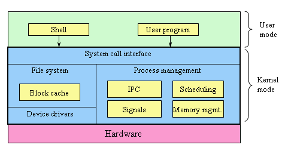

# OS의 정체

## 의문

## 개요

- 선점형 OS vs 비선점형 OS
  - 선점형 OS
    - 일정시간 동안 스레드가 자발적으로 수행권을 내놓지 않으면 인터럽트를 이용해 OS가 수행권을 가로채고 여기서 강제로 다른 스레드에게 수행권을 줌
  - 비선점형 OS
    - 프로그램 실행의 주체가 되는 스레드간의 문맥 전환을 각 프로그램의 자발적인 CPU 반환에만 의존

## 누구냐 넌? - OS

### OS와 오해

- 오해
  - 데스크탑 화면은 OS가 아니라 하나의 프로그램에 불과
  - 윈도우에서 터미널에 실행 파일 이름을 쳐서 원하는 프로그램을 실행하는 것도 하나의 쉘 프로그램에 불과
  - 터미널 창도 하나의 프로그램에 불과
  - 무엇이 OS인가?

### OS란

- OS의 등장
  - 과거에는 하나의 컴퓨터를 많은 사람이 공유해서 썼고, 인쇄하는 데에 시간을 많이 소비
    - 실질적 CPU 이용률이 매우 낮음
  - 그래서 Spooling을 도입해서 메모리에 결과물을 넣어두고 순차적으로 알아서 실행하도록 하는 **일괄 처리의 역할**
    - 중앙처리장치와 입출력장치가 독립적으로 동작하게 함
  - I/O작업이 끝날 떄 까지는 다른 프로그램을 실행
    - Multi-Programming / Multi Tasking
- OS의 역할
  - **사용자에게 편의성을 제공하기 위한 일종의 라이브러리**
    - **OS는 그 자체로서는 어떠한 능동적인 역할도 하지 않음**
      - **공들여 깔아 놓은 도로나, 신호등 같은 시설이 그 자체로 차를 운반해주지 않는다.**
    - 규칙을 만들고 라이브러리 형태로 제공
      - 실행 코드(exe파일)는 실제 프로그램 코드 이외에도 해당 OS 위에서 돌아가기 위한 여러 가지 다른 정보를 포함해야 함
      - 해당 프로그램은 운영체제가 제공하는 함수, 즉 API를 사용하므로써 운영체제 안에서 적절하게 조화를 이루며 동작하게 됨
        - e.g
          - `printf` -> `TextOut` / `DrawText` 윈도우즈 API
          - `CreateWindow`라는 윈도우즈가 제공하는 API 함수를 사용해야만 함. 임의로 프로그램이 비디오 카드를 직접 엑세스하여 선과 사각형을 그리면 안됨
    - OS는 능동적이지 않음
      - 각 응용 프로그램이 OS의 API 함수를 부를 때 비로소 스케쥴링이 일어나 다른 프로그램이 실행되는 것임
        - 시분할하는 선점형OS에서는 인터럽트를 통해서 API 함수 호출이 없어도 스케줄링 하는 경우도 존재
  - **효율적인 시스템 운영을 위함**
    - 초창기 컴퓨터는 CPU 100%를 가동하는것이 중요했다.
    - 과거에는 CPU를 쉬지 않도록 해주는 것이 주 관심사였음.
    - 하드웨어에 신경을 쓰지 않고 API만 이용해서 다양한 프로그램의 개발을 가능하게 해줌
    - 결국 컴퓨터를 사용하는 목적은 응용 프로그램을 사용하기 위함
      - 윈도우즈는 개발자에게 개발에 편리한 환경을 제공
      - 많은 응용프로그램의 등장

- OS의 구조
  - 커널
    - 운영체제에서 가장 핵심이 되는 프로그램
    - 응용 프로그램이 요청한 처리를 드라이버를 이용해서 CPU나 그래픽카드와 같은 하드웨어를 제어
    - 여러 응용프로그램들이 서로 다른 하드웨어에서 돌아갈 수 있도록 호환성을 보장하기 위한 API 제공
      - 그래픽 카드가 바뀌었다고 해도 API는 변함 없음
  - 셸
    - 커널 위에서 동작하는 프로그램
    - 사용자의 지시를 해석하여 커널에게 전달하여 주는 역할
    - CLI
      - 텍스트 기반의 유저인터페이스
    - GUI
      - 그래픽 기반의 유저인터페이스

### 선점(Preemptive)과 비선점(Non-Preemptive) 방식

- 도스 / 윈도우즈 3.1 프로그램
  - **비선점형 멀티태스킹**
    - 한 프로그램이 CPU를 선점하고 있으면, 스스로 양보하지 않는 이상 다른 프로그램이 이를 가져올 방법이 없음(실행을 못함)
    - 한 프로그램이 길고 복잡한 연산을 하면 다른 프로그램은 기다려야 함
      - `while(TRUE){}` 이렇게 코드를 작성하고 실행하면 시스템 전체가 먹통
  - 램 상주(프로그램 코드)로 프로그램들을 교대로 실행시키는 일괄처리 시스템
  - main함수 내에서 루프를 돌면서 계속해서 화면을 갱신하는 등의 CPU 점유
    - 따라서 다른 윈도우즈 프로그램과 동시에 동작할 수 없음
- 윈도우즈
  - **선점형 멀티태스킹**
    - 프로그램 하나가 CPU를 독점할 수 없는 방식
      - `while(TRUE){}` 이렇게 코드를 작성하고 실행해도 시스템이 먹통이 되지 않음
    - 시분할 시스템(Time Sharing System)
      - CPU의 제어권 이전을 강제적으로 OS에서 조금씩 프로그램마다 시간을 할당함
      - 윈도우즈 95와 UNIX에서 차용
  - Event Driven
    - 마우스나 키보드 등으로부터 이벤트가 발생하면 그 이벤트에 대해서만 처리하고 다음 이벤트가 발생할 때까지 Sleep 모드로 들어가서 다른 프로그램에게 CPU를 양보
