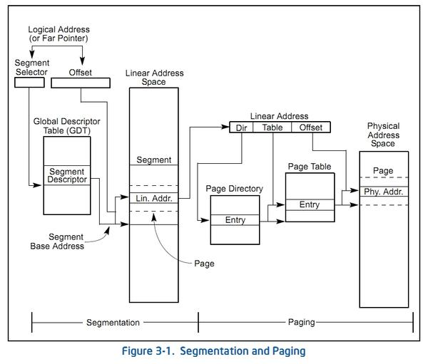
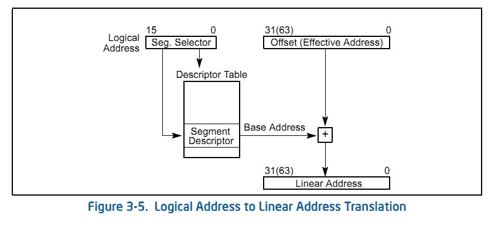

# OS 속 들여다 보기 - OS의 내부 동작 원리

- 의문
- 16.0 프로그램 실행과 메모리 관리 진화 순서
- 16.1 프로세스 vs 메모리
- 16.2 프로그램이 실행되기까지
- 16.3 멀티 프로그램을 위한 메모리 관리
- 16.4 페이징
- 16.5 페이징을 활용한 가상 메모리
- 16.6 페이지 테이블을 위한 캐쉬 메모리 - TLBs
- 16.7 페이징을 통한 프로세스간 메모리 공유
- 16.8 CPU의 시간표 - 스케줄링
- 16.9 실시간 운영체제
- 16.10 세그먼테이션

## 의문

- 인터럽트가 발생하여 그것을 처리하는 동안 또 인터럽트가 발생하면 어떻게 되는가?
  - General Purpose OS에서는 Interrupt Enable bit 레지스터를 0으로 설정하여 처리중에 발생한 다른 인터럽트 무시
    - 커널코드는 컨텍스트 스위칭이 존재하지 않음

## 16.0 프로그램 실행과 메모리 관리 진화 순서

- Compile time 주소 바인딩
  - 할당할 주소를 미리 사용자가 정해줘야 함
- Load time 주소 바인딩
  - 모든 코드, 데이터가 한꺼번에 메모리에 올라감
  - 외부 단편화 문제
  - 스와핑 문제
- Paging & Virtual memory
  - 페이지 테이블로 인하여 메모리 엑세스가 두배가 되는 문제
- Paging & Virtual memory & TLBs

## 16.1 프로세스 vs 메모리

- 프로세스와 메모리
  - 개요
    - 32비트 컴퓨터의 경우, 모든 프로그램은 4기가바이트의 메모리를 할당받아 사용
    - 각 프로세스의 메모리들이 0부터 시작해서 주소가 겹침에도, 침범되지 않음
      - 가상 메모리

## 16.2 프로그램이 실행되기까지

- 개요
  - 컴파일러
    - C소스 파일을 컴파일러가 해석, 타겟 CPU에 따라 적절한 인스트럭션을 생성
    - main파일에서 정의된 함수는 해당 함수의 기계어코드 생성
    - `printf`와 같은 함수의 경우, `#include<stdio.h>`에 기술된 stdio.h 파일도 함께 검사해서, `printf`함수가 정의된 것을 확인
      - 함수의 prototype만 정의되어 있음
      - 컴파일러가 prototype에 맞게 코드가 함수를 호출하는지 체크
    - 컴파일 마침
      - call 인스트럭션의 타겟 주소를 생성할 수 없음(아직 함수가 어디에 구현되어있는지 모르므로)
    - .obj 파일 생성
  - 링커
    - 컴파일러가 생성한 obj파일과 따로 지정된 라이브러리 파일들을 모두 검사하고 전부 합쳐서 최종적인 실행파일 생성(링킹)
      - 컴파일러가 obj파일에 체크해 둔 부분을 완성
        - 모든 목적파일과 지정된 라이브러리를 검사해서 체크한 함수가 존재하는지 확인하고 존재하면
        - 그 부분을 실행파일에 복사해오고
        - 그 복사된 주소를 호출하도록 체크한 부분을 채워 넣음
    - 대상
      - 함수의 호출, 전역 변수 참조
- 임베디드 환경 vs 멀티태스킹 OS 환경
  - 임베디드 환경
    - 직접 사용자가 점프할 절대주소나, 데이터가 위치한 메모리의 절대주소를 지정해서 사용
    - 어차피 실행되는 프로그램은 하나이므로 문제가 없음
  - 멀티태스킹 OS 환경
    - 문제
      - OS 자체도 버전업이 되어 사이즈가 바뀜
        - 절대주소를 사용하여 만들어진 응용 프로그램을 다시 컴파일 해줘야 함
    - 해결
      - 재배치 및 적재 시간 주소 바인딩
        - 개요
          - 프로그램을 메모리로 로드하는 시점에서 주소를 결정하는 것
          - OS의 프로그램 로더가 프로그램을 메모리로 로드하는 시점에 결정
          - 프로그램이 재배치가 가능한 형태로 컴파일되어 있어야 함
            - 0번지를 기준으로 한 상대적인 주소만 생성
            - 프로그램의 헤더에 재배치가 필요한 코드의 위치를 모두 기록
        - c.f) 컴파일 시간 주소 바인딩
          - 컴파일러가 컴파일 할 때, 코드에서 메모리상의 절대 주소를 정해주는 것
      - 실행시간 주소 바인딩
        - 개요
          - 주소의 결정이 최종적으로 CPU가 해당 인스트럭션을 실행할 시점에 결정나는 것

## 16.3 멀티 프로그램을 위한 메모리 관리

- 다중 분할 할당
  - 개요
    - 프로그램을 실행할 때, 모든 데이터, 코드를 메모리에 적재
- 문제
  - 모든 데이터, 코드를 메모리에 올리므로 너무 무거운 문제
  - 단편화 문제
    - 외부 단편화
      - 전체 메모리에서 프로그램 단위로 메모리가 듬성듬성 비어버리는 현상
    - 내부 단편화
      - 페이징을 적용할 시 4KB 단위의 메모리 프레임에서 메모리가 듬성듬성 비어버리는 현상
  - 스와핑 문제

## 16.4 페이징

- 구역성(Locality)
  - 종류
    - 공간구역성
      - 어떤 프로세스가 메모리의 한 곳을 일단 엑세스하기 시작하면 그 주변 데이터도 곧이어 사용될 확률이 높음
        - e.g) 인스트럭션은 순차적으로 실행
        - e.g) 배열은 전체 혹은 일부를 순회하면서 검사하는 경우가 많음
    - 시간구역성
      - 시간적인 관점에서 한 번 엑세스된 데이터는 곧이어 다시 엑세스될 확률이 높음
        - e.g) 루프를 돌 때, i와 같은 순회 변수를 사용하는 경우
        - e.g) 스택 세그먼트
  - 활용
    - 공간구역성을 생각하면, 굳이 프로세스 전체 코드나 데이터를 다 메모리에 올릴 필요가 없음
    - 스와핑 자체도 공간구역성을 이용하여, 엑세스가 발생한 일정한 작은 영역에서만 스와핑을 함
    - 단편화 문제는, 공간구역성으로 인하여, 프로세스마다 구역의 크기를 다르게 할 필요가 없을것
      - 32비트 컴퓨터에서는 4KB 정도로 일정한 크기로 나누어서 사용
- 페이징
  - 개요
    - 물리적 메모리를 4킬로바이트 단위로 차례대로 쪼개서 번호를 매김
      - 프레임
    - 프로세스의 코드와 데이터 전체를 4킬로바이트 단위로 쪼갬
      - 페이지
  - Demand 페이징
    - 개요
      - CPU가 메모리 접근을 요구할 때마다 페이지의 부재 여부를 확인해서 없으면 로드
    - 시나리오
      - 프로그램을 실행
      - 프로세스만 생성(메모리에 코드, 데이터 올려두지 않음)
      - CPU가 PC레지스터가 가리키는 메모리 주소에 코드 혹은 데이터가 있는지 확인
      - 코드 혹은 데이터가 없으므로 페이지 폴트 인터럽트(에러) 발생
      - ISR 동작
        - 필요한 페이지를 메모리 프레임 중 한 곳으로 로드
      - 다시 CPU는 정상적인 인스트럭션 수행
        - 웬만하면 페이지 폴트를 일으키지 않을것(공간구역성)
    - 장점
      - 다중 분할 방식 때보다 훨씬 많은 프로세스가 동시에 수행 가능
      - 외부 단편화가 발생하지 않음
      - 서로 다른 프로세스가 같은 주소의 물리 메모리를 엑세스 할 수 있음

## 16.5 페이징을 활용한 가상 메모리

페이지 테이블 도식

- 가상 메모리
  - 개요
    - CPU가 요구하는 논리적 주소와 메모리의 물리적 주소를 매핑하는 기술
    - 페이지 테이블을 사용
      - 몇번째 페이지 + 몇번째 바이트 -> 몇번째 프레임 + 몇번째 바이트
      - 몇번째 바이트는 페이지나 프레임이나 같으므로, 몇번째 페이지가 몇번째 프레임과 매핑되는지만 확인하면 됨
  - 프레임 정보 표현
    - 프레임 안에서 몇번째 바이트인지 나타내기
      - 프레임의 크기 4KB = 2^12바이트
      - 12개의 비트만 있으면 프레임 내부의 몇번째 바이트인지 파악 가능
    - 몇 번째 프레임인지 나타내기
      - 32비트 컴퓨터이면 나머지 20비트로 표현
      - 2^20개의 프레임 = 1048576개의 프레임
  - 페이지 정보 표현
    - 페이지 안에서 몇번째 바이트인지 나타내기
      - 페이지 크기 4KB = 2^12바이트
      - 12개의 비트만 있으면 페이지 내부의 몇번째 바이트인지 파악 가능
    - 몇 번째 페이지인지 나타내기
      - 프레임과 같음
    - 예시
      - `0000 0000 0000 0000 0001 0000 0000 0011`
        - `0000 0000 0000 0000 0001`는 페이지 번호 = 1
        - `0000 0000 0011`는 오프셋 = 4(0부터 인덱싱되므로)
  - 페이지 - 프레임 매핑 페이지 테이블의 문제
    - 사이즈 문제
      - 32비트 CPU에서 필요한 페이지 테이블의 크기가 너무 큼
      - 페이지 테이블은 2^20의 항목을 지녀야 함
      - 각 항목은 또 2^20까지의 수를 표현할 수 있어야 함
        - 항목별 메모리 크기는 3바이트(2^24 비트)
      - 따라서 한 프로세스당 약 6메가바이트의 페이지 테이블이 존재해야 함
    - 해결책
      - 페이지의 사이즈를 크게 잡기
        - 예시
          - 4KB -> 4MB
        - 문제
          - 내부 단편화 문제가 심각해짐
      - *이중 페이지 테이블(다시 공부해보자)*
        - 페이지 테이블 크기 자체가 크므로, 그것 자체를 메모리 페이징을 했던것 처럼 페이징을 함
          - 페이지 번호로 사용하던 구간을 다시 쪼개서, 외부 페이지 테이블의 인덱스와 외부 페이지 테이블의 오프셋으로 나눔
            - 페이지 테이블을 위한 공간을 1MB정도로 확보함
            - 외부 페이지 테이블의 구획을 1KB로 쪼갬
          - 모든 페이지 테이블을 메모리에 보관하는 대신, 구획으로 쪼개진 페이지 테이블 중, 현재 엑세스 중인 구획만 페이지 테이블 메모리에 매핑하고, 이를 위한 외부 페이지 테이블만 메모리 상에 유지

## 16.6 페이지 테이블을 위한 캐쉬 메모리 - TLBs

- 페이징의 단점
  - 페이지 테이블로 인한 메모리 엑세스 횟수의 증가
    - 속도의 병목
    - CPU연산 중에서, 메모리 접근은 매우 느린편에 속함
    - 페이징 도입하면, 메모리에 연속해서 두번 접근해야 함(페이지 테이블 엑세스, 메모리 에서 데이터 가져오는 엑세스)
      - 2배의 시간 지연 발생
- 문제 해결
  - TLBs(Translation Look-aside Buffers)
    - 개요
      - CPU 내부의 일종의 하드웨어로서, 페이지 테이블의 캐쉬 메모리
        - 구역성 이론에 기반
      - 메모리 엑세스시, 페이지 테이블 검색하기 전에 먼저 TLBs를 살펴봄
    - 구조
      - 논리 주소의 페이지 번호 <-> 물리 메모리에서의 프레임 번호
    - 동작
      - 논리 주소가 생성되면, 이 주소의 페이지 번호 비트들은 TLBs의 첫번째 항(페이지 번호 항)과 동시에 비교
        - 동시에 비교하기 때문에 하드웨어가 복잡해지고 비싸짐
      - 일치하는 행이 발견되면, 그 행의 프레임 번호가 활용됨
      - 일치하는 행이 발견되지 않으면, 페이지 테이블로가서 프레임 번호를 읽어옴 & 페이지 번호와 프레임 번호를 TLBs에 기록
        - 구역성에 의해 한동안 TLBs만으로 물리 주소 생성 가능
        - TLBs는 2000행 내외이나, 효과가 엄청남

## 16.7 페이징을 통한 프로세스간 메모리 공유

- 배경
  - 인터넷 익스플로러에서 팝업 창이 뜬다던지, 새로운 창을 띄우는 경우가 존재
    - 창이 뜰 때마다 별도의 프로세스 생성
  - 인터넷 익스플로러의 코드 부분을 메모리에 한 번만 로드하고, 데이터만 각 프로세스별로 로드
    - 페이지 테이블을 잘 조작
      - *구체적으로 어떻게 페이지 테이블을 조작하는 것일까?*
    - 윈도우즈에서는 DLL라는 이름으로 이러한 기술을 활용
- DLL
  - 개요
    - 윈도우즈는 4GB 프로세스 공간 중 상위 2GB는 항상 DLL을 위한 공간으로 활용
    - WIN32 API와 같은 시스템 함수들은 전부 DLL형태로 구성
      - 메모리상의 코드를 공유해서 메모리 절약

## 16.8 CPU의 시간표 - 스케줄링

- 스케줄링
  - 개요
    - CPU 자원의 수행권을 분배해주는 것
- 문맥 전환
  - 개요
    - 실행되던 프로세스가 멈추고 다른 프로세스를 수행하는 방법
  - 방법
    - CPU의 레지스터 값을 프로세스 마다 할당되는 PCB(Process Control Block)에 저장
      - 사실, 윈도우즈는 스레드의 개념을 사용해 TCB에 레지스터를 백업
      - PCB에 저장되는 것들
        - 레지스터
        - 페이지 테이블
        - fds
        - 프로세스 이름
    - 비선점형 OS
      - OS의 API(Sleep, ReadFile 과같은 함수)함수에서 문맥 전환 함수를 호출함
        - **OS는 능동적으로 동작하지 않는다**
          - OS는 일종의 라이브러리 형태로 OS함수를 제공하고, 작성된 프로그램에 의해 시스템 운영을 해나가는 보조적인 역할
          - e.g) 비선점형 OS 문맥전환, 힙 메모리 할당(malloc)
      - 그러한 함수가 호출되지 않고 계속 작업할 경우, 나머지 프로세스는 대기
      - e.g) Windows95
    - 선점형 OS
      - 외부 타이머 레지스터의 타이머 인터럽트 + 비선점 OS의 방식처럼 API함수를 이용한 문맥 전화
        - 인터럽트가 발생하면 ISR에서 문맥 전환을 하는 코드를 실행
      - e.g) Windows98
- c.f) 최대 절전 모드
  - 개요
    - 모든 메모리의 내용과 CPU 레지스터 값 등을 전부 하드디스크에 백업 & 전원 끄기
    - 다시 전원을 키면 OS가 부팅중에 백업 데이터를 메모리와 CPU 레지스터를 옮김
      - 전원끄기 이전 상태로 돌아감

## 16.9 실시간 운영체제

*아직 완벽히 이해가 되지는 않음*

- 실시간 시스템
  - 개요
    - 반응 속도가 큰 이슈가 되는 시스템
      - 반응 시간이 항상 일정
      - 적어도 최대 반응 시간 이내에 무조건 실행
  - 종류
    - Hard Real Time System
      - 심장 보조 장치
      - 미사일 발사 시스템
    - Soft Real Time System
      - DVD player
- RTOS
  - 개요
    - 모든 동작이 예측 가능한 시간 안에 이루어져야 하고, 그것을 만족시켜주는 OS
      - 인터럽트 핸들링
        - 언제나 발생할 수 있는 수많은 인터럽트에 대해, 일정한 시간 안에 처리를 끝낼 수 있게 해줌으로써, 한 인터럽트의 처리로 인해 다른 인터럽트가 걸리지 못하게 하는 상황을 최대한 줄여줌
        - e.g) 키보드나, 마우스 관련 인터럽트
          - 인터럽트에 대한 동작 처리 시간이 사용자의 다음 input보다 빠르면 문제가 없음
            - 인터럽트 핸들링 자체 말고
      - 프로세스 스케줄링
        - 프로세스의 수에 상관없이 항상 균일한 시간 간격으로 프로세스 스케줄링을 해주는 것
  - 다단계 인터럽트 방식 채용
    - 개요
      - 인터럽트가 발생하면 각 인터럽트 별 task목록 버퍼에다가 task삽입
        - task는 우선순위가 존재
        - 각 task는 별도 프로세스가 되어서 해당 task를 실행
      - ISR에서는 그냥 바로 반환
  - 다음 조건을 만족해야 함
    - 조건
      - 선점형 방식
      - 우선순위 스케줄링 지원
      - 인터럽트 지연
        - 인터럽트가 걸리지 못하는 시간이 일정해야 함
        - *이건, ISR처리를 그냥 바로 반환하면서 충족?*
      - 스케줄링 지연 시간이 일정해야 함
        - 프로세스의 개수와 상관없이 우선순위 검색에 걸리는 시간은 일정
        - 프로세스가 많아지면, 그만큼 한 프로세스가 차지할 수 있는 시간이 줄어드는데, 이 시간에 맞추어 충분히 원하는 데이터 처리를 할 수 있게 하는건 응용 프로그램 혹은 하드웨어 개발자의 몫
    - 의문
      - 프로세스가 무한정 spawn가능한 것은 아닌데, 스왑이 일어나서 동작 속도가 너무 느려지는 경우 어떻게하는가?
- 리눅스, Windows는 RTOS인가?
  - 선점형 방식 x
    - OS의 시스템 함수(커널 코드)가 선점성을 지원하지 못함
      - 따라서, 낮은 우선순위의 프로세스가 커널 코드를 수행하고 있을경우, 높은 우선순위 프로세스로 컨텍스트 스위칭 불가
      - 이유
        - 공유자원에 대한 문제(CreateFile을 하는 동안, DeleteFile로 문맥전환 되면...)
  - 우선순위 스케줄링 지원 o
  - 인터럽트 지연 o

## 16.10 세그먼테이션

X86 CPU에서 제공하는 세그먼테이션과 페이징 기능 도식

X86 CPU에서 제공하는 세그먼테이션 기능

- 페이징 vs 세그먼테이션
  - 페이징
    - 개요
      - 논리적 메모리를 동일한 크기의 페이지로 나누고, 물리적 메모리를 동일한 크기의 프레임으로 나눔
  - 세그먼테이션
    - 개요
      - 논리적으로 의미가 있는 구획끼리 묶어서 나눔
      - 코드, 데이터, 힙, 스택
    - 장점
      - 논리적인 단위로 구분해서 프로그래밍 하기 용이해짐
        - 코드 세그먼트(CS), 데이터 세그먼트(DS) 레지스터를 마련해두면, 그 구간 안에서는 절대주소 체계로 프로그램 작성 가능
      - **메모리의 사용 용도를 논리적으로 제약 둘 수 있음**
        - e.g) 코드 세그먼트 부분의 메모리를 수정하려면, CPU가 에러를 발생시켜 프로그램 보호
  - **페이징과 세그먼테이션의 구현이 대척됨**
- 다중 프로그램 OS의 등장
  - 개요
    - *세그먼테이션과 페이징의 혼합*
      - *이 부분이 잘 이해가 안된다*
        - 프로그램이 컴파일되어서 바이너리파일이 생성되면, 메모리 접근은 상대주소로 0부터 할당이 되는데
        - *이 상대주소를 논리주소로 변환하는건가? 아닌가? 애초에 링커에서 메모리 주소를 논리주소로 주는것인가?*
      - 3-1 그림에서 Linear Address Space(Logical Address Space)가 존재
  - 구현
    - CPU가 생성하는 논리주소 = 세그먼트 레지스터(segment selector register)에서 지정하는 인덱스 + 나머지(오프셋)
    - 세그먼트 레지스터를 지정하는 인덱스를 참고해서 세그먼트 디스크립터를 찾음
      - 세그먼트 디스크립터
        - 세그먼트 시작 주소, 세그먼트 권한, 세그먼트 최대 크기
    - 제2의 논리주소(선형 주소) = 세그먼트 시작 주소 + 오프셋
      - 제2의 논리주소로 페이징 적용
    - 제3의 물리주소로 매핑
  - 단점
    - 최종 물리 주소 생성까지의 걸리는 시간이 늘어남
      - TLBs, 세그먼테이션에서 사용하는 전용 세그먼트 레지스터를 마련해서 성능 향상
