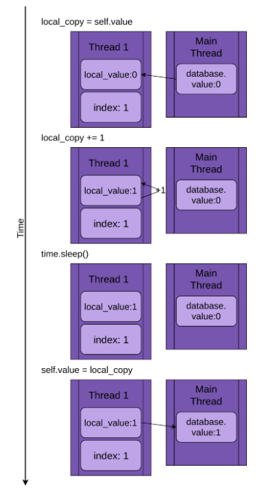

# 파이썬 스레딩

- 의문
- 개요
  - thread
  - Daemon thread
- Working with many threads
  - ThreadPoolExecutor
  - Race Conditions
  - Basic Synchronization Using Lock
  - Deadlock
- Producer-Consumer Threading
  - 1 Producer-Consumer Using Lock
  - 2 Producer-Consumer Using Queue
- Threading Objects
  - Semaphore
  - Timer
  - Barrier

## 의문

- *(중요) 파이썬 스레딩을 이용할 때 스레드 내부의 exception을 어떻게 처리해야 하는가?*

## 개요

- 스레딩
  - 개요
    - concurrently 프로그램을 실행 할 수 있도록 함
    - 코드 디자인을 심플하게 함

### thread

- 개요
  - 하나의 실행의 흐름
  - 외부 이벤트를 기다리는데에 많은 시간을 소비하는 tasks은 스레딩을 도입 하기에 좋은 대상이다
    - 반대로, CPU 사용이 많고 외부 이벤트를 기달리는 시간이 매우 작은 경우에는 더 빨라지지 않는 경우도 존재
  - 프로그램의 디자인이 간결해짐
- c.f) 코루틴
  - 스레드
    - 하나의 프로세스에서 자원을 얼마나 효율적으로 사용할 것인가(특히 IO)
  - 코루틴
    - 하나의 스레드에서 자원을 얼마나 효율적으로 사용할 것인가(특히 IO)

기본적인 스레딩 예시 코드

```py
import logging
import threading
import time

def thread_function(name):
    logging.info('Thread %s: starting', name)
    time.sleep(2)
    logging.info('Thread %s: finishing', name)

if __name__ == '__main__':
    format = '%(asctime)s: %(message)s'
    logging.basicConfig(format=format, level=logging.INFO, datefmt='%H:%M:%S')

    logging.info('Main : before creating thread')
    x = threading.Thread(target=thread_function, args=(1,))
    logging.info('Main : before running thread')
    x.start()
    logging.info('Main : wait for the thread to finish')
    # block until thread x finish
    x.join()
    logging.info('Main : all done')

```

### Daemon thread

- 개요
  - 메인 프로그램이 종료되면 데몬 스레드도 즉시 종료됨
  - 즉, daemon thread는 종료를 걱정할 필요 없이 background에서 실행되는 스레드
    - daemon thread가 아닌 스레드를 프로그램이 실행하면, 프로그램을 종료하기 전 해당 스레드들이 종료될 때 까지 기다림
- 코드
  - `x = threading.Thread(target=thread_function, args=(1,), daemon=True)`
    - 위의 예시에서 이렇게 지정하고, `x.join()`을 주석으로 두면, 해당 프로그램은 x 스레드를 기다리지 않고 바로 종료
- `join()`
  - daemon thread던 일반 thread던 callee 스레드가 실행이 끝날 때 까지 caller thread를 blocking함

## Working with many threads

- 문제
  - 단순히 for loop으로 스레드를 실행시키고 `join()`으로 블록 시키면 순서대로 스레드가 끝나지 않아서 예상하지 못한 결과를 반환
  - **스레드를 실행하는 순서는 os가 정해주므로 예측하기 힘듬**
    - 심지어 실행시 마다 다름

### ThreadPoolExecutor

- 개요
  - `concurrent.futures` 스탠다드 라이브러리에 포함됨
    - `with` context manager로 쉽게 위의 for loop으로 실행하는 스레드를 만들 수 있음
- 특징
  - 여전히 os가 스레드 실행 순서를 관장하므로 순서 보장을 할 수 없음

```py
import time
import concurrent.futures

def thread_function(name):
    logging.info('Thread %s: starting', name)
    time.sleep(2)
    logging.info('Thread %s: finishing', name)

if __name__ == '__main__':
    format = '%(asctime)s: %(message)s'
    logging.basicConfig(format=format, level=logging.INFO, datefmt='%H:%M:%S')

    with concurrent.futures.ThreadPoolExecutor(max_workers=3) as executor:
        executor.map(thread_function, range(3))
        logging.info('done')

# Thread 0: starting
# Thread 1: starting
# Thread 2: starting
# done
# Thread 1: finishing
# Thread 0: finishing
# Thread 2: finishing
```

### Race Conditions

- 개요
  - 두개나 그 이상의 스레드가 공유 데이터나 자원을 접근할 때 발생함
  - race condition은 명백하지 않음
    - 디버깅하기 힘듬
  - os는 심지어 `x = x + 1`과 같은 코드에서 x의 값만 읽고 컨텍스트 스위칭을 할 수 있음(다시 돌아와서 갱신)
    - 어셈블리어를 생각해보면 매우 자명함

문제의 코드

```py
import logging
import time
import concurrent.futures

class FakeDatabase:
    def __init__(self):
        self.value = 0

    def update(self, name):
        logging.info('Thread %s: starting update', name)

        # local_copy는 thread-safe
        # local-variable
        local_copy = self.value
        local_copy += 1
        time.sleep(0.1)

        self.value = local_copy
        logging.info('Thread %s: finishing update', name)

if __name__ == '__main__':
    format = '%(asctime)s: %(message)s'
    logging.basicConfig(format=format, level=logging.INFO, datefmt='%H:%M:%S')

    database = FakeDatabase()
    logging.info('Testing update. Starting value is %d.', database.value)
    with concurrent.futures.ThreadPoolExecutor(max_workers=2) as executor:
        for index in range(2):
            # submit: 스레드에서 실행하는 함수에 positional / named arguments를 전달 가능한 함수
            executor.submit(database.update, index)
    logging.info('Testing update. Ending value is %d.', database.value)

# output
# Testing unlocked update. Starting value is 0.
# Thread 0: starting update
# Thread 1: starting update
# Thread 0: finishing update
# Thread 1: finishing update
# Testing unlocked update. Ending value is 1.
```

위 코드 그림 해설



### Basic Synchronization Using Lock

- Lock(Mutex(Mutual Exclusion))
  - race condition의 해결책중 하나
  - 한번에 하나의 스레드만 lock을 갖을 수 있음
    - 다른 lock을 원하는 스레드는 owner가 풀어주기 까지 기다려야 함(`.acquire()`, `.release()`)
    - 다른 lock을 갖은 스레드가 release하지 않으면 프로그램의 실행 흐름이 막혀버림
  - `with`와 같은 context manager과 같이 쓰임
    - release를 하지 않아도 알아서 해줌
- Lock을 이용한 문제 해결

코드

```py
import logging
import time
import concurrent.futures
import threading

class FakeDatabase:
    def __init__(self):
        self.value = 0
        self._lock = threading.Lock()

    def update(self, name):
        logging.info('Thread %s: starting update', name)
        logging.debug('Thread %s about to lock', name)
        with self._lock:
            logging.debug('Thread %s has lock', name)

            local_copy = self.value
            local_copy += 1
            time.sleep(1)

            self.value = local_copy
            logging.debug('Thread %s about to release lock', name)
        logging.debug('Thread %s after release', name)
        logging.info('Thread %s: finishing update', name)

if __name__ == '__main__':
    format = '%(asctime)s: %(message)s'
    logging.basicConfig(format=format, level=logging.INFO,
     datefmt='%H:%M:%S')
    logging.getLogger().setLevel(logging.DEBUG)

    database = FakeDatabase()
    logging.info('Testing update. Starting value is %d.', database.value)
    with concurrent.futures.ThreadPoolExecutor(max_workers=2) as executor:
        for index in range(2):
            executor.submit(database.update, index)
    logging.info('Testing update. Ending value is %d.', database.value)

# 22:38:40: Testing update. Starting value is 0.
# 22:38:40: Thread 0: starting update
# 22:38:40: Thread 1: starting update
# 22:38:40: Thread 0 about to lock
# 22:38:40: Thread 1 about to lock
# 22:38:40: Thread 0 has lock
# 22:38:41: Thread 0 about to release lock
# 22:38:41: Thread 0 after release
# 22:38:41: Thread 1 has lock
# 22:38:41: Thread 0: finishing update
# 22:38:42: Thread 1 about to release lock
# 22:38:42: Thread 1 after release
# 22:38:42: Thread 1: finishing update
# 22:38:42: Testing update. Ending value is 2.
```

### Deadlock

Deadlock의 예시

```py
import threading

l = threading.Lock()
print('before first acquire')
l.acquire()
print('before second acquire')
# wait for the lock to be released
l.acquire()
print('acquired lock twice')
```

- 위와 같은 실수를 범하지 않기 위해 context manager를 사용하는 것이 바람직
- `RLock`
  - 스레드가 `.acquire()`를 `.release()`전에 여러번 호출 할 수 있도록 함. 대신 나중에 `.release()`를 acquire한 횟수만큼 불러줘야 함

## Producer-Consumer Threading

- 배경
  - 네트워크로 부터 메시지를 읽고, 디스크에 메시지를 작성하는 프로그램
    - producer component
      - 메시지는 자신이 request를 보내는 것이 아닌, push를 받음(엄청나게 많은 수가 한번에 오는 경우가 존재). 그 push를 받는 부분
    - consumer component
      - 메시지를 받으면, 데이터베이스에 작성함. 데이터 베이스 접근은 느리긴 하나, 평균 메시지의 페이스를 커버할 정도는 되는데, 한꺼번에 밀려오는 메시지의 페이스를 커버할 수는 없음. 이러한 역할을 하는 부분
    - Pipeline
      - producer - consumer 를 이어주는 부분

### 1. Producer-Consumer Using Lock

Lock 을 이용한 Producer-Consumer 예시(좋지 못한 솔루션)

```py
import random
import logging

# 보초
SENTINEL = object()

class Pipeline:
  """
  Class to allow a single element pipeline between producer and consumer.
  """
  def __init__(self):
    self.message = 0
    self.producer_lock = threading.Lock()
    self.consumer_lock = threading.Lock()
    # consumer should wait until a message is present
    self.consumer_lock.acquire()

  def get_message(self, name):
    self.consumer_lock.acquire()
    message = self.message
    self.producer_lock.release()
    return message

  def set_message(self, message, name):
    self.producer_lock.acquire()
    self.message = message
    self.consumer_lock.release()

def producer(pipeline):
  # Pretend we're getting a message from the network
  for index in range(10):
    message = random.randint(1, 101)
    logging.info("Producer got message: %s", message)
    # 메시지를 consumer가 receive 하기 전까지는 locked됨(즉, get_message의 호출이 있어야 함)
    pipeline.set_message(message, "Producer")

  # Send a sentiel message to tell consumer we're done
  pipeline.set_message(SENTINEL, "Producer")

def consumer(pipeline):
  message = 0
  while message is not SENTINEL:
    # 메시지가 새로 갱신되기 전까지는 locked됨(즉, set_message의 호출 있어야 함)
    message = pipeline.get_message("Consumer")
    if message is not SENTINEL:
      logging.info("Consumer storing message: %s", message)

if __name__ == '__main__':
  format = "%(asctime)s: %(message)s"
  logging.basicConfig(format=format, level=logging.INFO, datefmt="%H:%M:%S")
  # logging.getLogger().setLevel(logging.DEBUG)

  pipeline = Pipeline()
  with concurrent.futures.ThreadPoolExecutor(max_workers=2) as executor:
    executor.submit(producer, pipeline)
    executor.submit(consumer, pipeline)

"""result
Producer got data 43
Producer got data 45
Consumer storing data: 43
Producer got data 86
Consumer storing data: 45
Producer got data 40
Consumer storing data: 86
Producer got data 62
Consumer storing data: 40
Producer got data 15
Consumer storing data: 62
Producer got data 16
Consumer storing data: 15
Producer got data 61
Consumer storing data: 16
Producer got data 73
Consumer storing data: 61
Producer got data 22
Consumer storing data: 73
Consumer storing data: 22
"""
```

- 의문
  - 위의 코드는 coroutine, 혹은 generator로 작성 가능하지 않는가?
- **thread가 블록되면, os는 항상 swap하여 다른 실행가능한 스레드를 찾음**
  - 위의 경우에서는 producer가 블록되면 consumer를 실행
- 위의 예시에서는 값을 하나만 다룰 수 있었음

### 2. Producer-Consumer Using Queue

- `threading.Event`
  - 한 스레드가 이벤트를 발생시켜, 다른 스레드들이 해당 event가 일어나는 것을 기다리게 함

```py
import time
import logging
import threading
import concurrent.futures
import queue
import random
# Queue is thread-safe
class Pipeline(queue.Queue):
    def __init__(self):
        # if maxsize is not set, then it grows until computer's memory size limit
        # if maxsize is given, it will limit the queue and block until there are fewer than maxsize elements
        super().__init__(maxsize=10)

    def get_message(self, name):
        value = self.get()
        return value

    def set_message(self, value, name):
        self.put(value)

def producer(pipeline, event):
    # SENTINEL 대신 event를 사용
    while not event.is_set():
        message = random.randint(1, 101)
        logging.info("Producer got message: %s", message)
        pipeline.set_message(message, "Producer")

    logging.info("Producer received EXIT event. Exiting")

def consumer(pipeline, event):
    while not event.is_set() or not pipeline.empty():
        message = pipeline.get_message("Consumer")
        logging.info(
            "Consumer storing message: %s  (queue size=%s)",
            message,
            pipeline.qsize(),
        )

    logging.info("Consumer received EXIT event. Exiting")

if __name__ == "__main__":
    format = "%(asctime)s: %(message)s"
    logging.basicConfig(format=format, level=logging.INFO,
                        datefmt="%H:%M:%S")
    logging.getLogger().setLevel(logging.DEBUG)

    pipeline = Pipeline()
    event = threading.Event()
    with concurrent.futures.ThreadPoolExecutor(max_workers=2) as executor:
        executor.submit(producer, pipeline, event)
        executor.submit(consumer, pipeline, event)

        time.sleep(0.1)
        logging.info("Main: about to set event")
        event.set()
```

- 의문
  - 위의 코드에서 consumer가 다수라면?
    - 충분히 잘 동작한다(queue는 thread-safe)

## Threading Objects

- `threading`모듈에서 쓸 모 있는 primitives

### Semaphore

- 특별한 속성을 지닌 counter(atomic)
  - os는 counter를 incrementing / decrementing 할 때 swap out하지 않는 것을 보장
  - 카운터는 `.release()`할 때 증가하고 `.acquire()`할 때 감소함
  - 한 스레드가 카운터 값이 0일 때 `.acquire()`하면 스레드는 다른 하나의 스레드가 `.release()`해서 카운터 값이 1이 될 때 까지 블로킹함
- **제한된 capacity를 갖는 리소스를 보호하기 위해서 사용**
  - 예시
    - connection pool과 pool의 사이즈를 특정 숫자로 고정할 때 사용(DB의 커넥션 풀이라던지)

### Timer

- 특정 시간이 지난뒤에 스케쥴된 함수를 호출하는 방식
  - `t = threading.Timer(30.0, my_function)`
    - my_function을 30초 마다 실행
    - 하지만 자신이 원하는 타이밍에 정확히 실행한다는 보장은 없음

### Barrier

- 고정된 숫자의 스레드를 싱크하는 것을 유지하는데에 사용
  - Barrier를 생성할 때, 얼마나 많은 수의 스레드 들을 이것에 싱크로나이징 할 것인지 설정해야 함
  - 각각의 스레드는 Barrier에서 `.wait()`하고 있음
  - 각각의 스레드는 Barrier에서 정해진 숫자의 스레드가 기다리고 있을 때 까지 blocked 되고, 동시에 released 됨
  - 다 같이 released된다고 해도, os에 의해서 스케쥴링 되므로, 한 시점에 하나의 스레드만 실행될 것임
- 사용 예시
  - allow a pool of threads to initialize themselves
    - 모든 스레드의 initialization을 끝내고 난 뒤에 본격적인 각 thread들이 행동을 시작할 수 있도록 함
