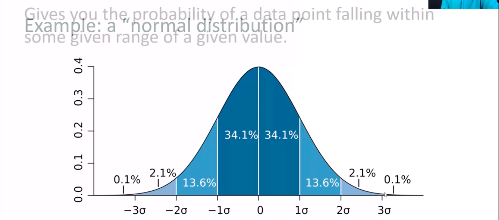
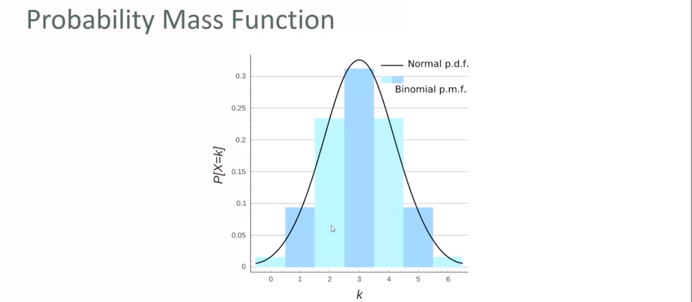
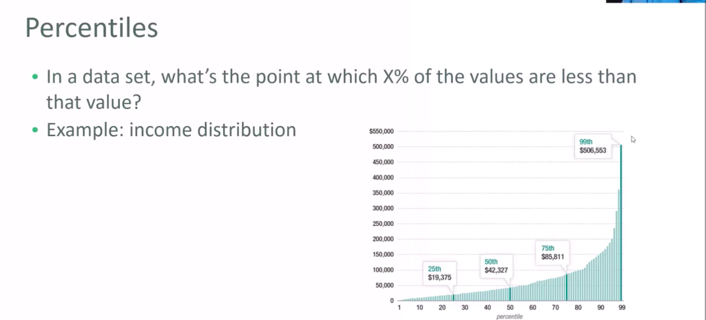
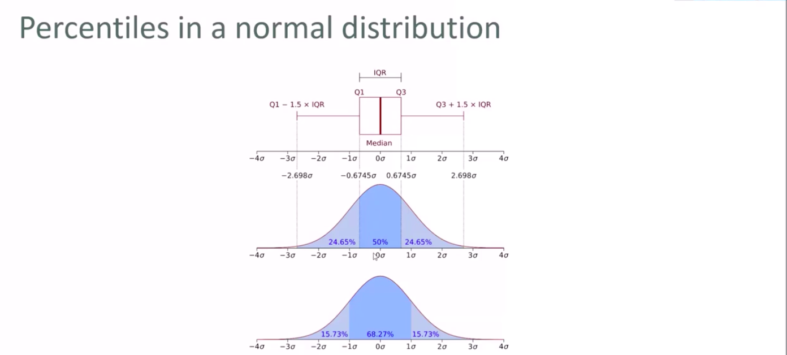
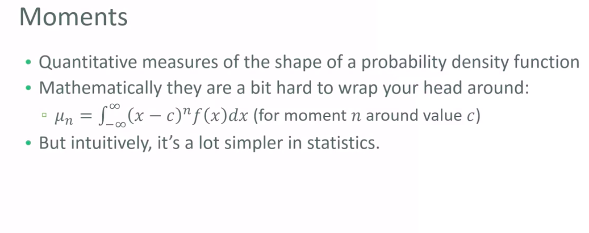
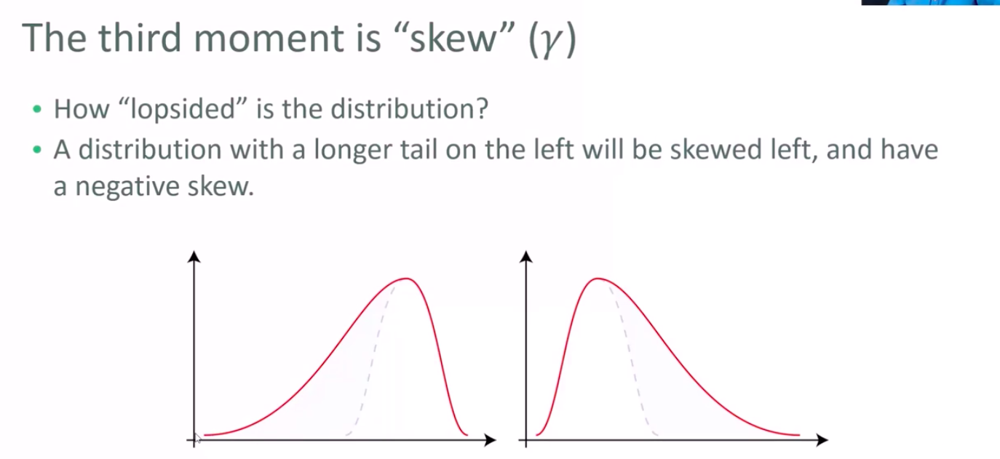
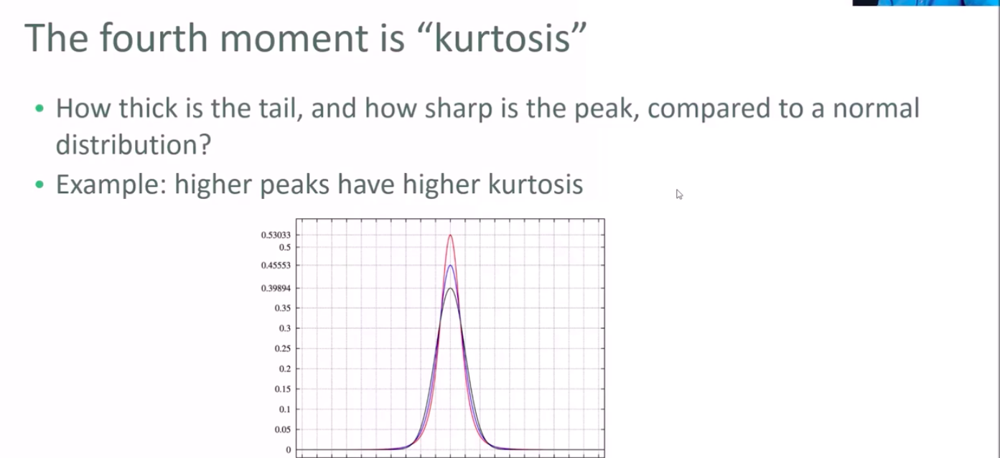
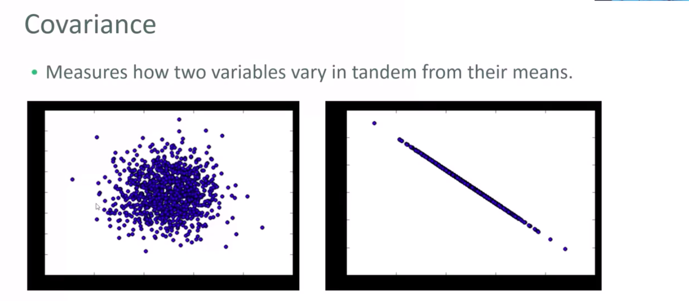
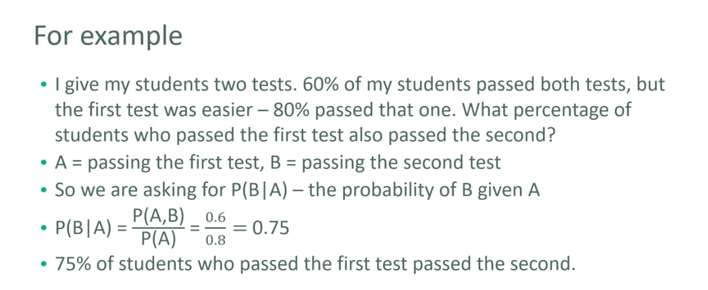
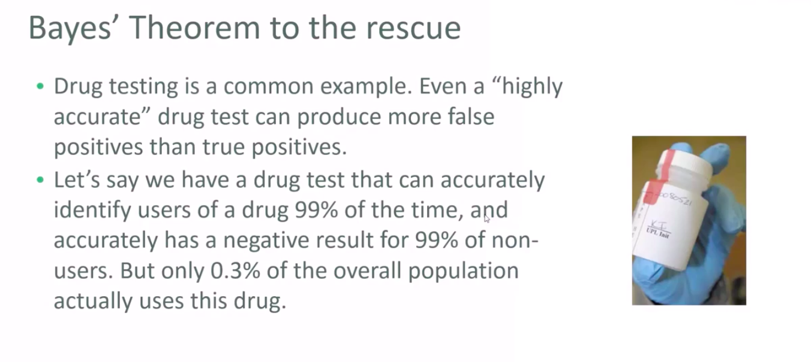

# Data science

## Type of data

- 수치데이터(numerical data)
  - 양적 측정량을 의미
    - e.g Heights of people, page load times, stock prices
    - 이산 데이터(Discrete data)
      - 정수 기반, 어떠한 이벤트의 횟수를 나타냄(보통)
        - 한 고객이 얼마나 많은 구매를 했는가?
        - 얼마나 많이 동전 던지기 해서 앞면이 나왔는가?
    - 연속 데이터(Continuous data)
      - 무한한 확률 값이 존재할 수 있음
        - 유저가 체크아웃 하는데 얼마나 시간이 걸리는가?
        - 하루에 비가 얼마나 내리는가?
- 카테고리 데이터(categorical data)
  - 수학적 의미가 없는 양적 데이터
    - 비교가 불가
    - 단순히 분류하기 위함
  - 성별, Yes/no(binary data), 인종, 주(state) 카테고리, 상품 카테고리, 정당 등
  - 카테고리에 숫자를 부여할 수 있으나, 수학적 의미는 존재하지 않음
- 순서자료 데이터(ordinal data)
  - numerical, categorical데이터의 합성
  - 수량적 순서는 있으나 간격은 명확하지 않음
  - e.g
    - 영화 감상평 1-5 스타(5개의 카테고리 + 수학적 의미 존재)

각각의 데이터 타입마다 다른 분석방법을 적용

## Mean Median Mode

**언제나 평균이 중앙값보다 낫다고 할 수 없음**

### 평균(Mean)

- Average
- 데이터 값의 합 / 데이터 수

### 중앙값(Median)

- 값을 소팅한 후 가장 마지막에 있는데이터 추출
- 데이터의 개수가 짝수면 가운데 두값의 평균을 중앙값으로 하는 경우가 있음
- **중앙값은 평균보다 극단값(outlier)에 덜 민감함**
  - 미국의 소득 분포를 볼떄 평균보다 중앙값을 참고하는게 좋음

### 최빈값(Mode)

```
0, 2, 3, 2, 1, 0, 0, 2, 0

0: 4,
1: 1,
2: 3,
3: 1
```

- 위의 경우 최빈값은 0
- 데이터에서 가장 흔한 값
  - 연속 수치데이터랑은 관게 없음

## 분산과 표준편차(Standard Deviation)

### 분산(Variance)

- 데이터가 얼마나 분포되어 있는가를 측정
- (데이터 값 - 평균)^2 / 데이터 수
- 예시
  - (1, 4, 5, 4, 8)의 분산?
    - 평균: 4.4
    - 차수: (-3.4, -0.4, 0.6, -0.4, 3.6)
    - 차수의 제곱: (11.56, 0.16, 0.36, 0.16, 12.96)
    - 분산: (11.56, 0.16, 0.36, 0.16, 12.96) / 5 = 5.04

### 표준편차(Standard Deviation)

- 분산의 루트 값
  - sigma^2 = 5.04
  - sigma = root(5.04) = 2.24
- 극단값 판별에 사용
  - 평균에서 1*표준편차를 넘는 차이를 보이는 값은 이상값으로 생각함
  - 데이터가 얼마나 극단적인가를 **"얼마나 많은 시그마 차이를 보내는가"** 로 나타낼 수 있음
- 모수 vs 표본(Population, Sample)
  - 모수 데이터가 아니라 표본 데이터를 다루는경우
  - 모분산(population variance)이 아닌, 표본분산(sample variance)를 사용해야 함
  - N크기의 표본에서 분산을 구할 경우 `N-1`로 나누어야 함
  - 아까의 모분산 = 11.56 + 0.16 + 0.36 + 0.16 + 12.96 / 5 = 5.04
  - 아까의 표본분산 = 11.56 + 0.16 + 0.36 + 0.16 + 12.96 / 4 = 6.3

## 확률 분포 함수(Probability Distribution Function)

### 확률 밀도 함수(Probability Density Function)



- 위는 정규분포(Normal distribution)의 경우
- 연속 수치 데이터의 경우

### 확률 질량 함수(Probability Mass Function)



- 이산 수치 데이터의 경우

## 백분위(Percentile)





- 어떠한 값이 X%의 값보다 작은 값중에 가장 클까?
- 예: 소득 분포

## 모먼트



- 확률 밀도 함수의 모양을 양적 측정을 한 것

### 첫번째 모먼트

- 평균

### 두번쨰 모먼트

- 분산

### 세번쨰 모먼트



- `skew`
- 어떻게 한쪽으로 치우침이 분포되어있는가?
- 왼쪽으로 긴 꼬리가 있는 분포는 음의 skew를 갖는 왼쪽으로 치우친 분포임

### 네번쨰 모먼트



- `kurtosis`
- **정규 분포에 비해서** 얼마나 꼬리가 굵고, 정상이 뾰족한가?

## 공분산과 상관관계

### 공분산(Covariance)



- 두 변수가 얼마나 관계가 있는지 나타내는 지표
  - 위의 그림에서 왼쪽 그래프가 나이와 소득을 나타낸다고 하자
    - 나이와 소득은 관계가 없어보임
    - 작은 공분산
  - 오른쪽 그래프
    - 선형적 관계가 있어보임
    - 큰 공분산
- 공분산 측정하기
  - 두 변수의 데이터가 높은 차원(high-dimensional)의 벡터라고 하자
  - 이 벡터를 편차의 벡터로 변환
  - 두 벡터의 dot product를 구함
  - 샘플 크기로 나눔
- 공분산 해석은 힘듬
  - 0과 가까울 수록 적은 상관관계
  - 0에서 멀 수록 큰 상관관계
    - 하지만 애초에 **크다** 를 어떻게 생각할 것인가?
- 상관관계의 등장
  - 공분산을 각각의 표준편차로 나눔(정규화)
  - -1값 == 완벽한 음의 상관관계
  - 0값 == 상관관계가 존재하지 않음
  - 1값 == 완벽한 양의 상관관계
- **상관관계는 인과관계가 아님**
  - 오직 제어되고, 랜덤화된 실험만이 인과관계를 알 수 있게 해줌
  - **상관관계는 어떠한 실험을 할 것인가를 정할 떄 사용**

## 조건부확률(conditional probability)



- 사전이 서로 의존(dependent)하고 있을때, 두 사건이 둘다 일어날 확률은?
- 예시
  - 이 상품을 구매한 사람들이 구매한 다른 상품(확률)
- 작성법
  - `P(A, B)`: A와 B가 독립적으로 일어날 확률
  - `P(B|A)`: A가 일어난 뒤 B가 일어날 확률
  - `P(B|A) = P(A, B) / P(A)`
  - 위 공식은 벤다이어그램을 그려보면 알기 쉬움

## 베이지안 이론(Bayes' Theorem)



- 정의
  - `P(A|B) = P(A) * P(B|A) / P(B)`
- 예시
  - 약 테스트
    - 매우 정확한 신약 실험이 오히려 진정한 양성반응보다 잘못된 양성반응(false positive)을 야기할 수 있음(????)
  - 이벤트 A: 신약의 복용자, 이벤트 B: 테스트에 양성
  - `P(B) = (0.99 * 0.003 + 0.01 * 0.997) = 1.3%`
  - `P(A|B) = P(A) * P(B|A) / P(B) = 22.8%`
  - 즉, 테스트가 양성일떄 그 사람이 신약 복용자일 가능성은 오직 22.8%
  - **`P(B|A)`가 높아도, 이는 `P(A|B)`가 높다고 보장할 수 없음**
- 발견
  - B사건에 의존하는 확률은 기본 B와 A의 확률에 크게 의존함
