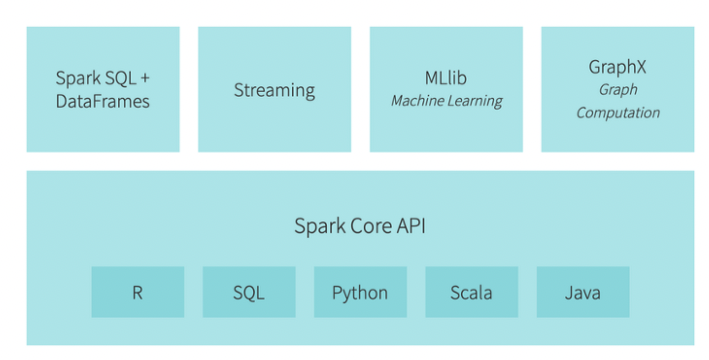
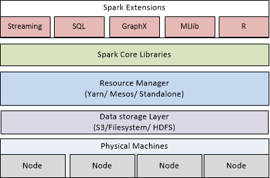
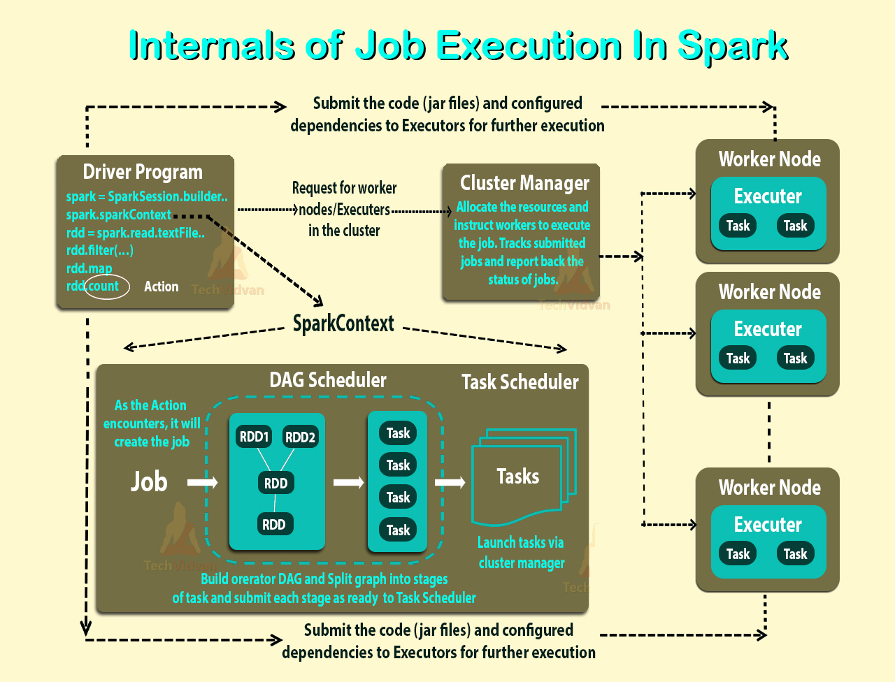

# 스파크

- 참고
- 의문
- 스파크
  - 개요
  - 아키텍처
  - Submit
  - 스파크RDD
  - 스파크SQL

## 참고

- https://stackoverflow.com/questions/32621990/what-are-workers-executors-cores-in-spark-standalone-cluster

## 의문

- *spark-submit을 하면, 알아서 스파크 클러스터 내의 노드에 driver와 executor의 역할을 분배해서 자동으로 실행하는 느낌인가?*

## 스파크

### 개요

스파크 기능



스파크 레이어



- general-purpose 빅데이터 분산처리 엔진(프레임워크)
  - 의미
    - 분산 데이터 / 컴퓨팅
      - 하나의 컴퓨터로는 감당할 수 없는 데이터양을 다룰때 노드에 분산시켜서 다루는 방식
    - 처리 엔진
      - 데이터 프로세싱 태스크를 수행하는 주체
    - general-purpose
      - 다양한 언어 지원, stream data 프로세싱도 지원, 머신 러닝, 그래프 라이브러리 사용 가능
  - 클러스터의 파일 시스템에 데이터를 분산 시키고, 해당 데이터들을 병렬적으로 프로세싱
- 매니지드 솔루션
  - Amazon EMR
  - GCP Dataproc
  - Azure HDInsight
- Spark vs Hadoop
  - 기본적으로 이 비교는 다소 부적절
    - 하둡 배포판에 스파크를 포함시킬 수 있음
      - *그럼 정확하게 어떤 관계인가?*
    - 하둡은 MapReduce라는 처리 엔진을 갖고 있음
  - Spark이점
    - 속도
      - 인메모리 데이터 엔진을 통해 특정 상황에서 MapReduce보다 100배 더 빠르게 작업 가능
      - 단계간에 디스크에 상태를 써야하는 다단계 작업에서 성능차이가 두드러짐
    - 개발자 친화적 API
      - 분산 처리 엔진이 갖는 복잡함의 대부분을 간단한 메서드 호출 뒤로 숨김
- 사용처
  - 데이터 ETL
  - BI
  - 배치 컴퓨테이션
  - 머신 러닝 / 데이터 분석
  - 리얼타임 스트림 프로세싱
- 용어 설명
  - Transformation
    - RDD를 input으로 받아서 새로운 RDD를 lazy하게 생성
  - Action
    - RDD를 input으로 받아서 다른 값을 output으로 생성
      - e.g) count, min, max, RDD의 요소 반환
    - lineage graph를 평가
  - Lineage Graph
    - 논리적인 실행 계획
      - fault tolerant
        - 한 노드가 다운되더라도, 해당 노드가 해야할 작업이 리니지 그래프에 작성되어있고, 그것을 다른 어디서든 재개될 수 있음

### 아키텍처

스파크 클러스터 다이어그램


스파크 내부 구조



- 용어
  - Application
    - 스파크로 만들어진 유저 프로그램
      - 드라이버 프로그램 + executor로 이루어짐
  - Application jar
    - 유저의 Spark 애플리케이션을 포함하는 jar
    - 이 jar에는 Hadoop이나 Spark라이브러리는 포함되어선 안됨
      - 런타임에 더해질 것임
  - Driver
    - 애플리케이션의 `main()`함수를 실행하고, `SparkContext`를 생성하는 **프로세스**
    - 유저의 코드를 받아 다수의 태스크의 집합으로 변환한뒤, 태스크를 executor로 스케쥴링 함
  - Executor
    - 워커 노드 위에서 애플리케이션을 위해서 생성된 **프로세스**
    - 역할
      - 태스크 수행
      - 데이터를 메모리나 디스크에 저장
      - 각 애플리케이션은 자신만의 executor들을 갖고 있음
  - Cluter manager
    - 클러스터 위에서 리소스를 분배하기 위한 서비스
  - Deploy mode
    - 드라이버 프로세스가 어디에서 동작하는지를 구별
    - 종류
      - cluster
        - 클러스터 내부에서 드라이버 프로세스를 동작
      - client
        - 클러스터 외부에서 드라이버 프로세스를 동작
  - Worker node
    - 클러스터 내에서 애플리케이션 코드를 동작시킬 수 있는 임의의 노드
  - Task
    - 하나의 executor에 보내지는 unit of work(일의 단위)
  - Stage
    - job을 stages라고 불리는 태스크들의 집합으로 분리
  - Job
    - 스파크 액션(e.g. save, collect)에 대한 응답으로 생성된 다수의 태스크로 이루어진 병렬 컴퓨팅
      - *간략히 태스크의 집합?*
    - RDD Action의 호출에의하여 트리거링 됨
- 구성 요소
  - cluster manager
    - driver와 executor의 리소스 매니징을 하는 주체
      - 하둡 YARN, Kubernetes 등
  - driver
    - 사용자의 코드를 여러 작업자 노드로 배분할 수 있는 여러 작업으로 변환
  - executor
    - 코드가 실행되면서 할당된 작업 수행
- 동작
  - 0 `spark-submit`커맨드 실행
  - 1 스파크 애플리케이션(SparkContext단위)은 `SparkContext`인스턴스를 시작함
    - 드라이버 프로세스
    - `SparkContext`는 다양한 타입의 cluter manager와 결합할 수 있음
  - 2 드라이버 프로세스는 cluster manager에 executor들을 시작하도록 자원을 요청
  - 3 cluster manager는 executor들을 올림
  - 4 드라이버 프로세스는 유저 애플리케이션을 실행함
    - 결합이 되면, `SparkContext`는 애플리케이션 코드(JAR or Python file)를 executor에 보냄
    - RDD에 대한 actions, transformations에 따라서 태스크가 executors에게 보내짐
  - 5 executors는 태스크를 실행하고 결과를 저장
  - 6 중간에 워커가 크래시가 나면, 해당 워커가 실행했어야 할 태스크가 다른 executors에게 보내져서 다시 프로세싱함
    - 작업 속도가 너무 느려도 다른 노드에서 같은 작업 실행시키고 결과를 가져옴
  - 7 `SparkContext.stop()`이 드라이버 프로세스에서 호출되거나, main method가 크래시가 되거나 끝나면 executor들이 제거되고, 클러스터 자원이 cluster manager에 의해서 해제됨
- 특징
  - 각 애플리케이션은 자신만의 executor processes를 갖음
    - 전체 애플리케이션동안 살아있고, 멀티 스레드에서 태스크 수행
    - 스파크 애플리케이션끼리는 격리되어 있으며, 데이터가 공유되려면 external storage system을 사용해야함(S3 같은 것들)
  - Spark는 주어진 cluster manager와는 agnostic함
  - driver 프로그램은 생애주기동안 executor들의 들어오는 연결을 받을 수 있어야 함(네트워크 주소로 접근가능해야 함)
  - driver 프로그램이 executor들에게 태스크를 스케쥴링 하므로, worker node에 최대한 물리적으로 가까이 존재해야 함
    - 되도록이면 같은 LAN
    - 원격으로 cluster에게 요청을 보내고 싶으면, worker node와 가까운 위치에 위치한 driver에 RPC를 열어서 operation을 submit하는게 나음
- 원리
  - 사용자의 데이터 처리 명령을 DAG로 만듬
    - 어느 작업이 어느 노드에서 어느 순서로 실행되는지 결정
  - 드라이버 코어 프로세스가 스파크 애플리케이션을 여러 작업으로 분할해 다수의 executor프로세스로 분배하면 executor프로세스가 작업 수행
    - executor는 애플리케이션의 필요에 따라서 확장 / 축소 가능

### Submit

`spark-submit`의 커맨드 예시

```sh
./bin/spark-submit \
  --class <main-class> \ # Application의 엔트리 포인트
  --master <master-url> \ # 클러스터의 master URL (deploy mode가 standalone인 경우, 리소스를 관리하는 노드, e.g spark://23.195.26.187:7077)
  --deploy-mode <deploy-mode> \
  --conf <key>=<value> \
  ... # other options
  <application-jar> \ # 번들링 된 jar의 path (애플리케이션과 모든 디펜던시를 포함)
  [application-arguments] # main class에 넘겨지는 args

# YARN 클러스터 매니저 사용
export HADOOP_CONF_DIR=XXX
./bin/spark-submit \
  --class org.apache.spark.examples.SparkPi \
  --master yarn \
  --deploy-mode cluster \
  --executor-memory 20G \
  --num-executors 50 \
  /path/to/examples.jar \
  1000

# k8s 클러스터 매니저 사용
./bin/spark-submit \
--class org.apache.spark.examples.SparkPi \
--master k8s://xx.yy.zz.ww:443 \
--deploy-mode cluster \
--executor-memory 20G \
--num-executors 50 \
http://path/to/examples.jar \
1000
```

- 개요
  - 하나의 클러스터에 애플리케이션들을 실행하는 것
  - 스파크 애플리케이션은 `spark-submit`스크립트를 사용해서 어떤 타입의 클러스터에든 제출 가능
    - 이 이야기는, 클러스터 구성만 하면, 알아서 실행을 나눠서 잘 해준다는 느낌
- 배포 전략
  - 애플리케이션을 워커 머신들과 물리적으로 같이 위치한 gateway machine(바스티온 등)으로부터 애플리케이션을 submit

### 데이터 구조

- 과거
  - RDD(Resilient Distributed Data)
    - immutable, resilient, partitioned
    - 스키마 없음
- 최신
  - Dataset & Dataframe
    - Dataset
      - 데이터의 분산 컬렉션
      - JVM 오브젝트로부터 만들어짐
        - 강타입
      - `map`, `flatMap`, `filter`와 같은 함수형 변환을 사용할 수 있음
      - Dataset API는 Scala, Java에서 사용 가능
        - Python은 불가하지만, 이미 언어적 차원에서 비슷하게 지원
    - Dataframe
      - 이름이 있는 칼럼으로 구성된 Dataset
        - 스키마 존재
      - 개념적으로 RDB의 테이블과 R/Python에서의 data frame과 동등함
        - 하지만 최적화가 더 잘 되어있음
      - Dataframe API는 Scala, Java, Python, R에서 사용 가능

개발자 친화적인 코드 예시

```scala
/* 문서의 단어 수를 세는 코드(맵리듀스는 50줄짜리) */
val textFile = sparkSession.sparkContext.textFile(“hdfs:///tmp/words”)
val counts = textFile.flatMap(line => line.split(“ “))
                      .map(word => (word, 1))
                      .reduceByKey(_ + _)
counts.saveAsTextFile(“hdfs:///tmp/words_agg”)
```

### 스파크RDD(Resilient Distributed Database)

- 개요
  - 컴퓨팅 클러스터 전역으로 분할할 수 있는 불변성 객체 모음을 나타내는 프로그래밍 추상화
    - 클러스터 전반에서 분할되어 병렬 배치 프로세스로 처리가 가능
      - 속도
      - 확장성
- 특징
  - 간단한 텍스트 파일, SQL 데이터베이스, NoSQL 스토어, 아마존 S3버킷을 비롯해 다른 많은 방법으로 만들 수 있음
  - 데이터 집합 조인, 필터링, 샘플링, 집계 가능

### 스파크SQL

- 개요
  - 정형 데이터 프로세싱을 위한 스파크 모듈
  - DataFrame이라는 프로그래밍적 추상화를 제공하고, 분산 SQL 엔진의 역할도 함
