# 정규분포로부터의 표본

카이제곱 분포, t분포, F분포

*카이제곱 분포와 유래란?, 자유도란?*

*표본 평균과 표본 분산(불편분산)은 독립?*

*합병 분산은 왜 사용되는가? (pooled variance)*

*F분포 퍼센트점과 확률 계산*

- 자유도란
  - 수학, 물리학, 화학에서는 어떤 물체의 운동을 설명하기 위해 필요한 변수의 개수라고 생각
- 통계학에서는 아래와 같이 정의
  - The number of degrees of freedom is the number of values in the final calculation of a statistic that are free to vary
  - 변인의 수(자유로이 움직일 수 있는 변수) - 제약
    - 불편분산에서 자유도가 n-1인 이유는, 내가 가진 정보의 수는 n이고, 추정해야할 미지수는 모집단 평균 1개가 되므로 n-1
    - sum(표본 - 표본 평균) === 0
      - 여기서 마지막 (표본 - 표본평균)은 이전 값이 정해지면 자동으로 정해짐(항등식에 의해서 - 제약)

- 목차
  - 배경
    - 관측, 측정, 측정오차
  - 정규분포의 성질
    - 표준정규분포
  - 모집단의 분산을 이미 아는경우의 표본평균의 표본분포
  - 표본분산의 표본분포
    - 카이제곱분포
  - 모집단의 분산이 알려지지 않았을 경우의 표본평균의 표본분포
    - t분포
  - 2표본문제
    - 1 표본평균의 차의 표본분포
      - 모분산을 알고 있는 경우
      - 모분산은 모르나 두 모분산의 값이 같다는 것을 아는 경우
      - 모분산도 모르고 두 모분산이 값이 같다고 할 수 없는 경우
    - 2 표본분산의 비의 표본분포
      - F분포
  - 표본상관계수의 표본분포
    - z변환

## 배경

- 정규모집단으로부터 표본 X1, X2, ..., Xn에 기초한 통계량의 표본분포를 계산하 것이 필요하게되나, 이 계산을 하는 것이 정규표본론임

### 관측, 측정, 측정오차

- 하나의 연필의 길이를 측정하는 것을 행함
  - n번 관측하고, 각 측정값은 서로 독립이며, 연필 그자체와 측정조건 자체가 동일하게 유지되도록 측정하는 것을 생각하여 X1, X2, ... Xn을 표본 이라 하고, 그것을 야기하는 것을 모집단이라 함
  - `Xi = 진정한 값(시그널 = mu) + 오차(노이즈 = e)`
  - 오차는 무엇이 나올지모르는 무작위 변수라고 생각하는 것이 타당
  - 모두 같은 표본 분포를 따르고 각 오차는 독립임
  - 가우스는 `ei ~ N(0, sigma^2)`를 따른다고 생각했음
    - 즉, 오차는 확률변수이며, 양의값 음의값도 있고, 평균은 0이고, 정확도가 높은 측정에서는 오차의 분산 sigma^2이 작고, 나쁜 측정에서는 sigma^2이 큼
  - 위의 오차의 분포에서 + mu 를 하면 Xi의 확률분포가 됨
    - `Xi ~ N(mu, sigma^2)`
  - 모든 측정에는 위와같은 구조를 이용함

## 정규분포의 성질

정규분포(Gaussian distribution)

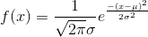

- 정규분포(가우스 분포) 성질
  - 모수(parameter)는 평균과 분산
  - 평균 = 중앙값 = 최빈값
  - 정규분포를 따르는 확률변수를 정규확률변수, 가우스 확률변수라 함
- 통계 분석에서 왜 정규 분포를 가정하는가?
  - 1 신장의 분포나 실험 오차의 분포등 분석대상이 되는 **현상들이 정규분포로 표현** 되는 경우가 많음
  - 2 체중이나 소득분포와 같은 **변수의 변환으로 인하여 정규분포로 나타내는 것이 가능** 한경우도 많음
    - log변환
  - 3 표본 평균등의 많은 통계량은, 확률변수의 합의 형태가 되어있는 경우가 많은데, 이러한 통계량의 표본분포는 **중심극한정리** 에 의하여 점근적으로 정규분포가 되며, 그 표본분포는 정규모집단의 경우의 결과를 근사적으로 그대로 사용할 수 있음
  - 4 **독립 정규확률변수의 합은 정규확률변수** 이고, 수학적인 처리가 용이하고 표본분포를 정확하게 구할 수 있음
  - 5 정규확률변수의 선형변환은 정규확률변수임
    - `X ~ N(mu, sigma^2)`
    - `aX+b ~ N(amu + b, a^2sigma^2)`
  - 6 독립인 두 정규확률변수의 합 및 차는 정규확률변수임
    - `X ~ N(mu1, sigma1^2), Y ~ N(mu2, sigma2^2)`
    - `aX + bY ~ N(amu1 + bmu2, a^2sigma1^2 + b^2sigma2^2)`

### 표준정규분포

확률 밀도 함수

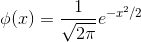

누적 분포 함수(가우스 오차 적분, erf(z))

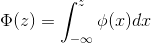

표준화 변수

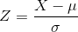

- `mu = 0, sigma^2 = 1`

## 분산을 이미 아는경우의 표본평균의 표본분포

- 표본평균 X bar는 확률변수 X1, X2, ..., Xn의 합을 n으로 나눈 것
  - X1, X2, ..., Xn는 모집단 분포와 동일한 분포를 따르는 독립적인 확률변수
- 그렇기 때문에 X bar역시 정규분포임 `X bar ~ N(mu, sigma^2/n)`
  - 표준화 하면 `Z = (X bar - mu) / (sigma / root(n)) ~ N(0, 1)`
    - 여기서 sigma^2의 값만 안다면, X bar의 표본분포는 결국 표준 정규분포 N(0, 1)를 보는것으로 귀속됨
  - 이 N(0, 1)에 있어서 그 점 보다 위의 확률이 100a%가 되는 점을 퍼센트점이라고 부르며, Za라고 나타냄
- X bar의 표준편차는 sigma/root(n)
  - n이 증가하면 X bar는 mu의 보다 정확한 추정값이 됨
  - 측정오차는 1/root(n) 단위로밖에 감소하지 않음 즉, 정확도를 2배증가시키려면 n은 4배로 증가시켜야 함
- **X bar역시 정규분포가 되고, 분산이 작아져서 단독 Xi보다도 나은 측정값임**
  - 단독의 경우보다 측정의 정확성을 높이는 의미를 갖음
  - 기하평균은 정확성을 높이는 성질은 없음

## 표본분산의 표본분포

표본 분산

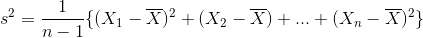

표본 분산의 기댓값

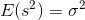

- 정규모집단을 가정하면, 표본 분산 s^2의 표본분포를 구할 수 있음
  - 그것을 알 수 있으면, 모분산 sigma^2에 대해서 다양한 통계적 추측을 시행할 수 있음
- 측정 오차의 예시
  - 측정오차의 분산 sigma^2가 알려지지 않은 상태인데, 각 측정오차의 분산의 크기가 sigma^2이라는 사실은 알고 있음

각 측정 오차의 분산

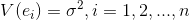

각 측정 오차의 분산으로부터

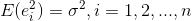

- *`e1^2 + e2^2 + ... + en^2`이 표본분산 s^2의 표본분포를 구하는 기초적인 통계량이 됨*
  - 왜지?
- 일반적으로 `e1, e2, ..., en`은 독립이고 정규분포 `N(0, sigma^2)`을 따르나, sigma = 1로 표준정규분포를 가정하면 충분함

### 카이제곱 분포

Z1, Z2, ..., Zk를 독립인, 표준정규분포 N(0, 1)를 따르는 확률변수라고 하자.

자유도 k인 x^2(카이제곱) 분포

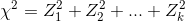

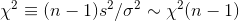

증명은 설명은 불편분산 공식에서 참고할 수 있음(표본평균 대신 mu로 치환했다고 생각)

- 카이제곱 분포
  - 표준졍규분를 따르는 확률변수를 제곱한 확률변수의 분포
  - 정규표본론에서 표본분산을 다룰때에는 반드시 관계되는 확률분포임
  - 자유도 k의 카이제곱분포의 상측확률이 a가 되는 값을 xa^2(k)라고 쓰며, 상측확률 100a%의 퍼센트점이라고 부름
  - **통계량인 표본분산 s^2의 확률분포를 구할 때 사용됨**
- 응용 예시
  - 어떤 정규모집단은 모평균이 mu = 50, 모분산이 sigma^2 = 25라고 하자. 여기서부터 표본 n = 10을 추출할 때, 표본분산 s^2이 50을 넘을 확률은 어느정도인가?
    - 부등식 s^2 > 50을 chi^2 = (n-1)s^2/sigma^2 형태로 변형
    -  `P(s^2 > 50) = P(chi^2 > 9 * 50 / 25) = P(chi^2 > 18) = 0.038 (자유도 = 9)`

## 모집단의 분산이 알려지지 않았을 경우의 표본평균의 표본분포

- 현실적으로 모평균을 모를 때, 모분산을 알고있을 가능성이 매우 낮음
  - sigma^2 대신에 s^2를 사용하는 방법을 고안

t 분포

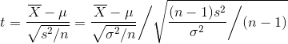

- t분포의 구성
  - *X bar와 s^2는 서로 독립*
    - 정규분포의 밀도함수의 계산으로부터 증명 가능
  - 그러므로, t밀도함수는 `N(0, 1)`과 `chi^2(n-1)`의 조합으로 구할 수 있음
- t분포
  - Z는 표준정규분포를 따름
  - Y는 자유도 k의 카이제곱분포를 따름
  - Z와 Y는 독립임

자유도 k의 t분포(스튜던트 t분포)

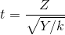

t의 통계량

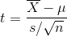

- 표현
  - `t(k)`
  - 위의 t의 통계량은 자유도가 n-1인 t(n-1)에 따름
  - s/sqrt(n)을 표본평균의 표준오차(standard error)라 함
- 특성
  - x = 0을 기준으로 좌우대칭
  - k가 30이상으로 충분히 클 경우, 표준정규분포와 거의 다르지 않음
    - k가 무한대일 경우, N(0, 1)과 일치함
    - 이는, 자유도 k의 카이제곱분포의 평균이 k이므로, Y/k가 k가 클 경우 대수의 법칙에 의하여 거의 1에 가깝게 되기 때문
    - 혹은, 큰 표본(n->무한대)인 경우는, 표본과 모집단의 구별이 없어지므로 s^2 ~ sigma^2가 되기 때문
  - **t분포는 작은 표본의 엄밀한 표본분포라고 생각할 수 있음**
    - [THE PROBABLE ERROR OF A MEAN](https://www.jstor.org/stable/pdf/2331554.pdf?casa_token=PIGeQJAqHiUAAAAA:KSIbAsdU9bUyQcczQ2opViSOrQ16ksCeKjDyJgyUfNhWbpQJrA8N6onCUu8rHX6AAFZI1RneddH1H9FQpKZyG6tvfXrd0GtdByLYILbEavGPQ-cjDH6v)
  - t(k)
    - k가 크면 클 수록, 동일 a%에 대해서 퍼센트점은 작아짐

## 2표본문제(two-sample problem)

- 두 **모집단** 의 비교
  - 예시
    - 남자의 신장 vs 여자의 신장
  - 접근 방식
    - 두 모집단으로부터 각각 표본을 추출했다고 생각
    - 크기 m의 제1표본 X1, X2, ..., Xm을 모집단 분포 N(mu1, sigma1^2)의 정규모집단으로부터, 크기 n의 제2표본 Y1, H2, ..., Yn을 모집단 분포 N(mu2, sigma2^2)의 정규모집단으로부터 각각 독립적으로 추출한 경우의 표본 분포를 생각
- 종류
  - 표본평균의 차의 표본분포
  - 표본분산의 비의 표본분포

### 1. 표본평균의 차의 표본분포

- 두 모집단의 차 mu1 - mu2 를 분석하는 것
  - 예시
    - 남녀별 임금 비교 문제에서 서로의 격차가 없으면 차가 0, 격차가 있으면 0이 아님
  - 접근 방식
    - 기본적으로 표본 평균의 차의 표본분포를 생각
    - 모집단의 분산을 알고 있는 경우
    - 모집단의 분산을 모르나, 두 값이 같은 경우
    - 모집단의 분산을 모르고, 두 값이 같다고 할 수 없는 경우

#### 모분산을 알고 있는 경우

- X bar, Y bar 가 각각 정규분포를 따르고, 독립이므로
  - `X bar ~ N(mu1, sigma1^2/m)`
  - `Y bar ~ N(mu2, sigma2^2/n)`
- X bar - Y bar 역시 정규분포를 따름
  - `X bar - Y bar ~ N(mu1 - mu2, sigma1^2/m + sigma2^2/n)`
- 표준화와 귀무가설을 이용해서 가설 검증(평균의 차가 유의한지)

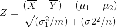

#### 모분산을 모르나, 두 값이 같은 경우

- 표본분산(s^2)을 모분산 simga^2 대신에 사용해서 X bar - Y bar의 분산을 구함
  - 이 때에 모분산이 곹오인 두 표본을 합병한 것을 **합병한 분산(pooled variance)** 으로 추정함

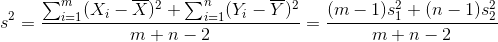

- (m+n-2)s^2/sigma^2는 자유도 m+n-2의 chi^2(m+n-2)를 따름
- s^2와 X bar - Y bar는 독립

2표본 t통계량(two-sample t statistic)

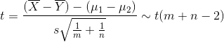

이는 2표본 t검정 등에 사용됨

#### 모분산을 모르고, 두 값이 같다고도 할 수 없는 경우

- 두 모집단의 분산 sigma1^2, sigma2^2를 추정하여 X bar - Y bar의 분포를 구하는 것이 필요하함
  - 하지만 이 경우 어떤식으로 접근해도, sigma1^2나 sigma2^2에 의존하지 않는 통계량을 만드는 것이 불가능
  - 결국 X bar - Y bar 의 정확한 분포를 구하는 것이 불가능
- *웰치 근사법*
  - t 통계량이 근사적으로 자유도가 nu에 가장 가까운 정수 nu*이 되는 t분포를 따르는 것이 알려짐

### 2. 표본분산의 비의 표본분포

- 배경
  - 표본평균의 차의 분포를 구할 경우, 두 모집단의 분포의 분산 sigma1^2, sigma2^2가 같거나 다를 경우에 의해서 그 분포를 구하는 방법이 다름
  - 그러므로, 두 표본분산 s1^2, s2^2의 상대적인 비 s1^2/s2^2에 대해서 아는 것이 그 모집단의 분산의 동일성을 파악하는 단서가 됨
  - 두 분산이 독립이며, 각각 chi^2 분포를 따를경우, chi^2분포를 따르는 확률변수의 비의 확률분포가 필요하게 됨. 그것이 F분포
- F분포
  - 확률변수 U, V가 다음의 조건을 만족한다고 하자
    - U는 자유도 k1의 chi^2분포 chi^2(k1)을 따름
    - V는 자유도 k2의 chi^2분포 chi^2(k2)를 따름
    - U와 V는 독립
  - 피셔분산비
    - U와 V를 각각 자유도로 나눈 다음에 구한 비율

자유도(k1, k2)의 F분포 F(k1, k2)

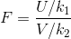

여기서 s1^2, s2^2의 표본분포에 대해서

- (m-1)s1^2/sigma1^2는 자유도 m-1의 chi^2분포 chi^2(m-1)을 따름
- (n-1)s2^2/sigma2^2는 자유도 n-1의 chi^2분포 chi^2(n-1)를 따름
- s1^2과 s2^2는 독립

여기서 F분포의 정의로부터

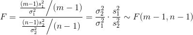

- 중요한 것은 모분산이 같은 경우이며, 이 떄에는, sigma1^2 = sigma2^2로 두면, F분포는 문자그대로 그 때의 표본의 분산비(variance ratio)
  - F = s1^2/s2^2 의 표본분포가 됨
- *t가 자유도 k의 t분포 t(k)를 따를 때, t^2 ~ F(1, k)임*
  - `T = Z / sqrt(chi^2(v)/v)`
  - `F(v1, v2) = (chi^2(v1)/v1) / (chi^2(v2)/v2)`
- F분포 예시
  - 모분산이 동일한 정규모집단으로 부터 m=10, n=15의 표본을 추출했다. s1^2이 s2^2의 두배이상이 되는 확률은 이 가정에서 P(F > 2) = 0.1이 됨. 따라서 모집단의 분산이 같아도 표본의 분산이 2배차이가 나는 확률은 0.1인데, 이는 관점에 따라서 충분히 높은 확률이기도 함

## 표본상관계수의 표본분포

- 배경
  - 개인의 체중과 신장과 같이, 동일 요소로부터 2개의 서로다른 속성의 관측값 X, Y를 얻는 경우가 있음
    - X를 제1속성값, Y를 제2속성값 이라 함
  - X와 Y의 모집단 분포로서 모평균 mux, muy, 모분산, sigmax^2, sigmay^2, 모공분산 sigmaxy(모상관계수 pxy)의 2차원 정규분포 `N((mux, muy), (sigmax^2, sigmay^2, sigmaxy))`를 생각하여, 그 2차원정규모집단으로부터 2차원 무작위 표본
  - (X1, Y1), (X2, Y2), ..., (Xn, Yn)을 추출

모공분산

모상관계수

표본공분산

표본상관계수

- 모상관계수에 대해서, 표본상관계수의 표본분포를 구하는 것은 직접적으로는 매우 어려움
  - **피셔z변환 이라는 근사법으로 구함**
